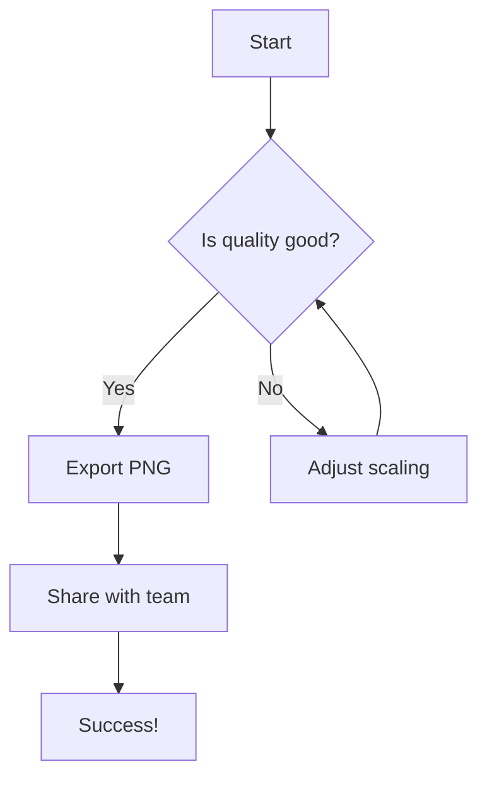

# PNG Export Quality Improvement for Mermaid Diagrams

## Problem Statement
The PNG export for Mermaid diagrams had poor quality, appearing pixelated especially for larger diagrams. This was due to insufficient resolution scaling during the export process.

## Root Cause
The PNG export function in `client/src/hooks/useMermaidRenderer.js` was using a fixed 2x scaling factor, while the PDF export was using a dynamic 3-4x scaling factor based on diagram size.

## Solution
Updated the PNG export to use the same high-quality scaling approach as PDF export:

### Before (2x scaling):
```javascript
canvas.width = width * 2; // 2x for better quality
canvas.height = height * 2;
ctx.scale(2, 2);
```

### After (3-4x dynamic scaling):
```javascript
// Use higher scaling for better PNG quality - 4x for large diagrams, minimum 3x
const scaleFactor = Math.max(3, width > 1000 || height > 800 ? 4 : 3);
canvas.width = width * scaleFactor;
canvas.height = height * scaleFactor;
ctx.scale(scaleFactor, scaleFactor);
```

## Quality Improvement
- **Small diagrams** (< 1000px width, < 800px height): 2x → 3x scaling = **50% more resolution**
- **Large diagrams** (≥ 1000px width or ≥ 800px height): 2x → 4x scaling = **100% more resolution**

## Expected Results
- PNG exports will now have crisp, high-resolution output
- Text and lines in diagrams will be sharp and clear
- Quality matches or exceeds PDF export quality
- Especially beneficial for complex diagrams with many nodes

## Testing Recommendations
1. Generate a simple Mermaid flowchart and export as PNG
2. Generate a large, complex diagram (with many nodes) and export as PNG
3. Compare the quality with the previous exports
4. Zoom in on exported PNGs to verify text clarity

## Example Mermaid Diagram for Testing


## Files Changed
- `client/src/hooks/useMermaidRenderer.js` - Updated PNG export scaling factor

## Impact
- No breaking changes
- Backwards compatible
- No performance degradation (slightly larger file sizes due to higher resolution)
