# iHub Apps

**Ready-to-use AI apps for your team. Self-hosted. Any model. No prompting expertise needed.**

[](LICENSE)
[](https://github.com/intrafind/ihub-apps/releases)
[](https://github.com/intrafind/ihub-apps/pkgs/container/ihub-apps)

**iHub Apps** is a full-stack, open-source AI platform that brings generative AI into your secure corporate environment. Your team starts from a personal start page, picks one of the ready-made apps — or chats freely — and gets answers from the model you choose: OpenAI, Anthropic, Google, Mistral, AWS Bedrock, any OpenAI-compatible gateway, or a local model on your own hardware.

Compose emails, translate, summarize, prepare meetings, analyze documents, transcribe recordings, or let a prompt run every morning as a scheduled task. Ground the answers in your own knowledge — files, websites, iFinder — and extend the platform with more apps, skills, models and workflows from the **iHub Marketplace**, all without writing code. Seamlessly integrate **iHub** with your existing **IntraFind** solutions for a unified platform of search, knowledge-based answers and creative AI applications — free and open source.

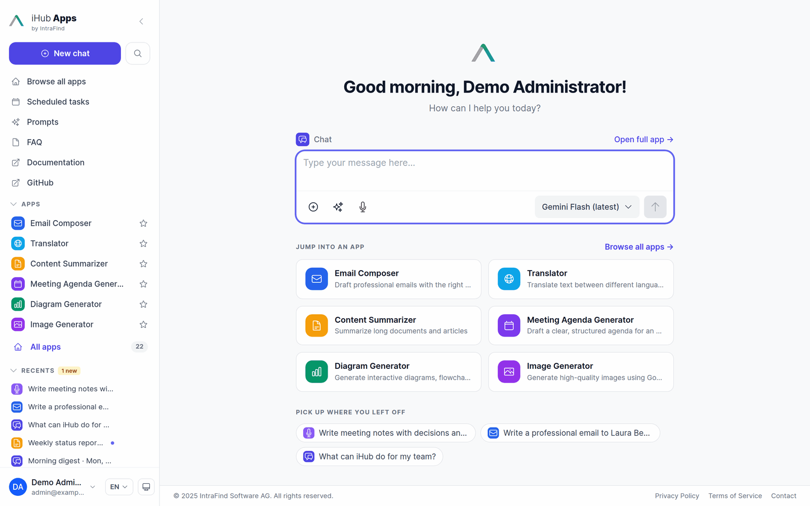

**iHub** is developed by [**IntraFind Software AG**](https://intrafind.com/) — made with ❤️ from our teams in Berlin, Bonn, Munich + Remote

The Software is free-of-use and "AS-IS" without warranty of any kind. — [License Details](LICENSE)

**For enterprise-grade support, custom features, or professional services, contact us at [sales@intrafind.com](mailto:sales@intrafind.com).**

---

## 🚀 Quick Start — Run in Under 60 Seconds

**No Node.js, no Docker, no dependencies.** Download the standalone binary and you're running:

### ⚡ One-Line Installer (Linux/macOS)

The simplest way to install — a single command handles everything:

```bash
curl -fsSL https://raw.githubusercontent.com/intrafind/ihub-apps/main/install.sh | sh
```

OR

### Step 1 — Download for your platform

👉 **[Download the latest release](https://github.com/intrafind/ihub-apps/releases)**

| Platform   | File                        |
| ---------- | --------------------------- |
| 🐧 Linux   | `ihub-apps-v*-linux.tar.gz` |
| 🍎 macOS   | `ihub-apps-v*-macos.tar.gz` |
| 🪟 Windows | `ihub-apps-v*-win.zip`      |

> **Restricted environment?** Use the `.base64.txt` files: `base64 -d ihub-apps-v*-linux.tar.gz.base64.txt > ihub-apps.tar.gz`

### Step 2 — Extract and run

```bash
# Linux / macOS
tar -xzf ihub-apps-v*-linux.tar.gz
cd ihub-apps-v*
./ihub-apps-v*-linux
```

```bat
:: Windows — extract the .zip, then:
ihub-apps-v*-win.bat
```

### Step 3 — Open iHub and connect a model

Open **http://localhost:3001** — the binary's port is set in `config.env` next to the executable (Docker uses port 3000). On a fresh installation the **setup wizard** opens: sign in with the shipped administrator account (`admin` / `password123`), pick a provider — Google Gemini, Anthropic Claude, OpenAI, Mistral AI or a local server such as LM Studio, Jan.ai, Ollama or vLLM — paste its API key and test the connection.

<p align="center">
  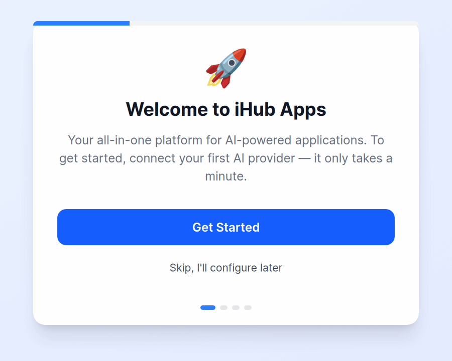
  &nbsp;
  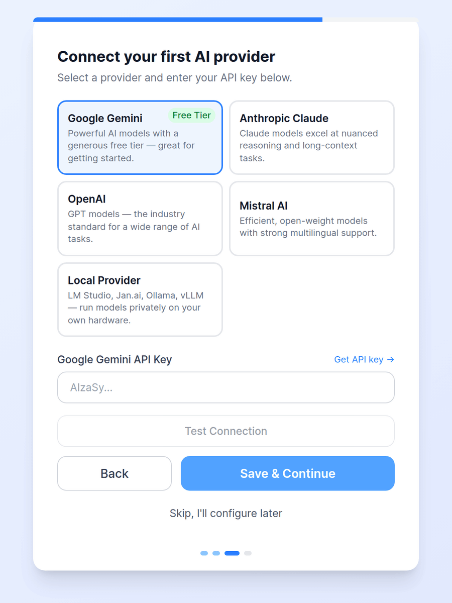
</p>

🎉 **Done!** iHub auto-configures everything else on first run. No `.env` file, no database, no manual setup. You can add more providers and models at any time under **Admin → Providers** and **Admin → Models**.

> 🔐 **Change the shipped passwords before you open iHub to others.** The `admin` and `user` demo accounts are meant for the first sign-in; the admin area warns as long as they still use their shipped passwords. See [Authentication Quick Start](docs/AUTHENTICATION_QUICK_START.md) for local accounts, LDAP, OIDC/SSO and proxy authentication.

**Other install methods:** [One-Line Installer](#-one-line-installer-linuxmacos-1) · [Docker](#-docker-production) · [npm (for developers)](#-npm-development)

---

## 👀 A Look Around

### 🏠 The start page

Every user lands on a personal start page: a greeting, the chat input of the default app so a conversation starts right away, shortcuts to the apps that matter most to them — their favorites first, then the apps you feature — and the chats they can pick up again. Admins choose the default app, the featured apps and even what `/` opens under **Admin → UI Customization → Start Page**.

<p align="center">
  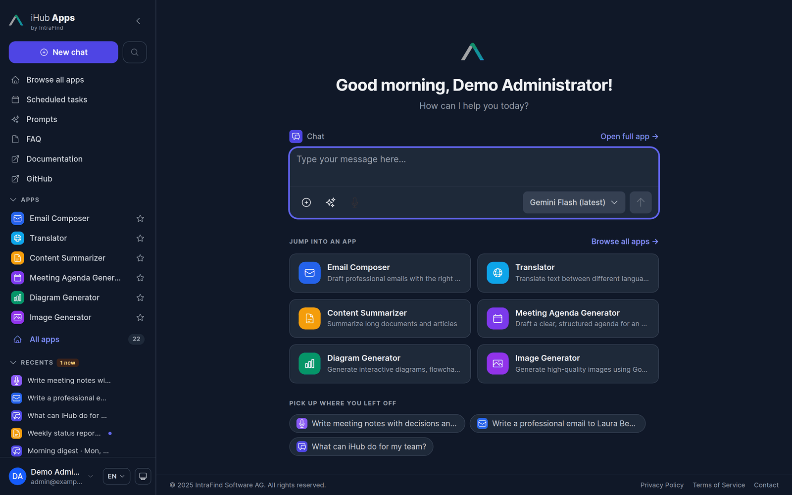
  &nbsp;
  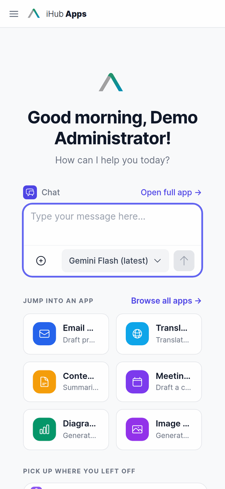
</p>

### 📝 Apps that start with a form

Apps frame a use case: prompt, variables, tools, sources and model. An app can open its chats with a **form** instead of an empty chat input — users fill in the fields, add their own text or files and press **Start**. The filled-in prompt goes out as the first message, and the conversation continues like any other chat.

<p align="center">
  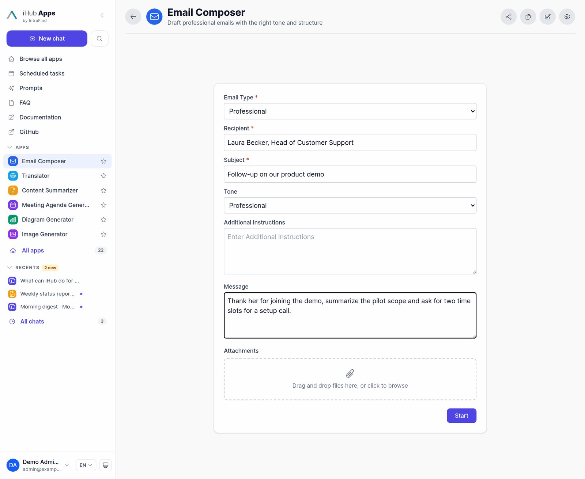
  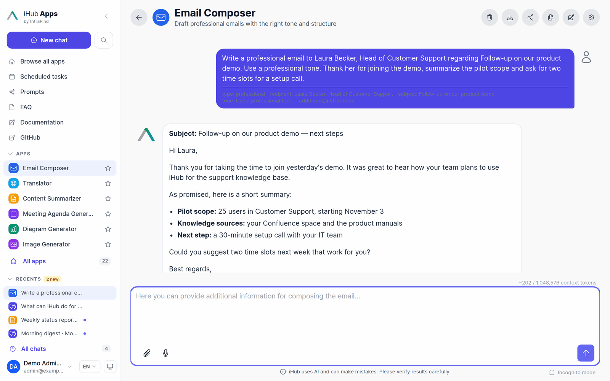
</p>

### 🤖 Any model — and side by side

Users pick the model per chat (when the app allows it), with descriptions and hints from the admin. **Compare mode** sends one message to two models and streams both answers next to each other.

<p align="center">
  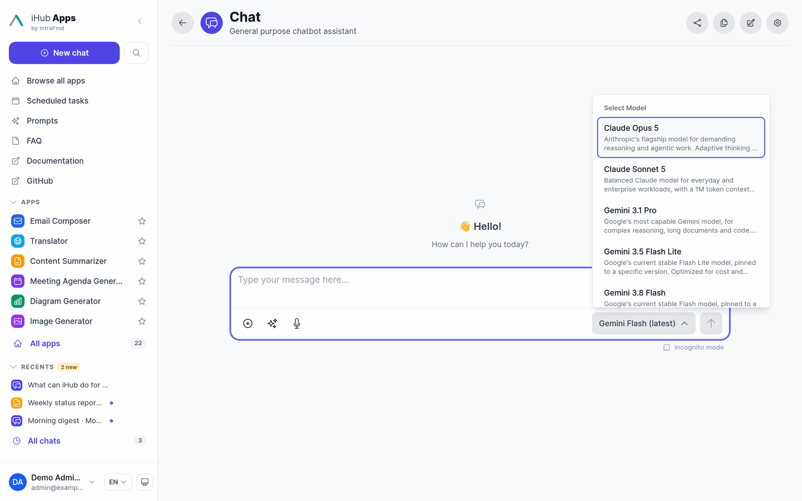
  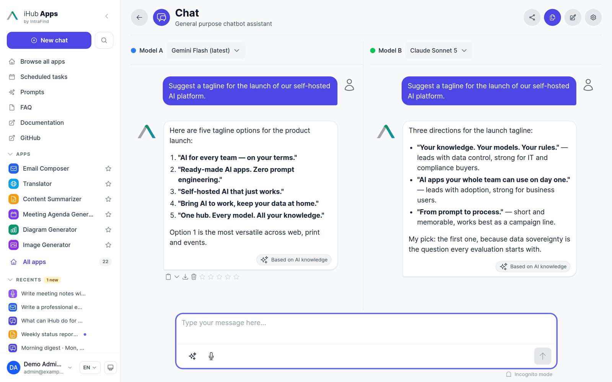
</p>

### 🎙️ Transcription

Record in the browser or upload an audio or video file: iHub transcribes it into the message — streaming, with self-hosted **Voxtral** on vLLM, or with Google's hosted Gemini transcription — and the chat model answers the text. Turn meetings into minutes, interviews into summaries, voice notes into emails. Dictation into the input field and **read aloud** (text-to-speech) are available too.

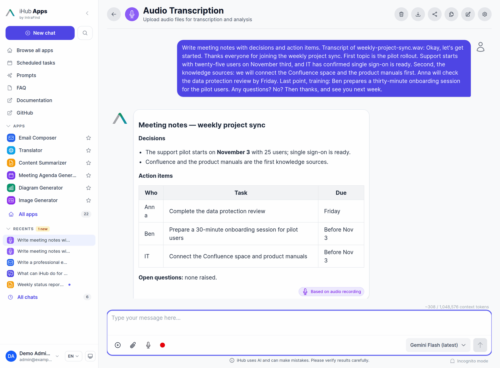

### ⏰ Scheduled tasks

Save a prompt as a task that runs by itself, as you, in one of your apps: every weekday at 08:00, every Friday afternoon, on the last day of the month, or only when you press **Run now**. Every run becomes its own chat, marked unread until you open it — the morning digest is waiting when you come in.

<p align="center">
  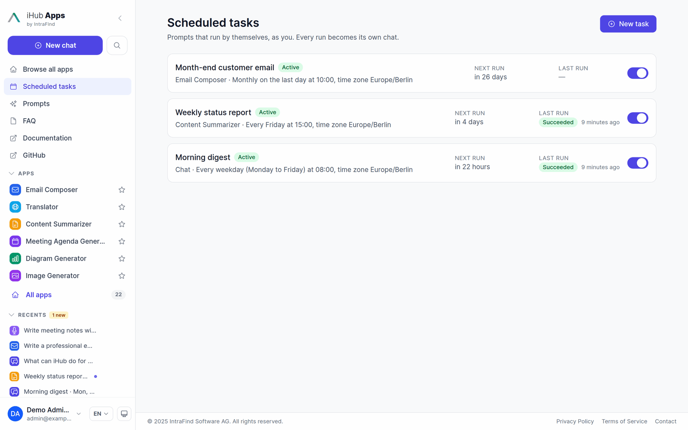
  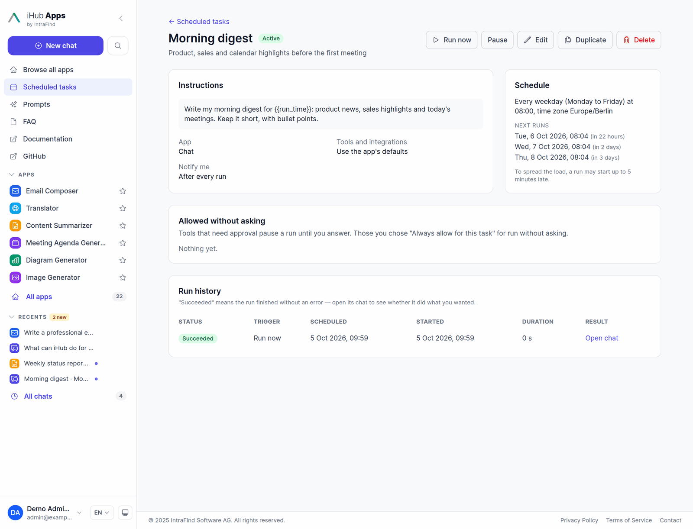
</p>

### 📚 Prompt library

Admin-curated global prompts plus prompts users write for themselves and share with colleagues, groups or everyone. Prompts can ask for the details they need (`{{tone}}`, `{{customer_name}}`) with a short form and a live preview, and keep a version history.

<p align="center">
  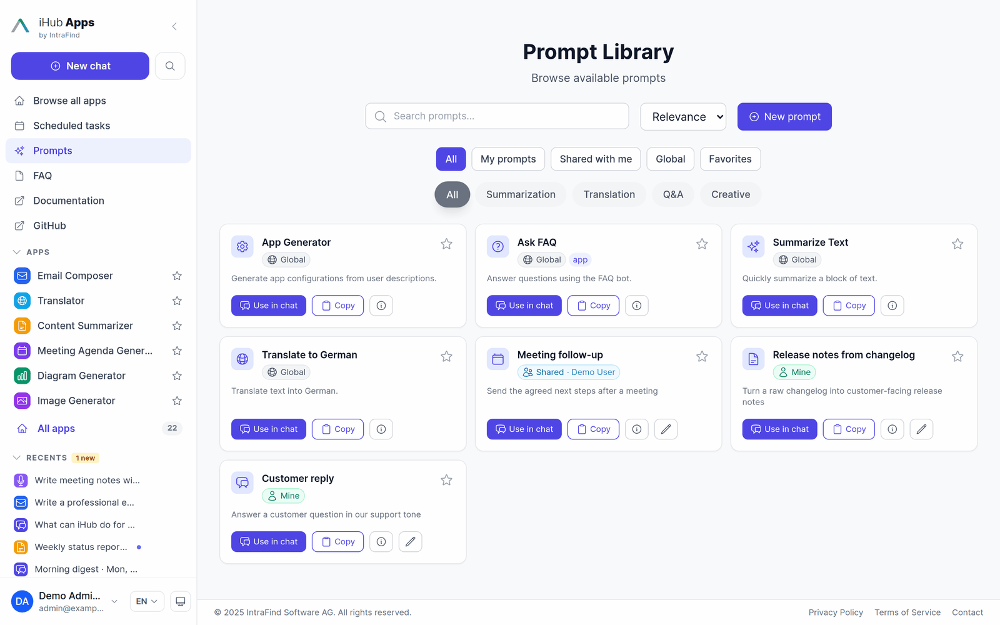
  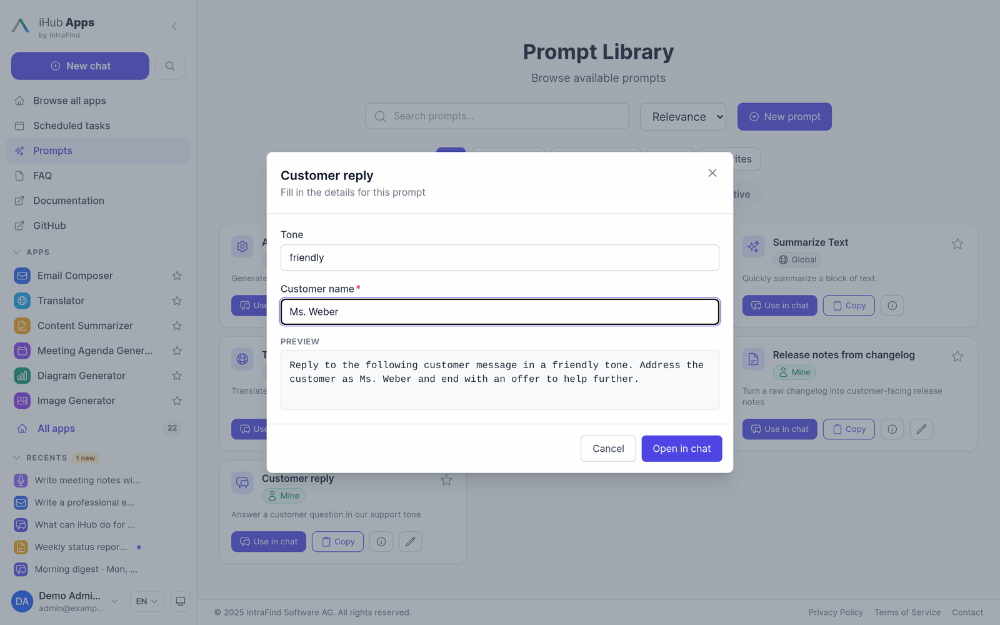
</p>

### 🛒 Marketplace

Browse and install apps, skills, models, workflows and prompts from registries with one click — the **iHub Official Marketplace** ships preconfigured with 90 apps (including 69 department assistants for HR, legal, sales, marketing, engineering and more), 98 skills, 19 model configurations, 6 workflows and 5 prompts. Add your own registry to distribute content across installations. Browse the catalog online at [intrafind.github.io/ihub-marketplace](https://intrafind.github.io/ihub-marketplace/).


### ⚙️ Admin

Everything is configured in the browser: apps, models, providers, prompts, sources, tools, skills, workflows, users, groups, authentication, integrations, branding — with change history, an audit log, usage reports, a command palette (`Cmd/Ctrl+K`) and an in-product changelog.

<p align="center">
  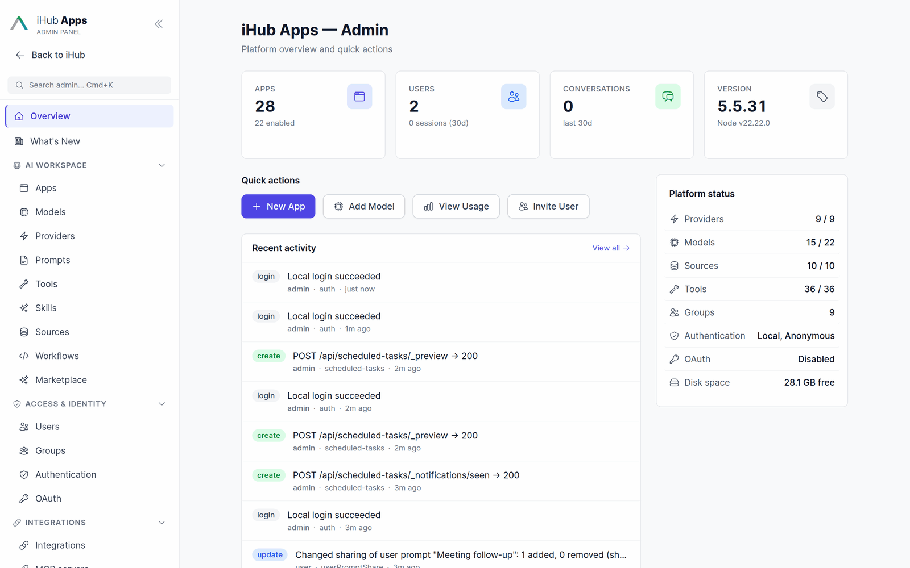
  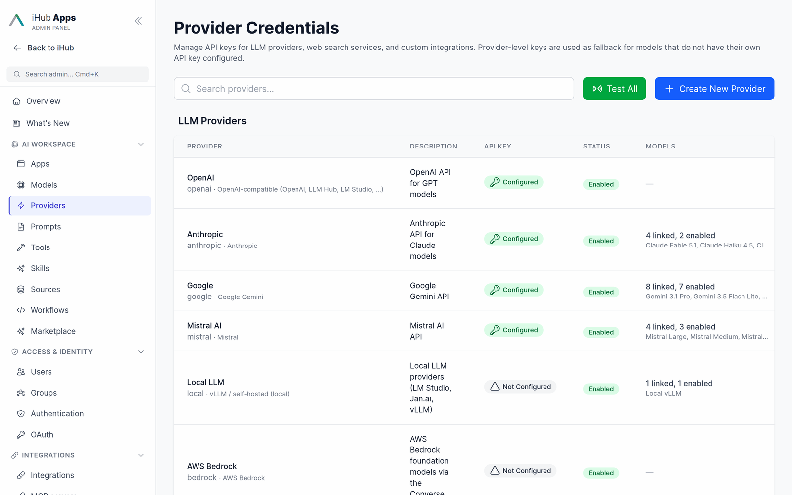
</p>

📖 **More screenshots and step-by-step guides:** [User Guide](docs/user-guide.md) · [Admin UI Guide](docs/admin-ui.md) · [Marketplace](docs/marketplace.md)

---

## 📱 Built-in Apps

iHub ships with apps for the most common business workflows. Apps marked with \* ship disabled — switch them on in **Admin → Apps** when you need them. Many more are one click away in the [Marketplace](#-marketplace).

| Area                       | Apps                                                                                                    |
| -------------------------- | ------------------------------------------------------------------------------------------------------- |
| 💬 Chat & research         | Chat · Web Chat (with web search) · File Analyzer · Audio Transcription\*                               |
| ✍️ Writing & communication | Email Composer · Translator\* · Content Summarizer\* · Social Media Content\* · Idea Coach\*            |
| 📅 Meetings                | Meeting Agenda Generator · Meeting Briefing                                                             |
| 📐 Diagrams & images       | Diagram Generator (Mermaid) · draw.io Diagrams\* · Excalidraw Sketches\* · Image Generator              |
| 🔍 Knowledge & search      | iFinder Search\* · iFinder Document Actions\* · iAssistant\* · IntraFind Website Bot · iHub Support Bot |
| ⚖️ Specialized             | NDA Risk Analyzer · Parliamentary Questions Analyzer · Customs Tariff Assistant\*                       |
| 📧 Outlook                 | Outlook – Reply Directly (for the [Outlook add-in](docs/outlook-add-in.md))                             |
| 🌐 Websites                | Website Wikipedia (embedded) · Website IntraFind (external) — examples of embedded and linked websites  |

All apps are **fully configurable** — prompts, variables, start forms, knowledge sources, tools, model preferences and group access. New apps can be created without coding, from a template, by uploading JSON, or from the Marketplace.

---

## 🧠 Model Providers

| Provider                      | What you get                                                                                                     |
| ----------------------------- | ---------------------------------------------------------------------------------------------------------------- |
| **OpenAI**                    | GPT models via the Chat Completions or the Responses API (GPT-5)                                                 |
| **Anthropic**                 | Claude Fable 5.1, Opus 5, Sonnet 5, Haiku 4.5 — with extended thinking and prompt caching                        |
| **Google**                    | Gemini 3.x Flash / Pro, Nano Banana image generation, Gemini transcription                                       |
| **Mistral AI**                | Mistral Large, Medium, Small; Voxtral TTS for read aloud                                                         |
| **AWS Bedrock**               | Claude, Amazon Nova, Llama, Mistral, Cohere, DeepSeek and more via the Converse API                              |
| **Local & OpenAI-compatible** | vLLM, LM Studio, Jan.ai, Ollama — complete privacy, no API costs                                                 |
| **Custom LLM providers**      | Any OpenAI-compatible gateway (e.g. T-Systems LLM Hub) with one API key; **Import from URL** adds all its models |
| **IntraFind iAssistant**      | Retrieval-augmented answers from your iFinder index                                                              |
| **Speech**                    | Voxtral realtime transcription on your own GPU (vLLM), Gemini Transcribe / Transcribe Live, Azure Speech         |

API keys are kept per provider, encrypted at rest, and can be tested from the admin UI. Model choice can be narrowed per app or fixed entirely.

📖 [Models](docs/models.md) · [Local LLM Providers](docs/local-llm-providers.md) · [Realtime Voice & Transcription](docs/voice-transcription.md) · [Read Aloud](docs/text-to-speech.md)

---

## 🧩 Core Concepts — Apps, Skills, Sources & Tools

iHub is built from a handful of building blocks. Knowing which one to reach for is the fastest way to turn an idea into a working use case:

| Building block     | Answers the question                                  |
| ------------------ | ----------------------------------------------------- |
| **Provider**       | How does iHub reach a model or external service?      |
| **Model**          | Which model answers, with which limits and abilities? |
| **App**            | What is the concrete use case and its frame?          |
| **Skill**          | Which reusable procedure, rules, or know-how apply?   |
| **Source**         | What domain knowledge does the model need?            |
| **Tool**           | What can the model _do_ beyond producing text?        |
| **Prompt library** | Which reusable text can a user drop into a chat?      |
| **Group**          | Who sees all of the above?                            |

**Providers and models.** Providers hold the technical connection — endpoint and credentials — to an external or local service; API keys are administered centrally and stored encrypted at rest. Models (GPT, Claude, Gemini, Mistral, or a local model) are what apps and users select. It pays to split models by use case: internal or sensitive scenarios on a local or dedicated model, public ones on a cloud model. Model choice can be narrowed per app (`allowedModels`) or fully predetermined (`disallowModelSelection`).

**Apps vs. prompt library vs. skills.** Apps are standardized use cases with a fixed frame — prompt, variables, tools, sources, model — and are rolled out per user group, including groups mapped from LDAP or OIDC. The prompt library is the flexible counterpart inside general chat: global prompts from the admin plus prompts users write and share themselves. Skills package complex, multi-step procedures and reusable rules modularly: rather than growing one giant app prompt, split a workflow such as a story generator into separate skills for interviewing, structuring, and drafting.

**Sources.** Sources give the model its knowledge: local files (Markdown, PDF, text, JSON), URLs, iFinder documents, and internal pages. URLs suit content that changes regularly, at the risk that page boilerplate adds noise to the context; local files give a more controlled context but must be updated by hand. Each source is either loaded into the prompt up front or fetched on demand as a tool.

**Tools.** Tools extend iHub beyond text generation — web search, page reading, screenshots, people search, Jira, iFinder, scheduling, remote A2A agents, and further systems via MCP.

In short: **apps** frame the use case, **skills** define reusable procedures, **sources** deliver the knowledge, and **tools** let the model act. Groups decide who gets what.

📖 **[Full Core Concepts Guide](docs/concepts.md)**

---

## 🎆 Why Teams Choose iHub Apps

### 🔒 Full Data Control

Deploy on-premise, in your private cloud, or air-gapped. With local LLMs (LM Studio, Jan.ai, Ollama, vLLM) and self-hosted speech-to-text, your data never leaves your infrastructure. Cloud models (OpenAI, Anthropic, Google, Mistral, AWS Bedrock) receive the chat content they answer — group permissions and per-app model restrictions decide which users and use cases may send data to which provider.

### 🤖 Any LLM, Unified Interface

One interface for OpenAI, Anthropic Claude, Google Gemini, Mistral, AWS Bedrock and any OpenAI-compatible model. Switch models per app, let users choose, or compare two side by side. No vendor lock-in.

### 📚 Enterprise Knowledge Integration

Connect your organization's knowledge: local files, web pages, enterprise document systems (iFinder), Office 365, Google Drive, Nextcloud, Jira and MCP servers. Answers show their sources with numbered citations.

### 👤 No Prompting Skills Required

Every app ships with an expert-crafted prompt, many start with a simple form, and the Marketplace adds ready-made assistants for every department.

### 🔐 Enterprise-Grade Security

Multi-mode authentication: Anonymous, Local, LDAP, NTLM, OIDC (Microsoft, Google, Keycloak, …) and proxy auth. Group-based permissions with inheritance, encrypted secrets, audit log and sign-in lockout.

### 🚀 Deploy in Minutes, Scale When Needed

Standalone binary, Docker, npm, or PWA. Setup wizard on first run. Multi-worker clustering for production. No database required.

### 🎨 Modern, Responsive Interface

Clean React SPA with dark/light mode, mobile-friendly design, real-time streaming responses, and full internationalization (English and German, extensible).

### 🛠️ Extensible Without Coding

Add apps, models, skills, workflows and knowledge sources through the admin UI or the Marketplace. JSON-based configuration, an OpenAI-compatible inference API, and the full source code for deeper customization.

---

## 🚢 Deploy Anywhere

### ⚡ One-Line Installer (Linux/macOS)

The simplest way to install — a single command handles everything:

```bash
curl -fsSL https://raw.githubusercontent.com/intrafind/ihub-apps/main/install.sh | sh
```

```bash
# Install and start immediately:
curl -fsSL https://raw.githubusercontent.com/intrafind/ihub-apps/main/install.sh | sh -s -- --start
```

**CLI Options:**

| Option          | Description                                           |
| --------------- | ----------------------------------------------------- |
| `--start`       | Start iHub Apps immediately after installation        |
| `--version=TAG` | Install a specific version (e.g. `--version=v5.5.31`) |
| `-h, --help`    | Show help                                             |

The installer puts iHub into `./ihub-apps` in the current directory. Start it with the launcher printed at the end, open **http://localhost:3001** and follow the setup wizard.

> **Windows users**: Download the `.zip` from [GitHub Releases](https://github.com/intrafind/ihub-apps/releases) — the shell installer does not support Windows.

- ✅ Detects OS and architecture automatically
- ✅ Offers Docker if available on your system
- ✅ Verifies download integrity with checksums

> ⚠️ **Updating:** re-running the installer replaces `./ihub-apps` — including the `contents/` folder that holds your configuration and chats. Update an existing installation from **Admin → Updates** or with `--update` instead, or back up `contents/` first.

---

### 📦 Binary (Recommended for most users)

The fastest way to run iHub — a single executable with zero dependencies.

```bash
# Download, extract, run
tar -xzf ihub-apps-v*-linux.tar.gz && cd ihub-apps-v* && ./ihub-apps-v*-linux
```

- ✅ Zero dependencies — no Node.js, no Docker required
- ✅ Auto-setup — creates default configuration on first run
- ✅ Cross-platform — Windows, macOS, Linux binaries
- ✅ Production-ready — optimized single executable
- ✅ Built-in updates — update via Admin UI or `--update` CLI flag

📥 **[Download from GitHub Releases](https://github.com/intrafind/ihub-apps/releases)**

---

### 🐳 Docker (Production)

```bash
# Zero-config quickstart (published on 127.0.0.1:3000)
docker compose -f docker-compose.quickstart.yml up
```

```bash
# Or plain docker
docker run -d \
  -p 127.0.0.1:3000:3000 \
  -v $(pwd)/contents:/app/contents \
  --name ihub-apps \
  ghcr.io/intrafind/ihub-apps:latest
```

- ✅ Configuration, chats and uploads persist in the mounted `contents/` directory
- ✅ Multi-platform support (Linux, macOS, Windows)
- ✅ Production-hardened container image

To reach iHub from other machines, put a reverse proxy in front of it ([guide](docs/production-reverse-proxy-guide.md)) or publish `3000:3000` once the shipped accounts are secured.

📖 **[Full Docker Guide](docker/DOCKER.md)** · **[Docker Quick Reference](docs/DOCKER-QUICK-REFERENCE.md)**

---

### 💻 npm (Development)

```bash
git clone https://github.com/intrafind/ihub-apps.git
cd ihub-apps
npm run setup:dev
npm run dev
# Open http://localhost:5173 (Vite dev server; the API runs on port 3000)
```

Best for: customization, contributing, building new apps.

📖 **[Developer Onboarding](docs/developer-onboarding.md)**

---

## 🔌 Extend & Customize

| What                               | Where                                                                             |
| ---------------------------------- | --------------------------------------------------------------------------------- |
| 👋 Use iHub day to day             | [User Guide](docs/user-guide.md)                                                  |
| ⚙️ Administer the platform         | [Admin UI Guide](docs/admin-ui.md)                                                |
| 🧩 Understand the concepts         | [Core Concepts](docs/concepts.md)                                                 |
| 📱 Create custom AI apps           | [App Configuration](docs/apps.md)                                                 |
| 🛒 Install content from registries | [Marketplace](docs/marketplace.md)                                                |
| 🤖 Add LLM providers and models    | [Models](docs/models.md)                                                          |
| 🖥️ Local LLMs (privacy mode)       | [Local LLM Providers](docs/local-llm-providers.md)                                |
| 🎙️ Transcription and dictation     | [Realtime Voice & Transcription](docs/voice-transcription.md)                     |
| ⏰ Prompts that run by themselves  | [Scheduled Tasks](docs/scheduled-tasks.md)                                        |
| 📚 Connect knowledge sources       | [Sources System](docs/sources.md)                                                 |
| 🔍 Enable web search tools         | [Web Tools](docs/web-tools.md)                                                    |
| 🛠️ Add tools & MCP servers         | [Tool Calling](docs/tool-calling.md) · [MCP Integration](docs/mcp-integration.md) |
| 🔐 Configure SSO / OIDC / LDAP     | [Authentication Guide](docs/external-authentication.md)                           |
| 🔧 Full documentation              | [docs/README.md](docs/README.md)                                                  |

---

## ✨ Key Features

### 🤖 AI & LLM Integration

- **Multi-provider**: OpenAI (Chat Completions and Responses API), Anthropic, Google Gemini, Mistral, AWS Bedrock, iAssistant — one interface
- **Custom LLM providers**: any OpenAI-compatible gateway with its own key; import all of an endpoint's models from its URL
- **Central provider management**: Endpoints and API keys administered in one place, encrypted at rest, testable from the admin UI
- **Local LLMs**: vLLM, LM Studio, Jan.ai, Ollama — complete privacy, zero API costs
- **Per-app model control**: Restrict the selectable models or fix the model entirely
- **Streaming responses**: Real-time token streaming via Server-Sent Events
- **Structured output**: JSON schema validation for AI responses
- **Tool calling**: Function calling and agentic workflows
- **Vision and image generation**: Image understanding and Gemini image generation (Nano Banana)
- **Thinking models**: Extended reasoning with configurable effort
- **Prompt caching**: Per-model switch with cache metrics in the usage reports
- **Compare Mode**: Send one input to two models and compare the answers side by side
- **OpenAI-compatible inference API**: Call iHub apps and models from other tools (Chat Completions, Responses, Conversations)

### 💬 Chat & Productivity

- **Personal start page**: Greeting, default app's chat input, favorite and featured apps, recent chats
- **Start forms**: Apps open with a form for their variables, a message field and file upload
- **Chat history**: Conversations stored server-side, reopened and continued on any device
- **Scheduled tasks**: Prompts that run once, on an interval, daily, weekly, monthly or by cron — as their owner
- **Prompt library**: Global, personal and shared prompts with variables, favorites and versions
- **Magic Prompt**: Turns short or incomplete input into a well-formed prompt, with undo
- **Chat sharing and export**: Read-only share links, short links, export to Markdown, PDF and more
- **Canvas mode**: Edit a long answer together with the model

### 🎙️ Voice

- **Transcription**: Record or upload audio and video; the transcript becomes the message
- **Self-hosted speech-to-text**: Voxtral realtime transcription on your own GPU — audio never reaches a third party
- **Hosted alternative**: Gemini Transcribe (up to one hour) and Gemini Transcribe Live
- **Dictation**: Browser speech recognition, Azure Speech or vLLM realtime into the input field
- **Read aloud**: A play button on every message, with Voxtral TTS voices per language
- **Admin test panel**: Microphone check, live dictation and recording tests from the admin page

### 📚 Knowledge & Sources

- **Filesystem**: Local markdown, text, PDF and JSON files as AI context
- **Web pages**: Intelligent content extraction from any URL
- **Enterprise docs**: iFinder search, document actions and iAssistant
- **Cloud storage**: Office 365 (OneDrive, SharePoint), Google Drive, Nextcloud
- **Sources panel**: Numbered inline citations and one panel with every page and document an answer used
- **On-demand or up front**: Load a source into the prompt or let the model fetch it as a tool

### 🧠 Apps, Skills, Workflows & Marketplace

- **Apps**: Standardized use cases with a fixed prompt, variables, tools, sources, and model
- **Skills**: Reusable, modular instruction packages (`SKILL.md` + references) for multi-step procedures
- **Workflows**: Agentic multi-step automation with approvals, triggered from chat (`@workflow`), by schedule or webhook
- **Marketplace**: One-click install of apps, skills, models, workflows and prompts from registries
- **Group-based rollout**: Deliver apps, skills, models, and prompts to specific departments or roles
- **No-code authoring**: Create and edit everything through the admin UI or a raw JSON editor, and test an app next to its editor

### 🛠️ Tools & Integrations

- **Web search**: Brave, Staan, Qwant, and native search for Claude, Gemini and OpenAI
- **Page reader**: The model opens and reads pages as Markdown
- **Microsoft Entra**: Corporate directory and people search
- **Jira integration**: Issue tracking and project management
- **MCP**: Connect further systems via the Model Context Protocol, including MCP Apps and per-user sign-in
- **A2A**: Use remote agents as tools, and offer iHub apps as skills of an A2A agent
- **Outlook add-in, browser extension, Nextcloud and Teams**: iHub where your users already work, with group-based rollout

### 🔐 Security & Authentication

- **Multi-mode auth**: Anonymous, Local, LDAP, NTLM, OIDC, Proxy (JWT) — mix and match
- **SSO ready**: Microsoft Entra ID, Google, Okta, Keycloak, ADFS, any OIDC provider
- **Group permissions**: Hierarchical group inheritance with granular access control
- **Encrypted secrets**: AES-256-GCM encryption for stored credentials
- **OAuth server and personal API keys**: Secure access for other applications
- **Audit log and change history**: Every admin change recorded with a before/after diff

### 📊 Operations & Scaling

- **Zero-config startup**: Auto-generates configuration on first run, setup wizard in the browser
- **Hot reload**: Config changes apply without server restart
- **Multi-worker**: Process clustering for production throughput
- **Config migrations**: Versioned, Flyway-style migration system
- **Usage reports, telemetry and system resources**: Tokens, cache hit ratio, CPU, memory and disk space
- **In-product changelog**: What's New lists every release since your last upgrade
- **Health endpoint**: `/api/health` for load balancer probes

---

## 🏗️ Architecture

iHub Apps is a full-stack Node.js + React application:

- **Server** (`/server`): Express.js REST API with LLM adapters, auth middleware, and config management
- **Client** (`/client`): React/Vite SPA with Tailwind CSS, real-time streaming, and admin interface
- **Configuration** (`contents/`): JSON files for apps, models, groups, and platform settings — fully admin-editable

**Request flow**: Browser → Express → LLM Adapter → Provider API → Streaming SSE → Browser

The server is stateless — all configuration lives in the `contents/` directory, making it easy to mount, back up, and version-control your settings separately from the application.

📖 **[Architecture Overview](docs/architecture.md)**

---

## 🤝 Contributing

Contributions, issues, and feature requests are welcome! See [CODE_OF_CONDUCT.md](CODE_OF_CONDUCT.md) for community guidelines.

- 🐛 **Report bugs**: [GitHub Issues](https://github.com/intrafind/ihub-apps/issues)
- 💡 **Request features**: [GitHub Issues](https://github.com/intrafind/ihub-apps/issues)
- 📖 **Full documentation**: [docs/README.md](docs/README.md)
- 💬 **Enterprise inquiries**: [sales@intrafind.com](mailto:sales@intrafind.com)

---

_Built with ❤️ by [IntraFind Software AG](https://intrafind.com/) — Berlin · Bonn · Munich · Remote_
