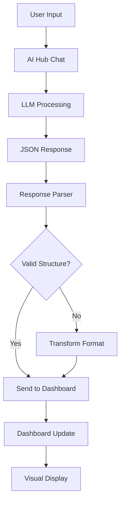

# Concept: Dynamic UI Generation and LLM Integration in AI Hub Apps

## Executive Summary

This proof-of-concept explores integrating custom, domain-specific user interfaces with Large Language Models (LLMs) within the AI Hub ecosystem. Through the implementation of a BR Nexus incident management dashboard, we've identified key patterns, challenges, and solutions for creating interactive, data-driven UIs that respond to LLM outputs in real-time.

## Problem Statement

Traditional AI chat interfaces are limited for complex, data-rich domains that require:

- **Visual data representation** (dashboards, charts, tables)
- **Domain-specific interactions** (incident management, system monitoring)
- **Real-time data updates** based on AI responses
- **Structured information display** beyond plain text

Repeatedly generating HTML via LLMs is inefficient and wastes tokens. A better approach separates UI from data generation.

## Key Learnings

### 1. **UI Architecture Patterns**

#### ❌ **Anti-Pattern: HTML Generation**

```
User Query → LLM → Generate HTML → Display HTML
Problems: Token waste, inconsistent markup, no interactivity
```

#### ✅ **Recommended Pattern: Static UI + Dynamic Data**

```
User Query → LLM → Generate JSON → Update Static UI
Benefits: Token efficiency, consistent UX, true interactivity
```

### 2. **LLM Response Format Challenges**

**Expected vs. Actual**: LLMs rarely follow exact JSON schemas precisely.

**Expected Format:**

```json
{
  "type": "incident_response",
  "dashboard_data": { "stats": {...}, "incidents": [...] }
}
```

**Actual LLM Response:**

```json
{
  "dashboard": { "summary": {...}, "recent_incidents": [...] }
}
```

**Solution**: Flexible parsing with format transformation layers.

### 3. **Integration Architecture**



## Technical Implementation Framework

### 1. **Static UI Components**

**Storage Strategy:**

- **Development**: `client/public/` (served by Vite)
- **Production**: `public/` (served by Express)
- **Mobile**: Popup windows for complex interfaces

**UI Requirements:**

- Self-contained HTML files with embedded CSS/JS
- Message listener for parent-child communication
- Responsive design for multiple screen sizes
- Error handling and fallback states

### 2. **LLM Configuration**

**System Prompt Structure:**

```markdown
## RESPONSE FORMAT

For [domain] queries, respond with structured JSON:

[Include example JSON structure]

Customize based on query type:

- Include only relevant data sections
- Adjust detail level based on request
- Handle edge cases gracefully
```

**Key Settings:**

- `preferredOutputFormat: "json"`
- Temperature: 0.7 (balance creativity and consistency)
- Token limit: Match complexity requirements

### 3. **Communication Layer**

**Message Protocol:**

```javascript
// Parent → Child (Dashboard)
window.postMessage(
  {
    type: 'dashboard-update',
    data: {
      /* formatted data */
    }
  },
  '*'
);

// Error Handling
window.postMessage(
  {
    type: 'dashboard-error',
    error: 'Data parsing failed'
  },
  '*'
);
```

**Data Transformation Pipeline:**

1. **Raw LLM Response** → JSON parsing
2. **Format Detection** → Expected vs. actual structure
3. **Data Mapping** → Transform to standard format
4. **Validation** → Ensure required fields present
5. **Dispatch** → Send to UI components

### 4. **Integration Points**

**Chat Interface Integration:**

```javascript
// In handleMessageComplete callback
if (isSpecializedApp(appId) && hasStructuredData(response)) {
  const transformedData = transformResponse(response);
  sendToInterface(appId, transformedData);
}
```

**Responsive Design:**

- **Desktop**: Iframe sidebar integration
- **Tablet**: Collapsible panels
- **Mobile**: Floating action button → popup window

## Recommended Architecture

### **Option 1: Embedded Integration (Current)**

```
[Chat Interface] [Custom Dashboard Iframe]
Pros: Unified view, real-time updates
Cons: Space constraints, complexity
```

### **Option 2: Tab-Based Interface**

```
[Chat Tab] [Dashboard Tab] [Reports Tab]
Pros: More space, focused interactions
Cons: Context switching required
```

### **Option 3: Overlay System**

```
[Chat Interface]
  ↓ (trigger)
[Fullscreen Dashboard Overlay]
Pros: Maximum space utilization
Cons: Modal interaction pattern
```

## Storage and Deployment Strategy

### **File Organization**

```
project/
├── client/
│   └── public/           # Vite static files (dev)
│       └── dashboards/
│           ├── incident-management.html
│           ├── system-monitoring.html
│           └── analytics.html
├── public/               # Express static files (prod)
│   └── dashboards/       # Mirror of client/public/dashboards
└── contents/
    └── apps/
        ├── incident-app.json
        └── monitoring-app.json
```

### **Build Pipeline**

```bash
# Development
cp client/public/dashboards/* public/dashboards/

# Production
# Files served directly from public/ by Express
```

## Data Flow Patterns

### **Pattern 1: Request-Response**

```
User: "Show system status"
LLM: { systems: [...], alerts: [...] }
UI: Updates dashboard immediately
```

### **Pattern 2: Conversational Updates**

```
User: "What about the Berlin datacenter?"
LLM: { filtered_systems: [...] }
UI: Filters existing dashboard view
```

### **Pattern 3: Progressive Enhancement**

```
User: "More details on incident #123"
LLM: { incident_details: {...} }
UI: Expands incident card with details
```

## Security Considerations

### **Iframe Sandbox**

```html
<iframe sandbox="allow-scripts allow-same-origin" />
```

**Warning**: This combination can escape sandboxing. Consider:

- `allow-scripts allow-same-origin allow-forms`
- Content Security Policy headers
- Domain restrictions for postMessage

### **Data Validation**

```javascript
function validateDashboardData(data) {
  if (!data?.dashboard_data) return false;
  if (typeof data.dashboard_data !== 'object') return false;
  // Additional validation...
  return true;
}
```

## Performance Considerations

### **Token Efficiency**

- **Before**: ~2000 tokens per HTML generation
- **After**: ~500 tokens for JSON data
- **Improvement**: 75% token reduction

### **Loading Performance**

- Preload dashboard iframes on app initialization
- Cache static UI components
- Minimize data transformation overhead

## Future Enhancement Opportunities

### **1. UI Template System**

```javascript
// Dynamic UI generation from templates
const template = await loadTemplate('incident-dashboard');
const ui = renderTemplate(template, data);
```

### **2. Component Library**

```javascript
// Reusable dashboard components
import { StatCard, IncidentList, SystemMap } from './components';
```

### **3. Real-time Synchronization**

```javascript
// WebSocket integration for live updates
const ws = new WebSocket('/dashboard-updates');
ws.onmessage = event => updateDashboard(event.data);
```

### **4. Multi-App Orchestration**

```javascript
// Cross-app data sharing
window.postMessage({
  type: 'cross-app-update',
  targetApp: 'monitoring-dashboard',
  data: systemMetrics
});
```

## Implementation Details from BR Nexus POC

### **Challenges Encountered**

1. **Static File Serving**: Development vs. production file serving differences
   - **Solution**: Dual deployment to `client/public/` and `public/`

2. **LLM Response Inconsistency**: AI didn't follow exact JSON schema
   - **Solution**: Flexible parsing with format transformation

3. **Cross-frame Communication**: iframe security and message passing
   - **Solution**: postMessage API with proper origin validation

4. **Mobile Responsiveness**: Limited screen real estate
   - **Solution**: Floating action button with popup window

### **Code Architecture**

**App Configuration:**

```json
{
  "id": "br-nexus-assistant",
  "preferredOutputFormat": "json",
  "features": {
    "canvas": false,
    "magicPrompt": true
  }
}
```

**Message Handling:**

```javascript
// In AppChat.jsx - handleMessageComplete
if (appId === 'br-nexus-assistant' && aiResponse) {
  const dashboardData = parseAndTransformResponse(aiResponse);
  sendToDashboard(dashboardData);
}
```

**Dashboard Integration:**

```javascript
// Dashboard HTML - message listener
window.addEventListener('message', function (event) {
  if (event.data?.type === 'dashboard-update') {
    updateDashboard(event.data.data);
  }
});
```

## Conclusion

The static UI + dynamic data pattern proves effective for integrating specialized interfaces with LLMs. Key success factors:

1. **Flexible data parsing** to handle LLM response variations
2. **Efficient communication** via postMessage API
3. **Responsive design** across device types
4. **Token optimization** through data-only generation
5. **Security considerations** for iframe integration

This approach enables rich, domain-specific interfaces while maintaining the conversational benefits of LLM interaction, opening possibilities for specialized AI applications beyond traditional chat interfaces.

## Implementation Checklist

- [x] Define UI component requirements
- [x] Create static HTML templates
- [x] Configure LLM response format
- [x] Implement data transformation layer
- [x] Set up communication protocol
- [x] Handle mobile/responsive scenarios
- [x] Add error handling and fallbacks
- [ ] Test cross-browser compatibility
- [ ] Optimize performance and security
- [ ] Create reusable component library

This framework can be applied to various domains: financial dashboards, project management interfaces, monitoring systems, and any scenario requiring rich visual data representation combined with AI-powered insights.

## Next Steps

1. **Generalize the pattern** for other domain-specific apps
2. **Create a template system** for rapid dashboard development
3. **Implement security hardening** for production deployment
4. **Add real-time data synchronization** capabilities
5. **Develop component library** for common UI patterns

---

_Document created: 2025-07-21_  
_Based on: BR Nexus Dashboard POC implementation_  
_Authors: AI Hub Development Team_
