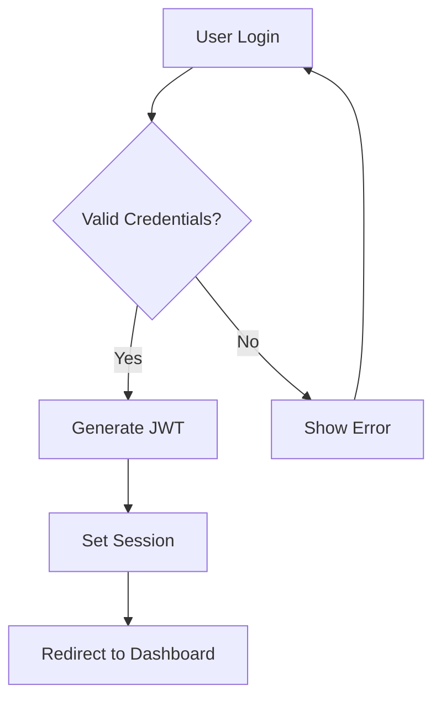
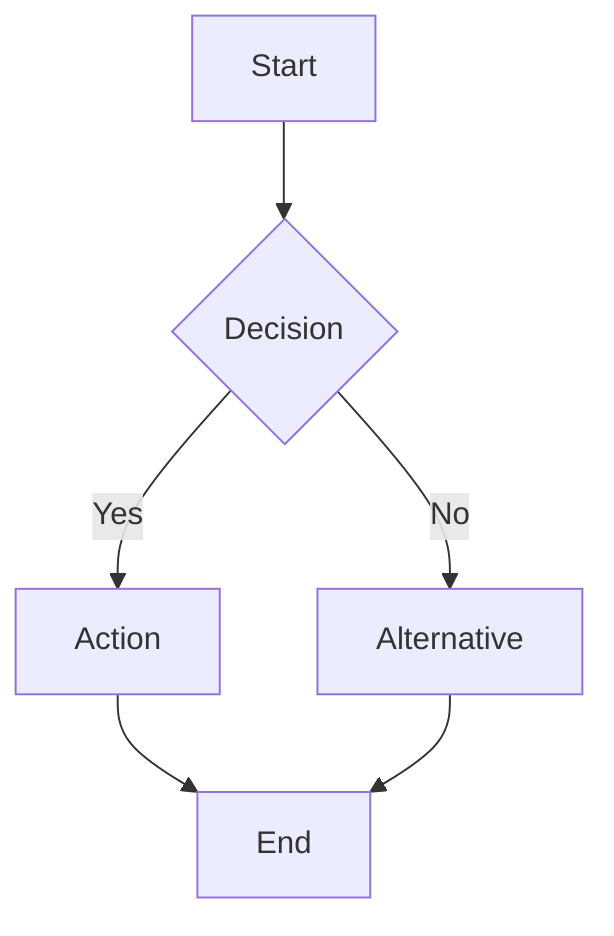

# MermaidJS Integration Concept for iHub Apps

**Date:** 2025-07-24  
**Issue:** #280 - Integrate diagram / chart tool  
**Research Source:** OpenWebUI MermaidJS implementation analysis

## 🎯 Executive Summary

This proposal outlines a comprehensive integration of MermaidJS into iHub Apps to enable LLMs to generate interactive charts, diagrams, and visualizations directly within the chat interface. The solution builds upon the existing markdown processing pipeline while maintaining security, performance, and user experience standards.

## 🏗️ Technical Architecture

### **1. Integration Strategy**

**Primary Integration Point**: `/client/src/shared/components/MarkdownRenderer.jsx`

- Extend the existing `renderer.code()` function to detect Mermaid syntax
- Leverage the current code block infrastructure for consistent UI/UX
- Maintain existing copy/download functionality with diagram-specific enhancements

### **2. Detection & Rendering Flow**

```javascript
// Enhanced renderer.code function logic
renderer.code = function (code, language, isEscaped) {
  // Detect Mermaid diagrams
  if (language === 'mermaid' || language === 'graph' || language === 'diagram') {
    return renderMermaidDiagram(code, language);
  }

  // Fall back to existing code block rendering
  return renderCodeBlock(code, language, isEscaped);
};
```

### **3. Component Architecture**

**New Components:**

- **`MermaidDiagram.jsx`**: Core diagram rendering component
- **`MermaidToolbar.jsx`**: Enhanced toolbar with diagram-specific actions
- **`MermaidModal.jsx`**: Full-screen diagram viewer (optional)

**Integration Points:**

- **MarkdownRenderer.jsx**: Detection and routing logic
- **StreamingMarkdown.jsx**: Real-time diagram updates during streaming
- **ChatMessage.jsx**: Container-level styling and interaction handling

## 🎨 User Experience Flow

### **1. Diagram Generation**

**User Request:**

```
"Create a flowchart showing the user authentication process using Mermaid"
```

**LLM Response:**

````markdown
Here's a flowchart for the user authentication process:


````

**Rendered Output:**

- Interactive diagram with pan/zoom capabilities
- Toolbar with Copy Code, Copy SVG, Download PNG, Download SVG, Fullscreen
- Syntax error handling with clear feedback
- Responsive design for mobile/desktop

### **2. Interactive Features**

**Enhanced Toolbar Actions:**

- **Copy Mermaid Code**: Copy the original syntax
- **Copy as SVG**: Copy rendered SVG to clipboard
- **Download PNG**: Export as high-resolution PNG
- **Download SVG**: Export as scalable SVG
- **Fullscreen**: Open in modal for detailed viewing
- **Edit**: Inline editing with live preview (advanced feature)

### **3. Error Handling**

**Graceful Degradation:**

- Invalid syntax → Show code block with error message
- Rendering failures → Fallback to code display
- Large diagrams → Performance warnings and optimization suggestions

## 🔧 Implementation Approach

### **Phase 1: Core Integration (MVP)**

**Dependencies:**

```json
{
  "mermaid": "^10.9.0",
  "@types/mermaid": "^10.9.0"
}
```

**Key Files to Modify:**

1. **`client/src/shared/components/MarkdownRenderer.jsx`**
   - Add Mermaid detection logic
   - Integrate MermaidDiagram component
   - Update language mappings

2. **`client/src/shared/components/MermaidDiagram.jsx`** (NEW)
   - Initialize Mermaid library
   - Handle diagram rendering
   - Implement error boundaries

3. **`client/src/shared/components/MermaidToolbar.jsx`** (NEW)
   - Enhanced toolbar with diagram actions
   - Export functionality
   - Copy operations

**Core Implementation:**

```javascript
// MermaidDiagram.jsx
import mermaid from 'mermaid';

const MermaidDiagram = ({ code, language }) => {
  const containerRef = useRef(null);
  const [error, setError] = useState(null);
  const [diagramId] = useState(`mermaid-${Date.now()}-${Math.random().toString(36).substr(2, 9)}`);

  useEffect(() => {
    mermaid.initialize({
      startOnLoad: false,
      theme: 'default',
      securityLevel: 'sandbox', // Enhanced security
      fontFamily: 'ui-sans-serif, system-ui, sans-serif'
    });

    renderDiagram();
  }, [code]);

  const renderDiagram = async () => {
    try {
      const { svg } = await mermaid.render(diagramId, code);
      if (containerRef.current) {
        containerRef.current.innerHTML = svg;
      }
    } catch (err) {
      setError(err.message);
    }
  };

  if (error) {
    return <MermaidErrorFallback code={code} error={error} />;
  }

  return (
    <div className="mermaid-container">
      <div ref={containerRef} className="mermaid-diagram" />
      <MermaidToolbar code={code} diagramId={diagramId} />
    </div>
  );
};
```

### **Phase 2: Enhanced Features**

**Advanced Capabilities:**

- **Real-time Editing**: Inline diagram editor with live preview
- **Template Library**: Pre-built diagram templates for common use cases
- **Diagram Themes**: Support for light/dark mode and custom themes
- **Collaboration**: Shared diagram URLs and embedded widgets
- **Version History**: Track diagram iterations within chat sessions

### **Phase 3: AI Enhancement**

**LLM Integration Improvements:**

- **Syntax Validation**: Pre-validate Mermaid syntax before rendering
- **Auto-correction**: Suggest fixes for common syntax errors
- **Intelligent Templates**: Context-aware diagram suggestions
- **Multi-format Export**: PDF, PowerPoint, and other business formats

## 🔒 Security & Performance Considerations

### **Security Measures**

**1. Sandboxed Rendering:**

```javascript
mermaid.initialize({
  securityLevel: 'sandbox', // Prevents arbitrary code execution
  maxTextSize: 50000, // Limit diagram complexity
  maxEdges: 500, // Prevent resource exhaustion
  htmlLabels: false // Disable HTML in labels for XSS prevention
});
```

**2. Content Sanitization:**

- Validate Mermaid syntax before rendering
- Sanitize user inputs and diagram content
- Implement size and complexity limits
- Rate limiting for diagram generation

**3. CSP Compatibility:**

- Ensure Mermaid SVG generation works with existing Content Security Policy
- Use nonce-based script loading if needed
- Avoid inline styles and scripts

### **Performance Optimizations**

**1. Lazy Loading:**

- Load Mermaid library only when needed
- Implement intersection observer for off-screen diagrams
- Defer complex diagram rendering

**2. Caching Strategy:**

- Cache rendered SVGs based on diagram content hash
- Browser-level caching for diagram assets
- Debounced re-rendering during streaming

**3. Resource Management:**

```javascript
// Diagram complexity limits
const LIMITS = {
  maxNodes: 100,
  maxEdges: 200,
  maxTextLength: 10000,
  renderTimeout: 5000
};
```

## 🚀 Implementation Timeline

**Week 1-2: Foundation**

- Set up Mermaid library integration
- Implement basic diagram detection and rendering
- Create core MermaidDiagram component

**Week 3-4: UI/UX Enhancement**

- Build enhanced toolbar with export features
- Implement error handling and fallbacks
- Add responsive design and accessibility

**Week 5-6: Testing & Optimization**

- Performance testing with large diagrams
- Security validation and penetration testing
- Cross-browser compatibility testing

**Week 7-8: Advanced Features**

- Real-time streaming support
- Fullscreen modal and interaction features
- Documentation and user guides

## 📊 Expected Outcomes

**User Benefits:**

- **Enhanced Communication**: Visual diagrams improve clarity and understanding
- **Workflow Efficiency**: Direct diagram generation eliminates external tool dependencies
- **Professional Output**: High-quality diagrams suitable for business presentations
- **Accessibility**: Screen reader support and keyboard navigation

**Technical Benefits:**

- **Seamless Integration**: Builds upon existing architecture patterns
- **Scalable Architecture**: Modular design supports future enhancements
- **Performance Optimized**: Efficient rendering with resource management
- **Security Hardened**: Sandboxed execution prevents security vulnerabilities

## 🔗 Integration with Existing Features

**Chat System:**

- Diagrams render during streaming responses
- Diagram content included in chat history and exports
- Copy/share functionality maintains diagram fidelity

**Authentication & Permissions:**

- Respect existing user group permissions
- Admin controls for diagram complexity limits
- Audit logging for diagram generation activities

**Configuration System:**

- Platform-level settings for enabling/disabling diagrams
- App-specific diagram permissions and limits
- UI customization options for diagram themes

## 🎓 LLM Prompt Optimization

**Recommended System Prompts for Diagram Generation:**

````
When creating diagrams, use Mermaid syntax with these guidelines:
- Use ```mermaid code blocks for all diagrams
- Prefer flowcharts (flowchart TD) for processes
- Use sequence diagrams for interactions
- Keep node labels concise and clear
- Add descriptive comments before complex diagrams

Example:


## 📋 Next Steps

1. **Technical Review**: Have the development team review the proposed architecture
2. **Proof of Concept**: Build a minimal working prototype to validate the approach
3. **Security Audit**: Conduct security review of the sandboxed Mermaid implementation
4. **User Testing**: Test diagram generation with various LLM models and prompts
5. **Performance Benchmarking**: Test with complex diagrams and high concurrency

## 📚 References

- **OpenWebUI MermaidJS Implementation**: https://openwebui.com/features/code-execution/mermaid
- **MermaidJS Documentation**: https://mermaid.js.org/
- **Issue #280**: https://github.com/intrafind/ai-hub-apps/issues/280

---

This comprehensive integration concept provides a robust foundation for adding MermaidJS diagram capabilities to iHub Apps while maintaining the platform's security, performance, and user experience standards.
```
