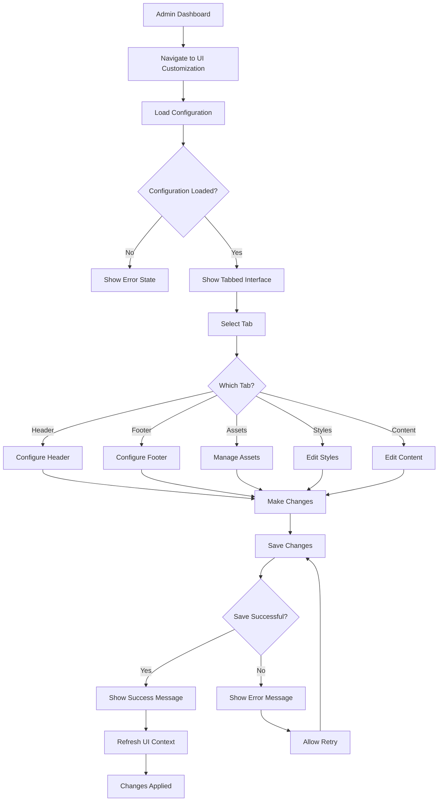

# UI/UX Brief: AdminUICustomization Component Audit

## Executive Summary

The AdminUICustomization component is a comprehensive interface for managing UI branding and customization within the AI Hub Apps platform. The component follows a tabbed architecture with five distinct sections: Header, Footer, Assets, Styles, and Content. While functionally robust, the interface presents several opportunities for improvement in user experience, accessibility, visual hierarchy, and modern design patterns.

**Key Strengths:**

- Comprehensive functionality with logical feature grouping
- Good use of progressive disclosure with collapsible sections
- Internationalization support throughout
- Proper error handling and user feedback
- Real-time preview capabilities

**Critical Areas for Improvement:**

- Accessibility compliance (WCAG gaps)
- Visual hierarchy and information architecture
- Mobile responsiveness
- Component architecture and reusability
- User feedback patterns and loading states

## Component Hierarchy

### AdminUICustomization (Main Container)

- **Purpose**: Primary orchestrator for UI customization features
- **States**: loading, error, saving, success, idle
- **Props**:
  - `config` (object): Current UI configuration
  - `onUpdate` (function): Configuration update handler
  - `t` (function): Translation function
- **Accessibility**:
  - ARIA: Missing landmark roles, inadequate tab navigation
  - Keyboard: Basic tab navigation, missing keyboard shortcuts
  - Screen Reader: Limited announcements for state changes

### HeaderCustomization

- **Purpose**: Configure header appearance, logo, navigation links
- **States**: default, editing, adding-link, color-picking
- **Props**:
  - `config` (object): Header configuration
  - `onUpdate` (function): Update handler
  - `t` (function): Translation function
- **Accessibility**:
  - ARIA: Missing labels for color inputs, inadequate descriptions
  - Keyboard: Color presets not keyboard accessible
  - Screen Reader: Color values not announced properly

### FooterCustomization

- **Purpose**: Configure footer content, links, and visibility
- **States**: enabled, disabled, editing-links
- **Props**: Same as HeaderCustomization
- **Accessibility**:
  - ARIA: Conditional content not properly announced
  - Keyboard: Toggle interactions accessible
  - Screen Reader: State changes need better announcements

### AssetManager

- **Purpose**: Upload, manage, and organize media assets
- **States**: loading, uploading, idle, error, success
- **Props**:
  - `t` (function): Translation function
- **Accessibility**:
  - ARIA: File upload lacks proper labeling
  - Keyboard: Table navigation could be improved
  - Screen Reader: Upload progress not announced

### StyleEditor

- **Purpose**: Manage theme colors, CSS, and design variables
- **States**: theme-editing, css-editing, variables-editing
- **Props**: Same as HeaderCustomization
- **Accessibility**:
  - ARIA: Color inputs need better labeling
  - Keyboard: Color picker inaccessible
  - Screen Reader: CSS syntax not announced

### ContentEditor

- **Purpose**: Manage site-wide content like titles and disclaimers
- **States**: title-editing, disclaimer-editing, pages-editing
- **Props**: Same as HeaderCustomization
- **Accessibility**:
  - ARIA: Nested form sections need proper grouping
  - Keyboard: Multi-step forms could be improved
  - Screen Reader: Content relationships unclear

### DynamicLanguageEditor (Shared Component)

- **Purpose**: Multi-language content editing with translation support
- **States**: default, adding-language, translating
- **Props**:
  - `label` (string): Field label
  - `value` (object): Language-keyed values
  - `onChange` (function): Change handler
  - `type` (string): Input type (text/textarea)
  - `placeholder` (object): Language-keyed placeholders
- **Accessibility**:
  - ARIA: Language tags need better semantics
  - Keyboard: Add/remove language buttons accessible
  - Screen Reader: Translation status needs announcements

## User Flow



## Design Specifications

### Current Spacing Issues

- **Inconsistent margins**: Mix of `mb-4`, `mb-6`, `mb-8` without clear hierarchy
- **Grid gaps**: Inconsistent use of `gap-4` vs `gap-6` in grid layouts
- **Button spacing**: Inconsistent padding on action buttons

### Typography Problems

- **Hierarchy confusion**: Multiple heading levels without clear semantic structure
- **Font weights**: Overuse of `font-medium` and `font-bold`
- **Text sizing**: Inconsistent use of `text-sm` vs `text-xs` for metadata

### Color Usage Analysis

- **Good**: Consistent use of indigo theme colors
- **Issues**:
  - Color picker accessibility (no focus indicators)
  - Insufficient contrast ratios in some preview areas
  - Missing dark mode considerations

## Accessibility Requirements

### Critical WCAG Violations

#### Level A Issues

1. **Missing Alt Text**: Color preview squares lack descriptive alt text
2. **Keyboard Navigation**: Color preset buttons not focusable
3. **Form Labels**: Many inputs lack proper associated labels
4. **Focus Indicators**: Custom buttons missing visible focus states

#### Level AA Issues

1. **Color Contrast**: Preview text may not meet 4.5:1 ratio
2. **Target Size**: Some buttons below 44px minimum touch target
3. **Error Identification**: Error messages not programmatically associated
4. **Language Changes**: Language tags in DynamicLanguageEditor not marked up

#### Level AAA Considerations

1. **Context Help**: Complex forms lack contextual help
2. **Error Prevention**: No confirmation for destructive actions (beyond confirm())
3. **Documentation**: Missing help text for advanced features

### Required ARIA Implementations

```jsx
// Color picker section needs:
<fieldset role="group" aria-labelledby="color-section-heading">
  <legend id="color-section-heading">Theme Colors</legend>
  <div role="radiogroup" aria-labelledby="color-presets-label">
    <span id="color-presets-label">Color Presets</span>
    {presets.map(color => (
      <button
        role="radio"
        aria-checked={selectedColor === color}
        aria-label={`Select ${color} color`}
        key={color}
      />
    ))}
  </div>
</fieldset>

// Tab navigation needs:
<div role="tablist" aria-label="UI Customization Sections">
  {tabs.map(tab => (
    <button
      role="tab"
      aria-selected={activeTab === tab.id}
      aria-controls={`panel-${tab.id}`}
      id={`tab-${tab.id}`}
    />
  ))}
</div>

// Upload area needs:
<div
  role="button"
  aria-label="Upload asset file"
  aria-describedby="upload-instructions"
  tabIndex={0}
  onKeyDown={handleKeyPress}
>
  <p id="upload-instructions">
    Drag and drop files here or click to browse
  </p>
</div>
```

## Implementation Notes

### Performance Optimizations Needed

1. **Debounced Updates**: Color and text inputs should debounce changes
2. **Lazy Loading**: Asset previews should load on demand
3. **Virtual Scrolling**: Language list in DynamicLanguageEditor
4. **Memoization**: Preview components should use React.memo

### Component Architecture Improvements

1. **Hook Extraction**: Move form logic to custom hooks
2. **State Management**: Consider reducer pattern for complex state
3. **Error Boundaries**: Add granular error boundaries per section
4. **Validation**: Implement client-side validation with react-hook-form

### Mobile Responsiveness Issues

1. **Tab Navigation**: Horizontal scrolling on mobile needed
2. **Form Layout**: Stack form fields on mobile
3. **Touch Targets**: Increase button sizes for touch interfaces
4. **Asset Table**: Implement mobile-friendly card layout

### Modern Design Pattern Recommendations

#### 1. Progressive Disclosure Enhancement

```jsx
// Replace simple show/hide with smooth animations
const [isExpanded, setIsExpanded] = useState(false);

<motion.div
  initial={false}
  animate={{ height: isExpanded ? 'auto' : 0 }}
  style={{ overflow: 'hidden' }}
>
  {/* Collapsible content */}
</motion.div>;
```

#### 2. Improved Loading States

```jsx
// Replace basic spinners with skeleton screens
const LoadingSkeleton = () => (
  <div className="space-y-4">
    {[...Array(3)].map((_, i) => (
      <div key={i} className="animate-pulse">
        <div className="h-4 bg-gray-200 rounded w-3/4 mb-2"></div>
        <div className="h-8 bg-gray-200 rounded"></div>
      </div>
    ))}
  </div>
);
```

#### 3. Enhanced Error Handling

```jsx
// Implement toast notifications instead of inline alerts
import { toast } from 'react-hot-toast';

const handleSave = async () => {
  try {
    await saveConfig();
    toast.success('Configuration saved successfully', {
      duration: 3000,
      position: 'top-right'
    });
  } catch (error) {
    toast.error('Failed to save configuration', {
      description: error.message,
      action: {
        label: 'Retry',
        onClick: handleSave
      }
    });
  }
};
```

#### 4. Improved Color Picker

```jsx
// Replace basic color inputs with accessible color picker
import { HexColorPicker } from 'react-colorful';

const ColorPicker = ({ color, onChange, label }) => (
  <div className="space-y-2">
    <label className="block text-sm font-medium">{label}</label>
    <Popover>
      <PopoverTrigger asChild>
        <Button
          variant="outline"
          className="w-full justify-start text-left font-normal"
          style={{ backgroundColor: color }}
        >
          <div className="w-4 h-4 rounded border mr-2" style={{ backgroundColor: color }} />
          {color}
        </Button>
      </PopoverTrigger>
      <PopoverContent className="w-auto p-3">
        <HexColorPicker color={color} onChange={onChange} />
      </PopoverContent>
    </Popover>
  </div>
);
```

### Security Considerations

1. **File Upload**: Validate file types and sizes on both client and server
2. **CSS Injection**: Sanitize custom CSS to prevent XSS
3. **Image Processing**: Implement server-side image optimization
4. **Rate Limiting**: Limit asset upload frequency

### Testing Strategy

1. **Unit Tests**: Test each component in isolation
2. **Integration Tests**: Test tab navigation and form submission
3. **Accessibility Tests**: Use axe-core for automated a11y testing
4. **Visual Regression**: Test UI changes across breakpoints
5. **E2E Tests**: Test complete customization workflows

## Recommended Improvements Priority

### High Priority (Critical UX Issues)

1. Fix accessibility violations (WCAG AA compliance)
2. Implement proper mobile responsive design
3. Add loading skeletons and improved error states
4. Enhance keyboard navigation throughout interface

### Medium Priority (User Experience)

1. Implement drag-and-drop for asset uploads
2. Add preview modes for customizations
3. Improve color picker with accessibility features
4. Add undo/redo functionality for changes

### Low Priority (Enhancement)

1. Add customization templates/presets
2. Implement bulk operations for assets
3. Add advanced CSS editing with syntax highlighting
4. Create guided tour for first-time users

This audit provides a comprehensive analysis of the AdminUICustomization interface and serves as a roadmap for improving user experience, accessibility, and maintainability. The recommendations prioritize user needs while ensuring the interface meets modern web standards and accessibility requirements.
