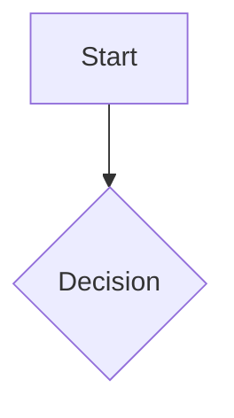
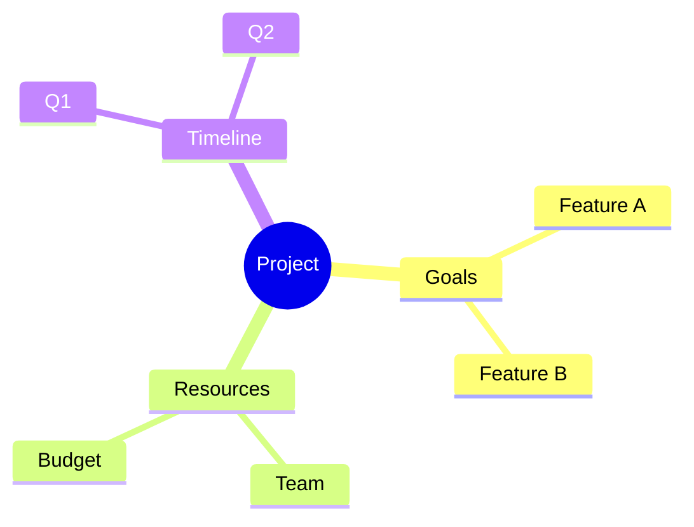

# Interactive Diagrams Feature Concept

**Date:** 2026-01-23  
**Issue:** Interactive Diagrams Enhancement  
**Status:** Implementation Planning

## 🎯 Executive Summary

This document outlines the enhancement of the existing MermaidJS integration in iHub Apps to support interactive diagrams with features like pan/zoom, node navigation, expand/collapse functionality, and enhanced user interaction capabilities.

## 📋 Problem Statement

The current implementation supports generating Mermaid diagrams, but these are **static/images**. Users need:
- **Pan and Zoom**: Navigate large diagrams easily
- **Interactive Nodes**: Click nodes to expand/collapse or navigate
- **Better UX for Complex Diagrams**: Mind maps and flowcharts with collapsible sections
- **Enhanced Navigation**: Dive into nodes for better understanding

## 🔍 Current State Analysis

### Existing Implementation

**Files:**
- `client/src/hooks/useMermaidRenderer.js` - Main Mermaid rendering logic
- `client/src/shared/components/MarkdownRenderer.jsx` - Markdown integration
- `client/src/utils/markdownHelpers.js` - Mermaid utilities
- `client/src/config/marked.config.js` - Marked configuration

**Current Features:**
- ✅ Mermaid diagram rendering (v11.10.0)
- ✅ Multiple diagram types (flowchart, sequence, class, gantt, mindmap, etc.)
- ✅ Download options (SVG, PNG, PDF)
- ✅ Copy code functionality
- ✅ Fullscreen view
- ✅ Error handling and validation
- ✅ Syntax processing and cleanup

**Limitations:**
- ❌ No pan/zoom controls
- ❌ No interactive node navigation
- ❌ No expand/collapse for hierarchical diagrams
- ❌ Limited keyboard navigation
- ❌ Static SVG output only

## 🎨 Proposed Solution

### 1. Pan & Zoom Integration

**Library:** `svg-pan-zoom` (MIT license, lightweight, 27KB minified)

**Features:**
- Mouse wheel zoom
- Drag to pan
- Double-click to reset
- Pinch-to-zoom support (touch devices)
- Programmatic zoom controls (+/- buttons)
- Fit-to-screen functionality

**Implementation:**
```javascript
import svgPanZoom from 'svg-pan-zoom';

// Initialize after Mermaid renders
const panZoomInstance = svgPanZoom(svgElement, {
  zoomEnabled: true,
  controlIconsEnabled: false, // We'll use custom controls
  fit: true,
  center: true,
  minZoom: 0.1,
  maxZoom: 10,
  zoomScaleSensitivity: 0.3
});
```

### 2. Interactive Node Click Handlers

**Mermaid Built-in Support:**


**Implementation Approach:**
- Enable `securityLevel: 'loose'` for click functionality
- Register global callback functions for custom interactions
- Support both URL navigation and custom JavaScript callbacks
- Add click event tracking for analytics

**Use Cases:**
- Navigate to related documentation
- Show node details in a modal
- Expand/collapse child nodes
- Trigger app-specific actions

### 3. Expand/Collapse for Mind Maps

**Mind Map Example:**


**Approach:**
- Detect mind map diagram type
- Add toggle buttons to parent nodes
- Dynamically show/hide child nodes
- Save expansion state in local storage
- Smooth animations for expand/collapse

### 4. Enhanced UI Controls

**New Toolbar Actions:**
```
[Pan Mode] [Zoom In] [Zoom Out] [Fit to Screen] [Reset View]
[Export SVG] [Export PNG] [Export PDF] [Fullscreen]
```

**Fullscreen Modal Enhancement:**
- Dedicated interactive controls
- Larger workspace for complex diagrams
- Keyboard shortcuts (ESC to close, +/- to zoom)
- Mini-map for large diagrams (optional)

### 5. Keyboard Navigation

**Shortcuts:**
- `+` / `-` : Zoom in/out
- `0` : Reset zoom
- `F` : Fit to screen
- `ESC` : Exit fullscreen
- `Space + Drag` : Pan (alternative to mouse drag)
- `Arrow keys` : Navigate nodes (future enhancement)

## 🏗️ Technical Architecture

### Dependencies

```json
{
  "svg-pan-zoom": "^3.6.1"
}
```

### Component Structure

**Enhanced Files:**

1. **`useMermaidRenderer.js`**
   - Add svg-pan-zoom initialization
   - Implement click handler registration
   - Add expand/collapse logic for mind maps
   - Enhance toolbar with interactive controls

2. **`markdownHelpers.js`**
   - Add helper for detecting interactive diagram types
   - Add state management utilities

3. **New Component: `InteractiveDiagramControls.jsx`**
   - Zoom controls (+/-, fit, reset)
   - Pan mode toggle
   - Expand/collapse all (for mind maps)
   - Export controls

4. **New Component: `FullscreenDiagramModal.jsx`**
   - Enhanced fullscreen view
   - Interactive controls overlay
   - Mini-map (optional)
   - Keyboard shortcuts handler

### Data Flow

```
1. Mermaid code detected in markdown
   ↓
2. useMermaidRenderer processes code
   ↓
3. Mermaid renders SVG
   ↓
4. svg-pan-zoom initializes on SVG
   ↓
5. Click handlers registered
   ↓
6. Interactive controls attached
   ↓
7. User interacts (pan/zoom/click)
   ↓
8. State updates, UI responds
```

## 🔒 Security Considerations

### Click Handler Security

**Current:** `securityLevel: 'loose'` (required for click handlers but allows HTML labels)

**Mitigation:**
- Validate all click callback functions
- Sanitize node labels and content
- Whitelist allowed URL patterns for external navigation
- Use CSP to restrict inline scripts
- Implement click event validation

**Recommended Config:**
```javascript
mermaid.initialize({
  securityLevel: 'loose', // Required for clicks
  maxTextSize: 50000,
  maxEdges: 500,
  htmlLabels: true, // Needed for interactive features
  // Add click handler validation
  secure: {
    validateClickCallbacks: true,
    allowedDomains: ['example.com'] // Whitelist for external links
  }
});
```

### XSS Prevention

- Sanitize all user-generated diagram code
- Escape special characters in labels
- Validate URLs before navigation
- Use Content Security Policy headers

## 🎯 Implementation Phases

### Phase 1: Core Pan & Zoom (Week 1)
- [x] Research and library selection
- [ ] Install svg-pan-zoom dependency
- [ ] Integrate pan-zoom with Mermaid SVG output
- [ ] Add basic zoom controls (+/-, reset, fit)
- [ ] Test with various diagram types
- [ ] Update documentation

### Phase 2: Interactive Node Clicks (Week 2)
- [ ] Enable Mermaid click functionality
- [ ] Implement callback registration system
- [ ] Add click event handlers
- [ ] Support URL navigation
- [ ] Add custom action callbacks
- [ ] Test security measures

### Phase 3: Expand/Collapse (Week 3)
- [ ] Detect hierarchical diagram types
- [ ] Implement expand/collapse for mind maps
- [ ] Add toggle buttons to nodes
- [ ] State persistence (localStorage)
- [ ] Smooth animations
- [ ] Test with complex diagrams

### Phase 4: Enhanced UI/UX (Week 4)
- [ ] Create InteractiveDiagramControls component
- [ ] Build FullscreenDiagramModal component
- [ ] Add keyboard shortcuts
- [ ] Implement mini-map (optional)
- [ ] Add internationalization
- [ ] Polish animations and transitions

### Phase 5: Testing & Documentation (Week 5)
- [ ] Cross-browser testing
- [ ] Touch device testing
- [ ] Performance testing with large diagrams
- [ ] Accessibility audit
- [ ] User documentation
- [ ] Code review and refinement

## 📊 Expected Outcomes

### User Benefits
- **Better Navigation**: Pan and zoom for large diagrams
- **Enhanced Understanding**: Interactive exploration of complex structures
- **Improved Productivity**: Faster diagram analysis and interaction
- **Better Mobile Experience**: Touch-friendly controls
- **Accessibility**: Keyboard navigation support

### Technical Benefits
- **Minimal Dependencies**: Only one new library (svg-pan-zoom)
- **Backward Compatibility**: Existing diagrams work without changes
- **Performance**: Efficient SVG manipulation
- **Maintainability**: Clean separation of concerns
- **Extensibility**: Easy to add future interactive features

## 🔗 Integration Points

### Existing Features
- **Chat System**: Diagrams remain interactive in chat messages
- **Export System**: Export maintains interactivity where possible
- **Markdown Rendering**: Seamless integration with markdown flow
- **Authentication**: Respects user permissions
- **Configuration**: App-specific diagram settings

### Configuration Options

**Platform Configuration (`platform.json`):**
```json
{
  "features": {
    "interactiveDiagrams": {
      "enabled": true,
      "panZoom": true,
      "clickHandlers": true,
      "expandCollapse": true,
      "keyboardShortcuts": true
    }
  }
}
```

**App Configuration (`apps/*.json`):**
```json
{
  "features": {
    "enableMermaidRendering": true,
    "enableInteractiveDiagrams": true,
    "allowExternalLinks": false,
    "maxDiagramComplexity": 200
  }
}
```

## 📚 References

### Libraries
- **svg-pan-zoom**: https://github.com/bumbu/svg-pan-zoom
- **Mermaid.js**: https://mermaid.js.org/
- **React Flow** (alternative considered): https://reactflow.dev/

### Research
- Mermaid click syntax: https://mermaid.js.org/config/Tutorials.html#click-event
- Pan/zoom integration examples: https://stackoverflow.com/questions/78319916
- Interactive diagram best practices: https://www.syncfusion.com/blogs/post/ai-assisted-mind-map

### Related Concepts
- `concepts/2025-07-24 MermaidJS Integration.md` - Original Mermaid implementation
- `concepts/mermaid-integration/2025-08-03 MermaidJS Implementation Report.md`

## 🚀 Next Steps

1. **Approval**: Review this concept with team
2. **Proof of Concept**: Build minimal pan-zoom prototype
3. **Implementation**: Follow phased approach
4. **Testing**: Comprehensive testing across use cases
5. **Documentation**: Update user guides and developer docs
6. **Release**: Gradual rollout with feature flag

## 📝 Notes

### Alternative Approaches Considered

**1. React Flow**
- **Pros**: Built for React, rich features, good community
- **Cons**: Different diagram syntax, migration effort, larger bundle size
- **Decision**: Rejected - would require rewriting diagram generation

**2. Custom Canvas Rendering**
- **Pros**: Maximum control, no dependencies
- **Cons**: High development effort, maintenance burden
- **Decision**: Rejected - reinventing the wheel

**3. Enhance Mermaid + svg-pan-zoom**
- **Pros**: Minimal changes, leverages existing implementation, lightweight
- **Cons**: Some limitations with complex interactions
- **Decision**: ✅ Selected - best balance of features and effort

### Future Enhancements
- Real-time collaborative diagram editing
- Diagram versioning and history
- AI-powered diagram suggestions and improvements
- Export to other formats (PowerPoint, Visio)
- Diagram templates library
- Animated transitions between diagram states
- Voice control for accessibility

---

**Document Version:** 1.0  
**Last Updated:** 2026-01-23  
**Status:** Ready for Implementation
