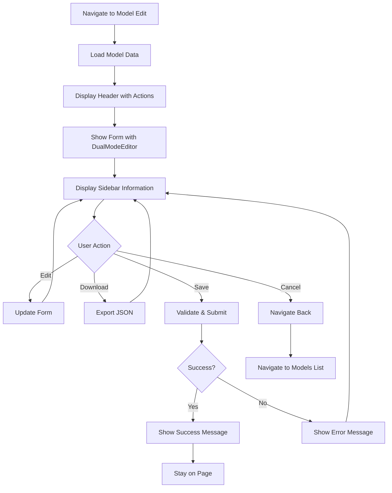

# UI/UX Brief: AdminModelEditPage Design Consistency Redesign

## Executive Summary

The AdminModelEditPage currently uses a significantly different design approach compared to AdminPromptEditPage and AdminAppEditPage, creating an inconsistent user experience within the admin interface. This brief outlines the necessary changes to align the model edit page with the established design patterns while preserving its unique functionality (usage stats and apps list).

## Current Design Analysis

### AdminPromptEditPage (Consistent Pattern)
- **Container**: `max-w-4xl mx-auto px-4 sm:px-6 lg:px-8 py-8`
- **Layout**: Simple single-column form layout
- **Header**: Inline header with title/description on left, action buttons on right
- **Form**: Direct DualModeEditor integration
- **Error Handling**: Inline error display (not implemented but space available)
- **Actions**: Bottom-aligned cancel/save buttons with loading states

### AdminAppEditPage (Consistent Pattern)
- **Container**: `max-w-6xl mx-auto px-4 sm:px-6 lg:px-8 py-8`
- **Layout**: Single-column form layout with AdminAuth wrapper
- **Header**: `sm:flex sm:items-center` with flexible layout
- **Form**: Clean DualModeEditor integration
- **Error Handling**: Space for inline error display
- **Actions**: Bottom-aligned cancel/save buttons with loading states

### AdminModelEditPage (Inconsistent Pattern)
- **Container**: `min-h-screen bg-gray-100` with complex nested containers
- **Layout**: Complex 12-column grid with sidebar content
- **Header**: Separate `bg-white shadow` header section
- **Form**: DualModeEditor in 8-column left area
- **Error Handling**: Fixed positioning with toast-style notifications
- **Actions**: Bottom-aligned within form area
- **Sidebar**: Usage stats and apps list in 4-column right area

## Component Hierarchy

### Current AdminModelEditPage Structure
```
AdminAuth
├── div (min-h-screen bg-gray-100)
    ├── AdminNavigation
    ├── Header Section (bg-white shadow)
    │   ├── Back Button + Title/Description
    │   └── Download Button
    ├── Main Content (max-w-7xl)
    │   └── Form (lg:grid lg:grid-cols-12)
    │       ├── Left Column (lg:col-span-8)
    │       │   └── DualModeEditor
    │       ├── Right Column (lg:col-span-4)
    │       │   ├── Usage Stats Card
    │       │   └── Apps Using Model Card
    │       └── Save Buttons
    └── Fixed Status Messages
```

### Proposed Consistent Structure
```
AdminAuth
├── AdminNavigation
├── Container (max-w-6xl mx-auto px-4 sm:px-6 lg:px-8 py-8)
    ├── Header Section (inline)
    │   ├── Title/Description (left)
    │   └── Action Buttons (right - download, back)
    ├── Form
    │   ├── DualModeEditor (main content)
    │   ├── Model Sidebar Information (below editor on mobile, beside on desktop)
    │   │   ├── Usage Stats
    │   │   └── Apps Using Model
    │   └── Save Buttons (bottom)
    └── Inline Error Display
```

## User Flow



## Design Specifications

### Container and Layout
- **Remove**: `min-h-screen bg-gray-100` wrapper
- **Use**: `max-w-6xl mx-auto px-4 sm:px-6 lg:px-8 py-8` (same as AdminAppEditPage)
- **Layout**: Responsive single-column with flexible sidebar integration

### Header Section
- **Structure**: `div className="sm:flex sm:items-center mb-8"`
- **Left Side**: Title and description in `sm:flex-auto`
- **Right Side**: Action buttons in `mt-4 sm:mt-0 sm:ml-16 sm:flex-none`
- **Remove**: Separate `bg-white shadow` header section
- **Remove**: Inline back button from title area

### Sidebar Content Integration
- **Desktop**: Display usage stats and apps list in a right column beside the form
- **Mobile**: Stack below the DualModeEditor for better mobile experience
- **Layout**: Use CSS Grid or Flexbox instead of complex 12-column grid
- **Styling**: Maintain current card styling but integrate within main flow

### Error Handling
- **Remove**: Fixed positioning toast notifications
- **Add**: Inline error display area below header
- **Style**: Red background with white text, consistent with other pages
- **Pattern**: `className="bg-red-50 border border-red-200 text-red-700 px-4 py-3 rounded"`

### Typography and Spacing
- **Title**: `text-2xl font-semibold text-gray-900`
- **Description**: `mt-1 text-sm text-gray-600` (Prompt) or `mt-2 text-sm text-gray-700` (App)
- **Spacing**: Consistent `space-y-6` for form sections
- **Cards**: Maintain current `bg-white shadow px-4 py-5 sm:rounded-lg sm:p-6`

## Accessibility Requirements

### Keyboard Navigation
- **Tab Order**: Header actions → Form inputs → Sidebar information → Save buttons
- **Focus Management**: Ensure sidebar cards are keyboard accessible
- **Focus Indicators**: Maintain current focus ring patterns

### Screen Reader Support
- **ARIA Labels**: 
  - Usage stats: `aria-label="Model usage statistics"`
  - Apps list: `aria-label="Applications using this model"`
  - Error messages: `role="alert"` for inline errors
- **Headings**: Proper heading hierarchy (h1 → h2 → h3)
- **Live Regions**: `aria-live="polite"` for save status updates

### WCAG Compliance
- **Color Contrast**: Ensure all text meets WCAG AA standards
- **Focus Management**: Clear focus indicators on all interactive elements
- **Error Identification**: Clear error messaging with proper ARIA attributes

## Implementation Notes

### Key Changes Required

1. **Layout Restructure**
   ```jsx
   // Replace current structure
   <div className="min-h-screen bg-gray-100">
     <div className="bg-white shadow">
   
   // With consistent pattern
   <div className="max-w-6xl mx-auto px-4 sm:px-6 lg:px-8 py-8">
     <div className="sm:flex sm:items-center mb-8">
   ```

2. **Header Alignment**
   ```jsx
   // Move download button to header actions area
   <div className="mt-4 sm:mt-0 sm:ml-16 sm:flex-none">
     <div className="flex space-x-3">
       {!isNewModel && (
         <button onClick={downloadHandler}>Download</button>
       )}
       <button onClick={() => navigate('/admin/models')}>
         Back to Models
       </button>
     </div>
   </div>
   ```

3. **Sidebar Integration**
   ```jsx
   // Use responsive layout instead of complex grid
   <div className="lg:flex lg:gap-8">
     <div className="lg:flex-1">
       <DualModeEditor />
     </div>
     <div className="mt-6 lg:mt-0 lg:w-80">
       {/* Usage stats and apps cards */}
     </div>
   </div>
   ```

4. **Error Handling**
   ```jsx
   // Replace fixed positioning with inline display
   {error && (
     <div className="mb-6 bg-red-50 border border-red-200 text-red-700 px-4 py-3 rounded">
       {error}
     </div>
   )}
   ```

### Responsive Behavior
- **Mobile**: Stack sidebar content below main form
- **Tablet**: Flexible layout with reduced sidebar width
- **Desktop**: Full sidebar display with optimal information density

### Performance Considerations
- **Maintain**: Current data loading patterns
- **Preserve**: Usage stats and apps functionality
- **Optimize**: Remove unnecessary DOM nesting

## Success Criteria

1. **Visual Consistency**: AdminModelEditPage matches the look and feel of AdminPromptEditPage and AdminAppEditPage
2. **Functional Preservation**: All current functionality (usage stats, apps list) remains intact
3. **Responsive Design**: Layout works well across all screen sizes
4. **Accessibility**: Meets WCAG AA standards with proper keyboard navigation
5. **Code Quality**: Cleaner, more maintainable component structure
6. **User Experience**: Intuitive navigation and interaction patterns consistent with other admin pages

This redesign will create a cohesive admin interface experience while preserving the unique value of the model edit page's additional information display.