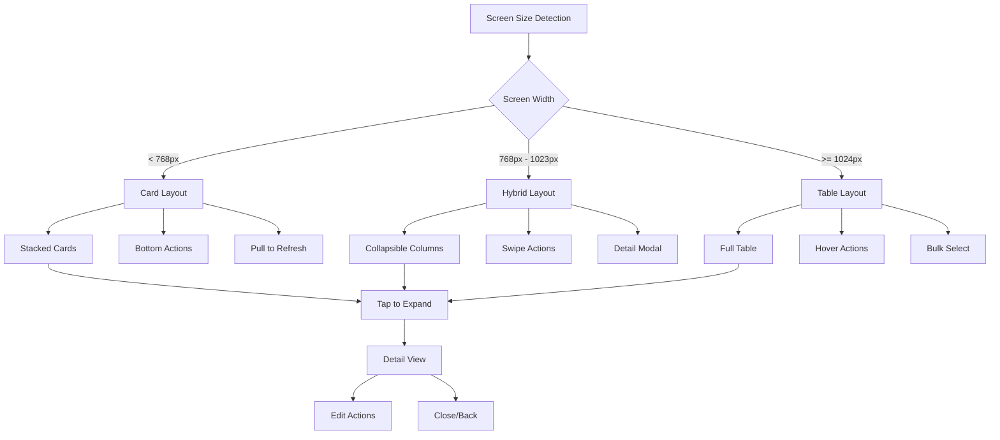

# UI/UX Brief: Admin Table Improvements

## Executive Summary

After examining the admin interface tables across Apps, Prompts, Users, and Models pages, I've identified significant horizontal scrolling issues that impact usability, particularly on mobile and smaller screens. The current implementation uses traditional HTML tables with multiple columns that force horizontal scrolling when content doesn't fit the viewport. This brief outlines the problems and provides comprehensive solutions for improving the admin table experience.

## Current Issues Analysis

### 1. Horizontal Scrolling Problems

**Root Causes:**
- **Fixed Table Structure**: All admin pages use `<table className="min-w-full">` which forces tables to be at least 100% width, causing overflow
- **Multiple Columns**: Apps table has 6 columns, Prompts has 7 columns, Users has 6 columns, Models has 4 columns
- **Non-responsive Design**: Tables don't adapt to different screen sizes
- **Wide Content**: Long text content (descriptions, IDs, URLs) forces column expansion
- **Action Buttons**: Multiple action buttons in the last column create additional width pressure

**Specific Issues by Page:**

**Apps Admin Table:**
- Columns: App | Category | Status | Order | Model | Actions
- Problems: App names with descriptions, long model names, category badges
- Wrapper: `<div className="-my-2 -mx-4 overflow-x-auto sm:-mx-6 lg:-mx-8">`

**Prompts Admin Table:**
- Columns: Name | Category | Description | Order | App ID | Status | Actions
- Problems: Most columns with wide content, description truncation at `max-w-xs`
- Critical Issue: 7 columns make it impossible to view on mobile

**Users Admin Table:**
- Columns: User | Auth Method | Groups | Status | Last Active | Actions
- Problems: User info with multiple lines, auth method badges, group badges
- Better Implementation: Uses proper `overflow-x-auto` wrapper

**Models Admin Table:**
- Columns: Name | Provider | Status | Actions
- Least problematic: Only 4 columns, but still suffers from horizontal scrolling

### 2. Mobile Experience Issues

- **Touch Navigation**: Horizontal scrolling conflicts with swipe gestures
- **Information Hierarchy**: Important information gets pushed off-screen
- **Action Accessibility**: Action buttons may be unreachable without scrolling
- **Visual Confusion**: Users can't see relationship between data across columns

### 3. Accessibility Concerns

- **Screen Reader Navigation**: Complex horizontal scrolling patterns
- **Keyboard Navigation**: Tab order disrupted by scrolling
- **Focus Management**: Elements can be focused but not visible
- **WCAG Compliance**: Fails responsive design requirements

## Component Hierarchy

### Current Table Component Pattern

```jsx
// Repeated pattern across all admin pages
<div className="mt-8 flex flex-col">
  <div className="-my-2 -mx-4 overflow-x-auto sm:-mx-6 lg:-mx-8">
    <div className="inline-block min-w-full py-2 align-middle md:px-6 lg:px-8">
      <div className="overflow-hidden shadow ring-1 ring-black ring-opacity-5 md:rounded-lg">
        <table className="min-w-full divide-y divide-gray-300">
          {/* Table content */}
        </table>
      </div>
    </div>
  </div>
</div>
```

### Proposed Responsive Table Component

```jsx
<ResponsiveAdminTable
  data={items}
  columns={columnConfig}
  onRowClick={handleRowClick}
  actions={actionConfig}
  searchable={true}
  filterable={true}
  responsive="adaptive" // card | stack | scroll
/>
```

## Recommended Solutions

### 1. Responsive Card Layout (Primary Recommendation)

**Implementation:**
- **Desktop**: Traditional table layout (>= 1024px)
- **Tablet**: Stacked card layout (768px - 1023px)  
- **Mobile**: Compressed card layout (<= 767px)

**Card Structure:**
```jsx
<div className="bg-white rounded-lg shadow-sm border border-gray-200 p-4">
  <div className="flex items-start justify-between">
    <div className="flex-1">
      <div className="flex items-center mb-2">
        <Avatar />
        <div className="ml-3">
          <h3 className="text-sm font-medium text-gray-900">Primary Info</h3>
          <p className="text-xs text-gray-500">Secondary Info</p>
        </div>
      </div>
      <div className="grid grid-cols-2 gap-2 text-xs">
        <DataPoint label="Status" value={status} />
        <DataPoint label="Category" value={category} />
      </div>
    </div>
    <ActionMenu actions={actions} />
  </div>
</div>
```

### 2. Collapsible Column System

**Implementation:**
- **Priority Columns**: Always visible (Name, Status, Actions)
- **Secondary Columns**: Hidden on mobile, toggleable on tablet
- **Progressive Enhancement**: Add columns as screen space increases

**Column Priority Matrix:**

| Column | Mobile | Tablet | Desktop | Priority |
|--------|--------|--------|---------|----------|
| Name/Title | ✅ | ✅ | ✅ | 1 |
| Status | ✅ | ✅ | ✅ | 1 |
| Actions | ✅ | ✅ | ✅ | 1 |
| Category | 📱 | ✅ | ✅ | 2 |
| Order | ❌ | 📱 | ✅ | 3 |
| Description | ❌ | ❌ | ✅ | 4 |

Legend: ✅ Always Visible | 📱 Toggleable | ❌ Hidden

### 3. Expandable Row Details

**Implementation:**
- **Compact Row**: Show only essential information
- **Expand Button**: Toggle detailed view
- **Slide Animation**: Smooth height transition
- **Nested Content**: Full details without horizontal scroll

```jsx
<tr className="hover:bg-gray-50">
  <td colSpan="all" className="px-6 py-4">
    <div className="flex items-center justify-between">
      <CompactRowInfo />
      <div className="flex items-center space-x-2">
        <ActionButtons />
        <ExpandButton onClick={toggleExpand} expanded={isExpanded} />
      </div>
    </div>
    {isExpanded && (
      <ExpandedDetails className="mt-4 pt-4 border-t border-gray-200">
        <DetailGrid />
      </ExpandedDetails>
    )}
  </td>
</tr>
```

## Design Specifications

### Responsive Breakpoints
```scss
// Mobile First Approach
$mobile: 320px;
$mobile-lg: 480px;
$tablet: 768px;
$desktop: 1024px;
$desktop-lg: 1200px;
```

### Spacing Tokens
- **Card Padding**: `p-4` (16px) mobile, `p-6` (24px) desktop
- **Grid Gap**: `gap-2` (8px) mobile, `gap-4` (16px) desktop  
- **Row Spacing**: `space-y-2` (8px) mobile, `space-y-4` (16px) desktop

### Typography Scale
- **Primary Text**: `text-sm font-medium` (14px, 500 weight)
- **Secondary Text**: `text-xs text-gray-500` (12px, 400 weight)
- **Labels**: `text-xs font-medium text-gray-700` (12px, 500 weight)

### Color Application
- **Card Background**: `bg-white`
- **Border**: `border-gray-200`
- **Hover**: `hover:bg-gray-50`
- **Shadow**: `shadow-sm` for cards, `shadow` for elevated states

## User Flow

### Desktop Experience
1. **Table View**: Traditional table with all columns visible
2. **Row Interaction**: Click anywhere on row to view details
3. **Quick Actions**: Hover reveals action buttons
4. **Bulk Operations**: Header checkboxes for multi-select

### Tablet Experience  
1. **Hybrid View**: Mix of table and card elements
2. **Column Toggle**: Settings button to show/hide columns
3. **Swipe Actions**: Left/right swipe for quick actions
4. **Detail Modal**: Tap for full detail overlay

### Mobile Experience
1. **Card List**: Stacked card layout
2. **Pull to Refresh**: Native mobile interaction
3. **Infinite Scroll**: Progressive loading for large datasets
4. **Bottom Sheet**: Actions in sliding panel



## Accessibility Requirements

### WCAG 2.1 AA Compliance

**Keyboard Navigation:**
- **Tab Order**: Logical progression through interactive elements
- **Skip Links**: "Skip to content" for table navigation
- **Arrow Keys**: Table cell navigation when in table mode
- **Escape Key**: Close expanded details/modals

**Screen Reader Support:**
- **Table Headers**: Proper `<th>` elements with `scope` attributes
- **ARIA Labels**: Descriptive labels for actions and status
- **Live Regions**: Status updates announced to screen readers
- **Heading Hierarchy**: Proper h1-h6 structure in expanded views

**Visual Requirements:**
- **Color Contrast**: Minimum 4.5:1 ratio for all text
- **Focus Indicators**: Visible 2px outline on focus
- **Text Scaling**: Support up to 200% zoom without horizontal scroll
- **Animation**: Respect `prefers-reduced-motion`

### Implementation Details

**ARIA Attributes:**
```jsx
<table role="table" aria-label="Apps management table">
  <thead>
    <tr role="row">
      <th scope="col" aria-sort="none">App Name</th>
      <th scope="col">Status</th>
      <th scope="col">Actions</th>
    </tr>
  </thead>
  <tbody>
    <tr role="row" aria-selected="false">
      <td role="gridcell">
        <button 
          aria-expanded="false"
          aria-controls="row-details-1"
          aria-label="Expand details for My App"
        >
          My App
        </button>
      </td>
    </tr>
  </tbody>
</table>
```

**Focus Management:**
```jsx
const handleExpandRow = (rowId) => {
  setExpandedRow(rowId);
  // Move focus to first interactive element in expanded content
  setTimeout(() => {
    document.getElementById(`expanded-${rowId}-first-action`)?.focus();
  }, 100);
};
```

## Implementation Recommendations

### Phase 1: Quick Wins (1-2 weeks)
1. **Add Responsive Wrapper**: Implement card layout for mobile screens
2. **Column Priority**: Hide non-essential columns on smaller screens  
3. **Improved Actions**: Convert action buttons to dropdown menu on mobile
4. **Touch Targets**: Increase tap target sizes to minimum 44px

### Phase 2: Enhanced Experience (3-4 weeks)
1. **Expandable Rows**: Add detail expansion functionality
2. **Column Sorting**: Maintain sort functionality across all layouts
3. **Bulk Actions**: Implement multi-select for batch operations
4. **Search Enhancement**: Add column-specific search filters

### Phase 3: Advanced Features (4-6 weeks)
1. **Virtualization**: Implement for large datasets (>100 rows)
2. **Export Functions**: PDF/CSV export maintaining responsive design
3. **Customization**: User preferences for column visibility
4. **Advanced Filtering**: Multi-faceted filtering system

### Code Architecture

**New Components:**
```
components/admin/
├── tables/
│   ├── ResponsiveAdminTable.jsx
│   ├── TableCard.jsx
│   ├── TableRow.jsx
│   ├── ExpandableRow.jsx
│   ├── ColumnToggle.jsx
│   └── BulkActions.jsx
├── hooks/
│   ├── useResponsiveTable.js
│   ├── useTableSort.js
│   └── useTableSelection.js
└── utils/
    ├── tableHelpers.js
    └── columnConfigs.js
```

**Props Interface:**
```typescript
interface ResponsiveTableProps {
  data: any[];
  columns: ColumnConfig[];
  responsive?: 'card' | 'hybrid' | 'scroll';
  sortable?: boolean;
  selectable?: boolean;
  expandable?: boolean;
  onRowClick?: (row: any) => void;
  onSort?: (column: string, direction: 'asc' | 'desc') => void;
  onSelect?: (selectedRows: any[]) => void;
  loading?: boolean;
  emptyState?: React.ReactNode;
}
```

This comprehensive solution will transform the admin tables from a frustrating horizontal-scrolling experience into an intuitive, accessible, and responsive interface that works seamlessly across all devices while maintaining the power and functionality administrators need.