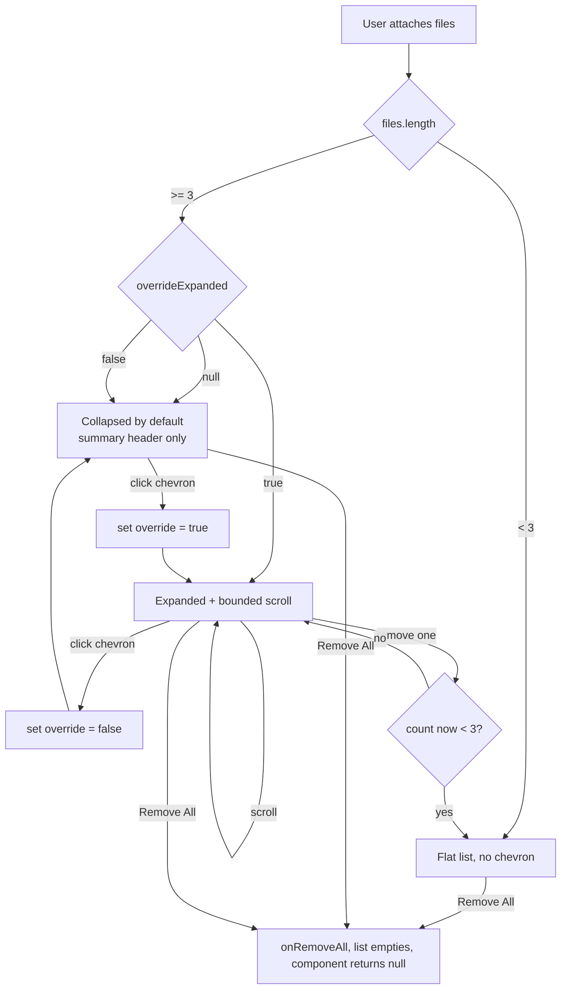

# UI/UX Brief: Collapsible AttachedFilesList

> Location of consumed component: `client/src/features/upload/components/AttachedFilesList.jsx`
> Rendered by: `client/src/features/chat/components/ChatInput.jsx` (line ~367), above the chat form.
> Pattern reused from: `client/src/features/office/components/chat/OfficeContextStrip.jsx` (issue #1467).

## Executive Summary

`AttachedFilesList` currently renders one ~40px full-width row per file with no bound. At
10+ files it pushes the textarea and send button off-screen. We fix this by porting the
proven **auto-collapse + user-override** pattern from `OfficeContextStrip`, plus adding a
**max-height scroll container** to the expanded list so even an expanded list can never grow
unbounded.

Two independent guards:

1. **Collapse** keeps the resting footprint small (one ~52px summary header) for many files.
2. **Bounded scroll** caps the expanded list height regardless of file count.

Common case (1-3 files) stays fully expanded with no chrome — we do not over-engineer it.

---

## UX Rationale

- The cost of the bug is total: losing the send button breaks the core task. So the design's
  job is to **guarantee an upper bound on vertical footprint**, not just "usually" stay small.
- Collapse alone is insufficient: a user who manually expands 30 files would still be pushed
  off-screen. Hence both collapse (default footprint) and max-height scroll (hard ceiling).
- Mirroring `OfficeContextStrip` (threshold = 3, override null|bool, reset-on-change) means
  one mental model across the app and code a teammate already understands. Consistency wins
  over a bespoke solution.
- For 1-3 files, a collapse chevron is noise. The current flat list is already compact and
  fine. Keep it. Only introduce the collapsible card at threshold.

---

## Component Spec

### Constants

```js
const AUTO_COLLAPSE_THRESHOLD = 3; // mirror OfficeContextStrip: collapse default when files.length >= 3
```

### Three render modes

| Mode             | Condition                            | What renders                                                                 |
| ---------------- | ------------------------------------ | ---------------------------------------------------------------------------- |
| **Small count**  | `files.length < 3`                   | Current flat list, no chevron, no collapsible chrome. Footer unchanged.      |
| **Collapsed**    | `files.length >= 3` and not expanded | Single summary header row only (icon + counts + size + chips + chevron + Remove All). No file rows. |
| **Expanded**     | `files.length >= 3` and expanded     | Summary header (with chevron up) + **bounded scroll** list of file rows + sticky footer. |

> Note: the existing footer ("{count} files attached" + "Remove All") is **redundant once we
> have a summary header**. In collapsed/expanded modes, fold its info into the header and drop
> the separate footer to save vertical space. Keep the footer only in small-count mode (or drop
> it there too — see open question Q1).

### State / prop additions

No new **props** required — `files`, `onRemoveFile`, `onRemoveAll`, `disabled` are sufficient.

Optional new prop:

- `compact` (boolean, default `false`) — when `true` (Outlook task pane), use the tighter
  `maxHeight` and force the collapsed default even at 2 files. Wire from `ChatInput` if an
  office/task-pane flag is available there; otherwise omit and rely on the responsive
  `max-h` clamp (see Responsive). **Recommended: omit the prop, use Tailwind responsive classes.**

New internal **state** (ported verbatim from OfficeContextStrip):

```js
const shouldDefaultCollapse = files.length >= AUTO_COLLAPSE_THRESHOLD;
const [overrideExpanded, setOverrideExpanded] = useState(/** @type {boolean|null} */ (null));
const expanded = overrideExpanded === null ? !shouldDefaultCollapse : overrideExpanded;
```

Override reset — reset the user's manual choice when the file set is effectively "new"
(e.g. user clears all and adds a fresh batch). Track by a cheap signature instead of an id:

```js
const filesSig = files.map(f => f.fileName).join('|');
const prevSigRef = useRef(filesSig);
if (prevSigRef.current !== filesSig) {
  prevSigRef.current = filesSig;
  // Only reset when crossing the threshold boundary, so removing 1 of 10 files
  // doesn't yank a manually-collapsed list back open. See open question Q2.
}
```

> Pragmatic default: do **not** reset override on every change (that fights the user). Only
> reset when `files.length` drops below the threshold (collapse no longer applies) — then
> `overrideExpanded` is moot anyway. Simplest correct rule: leave override sticky; when
> `files.length < 3` the small-count branch renders and ignores it.

### Summary line format

Collapsed/expanded header shows two lines:

- **Title line**: `t('attachedFiles.title', 'Attachments')`
- **Summary line**: `{count} files • {totalSize}` e.g. `12 files • 4.3 MB`
  - Use i18n plural key (below). Total size = sum of `file.fileSize` over non-loading files.
  - If any file is `loading`, append a loading hint: `12 files • 4.3 MB • 1 loading`.

Optional **type chips** (small icon badges) right of the summary — show up to 3 distinct
file-type icons present in the set (camera/microphone/document-text/paper-clip) as a quick
visual scan. Keep it to icons only (no text) to fit 280px. **Recommended: include chips, they
are cheap and aid recognition; drop them first if width is tight.**

### Max-height values

Expanded scroll container:

- Desktop: `max-h-60` (240px) → ~6 rows visible, then scroll.
- Narrow / task pane: `max-h-40` (160px) → ~4 rows.

Use a responsive clamp so no extra prop is needed:

```
max-h-40 sm:max-h-60
```

(Tailwind `sm` ≈ 640px; the Outlook task pane at ~280px stays below `sm`, so it gets the
160px cap automatically; desktop chat gets 240px.)

Rationale: 240px leaves room for the textarea (~2-3 lines) + send button + any token warning
banner on a typical 600-700px chat viewport. 160px keeps the 600px Outlook pane usable.

---

## Component Hierarchy

### AttachedFilesList (collapsible card)

- **Purpose**: Show queued attachments compactly; never push chat input off-screen.
- **States**: small-count (flat), collapsed, expanded, plus per-row: loading, hover, disabled.
- **Props**:
  - `files` (Array<{fileName, fileSize, type, source, loading}>): queued files.
  - `onRemoveFile(index)` (fn): remove one file.
  - `onRemoveAll()` (fn): clear all.
  - `disabled` (bool): disables all controls.
- **Accessibility**:
  - ARIA: chevron toggle button has `aria-expanded={expanded}` and a state-specific
    `aria-label`; scroll region has `role="region"` + `aria-label` (file list) so SR users
    know it scrolls; a polite live region announces the count.
  - Keyboard: chevron is a real `<button>` (Enter/Space toggles, included in tab order);
    Tab moves into the scroll list to each Remove button; Remove All reachable by Tab.
  - Screen Reader: header announces "Attachments, 12 files, 4.3 MB, collapsed/expanded".

---

## User Flow



---

## Illustrative Snippets

### Collapsed header (and the toggle, shared with expanded)

```jsx
<div className="mt-2 mb-4 rounded-lg border border-gray-300 dark:border-gray-600 bg-white dark:bg-gray-800 shadow-sm">
  <div className="flex items-center gap-2 px-3 py-2">
    <button
      type="button"
      onClick={() => setOverrideExpanded(!expanded)}
      aria-expanded={expanded}
      aria-label={
        expanded
          ? t('attachedFiles.collapse', 'Collapse attachments')
          : t('attachedFiles.expand', 'Expand attachments')
      }
      className="flex-1 flex items-center gap-2 text-left rounded-md px-1 py-0.5 -ml-1 hover:bg-gray-50 dark:hover:bg-gray-700/50 transition-colors"
    >
      <Icon name="paper-clip" size="sm" className="flex-shrink-0 text-gray-500 dark:text-gray-400" />
      <div className="flex-1 min-w-0">
        <div className="text-xs font-medium text-gray-900 dark:text-gray-100 truncate">
          {t('attachedFiles.title', 'Attachments')}
        </div>
        <div className="text-[11px] text-gray-500 dark:text-gray-400 truncate">
          {t('attachedFiles.summary', '{{count}} files • {{size}}', {
            count: files.length,
            size: formatFileSize(totalSize)
          })}
          {loadingCount > 0 &&
            ` • ${t('attachedFiles.loadingCount', '{{count}} loading', { count: loadingCount })}`}
        </div>
      </div>
      {/* type chips: up to 3 distinct type icons */}
      <div className="flex-shrink-0 hidden xs:flex items-center gap-1">
        {distinctTypeIcons.slice(0, 3).map(name => (
          <Icon key={name} name={name} size="sm" className="text-gray-400 dark:text-gray-500" aria-hidden />
        ))}
      </div>
      <Icon
        name={expanded ? 'chevronUp' : 'chevronDown'}
        size="sm"
        className="flex-shrink-0 text-gray-400"
        aria-hidden
      />
    </button>

    {/* Remove All lives in the header in both collapsed and expanded states */}
    <button
      type="button"
      onClick={onRemoveAll}
      disabled={disabled}
      className="flex-shrink-0 text-[11px] font-medium text-gray-700 dark:text-gray-300 hover:text-red-600 dark:hover:text-red-400 transition-colors disabled:opacity-50 disabled:cursor-not-allowed"
    >
      {t('attachedFiles.removeAll', 'Remove All')}
    </button>
  </div>

  {/* polite count announcement for SR */}
  <span className="sr-only" role="status" aria-live="polite">
    {t('attachedFiles.summary', '{{count}} files • {{size}}', { count: files.length, size: formatFileSize(totalSize) })}
  </span>

  {expanded && (/* bounded list below */)}
</div>
```

### Bounded expanded list

```jsx
{expanded && (
  <div
    role="region"
    aria-label={t('attachedFiles.listLabel', 'Attached files')}
    className="border-t border-gray-200 dark:border-gray-700 max-h-40 sm:max-h-60 overflow-y-auto overscroll-contain divide-y divide-gray-200 dark:divide-gray-700"
  >
    {files.map((file, index) => (
      <div key={index} className="flex items-center gap-3 px-3 py-2 hover:bg-gray-50 dark:hover:bg-gray-700/50 transition-colors">
        {/* ... existing row content: source icon, type icon/spinner, name+size, remove X ... */}
      </div>
    ))}
  </div>
)}
```

Key points:

- `overflow-y-auto` + responsive `max-h` = the hard ceiling. `overscroll-contain` stops scroll
  chaining into the page/chat history.
- The header (with Remove All + count) sits **above** the scroll region, so it acts as a sticky
  header naturally without `position: sticky`. No separate footer needed.
- Row markup is unchanged from today — minimal diff, low regression risk.

---

## Design Specifications

- **Spacing**: header `px-3 py-2`; rows keep existing `px-3 py-2 gap-3` (4px grid).
- **Typography**: header title `text-xs font-medium`; summary `text-[11px]`; row name `text-sm`,
  row size `text-xs` — matches both existing component and OfficeContextStrip scale.
- **Colors**: keep the upload component's `gray` palette + `dark:` variants (do **not** switch to
  OfficeContextStrip's `slate` — match the surrounding chat input, not Outlook). Remove/destructive
  actions use `red-600` / `dark:red-400` as today.
- **Theme**: all classes already have `dark:` pairs; chips and chevron use `gray-400/500`.

---

## Accessibility Requirements

- **WCAG 2.1.1 Keyboard**: chevron and Remove/Remove All are native `<button>`s; full keyboard
  operation, no custom key handlers needed.
- **WCAG 4.1.2 Name/Role/Value**: `aria-expanded` on toggle; state-specific `aria-label`.
- **WCAG 1.4.3 Contrast**: `text-[11px] text-gray-500` on white = ~4.6:1 (passes AA for the
  small-but-not-tiny summary). Verify `gray-400` chips meet 3:1 as non-text/decorative (they are
  `aria-hidden`, so exempt).
- **WCAG 4.1.3 Status Messages**: `role="status" aria-live="polite"` announces count changes
  without stealing focus.
- **Scroll region**: `role="region"` + `aria-label` so the scroll container is a navigable
  landmark and SR users are told there's a list.
- **Focus**: when collapsing via chevron, focus stays on the chevron (it remains mounted) — no
  focus-loss. Removed-file focus: after `onRemoveFile`, focus should move to the next row's
  Remove button or the header if the list empties (see open question Q3).

---

## Responsive

- **Desktop chat**: `sm:max-h-60` (240px) expanded cap; chips visible.
- **Outlook task pane (~280px)**: below the `sm` breakpoint, so `max-h-40` (160px) applies
  automatically. Chips hidden below the `xs` breakpoint (`hidden xs:flex`) — if the project has
  no `xs` breakpoint configured, use `hidden sm:flex` instead, hiding chips on the narrow pane.
- Everything truncates (`truncate`, `min-w-0`) so a 60-char filename never breaks layout at 280px.

---

## Edge Cases

| Case                  | Behavior                                                                                       |
| --------------------- | ---------------------------------------------------------------------------------------------- |
| Loading file          | Spinner stays in its row (unchanged); summary shows `• N loading`. Remove disabled while loading (today's behavior preserved). |
| Mixed sources         | Per-row source icon unchanged. Summary does not split by source (keep simple).                 |
| Very long file name   | `truncate` + `min-w-0` in row and header title; `title` attribute for full name on hover.      |
| Remove All, collapsed | Button is in the header, always reachable without expanding. After clear, component returns `null`. |
| Remove down to 2      | Switches to small-count flat mode automatically; override becomes irrelevant.                  |
| All files loading     | Summary `0 B • N loading`; size shows `0 B` until sizes resolve.                               |

---

## New i18n Keys

Add under the existing `attachedFiles.*` namespace (same place as `attachedFiles.remove`,
`attachedFiles.removeAll`, etc. — runtime locale files in `contents/locales/`, not the repo's
`examples/`).

| Key                          | English default                  | Notes                                  |
| ---------------------------- | -------------------------------- | -------------------------------------- |
| `attachedFiles.title`        | `Attachments`                    | Header title line.                     |
| `attachedFiles.summary`      | `{{count}} files • {{size}}`     | Use i18next plural — see below.        |
| `attachedFiles.expand`       | `Expand attachments`             | Chevron aria-label (collapsed).        |
| `attachedFiles.collapse`     | `Collapse attachments`           | Chevron aria-label (expanded).         |
| `attachedFiles.listLabel`    | `Attached files`                 | Scroll region aria-label.              |
| `attachedFiles.loadingCount` | `{{count}} loading`              | Appended to summary when files load.   |

Existing keys reused: `attachedFiles.removeAll`, `attachedFiles.remove`, `attachedFiles.loading`,
`attachedFiles.filesCount` (can be retired if footer is dropped — confirm before deleting).

**Pluralization** (i18next): provide both forms so "1 file" reads correctly:

```json
{
  "attachedFiles_summary_one": "{{count}} file • {{size}}",
  "attachedFiles_summary_other": "{{count}} files • {{size}}",
  "attachedFiles_loadingCount_one": "{{count}} loading",
  "attachedFiles_loadingCount_other": "{{count}} loading"
}
```

(Adapt to the project's existing i18next plural convention — check how `attachedFiles.filesCount`
with `{{count}}` is currently declared and mirror it.)

---

## Open Questions for the Developer

1. **Footer fate**: Drop the separate footer entirely (info moves to header) in all modes,
   including small-count? Or keep the footer for 1-3 files? Recommendation: drop it everywhere,
   move Remove All to a small text button; for 1-3 files keep a minimal footer only if user
   testing shows the count is missed.
2. **Override reset rule**: Confirm we should NOT reset `overrideExpanded` on every file
   add/remove (only when dropping below threshold). Resetting on every change would fight a user
   who deliberately collapsed a long list while still adding files.
3. **Focus management on remove**: Where should focus land after removing a row mid-list? Next
   row's Remove button is the friendliest; confirm acceptable or default to header.
4. **`xs` breakpoint**: Does the Tailwind config define `xs`? If not, chips use `hidden sm:flex`
   (hidden on the task pane). Confirm.
5. **Task-pane detection**: Is there a flag in `ChatInput` indicating Outlook/task-pane context?
   If yes we could force collapsed default there; if no, the responsive `max-h` clamp already
   covers the height risk and no prop is needed. Confirm we can skip the `compact` prop.
6. **Existing plural style**: Confirm the project's i18next plural key format
   (`_one`/`_other` suffix vs `{{count}}` inline) so new keys match.
```