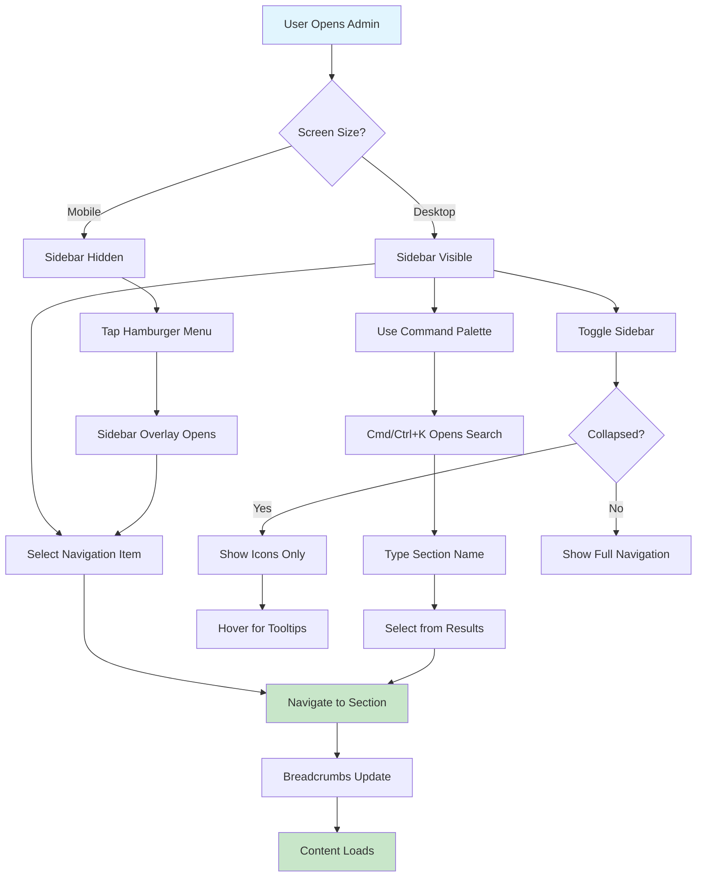

# UI/UX Brief: Enterprise Admin Layout

**Document Version:** 1.0  
**Date:** 2025-08-03  
**Project:** AI Hub Apps - Enterprise Admin Layout  
**Type:** UI/UX Design Specification  
**Author:** UI/UX Design Team  

## Executive Summary

This UI/UX design brief provides comprehensive component specifications, responsive design patterns, and interaction guidelines for implementing AI Hub Apps' enterprise-ready left sidebar navigation system. The design transforms the current horizontal tab-based navigation into a scalable, accessible, and mobile-responsive admin interface that groups 12 admin sections into logical categories.

### Key Design Decisions

- **Left Sidebar Architecture**: Collapsible sidebar with grouped navigation sections
- **Information Architecture**: Four logical groups (Content, Access Control, Analytics, Customization)
- **Mobile-First Responsive**: Progressive enhancement from mobile overlay to desktop sidebar
- **WCAG 2.1 AA Compliance**: Full accessibility with keyboard navigation and screen reader support
- **Performance-Optimized**: Smooth 60fps animations with minimal bundle impact

## Component Hierarchy

### 1. AdminLayout (Root Container)

**Purpose**: Primary layout wrapper that establishes the sidebar + content layout structure
**Role**: Provides the foundational grid system and responsive behavior

**States**:
- Default: Desktop layout with expanded sidebar
- Collapsed: Desktop layout with icon-only sidebar  
- Mobile: Mobile layout with overlay navigation

**Props**:
- `children` (ReactNode): Main content area components
- `sidebarCollapsed` (boolean): Controls sidebar collapse state on desktop
- `onSidebarToggle` (function): Callback for sidebar toggle actions

**Accessibility**:
- **ARIA**: `role="main"` on content area, `aria-label="Admin layout"`
- **Keyboard**: Focus management between sidebar and content
- **Screen Reader**: Announces layout changes when sidebar toggles

```jsx
// Layout Structure
<div className="flex h-screen bg-gray-50" role="application" aria-label="Admin layout">
  <AdminSidebar />
  <div className="flex-1 flex flex-col overflow-hidden">
    <AdminHeader />
    <main className="flex-1 overflow-auto" role="main">
      {children}
    </main>
  </div>
</div>
```

### 2. AdminSidebar (Navigation Container)

**Purpose**: Responsive sidebar container that adapts between desktop and mobile patterns
**Role**: Houses navigation content and manages responsive behavior

**States**:
- Expanded (Desktop): 280px width, full navigation visible
- Collapsed (Desktop): 64px width, icons only with tooltips
- Mobile Closed: Hidden sidebar with hamburger trigger
- Mobile Open: Full-screen overlay with slide-in animation

**Props**:
- `isCollapsed` (boolean): Controls collapsed state on desktop
- `isMobileOpen` (boolean): Controls mobile overlay visibility
- `onToggle` (function): Sidebar toggle handler
- `onMobileClose` (function): Mobile overlay close handler

**Accessibility**:
- **ARIA**: `role="navigation"`, `aria-label="Admin navigation"`
- **Keyboard**: Tab navigation, arrow key support for menu items
- **Screen Reader**: Announces navigation state changes

```jsx
// Desktop Sidebar (md and up)
<div className={`hidden md:flex md:flex-shrink-0 transition-all duration-200 ease-in-out ${
  isCollapsed ? 'md:w-16' : 'md:w-72'
}`}>
  <AdminSidebarContent isCollapsed={isCollapsed} onToggle={onToggle} />
</div>

// Mobile Overlay
<Transition show={isMobileOpen}>
  <Dialog className="relative z-40 md:hidden" onClose={onMobileClose}>
    <TransitionChild
      enter="transition-opacity ease-linear duration-300"
      enterFrom="opacity-0"
      enterTo="opacity-100"
    >
      <div className="fixed inset-0 bg-gray-600 bg-opacity-75" />
    </TransitionChild>
    <TransitionChild
      enter="transition ease-in-out duration-300 transform"
      enterFrom="-translate-x-full"
      enterTo="translate-x-0"
    >
      <DialogPanel className="relative flex-1 flex flex-col max-w-xs w-full">
        <AdminSidebarContent />
      </DialogPanel>
    </TransitionChild>
  </Dialog>
</Transition>
```

### 3. AdminSidebarContent (Shared Sidebar Content)

**Purpose**: Contains all sidebar content shared between desktop and mobile views
**Role**: Renders navigation menu, header, and footer components

**States**:
- Loading: Skeleton navigation items while configuration loads
- Loaded: Full navigation with all available sections
- Error: Error state with retry option

**Props**:
- `isCollapsed` (boolean): Affects text visibility and spacing
- `onToggle` (function): Toggle handler for collapse button

**Accessibility**:
- **ARIA**: `aria-busy` during loading, proper landmarks
- **Keyboard**: Focus management within sidebar content
- **Screen Reader**: Loading announcements and error messages

```jsx
<div className="flex flex-col w-full bg-white border-r border-gray-200 shadow-sm">
  <AdminSidebarHeader isCollapsed={isCollapsed} onToggle={onToggle} />
  <AdminNavigationMenu isCollapsed={isCollapsed} />
  <AdminSidebarFooter isCollapsed={isCollapsed} />
</div>
```

### 4. AdminSidebarHeader (Sidebar Top Section)

**Purpose**: Contains branding, collapse toggle, and search trigger
**Role**: Provides sidebar identity and primary controls

**States**:
- Expanded: Full logo/title with collapse button
- Collapsed: Icon-only with expand button
- Mobile: Full header with close button

**Props**:
- `isCollapsed` (boolean): Controls header layout and content
- `onToggle` (function): Toggle button handler

**Accessibility**:
- **ARIA**: `aria-label` on toggle button, `aria-expanded` state
- **Keyboard**: Toggle button focusable and keyboard operable
- **Screen Reader**: Clear button purpose and state announcements

```jsx
<div className="flex items-center justify-between p-4 border-b border-gray-200">
  {!isCollapsed && (
    <div className="flex items-center">
      <h1 className="text-lg font-semibold text-gray-900">Admin</h1>
    </div>
  )}
  <button
    onClick={onToggle}
    className="p-1.5 rounded-md text-gray-400 hover:text-gray-500 hover:bg-gray-100"
    aria-label={isCollapsed ? "Expand sidebar" : "Collapse sidebar"}
    aria-expanded={!isCollapsed}
  >
    <Icon name={isCollapsed ? "chevron-right" : "chevron-left"} size="sm" />
  </button>
</div>
```

### 5. AdminNavigationMenu (Navigation Items Container)

**Purpose**: Renders grouped navigation sections with proper hierarchy
**Role**: Organizes navigation items by category and manages active states

**States**:
- Loading: Skeleton navigation groups and items
- Loaded: Complete navigation with permission-filtered sections
- Empty: No available sections message

**Props**:
- `isCollapsed` (boolean): Affects group labels and item spacing
- `navigation` (object): Navigation configuration with groups and sections

**Accessibility**:
- **ARIA**: `role="menu"` with proper menu structure
- **Keyboard**: Arrow key navigation, Enter to activate
- **Screen Reader**: Group announcements and item descriptions

```jsx
<nav className="flex-1 px-2 py-4 space-y-2 overflow-y-auto" role="menu">
  {navigation.groups.map(group => (
    <AdminNavigationGroup 
      key={group.id}
      group={group}
      isCollapsed={isCollapsed}
    />
  ))}
</nav>
```

### 6. AdminNavigationGroup (Section Grouping)

**Purpose**: Groups related navigation sections with visual separation
**Role**: Provides logical organization and visual hierarchy

**States**:
- Expanded: Group label visible with sections
- Collapsed: No label, sections only (desktop collapsed mode)
- Empty: Hidden if no sections available

**Props**:
- `group` (object): Group configuration with name and sections
- `isCollapsed` (boolean): Controls group label visibility

**Accessibility**:
- **ARIA**: `role="group"`, `aria-label` with group name
- **Keyboard**: Group traversal with arrow keys
- **Screen Reader**: Group context and section count

```jsx
<div className="space-y-1" role="group" aria-label={group.name}>
  {!isCollapsed && (
    <div className="px-3 py-2 text-xs font-semibold text-gray-500 uppercase tracking-wider">
      {group.name}
    </div>
  )}
  {group.sections.map(section => (
    <AdminNavigationItem 
      key={section.id}
      section={section}
      isCollapsed={isCollapsed}
    />
  ))}
</div>
```

### 7. AdminNavigationItem (Individual Navigation Link)

**Purpose**: Individual navigation link with icon, label, and optional badge
**Role**: Provides navigation to specific admin sections

**States**:
- Active: Currently selected section with highlighted styling
- Inactive: Default state with hover effects
- Disabled: Section not available (grayed out)
- Loading: Loading state for dynamic sections

**Props**:
- `section` (object): Section configuration with name, href, icon, badge
- `isCollapsed` (boolean): Affects label visibility and spacing
- `isActive` (boolean): Controls active state styling

**Accessibility**:
- **ARIA**: `role="menuitem"`, `aria-current="page"` for active
- **Keyboard**: Focusable with Enter/Space activation
- **Screen Reader**: Section name and badge content

```jsx
<Link
  to={section.href}
  className={`
    group flex items-center px-2 py-2 text-sm font-medium rounded-md transition-colors duration-150
    ${isActive 
      ? 'bg-indigo-100 text-indigo-900 border-r-2 border-indigo-500' 
      : 'text-gray-600 hover:bg-gray-50 hover:text-gray-900'
    }
  `}
  role="menuitem"
  aria-current={isActive ? 'page' : undefined}
>
  <Icon 
    name={section.icon} 
    className={`${isCollapsed ? 'mr-0' : 'mr-3'} h-5 w-5 transition-colors duration-150`}
  />
  {!isCollapsed && (
    <>
      <span className="truncate">{section.name}</span>
      {section.badge && (
        <span className={`ml-auto inline-block py-0.5 px-2 text-xs rounded-full ${
          section.badge.color === 'red' ? 'bg-red-100 text-red-800' :
          section.badge.color === 'yellow' ? 'bg-yellow-100 text-yellow-800' :
          section.badge.color === 'green' ? 'bg-green-100 text-green-800' :
          'bg-blue-100 text-blue-800'
        }`}>
          {section.badge.text}
        </span>
      )}
    </>
  )}
  {isCollapsed && (
    <div className="absolute left-16 bg-gray-900 text-white text-xs rounded py-1 px-2 opacity-0 group-hover:opacity-100 transition-opacity duration-200 pointer-events-none z-50">
      {section.name}
    </div>
  )}
</Link>
```

### 8. AdminHeader (Content Area Header)

**Purpose**: Contains breadcrumbs, search, and mobile menu trigger
**Role**: Provides context and quick access tools for content area

**States**:
- Desktop: Breadcrumbs and search visible
- Mobile: Hamburger menu and search
- Loading: Skeleton breadcrumbs

**Props**:
- `onMobileMenuToggle` (function): Mobile menu trigger handler
- `breadcrumbs` (array): Breadcrumb navigation items

**Accessibility**:
- **ARIA**: `role="banner"`, proper navigation landmarks
- **Keyboard**: All interactive elements keyboard accessible
- **Screen Reader**: Clear header structure and navigation

```jsx
<header className="bg-white border-b border-gray-200 px-4 py-3" role="banner">
  <div className="flex items-center justify-between">
    <div className="flex items-center">
      <button
        className="md:hidden p-2 rounded-md text-gray-400 hover:text-gray-500 hover:bg-gray-100"
        onClick={onMobileMenuToggle}
        aria-label="Open navigation menu"
      >
        <Icon name="menu" size="sm" />
      </button>
      <AdminBreadcrumbs className="ml-4 md:ml-0" />
    </div>
    <div className="flex items-center space-x-4">
      <AdminCommandPaletteTrigger />
    </div>
  </div>
</header>
```

### 9. AdminBreadcrumbs (Navigation Context)

**Purpose**: Shows current location in admin hierarchy
**Role**: Provides navigation context and quick back navigation

**States**:
- Single Level: Home only
- Multi Level: Home > Section > Subsection
- Loading: Skeleton breadcrumb items

**Props**:
- `breadcrumbs` (array): Breadcrumb navigation chain
- `className` (string): Additional CSS classes

**Accessibility**:
- **ARIA**: `aria-label="Breadcrumb navigation"`
- **Keyboard**: All breadcrumb links keyboard accessible
- **Screen Reader**: Clear navigation hierarchy

```jsx
<nav className="flex items-center space-x-2 text-sm text-gray-500" aria-label="Breadcrumb navigation">
  {breadcrumbs.map((crumb, index) => (
    <div key={crumb.href} className="flex items-center">
      {index > 0 && <Icon name="chevron-right" size="xs" className="mx-2 text-gray-400" />}
      {index === breadcrumbs.length - 1 ? (
        <span className="text-gray-900 font-medium">{crumb.name}</span>
      ) : (
        <Link 
          to={crumb.href}
          className="hover:text-gray-700 transition-colors duration-150"
        >
          {crumb.name}
        </Link>
      )}
    </div>
  ))}
</nav>
```

### 10. AdminCommandPalette (Quick Access Search)

**Purpose**: Provides quick search and navigation to admin sections
**Role**: Enhances navigation efficiency with keyboard shortcuts

**States**:
- Closed: Hidden with keyboard shortcut hint
- Open: Modal with search input and filtered results
- Loading: Search results loading state
- Empty: No results found message

**Props**:
- `isOpen` (boolean): Controls modal visibility
- `onClose` (function): Modal close handler

**Accessibility**:
- **ARIA**: `role="dialog"`, proper modal semantics
- **Keyboard**: Cmd/Ctrl+K trigger, arrow navigation, escape close
- **Screen Reader**: Modal announcements and search results

```jsx
<Combobox value={selectedSection} onChange={handleSectionSelect}>
  <Dialog open={isOpen} onClose={onClose} className="relative z-50">
    <div className="fixed inset-0 bg-gray-500 bg-opacity-25" />
    <div className="fixed inset-0 z-10 overflow-y-auto p-4 sm:p-6 md:p-20">
      <DialogPanel className="mx-auto max-w-xl transform divide-y divide-gray-100 overflow-hidden rounded-xl bg-white shadow-2xl ring-1 ring-black ring-opacity-5">
        <ComboboxInput
          className="h-12 w-full border-0 bg-transparent pl-11 pr-4 text-gray-800 placeholder-gray-400 focus:ring-0 sm:text-sm"
          placeholder="Search admin sections..."
          onChange={(event) => setQuery(event.target.value)}
        />
        <ComboboxOptions className="max-h-72 scroll-py-2 overflow-y-auto py-2 text-sm text-gray-800">
          {filteredSections.map((section) => (
            <ComboboxOption
              key={section.id}
              value={section}
              className="cursor-default select-none px-4 py-2 hover:bg-indigo-600 hover:text-white"
            >
              <div className="flex items-center">
                <Icon name={section.icon} className="h-6 w-6 mr-3" />
                <span className="flex-auto truncate">{section.name}</span>
              </div>
            </ComboboxOption>
          ))}
        </ComboboxOptions>
      </DialogPanel>
    </div>
  </Dialog>
</Combobox>
```

## User Flow



## Responsive Design Patterns

### Desktop Layout (≥1024px)
- **Sidebar**: Fixed 280px width (expanded) / 64px width (collapsed)
- **Content**: Fluid width with max-width constraints
- **Navigation**: Full sidebar with grouped sections
- **Interactions**: Hover states, smooth transitions

### Tablet Layout (768px - 1023px)
- **Sidebar**: Collapsible with reduced padding
- **Content**: Adapts to available space
- **Navigation**: Compressed spacing, smaller text
- **Interactions**: Touch-friendly targets (44px minimum)

### Mobile Layout (<768px)
- **Sidebar**: Hidden by default, overlay when opened
- **Content**: Full width with mobile-optimized spacing
- **Navigation**: Full-screen overlay with large touch targets
- **Interactions**: Swipe gestures, mobile-first animations

## Design Specifications

### Spacing System (4px Grid)
```css
/* Base spacing unit: 4px */
--spacing-1: 0.25rem;  /* 4px */
--spacing-2: 0.5rem;   /* 8px */
--spacing-3: 0.75rem;  /* 12px */
--spacing-4: 1rem;     /* 16px */
--spacing-6: 1.5rem;   /* 24px */
--spacing-8: 2rem;     /* 32px */

/* Sidebar specific */
--sidebar-width-expanded: 18rem;  /* 288px */
--sidebar-width-collapsed: 4rem;  /* 64px */
--sidebar-padding: 0.5rem;        /* 8px */
--nav-item-height: 2.5rem;        /* 40px */
```

### Typography Scale
```css
/* Navigation Text */
--nav-group-text: 0.75rem;        /* 12px, font-semibold */
--nav-item-text: 0.875rem;        /* 14px, font-medium */
--nav-badge-text: 0.75rem;        /* 12px, font-medium */

/* Breadcrumb Text */
--breadcrumb-text: 0.875rem;      /* 14px, font-normal */

/* Search Text */
--search-input-text: 0.875rem;    /* 14px, font-normal */
--search-result-text: 0.875rem;   /* 14px, font-medium */
```

### Color Palette
```css
/* Navigation Colors */
--nav-bg: #ffffff;
--nav-border: #e5e7eb;
--nav-text: #6b7280;
--nav-text-hover: #111827;
--nav-active-bg: #eef2ff;
--nav-active-text: #3730a3;
--nav-active-border: #4f46e5;

/* Content Area */
--content-bg: #f9fafb;
--header-bg: #ffffff;
--header-border: #e5e7eb;

/* Interactive Elements */
--hover-bg: #f3f4f6;
--focus-ring: #4f46e5;
--disabled-text: #9ca3af;
```

### Shadow System
```css
/* Elevation levels */
--shadow-sm: 0 1px 2px 0 rgb(0 0 0 / 0.05);
--shadow-md: 0 4px 6px -1px rgb(0 0 0 / 0.1);
--shadow-lg: 0 10px 15px -3px rgb(0 0 0 / 0.1);
--shadow-xl: 0 20px 25px -5px rgb(0 0 0 / 0.1);

/* Component specific */
--sidebar-shadow: var(--shadow-sm);
--overlay-shadow: var(--shadow-xl);
--command-palette-shadow: var(--shadow-lg);
```

## Accessibility Requirements

### WCAG 2.1 AA Compliance

#### Color Contrast
- **Text on Background**: Minimum 4.5:1 contrast ratio
- **Large Text**: Minimum 3:1 contrast ratio
- **UI Components**: Minimum 3:1 contrast ratio for borders and states
- **Focus Indicators**: Minimum 3:1 contrast ratio with 2px minimum thickness

#### Keyboard Navigation
```javascript
// Keyboard shortcuts and navigation patterns
const keyboardShortcuts = {
  'Cmd/Ctrl + K': 'Open command palette',
  'Tab': 'Navigate forward through interactive elements',
  'Shift + Tab': 'Navigate backward through interactive elements',
  'Arrow Keys': 'Navigate within navigation menu',
  'Enter/Space': 'Activate navigation item',
  'Escape': 'Close overlays/command palette'
};
```

#### Screen Reader Support
```jsx
// ARIA attributes for screen readers
<nav 
  role="navigation" 
  aria-label="Admin navigation"
  aria-busy={isLoading}
>
  <div role="group" aria-label="Content Management">
    <Link 
      role="menuitem"
      aria-current={isActive ? 'page' : undefined}
      aria-describedby={section.badge ? `${section.id}-badge` : undefined}
    >
      {section.name}
      {section.badge && (
        <span id={`${section.id}-badge`} className="sr-only">
          {section.badge.text} notifications
        </span>
      )}
    </Link>
  </div>
</nav>
```

#### Focus Management
- **Focus Trap**: Command palette and mobile overlay trap focus
- **Focus Restoration**: Focus returns to trigger element when closing overlays
- **Focus Indicators**: Clear 2px outline with adequate contrast
- **Skip Links**: Provide skip navigation for keyboard users

## Animation & Micro-interactions

### Sidebar Animations
```css
/* Sidebar collapse/expand */
.sidebar-transition {
  transition: width 200ms ease-in-out;
}

/* Navigation item hover */
.nav-item {
  transition: background-color 150ms ease-in-out,
              color 150ms ease-in-out,
              transform 100ms ease-in-out;
}

.nav-item:hover {
  transform: translateX(2px);
}

/* Mobile overlay */
.mobile-overlay-enter {
  opacity: 0;
  transform: translateX(-100%);
}

.mobile-overlay-enter-active {
  opacity: 1;
  transform: translateX(0);
  transition: opacity 300ms ease-out,
              transform 300ms ease-out;
}
```

### Performance Considerations
- **Hardware Acceleration**: Use `transform` and `opacity` for animations
- **Reduced Motion**: Respect `prefers-reduced-motion` setting
- **Frame Rate**: Target 60fps for all animations
- **Duration Guidelines**: 
  - Hover effects: 100-150ms
  - State changes: 200-250ms
  - Layout changes: 300ms maximum

## Information Architecture

### Navigation Grouping Strategy
```javascript
const navigationGroups = {
  content: {
    id: 'content',
    name: 'Content Management',
    icon: 'collection',
    order: 1,
    sections: [
      { id: 'apps', name: 'Apps', icon: 'collection', href: '/admin/apps' },
      { id: 'models', name: 'Models', icon: 'cpu-chip', href: '/admin/models' },
      { id: 'prompts', name: 'Prompts', icon: 'clipboard-document-list', href: '/admin/prompts' },
      { id: 'pages', name: 'Pages', icon: 'document-text', href: '/admin/pages' }
    ]
  },
  access: {
    id: 'access',
    name: 'Access Control',
    icon: 'shield-check',
    order: 2,
    sections: [
      { id: 'auth', name: 'Authentication', icon: 'shield-check', href: '/admin/auth' },
      { id: 'users', name: 'Users', icon: 'user', href: '/admin/users' },
      { id: 'groups', name: 'Groups', icon: 'users', href: '/admin/groups' }
    ]
  },
  analytics: {
    id: 'analytics',
    name: 'Analytics & Operations',
    icon: 'chart-bar',
    order: 3,
    sections: [
      { id: 'usage', name: 'Usage Reports', icon: 'chart-bar', href: '/admin/usage' },
      { id: 'shortlinks', name: 'Short Links', icon: 'link', href: '/admin/shortlinks' },
      { id: 'system', name: 'System', icon: 'cog', href: '/admin/system' }
    ]
  },
  customization: {
    id: 'customization',
    name: 'Customization',
    icon: 'paint-brush',
    order: 4,
    sections: [
      { id: 'ui', name: 'UI Customization', icon: 'paint-brush', href: '/admin/ui' }
    ]
  }
};
```

### Icon Mapping
```javascript
const adminIcons = {
  // Home & Overview
  home: 'home',
  
  // Content Management
  apps: 'collection',
  models: 'cpu-chip', 
  prompts: 'clipboard-document-list',
  pages: 'document-text',
  
  // Access Control
  auth: 'shield-check',
  users: 'user',
  groups: 'users',
  
  // Analytics & Operations
  usage: 'chart-bar',
  shortlinks: 'link',
  system: 'cog',
  
  // Customization
  ui: 'paint-brush',
  
  // Interface Elements
  search: 'magnifying-glass',
  menu: 'bars-3',
  chevronLeft: 'chevron-left',
  chevronRight: 'chevron-right',
  close: 'x-mark'
};
```

## Implementation Notes

### Component File Structure
```
/client/src/features/admin/layout/
├── components/
│   ├── AdminLayout.jsx
│   ├── AdminSidebar.jsx
│   ├── AdminSidebarContent.jsx
│   ├── AdminSidebarHeader.jsx
│   ├── AdminNavigationMenu.jsx
│   ├── AdminNavigationGroup.jsx
│   ├── AdminNavigationItem.jsx
│   ├── AdminHeader.jsx
│   ├── AdminBreadcrumbs.jsx
│   ├── AdminCommandPalette.jsx
│   └── AdminMobileOverlay.jsx
├── hooks/
│   ├── useAdminNavigation.js
│   ├── useSidebarState.js
│   ├── useAdminPermissions.js
│   ├── useBreadcrumbs.js
│   └── useCommandPalette.js
└── utils/
    ├── navigationConfig.js
    ├── permissionUtils.js
    └── keyboardShortcuts.js
```

### Key Technical Considerations

1. **State Management**: Use React Context for sidebar state and navigation configuration
2. **Performance**: Implement React.memo for navigation components to prevent unnecessary re-renders
3. **Bundle Size**: Import only required Heroicons to minimize bundle impact
4. **Testing**: Comprehensive unit tests for each component with accessibility testing
5. **Documentation**: Storybook stories for each component with all states and variants

### Integration with Existing System

1. **Gradual Migration**: Use feature flags to enable new layout progressively
2. **Backward Compatibility**: Maintain existing admin page functionality during transition
3. **Configuration**: Extend platform config to support navigation customization
4. **Permissions**: Integrate with existing permission system for section visibility
5. **Internationalization**: Full i18next support for all navigation text and labels

This comprehensive UI/UX design brief provides all necessary specifications for implementing a world-class enterprise admin interface that scales with the platform's growth while maintaining excellent user experience and accessibility standards.