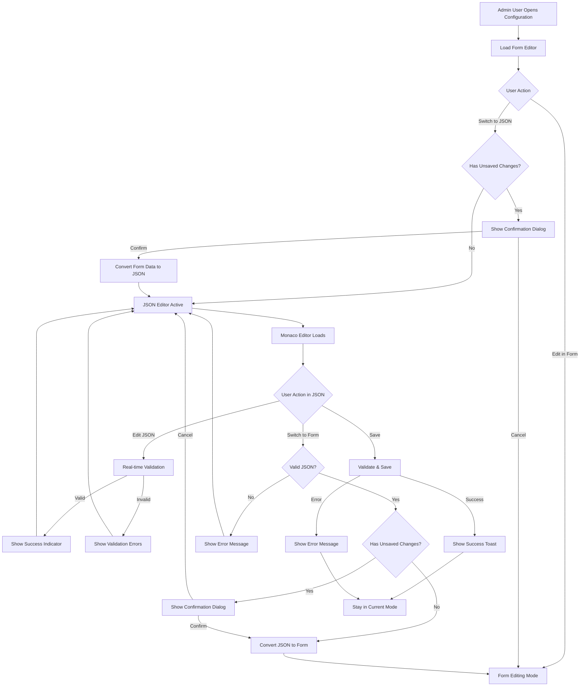

# UI/UX Brief: JSON Editor Feature

## Executive Summary

The JSON Editor feature provides admin users with a dual-mode editing interface that seamlessly switches between form-based editing and raw JSON editing. This addresses the need for power users to access fields not available in forms while maintaining the user-friendly form interface for standard operations. The design maintains visual consistency with iHub Apps' existing design system while introducing professional JSON editing capabilities through Monaco Editor integration.

**Key Design Decisions:**
- Persistent mode toggle with clear visual state indication
- Side-by-side layout on desktop, stacked on mobile
- Real-time validation with inline error display
- Unified save flow with change detection across both modes
- Progressive disclosure for complex validation errors

## Component Hierarchy

### DualModeEditor (Container Component)

- **Purpose**: Orchestrates form and JSON editing modes with unified state management
- **States**: form-active, json-active, validating, saving, error, success
- **Props**:
  - `initialData` (object): Initial configuration data
  - `schema` (object): Validation schema for the data
  - `onSave` (function): Save callback with validated data
  - `onCancel` (function): Cancel callback
  - `entityType` (string): 'app', 'model', or 'prompt' for context
  - `readOnly` (boolean): Disable editing
- **Accessibility**:
  - ARIA: `role="region"`, `aria-label="Configuration Editor"`, `aria-live="polite"` for status updates
  - Keyboard: Tab navigation between modes, Ctrl+S for save
  - Screen Reader: "Configuration editor with form and JSON view options"

### ModeToggle (Control Component)

- **Purpose**: Allows users to switch between form and JSON editing modes
- **States**: form-selected, json-selected, disabled, transitioning
- **Props**:
  - `currentMode` (string): 'form' | 'json'
  - `onModeChange` (function): Mode change callback
  - `hasUnsavedChanges` (boolean): Triggers confirmation dialog
  - `disabled` (boolean): Disable mode switching
- **Accessibility**:
  - ARIA: `role="tablist"`, `aria-label="Editor Mode Selection"`
  - Keyboard: Arrow keys for navigation, Enter/Space to select
  - Screen Reader: "Switch to [mode] editing view, [state] selected"

### FormEditor (Form Component)

- **Purpose**: Renders dynamic form based on configuration schema
- **States**: default, loading, validating, error, disabled
- **Props**:
  - `data` (object): Current form data
  - `schema` (object): Form schema definition
  - `onChange` (function): Data change callback
  - `errors` (object): Validation errors keyed by field
  - `readOnly` (boolean): Read-only mode
- **Accessibility**:
  - ARIA: Form semantics with proper labels and descriptions
  - Keyboard: Standard form navigation
  - Screen Reader: Field-specific error announcements

### JSONEditor (Editor Component)

- **Purpose**: Monaco Editor integration for raw JSON editing
- **States**: default, loading, validating, error, focused, readonly
- **Props**:
  - `value` (string): JSON string value
  - `onChange` (function): Value change callback
  - `onValidation` (function): Validation callback
  - `theme` (string): 'light' | 'dark' based on app theme
  - `readOnly` (boolean): Read-only mode
- **Accessibility**:
  - ARIA: `role="textbox"`, `aria-label="JSON Configuration Editor"`
  - Keyboard: Monaco's built-in keyboard shortcuts
  - Screen Reader: "JSON editor with syntax highlighting and validation"

### ValidationPanel (Feedback Component)

- **Purpose**: Displays validation errors and warnings in both modes
- **States**: hidden, warning, error, success
- **Props**:
  - `errors` (array): Array of validation error objects
  - `warnings` (array): Array of warning objects
  - `mode` (string): Current editor mode for context
- **Accessibility**:
  - ARIA: `role="alert"` for errors, `aria-live="assertive"`
  - Keyboard: Focusable error items with Enter to navigate to field
  - Screen Reader: "Validation errors found: [count] errors, [count] warnings"

### SaveControls (Action Component)

- **Purpose**: Unified save/cancel controls that work across both modes
- **States**: default, saving, success, disabled
- **Props**:
  - `onSave` (function): Save action callback
  - `onCancel` (function): Cancel action callback
  - `hasChanges` (boolean): Enable/disable save button
  - `isSaving` (boolean): Show loading state
- **Accessibility**:
  - ARIA: `role="group"`, `aria-label="Save Actions"`
  - Keyboard: Tab navigation, Enter/Space activation
  - Screen Reader: "Save changes button, Cancel button"

### ConfirmationDialog (Modal Component)

- **Purpose**: Confirms destructive actions like mode switching with unsaved changes
- **States**: hidden, visible, confirming
- **Props**:
  - `isOpen` (boolean): Dialog visibility
  - `title` (string): Dialog title
  - `message` (string): Confirmation message
  - `onConfirm` (function): Confirm action callback
  - `onCancel` (function): Cancel action callback
- **Accessibility**:
  - ARIA: `role="dialog"`, `aria-modal="true"`, focus trap
  - Keyboard: Escape to cancel, Tab navigation within dialog
  - Screen Reader: "Confirmation dialog: [title]"

## User Flow



## Design Specifications

### Layout Structure

#### Desktop Layout (≥1024px)
```
┌─────────────────────────────────────────────────────────────┐
│ Page Header                                                 │
├─────────────────────────────────────────────────────────────┤
│ ┌─────────┐ ┌─────────┐                          ┌────────┐ │
│ │  Form   │ │  JSON   │                          │  Save  │ │
│ └─────────┘ └─────────┘                          │ Cancel │ │
├─────────────────────────────────────────────────────────────┤
│                                                             │
│ ┌─────────────────────┐  ┌─────────────────────────────────┐ │
│ │                     │  │                                 │ │
│ │    Form Editor      │  │       JSON Editor              │ │
│ │   (when active)     │  │    (Monaco Editor)             │ │
│ │                     │  │                                 │ │
│ │                     │  │                                 │ │
│ └─────────────────────┘  └─────────────────────────────────┘ │
│                                                             │
├─────────────────────────────────────────────────────────────┤
│ Validation Panel (when errors/warnings present)            │
└─────────────────────────────────────────────────────────────┘
```

#### Tablet Layout (768px - 1023px)
```
┌─────────────────────────────────────────────────────────┐
│ Page Header                                             │
├─────────────────────────────────────────────────────────┤
│ ┌─────────┐ ┌─────────┐                    ┌──────────┐ │
│ │  Form   │ │  JSON   │                    │   Save   │ │
│ └─────────┘ └─────────┘                    │  Cancel  │ │
├─────────────────────────────────────────────────────────┤
│                                                         │
│ ┌─────────────────────────────────────────────────────┐ │
│ │                                                     │ │
│ │            Active Editor (Full Width)               │ │
│ │         (Form or JSON based on toggle)              │ │
│ │                                                     │ │
│ └─────────────────────────────────────────────────────┘ │
│                                                         │
├─────────────────────────────────────────────────────────┤
│ Validation Panel                                        │
└─────────────────────────────────────────────────────────┘
```

#### Mobile Layout (≤767px)
```
┌─────────────────────────────────┐
│ Page Header                     │
├─────────────────────────────────┤
│ ┌─────────┐ ┌─────────┐         │
│ │  Form   │ │  JSON   │         │
│ └─────────┘ └─────────┘         │
├─────────────────────────────────┤
│                                 │
│ ┌─────────────────────────────┐ │
│ │                             │ │
│ │        Active Editor        │ │
│ │      (Stacked Layout)       │ │
│ │                             │ │
│ └─────────────────────────────┘ │
│                                 │
├─────────────────────────────────┤
│ ┌─────────┐ ┌─────────────────┐ │
│ │  Save   │ │     Cancel      │ │
│ └─────────┘ └─────────────────┘ │
├─────────────────────────────────┤
│ Validation Panel                │
└─────────────────────────────────┘
```

### Component Styling

#### Mode Toggle Styling
```css
/* Active tab state */
.mode-toggle-active {
  @apply bg-blue-600 text-white border-blue-600;
  @apply dark:bg-blue-500 dark:border-blue-500;
}

/* Inactive tab state */
.mode-toggle-inactive {
  @apply bg-white text-gray-700 border-gray-300 hover:bg-gray-50;
  @apply dark:bg-gray-800 dark:text-gray-300 dark:border-gray-600 dark:hover:bg-gray-700;
}

/* Disabled state */
.mode-toggle-disabled {
  @apply bg-gray-100 text-gray-400 border-gray-200 cursor-not-allowed;
  @apply dark:bg-gray-900 dark:text-gray-600 dark:border-gray-700;
}
```

#### JSON Editor Container
```css
.json-editor-container {
  @apply border border-gray-300 rounded-lg overflow-hidden;
  @apply dark:border-gray-600;
  min-height: 400px;
}

.json-editor-container.error {
  @apply border-red-300 dark:border-red-600;
}

.json-editor-container.success {
  @apply border-green-300 dark:border-green-600;
}
```

#### Validation Panel
```css
.validation-panel-error {
  @apply bg-red-50 border-l-4 border-red-400 p-4;
  @apply dark:bg-red-900/20 dark:border-red-500;
}

.validation-panel-warning {
  @apply bg-yellow-50 border-l-4 border-yellow-400 p-4;
  @apply dark:bg-yellow-900/20 dark:border-yellow-500;
}

.validation-panel-success {
  @apply bg-green-50 border-l-4 border-green-400 p-4;
  @apply dark:bg-green-900/20 dark:border-green-500;
}
```

### Typography & Spacing
- **Section Headers**: `text-lg font-semibold text-gray-900 dark:text-white mb-4`
- **Field Labels**: `text-sm font-medium text-gray-700 dark:text-gray-300 mb-2`
- **Error Text**: `text-sm text-red-600 dark:text-red-400`
- **Success Text**: `text-sm text-green-600 dark:text-green-400`
- **Container Padding**: `p-6` for main sections, `p-4` for sub-sections
- **Element Spacing**: `space-y-4` for form fields, `gap-4` for button groups

### Color Palette Application
- **Primary Actions**: Blue-600 (blue-500 in dark mode)
- **Secondary Actions**: Gray-600 (gray-400 in dark mode)
- **Error States**: Red-600 (red-400 in dark mode)
- **Success States**: Green-600 (green-400 in dark mode)
- **Warning States**: Yellow-600 (yellow-400 in dark mode)
- **Backgrounds**: White/gray-50 (gray-800/gray-900 in dark mode)

## Accessibility Requirements

### WCAG 2.1 AA Compliance

#### Color & Contrast
- **Text Contrast**: Minimum 4.5:1 ratio for normal text, 3:1 for large text
- **Interactive Elements**: 4.5:1 contrast for buttons and form controls
- **Focus Indicators**: 3:1 contrast ratio, 2px minimum thickness
- **Error States**: Color plus iconography/text to convey meaning

#### Keyboard Navigation
- **Tab Order**: Logical sequence through mode toggle → editor → validation → actions
- **Focus Management**: Focus moves to newly active editor when switching modes
- **Shortcuts**: 
  - `Ctrl+S` / `Cmd+S`: Save from any focused element
  - `Escape`: Cancel current action or close dialogs
  - `F1`: Show help/documentation overlay

#### Screen Reader Support
- **Mode Announcements**: "Switched to JSON editing mode" when mode changes
- **Validation Feedback**: "3 validation errors found" with error details
- **Save Status**: "Configuration saved successfully" or specific error messages
- **Loading States**: "Validating configuration..." during async operations

#### Focus Management
- **Dialog Focus Trap**: Focus contained within confirmation dialogs
- **Return Focus**: Focus returns to triggering element after dialog close
- **Skip Links**: "Skip to editor content" for power users
- **Error Navigation**: Focus moves to first error field when validation fails

### Assistive Technology Integration
- **Live Regions**: `aria-live="polite"` for status updates, `aria-live="assertive"` for errors
- **Landmarks**: Proper `main`, `region`, and `dialog` roles
- **Descriptions**: `aria-describedby` linking fields to help text and errors
- **Labels**: Comprehensive `aria-label` attributes for complex controls

## Implementation Notes

### State Management Architecture
```javascript
const editorState = {
  mode: 'form', // 'form' | 'json'
  data: {}, // Current data object
  formData: {}, // Form-specific state
  jsonData: '', // JSON string representation
  isDirty: false, // Has unsaved changes
  isValid: true, // Current validation state
  errors: [], // Validation errors
  warnings: [] // Validation warnings
};
```

### Monaco Editor Configuration
```javascript
const monacoConfig = {
  language: 'json',
  theme: isDarkMode ? 'vs-dark' : 'vs-light',
  automaticLayout: true,
  scrollBeyondLastLine: false,
  wordWrap: 'bounded',
  wrappingStrategy: 'advanced',
  minimap: { enabled: false },
  lineNumbers: 'on',
  renderValidationDecorations: 'on',
  quickSuggestions: false,
  parameterHints: { enabled: false },
  suggestOnTriggerCharacters: false
};
```

### Validation Strategy
1. **Real-time JSON Syntax**: Validate JSON syntax on every edit with 300ms debounce
2. **Schema Validation**: Full schema validation on mode switch and save
3. **Cross-mode Sync**: Ensure data consistency when switching between modes
4. **Error Recovery**: Preserve invalid JSON to prevent data loss

### Performance Considerations
- **Lazy Loading**: Load Monaco Editor only when JSON mode is first activated
- **Debounced Validation**: 300ms debounce for real-time validation
- **Change Detection**: Efficient dirty checking using deep object comparison
- **Memory Management**: Dispose Monaco Editor instances properly on unmount

### Integration Points
- **Existing Forms**: Wrap current form components with minimal changes
- **Save Endpoints**: Unified save logic works with current API structure
- **Error Handling**: Leverage existing toast notification system
- **Theme Integration**: Automatically sync with app's light/dark theme

### Mobile Optimization
- **Touch Targets**: Minimum 44px touch targets for mode toggle
- **Viewport Management**: Prevent zoom on input focus
- **Scroll Behavior**: Smooth scrolling to validation errors
- **Gesture Support**: Swipe gestures for mode switching on mobile

### Development Guidelines
- **Component Isolation**: Each editor mode should be independently testable
- **Prop Drilling**: Use React Context for deeply nested state when needed
- **Error Boundaries**: Wrap Monaco Editor in error boundary for graceful degradation
- **TypeScript**: Full type safety for all props and state objects
- **Testing**: Unit tests for validation logic, integration tests for user flows

This comprehensive UI/UX specification provides the foundation for implementing a professional, accessible, and user-friendly JSON editor that seamlessly integrates with iHub Apps' existing design system while meeting the complex needs of admin users managing configuration data.