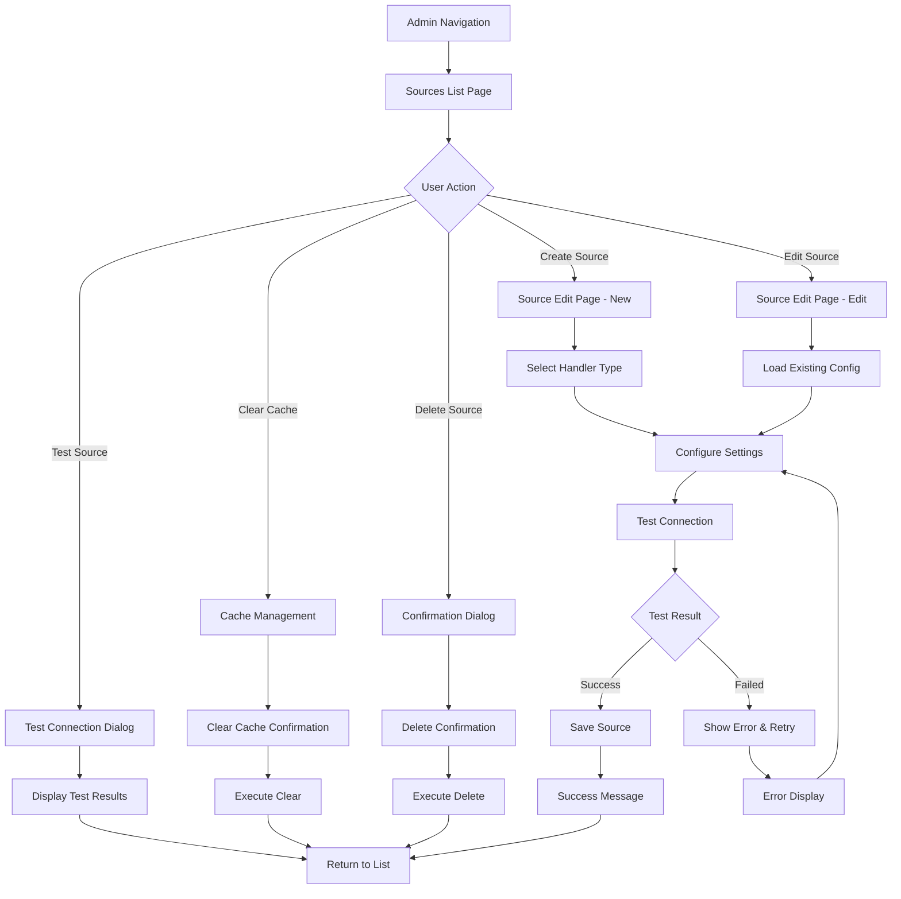

# UI/UX Brief: Sources Configuration Admin Interface

## Executive Summary

The Sources Configuration admin interface introduces comprehensive source management capabilities to AI Hub Apps, enabling administrators to manage filesystem, URL, and iFinder sources with full testing, caching, and integration features. The design follows established AI Hub Apps admin patterns while introducing specialized components for source configuration, testing, and app integration.

## Component Hierarchy

### AdminSourcesPage (List View)

- **Purpose**: Primary sources management interface with overview, search, filtering, and bulk operations
- **States**: loading, error, loaded, empty, searching, filtering
- **Props**:
  - `sources` (array): Complete sources configuration data
  - `loading` (boolean): Loading state indicator
  - `error` (string): Error message if any
  - `searchTerm` (string): Current search filter
  - `statusFilter` (string): Status filter selection (all, enabled, disabled)
  - `typeFilter` (string): Type filter selection (all, filesystem, url, ifinder)
  - `onSearch` (function): Search input handler
  - `onFilterChange` (function): Filter change handler
  - `onSourceToggle` (function): Enable/disable source handler
  - `onSourceTest` (function): Test connection handler
  - `onClearCache` (function): Cache clearing handler
  - `onSourceEdit` (function): Edit source navigation handler
  - `onSourceDelete` (function): Delete source handler
- **Accessibility**:
  - ARIA: `role="main"`, `aria-label="Sources management interface"`, table headers with `scope="col"`, row actions with `aria-label`
  - Keyboard: Tab navigation through filters, table rows, and actions; Enter/Space for button activation
  - Screen Reader: Status announcements for bulk operations, table row count updates, error state announcements

### AdminSourceEditPage (Create/Edit Form)

- **Purpose**: Source creation and editing interface with dynamic configuration based on handler type
- **States**: loading, editing, saving, validating, testing, error, success
- **Props**:
  - `sourceId` (string): Source ID for editing (null for new)
  - `initialData` (object): Source configuration data
  - `availableTypes` (array): Available handler types
  - `onSave` (function): Save source handler
  - `onCancel` (function): Cancel editing handler
  - `onTest` (function): Test connection handler
  - `validationErrors` (object): Field validation errors
- **Accessibility**:
  - ARIA: Form sections with `role="group"`, `aria-labelledby`, error associations with `aria-describedby`
  - Keyboard: Tab order through form fields, Enter for default actions, Escape for cancel
  - Screen Reader: Field validation announcements, test result announcements

### SourceCard Component

- **Purpose**: Individual source display card with quick actions and status indicators
- **States**: default, hover, testing, error, disabled
- **Props**:
  - `source` (object): Source configuration data
  - `onEdit` (function): Edit action handler
  - `onToggle` (function): Enable/disable handler
  - `onTest` (function): Test connection handler
  - `onDelete` (function): Delete source handler
  - `isTestable` (boolean): Whether source supports testing
  - `testStatus` (string): Current test status
- **Accessibility**:
  - ARIA: `role="article"`, action buttons with descriptive labels
  - Keyboard: Focusable card with action button access
  - Screen Reader: Source status and description announcements

### SourceConfigForm Component

- **Purpose**: Dynamic configuration form that adapts based on selected handler type
- **States**: default, validating, error
- **Props**:
  - `handlerType` (string): Selected handler type (filesystem, url, ifinder)
  - `config` (object): Current configuration values
  - `onChange` (function): Configuration change handler
  - `errors` (object): Validation errors
  - `disabled` (boolean): Form disabled state
- **Accessibility**:
  - ARIA: Field groups with appropriate labeling, error message associations
  - Keyboard: Standard form navigation
  - Screen Reader: Context-sensitive help text and validation messages

### SourceTestPanel Component

- **Purpose**: Connection testing interface with results display and diagnostics
- **States**: idle, testing, success, error, timeout
- **Props**:
  - `source` (object): Source to test
  - `onTest` (function): Test execution handler
  - `testResult` (object): Test results data
  - `isLoading` (boolean): Test in progress
- **Accessibility**:
  - ARIA: Live region for test results, progress indicator during testing
  - Keyboard: Test button activation, result navigation
  - Screen Reader: Test progress and result announcements

### CacheManagementPanel Component

- **Purpose**: Cache statistics display and management controls
- **States**: default, loading, clearing, error
- **Props**:
  - `cacheStats` (object): Cache hit/miss statistics
  - `onClearCache` (function): Cache clearing handler
  - `onRefreshStats` (function): Refresh statistics handler
- **Accessibility**:
  - ARIA: Data table for statistics, action confirmations
  - Keyboard: Statistics navigation, action button access
  - Screen Reader: Statistics value announcements, action result feedback

### SourceSelector Component (App Integration)

- **Purpose**: Multi-select interface for choosing sources in app configuration
- **States**: default, selecting, reordering, loading
- **Props**:
  - `availableSources` (array): All available sources
  - `selectedSources` (array): Currently selected sources
  - `onChange` (function): Selection change handler
  - `maxSelections` (number): Maximum allowed selections
  - `allowReordering` (boolean): Enable drag-and-drop reordering
- **Accessibility**:
  - ARIA: `role="listbox"`, `aria-multiselectable="true"`, drag-and-drop announcements
  - Keyboard: Arrow key navigation, Space for selection, drag-and-drop alternatives
  - Screen Reader: Selection count, reordering feedback

## User Flow

## Design Specifications

### Spacing

Following AI Hub Apps 4px grid system:

- **Component padding**: 16px (4 units)
- **Section margins**: 24px (6 units)
- **Element spacing**: 8px (2 units)
- **Form field gaps**: 12px (3 units)
- **Button padding**: 12px horizontal, 8px vertical

### Typography

- **Page titles**: text-2xl font-semibold text-gray-900 (32px bold)
- **Section headers**: text-lg font-medium text-gray-900 (18px medium)
- **Labels**: text-sm font-medium text-gray-700 (14px medium)
- **Body text**: text-sm text-gray-600 (14px regular)
- **Helper text**: text-xs text-gray-500 (12px regular)
- **Error text**: text-sm text-red-600 (14px regular)

### Colors

**Status Indicators:**

- **Enabled**: bg-green-100 text-green-800 (success states)
- **Disabled**: bg-red-100 text-red-800 (error/disabled states)
- **Testing**: bg-yellow-100 text-yellow-800 (warning/pending states)
- **Unknown**: bg-gray-100 text-gray-800 (neutral states)

**Action Buttons:**

- **Primary**: bg-indigo-600 hover:bg-indigo-700 text-white
- **Secondary**: bg-white border-gray-300 text-gray-700 hover:bg-gray-50
- **Danger**: bg-red-600 hover:bg-red-700 text-white
- **Success**: bg-green-600 hover:bg-green-700 text-white

**Handler Type Indicators:**

- **Filesystem**: bg-blue-100 text-blue-800
- **URL**: bg-purple-100 text-purple-800
- **iFinder**: bg-orange-100 text-orange-800

### Icons

Following existing Icon component patterns:

- **Sources list**: `database` icon
- **Filesystem**: `folder` icon
- **URL**: `globe-alt` icon
- **iFinder**: `magnifying-glass` icon
- **Test connection**: `beaker` icon
- **Clear cache**: `arrow-path` icon
- **Edit**: `pencil` icon
- **Delete**: `trash` icon
- **Enable/Disable**: `eye`/`eye-slash` icons
- **Settings**: `cog-6-tooth` icon
- **Success**: `check-circle` icon
- **Error**: `x-circle` icon
- **Warning**: `exclamation-triangle` icon

## Responsive Behavior

### Desktop (1024px+)

- **Layout**: Full table view with all columns visible
- **Actions**: Inline action buttons in table rows
- **Forms**: Two-column layout for configuration sections
- **Search**: Inline search with immediate filtering

### Tablet (768px - 1023px)

- **Layout**: Simplified table with essential columns
- **Actions**: Grouped action menu (overflow menu)
- **Forms**: Single-column layout with grouped sections
- **Search**: Full-width search bar above table

### Mobile (320px - 767px)

- **Layout**: Card-based list view instead of table
- **Actions**: Expandable action menu per card
- **Forms**: Stacked form layout with full-width fields
- **Search**: Sticky search header with filter dropdown

## Accessibility Considerations

### WCAG Compliance Features

**Level AA Requirements:**

- **Color contrast**: Minimum 4.5:1 ratio for all text
- **Focus indicators**: 2px solid ring with sufficient contrast
- **Keyboard navigation**: Full keyboard accessibility without mouse
- **Screen reader support**: Proper ARIA labels and live regions

**Form Accessibility:**

- **Labels**: Explicit label associations for all form controls
- **Error handling**: `aria-describedby` linking errors to fields
- **Required fields**: `aria-required="true"` and visual indicators
- **Fieldsets**: Grouped related fields with descriptive legends

**Table Accessibility:**

- **Headers**: Proper `th` elements with `scope` attributes
- **Captions**: Descriptive table captions for data tables
- **Sortable columns**: ARIA sort state indicators
- **Row selection**: Clear selection state announcements

**Dynamic Content:**

- **Live regions**: Status updates announced to screen readers
- **Loading states**: Progress indicators with accessible labels
- **Error states**: Immediate error announcements
- **Success feedback**: Confirmation message announcements

## Error States and Feedback

### Error Categories

**Validation Errors:**

- **Field-level**: Inline validation with red text and icons
- **Form-level**: Summary error messages at form top
- **Real-time**: Immediate feedback on field blur/change

**Connection Errors:**

- **Network issues**: Clear network error messages with retry options
- **Authentication**: Specific auth failure messages with guidance
- **Timeout**: Timeout indicators with extended retry options
- **Configuration**: Invalid config explanations with examples

**System Errors:**

- **Server errors**: User-friendly 500 error explanations
- **Permission errors**: Clear permission requirement messages
- **Resource limits**: Quota/limit explanations with alternatives

### Feedback Patterns

**Success States:**

- **Toast notifications**: 4-second auto-dismiss success messages
- **Inline confirmations**: Green checkmarks with success text
- **Status updates**: Real-time status indicator changes

**Loading States:**

- **Skeleton screens**: Consistent loading placeholders
- **Progress indicators**: Determinate progress for long operations
- **Spinners**: Indeterminate loading for quick operations

**Empty States:**

- **No sources**: Helpful empty state with creation guidance
- **No search results**: Clear "no results" with filter clearing
- **No cache data**: Explanatory message about cache building

## Integration Points

### App Editor Integration

**Source Selection Interface:**

- **Location**: New "Sources" tab in app editor
- **Components**: SourceSelector with drag-and-drop reordering
- **Validation**: Real-time validation of source compatibility
- **Preview**: Live preview of selected source content

**Variable Integration:**

- **Source variables**: Dynamic variable creation from source schemas
- **Content mapping**: Map source fields to app variables
- **Fallback handling**: Configure fallback values for missing sources

### Navigation Integration

**AdminNavigation Updates:**

- **New tab**: "Sources" between "Prompts" and "Pages"
- **Active state**: Consistent active styling with other admin tabs
- **Icon**: Database icon to represent source management
- **Permissions**: Conditional display based on admin permissions

### Cache Integration

**Global Cache Dashboard:**

- **System page**: Cache statistics panel in admin system page
- **Health monitoring**: Cache health indicators and alerts
- **Performance metrics**: Hit/miss ratios and response times

## Testing Scenarios

### UI Testing Requirements

**Functional Testing:**

1. **Create source**: Complete source creation flow for each handler type
2. **Edit source**: Modify existing source configurations
3. **Delete source**: Confirm deletion with proper confirmations
4. **Test connections**: Verify test functionality for all source types
5. **Cache management**: Clear cache and verify statistics updates
6. **Search/filter**: Verify search and filtering functionality
7. **Bulk operations**: Test enable/disable all functionality

**Accessibility Testing:**

1. **Keyboard navigation**: Complete interface navigation using only keyboard
2. **Screen reader**: Full interface usability with screen reader
3. **Focus management**: Proper focus handling in modals and forms
4. **Color blindness**: Interface usability without color information
5. **High contrast**: Compatibility with high contrast modes

**Responsive Testing:**

1. **Mobile devices**: Full functionality on mobile viewport
2. **Tablet landscape**: Proper layout adaptation for tablets
3. **Desktop scaling**: Interface scaling from 100% to 200% zoom
4. **Touch interactions**: Touch-friendly interface on touch devices

**Error Handling Testing:**

1. **Network failures**: Graceful handling of connection losses
2. **Invalid data**: Proper validation error display
3. **Permission errors**: Clear permission denial messages
4. **Timeout scenarios**: Appropriate timeout handling and recovery

**Performance Testing:**

1. **Large datasets**: Interface performance with many sources
2. **Slow connections**: Usability with slow network connections
3. **Concurrent users**: Multi-user editing conflict resolution
4. **Cache performance**: Cache hit/miss ratio optimization

### Integration Testing

**App Editor Integration:**

1. **Source selection**: Verify source picker in app configuration
2. **Variable creation**: Automatic variable generation from sources
3. **Content preview**: Live preview of source content in apps
4. **Dependency tracking**: Source usage tracking across apps

**Permission Integration:**

1. **Admin access**: Verify admin-only access to sources interface
2. **Role restrictions**: Test different permission levels
3. **Group inheritance**: Verify group-based permission inheritance

**API Integration:**

1. **CRUD operations**: Complete source management via API
2. **Test endpoints**: Source testing API functionality
3. **Cache endpoints**: Cache management API integration
4. **Error handling**: Proper API error response handling

This comprehensive UI/UX brief provides the foundation for implementing a professional, accessible, and user-friendly Sources Configuration interface that seamlessly integrates with the existing AI Hub Apps admin experience while providing powerful source management capabilities.
