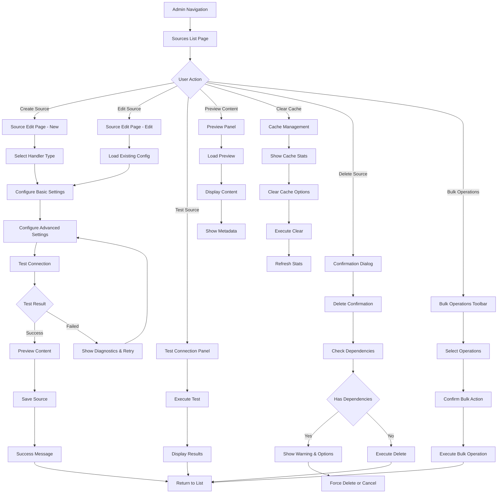

# UI/UX Brief: Sources Administration Interface

## Executive Summary

The Sources Administration interface introduces comprehensive source management capabilities to iHub Apps, enabling administrators to configure, test, and manage filesystem, URL, and iFinder sources with full integration into the prompt system. The design follows established iHub Apps admin patterns while introducing specialized components for source configuration, validation, and app integration. The interface prioritizes ease of use, robust error handling, and seamless integration with existing app workflows.

## Component Hierarchy

### AdminSourcesPage (List View)

- **Purpose**: Primary sources management interface with overview, search, filtering, and bulk operations
- **States**: loading, error, loaded, empty, searching, filtering, bulk-operating
- **Props**:
  - `sources` (array): Complete sources configuration data
  - `loading` (boolean): Loading state indicator
  - `error` (string): Error message if any
  - `searchTerm` (string): Current search filter
  - `statusFilter` (string): Status filter selection (all, enabled, disabled)
  - `typeFilter` (string): Type filter selection (all, filesystem, url, ifinder)
  - `selectedSources` (array): Sources selected for bulk operations
  - `onSearch` (function): Search input handler
  - `onFilterChange` (function): Filter change handler
  - `onSourceToggle` (function): Enable/disable source handler
  - `onSourceTest` (function): Test connection handler
  - `onBulkToggle` (function): Bulk enable/disable handler
  - `onClearCache` (function): Cache clearing handler
  - `onSourceEdit` (function): Edit source navigation handler
  - `onSourceDelete` (function): Delete source handler
  - `onSourceClone` (function): Clone source handler
- **Accessibility**:
  - ARIA: `role="main"`, `aria-label="Sources management interface"`, table headers with `scope="col"`, row actions with descriptive `aria-label`
  - Keyboard: Tab navigation through filters, table rows, and actions; Enter/Space for button activation; Shift+Click for range selection
  - Screen Reader: Status announcements for bulk operations, table row count updates, error state announcements, loading progress

### AdminSourceEditPage (Create/Edit Form)

- **Purpose**: Source creation and editing interface with dynamic configuration based on handler type
- **States**: loading, editing, saving, validating, testing, error, success, unsaved-changes
- **Props**:
  - `sourceId` (string): Source ID for editing (null for new)
  - `initialData` (object): Source configuration data
  - `availableTypes` (array): Available handler types with descriptions
  - `availableApps` (array): Apps for integration testing
  - `onSave` (function): Save source handler
  - `onCancel` (function): Cancel editing handler
  - `onTest` (function): Test connection handler
  - `onPreview` (function): Preview content handler
  - `validationErrors` (object): Field validation errors
  - `isDirty` (boolean): Unsaved changes indicator
- **Accessibility**:
  - ARIA: Form sections with `role="group"`, `aria-labelledby`, error associations with `aria-describedby`, unsaved changes alert
  - Keyboard: Tab order through form fields, Enter for default actions, Escape for cancel, Ctrl+S for save
  - Screen Reader: Field validation announcements, test result announcements, unsaved changes warnings

### SourceTypeSelector Component

- **Purpose**: Handler type selection with descriptions and capability indicators
- **States**: default, selected, disabled
- **Props**:
  - `selectedType` (string): Currently selected handler type
  - `onChange` (function): Type selection handler
  - `availableTypes` (array): Available handler types with metadata
  - `disabled` (boolean): Disable type selection
- **Accessibility**:
  - ARIA: `role="radiogroup"`, individual options with `role="radio"`
  - Keyboard: Arrow key navigation between options
  - Screen Reader: Type descriptions and capability announcements

### SourceConfigForm Component

- **Purpose**: Dynamic configuration form that adapts based on selected handler type
- **States**: default, validating, error, testing-connection
- **Props**:
  - `handlerType` (string): Selected handler type (filesystem, url, ifinder)
  - `config` (object): Current configuration values
  - `onChange` (function): Configuration change handler
  - `errors` (object): Validation errors
  - `disabled` (boolean): Form disabled state
  - `showAdvanced` (boolean): Show advanced configuration options
- **Accessibility**:
  - ARIA: Field groups with appropriate labeling, error message associations, help text linking
  - Keyboard: Standard form navigation, conditional field focusing
  - Screen Reader: Context-sensitive help text and validation messages, field relationship announcements

### SourceTestPanel Component

- **Purpose**: Connection testing interface with results display and diagnostics
- **States**: idle, testing, success, error, timeout, partial-success
- **Props**:
  - `source` (object): Source to test
  - `onTest` (function): Test execution handler
  - `testResult` (object): Test results data with diagnostics
  - `isLoading` (boolean): Test in progress
  - `showDiagnostics` (boolean): Show detailed diagnostic information
- **Accessibility**:
  - ARIA: Live region for test results, progress indicator during testing, diagnostic details expansion
  - Keyboard: Test button activation, result navigation, diagnostic expansion
  - Screen Reader: Test progress announcements, result summary and detailed feedback

### SourcePreviewPanel Component

- **Purpose**: Content preview interface showing sample data from configured source
- **States**: idle, loading, loaded, error, empty, truncated
- **Props**:
  - `source` (object): Source configuration
  - `previewData` (object): Preview content and metadata
  - `onRefresh` (function): Refresh preview handler
  - `maxPreviewLength` (number): Maximum preview content length
  - `showMetadata` (boolean): Show content metadata
- **Accessibility**:
  - ARIA: Content region with appropriate labeling, metadata disclosure
  - Keyboard: Refresh action, metadata expansion, content scrolling
  - Screen Reader: Content length announcements, metadata descriptions

### CacheManagementPanel Component

- **Purpose**: Cache statistics display and management controls with per-source breakdown
- **States**: default, loading, clearing, error, refreshing
- **Props**:
  - `cacheStats` (object): Cache hit/miss statistics per source
  - `onClearCache` (function): Cache clearing handler (global and per-source)
  - `onRefreshStats` (function): Refresh statistics handler
  - `selectedSources` (array): Sources for selective cache clearing
- **Accessibility**:
  - ARIA: Data table for statistics, action confirmations, progress indicators
  - Keyboard: Statistics navigation, action button access, confirmation dialogs
  - Screen Reader: Statistics value announcements, action result feedback, cache clear confirmations

### SourceIntegrationPanel Component

- **Purpose**: Shows which apps are using the source and integration status
- **States**: default, loading, error, empty
- **Props**:
  - `sourceId` (string): Source identifier
  - `integratedApps` (array): Apps using this source
  - `onNavigateToApp` (function): Navigate to app editor handler
  - `onRemoveIntegration` (function): Remove source from app handler
- **Accessibility**:
  - ARIA: List of integrated apps with navigation links
  - Keyboard: Navigation to app editors, integration removal
  - Screen Reader: Integration count and app name announcements

### BulkOperationsToolbar Component

- **Purpose**: Bulk operations interface for selected sources
- **States**: hidden, visible, confirming, processing
- **Props**:
  - `selectedCount` (number): Number of selected sources
  - `onEnableAll` (function): Bulk enable handler
  - `onDisableAll` (function): Bulk disable handler
  - `onDeleteAll` (function): Bulk delete handler
  - `onClearSelection` (function): Clear selection handler
  - `isProcessing` (boolean): Bulk operation in progress
- **Accessibility**:
  - ARIA: Toolbar role with action group, selection count announcement
  - Keyboard: Toolbar navigation, confirmation dialogs
  - Screen Reader: Operation progress and result announcements

## User Flow

## Design Specifications

### Spacing

Following iHub Apps 4px grid system:

- **Page container**: 32px padding (8 units)
- **Section containers**: 24px padding (6 units)
- **Component padding**: 16px (4 units)
- **Element spacing**: 12px (3 units)
- **Form field gaps**: 16px (4 units)
- **Button padding**: 12px horizontal, 8px vertical
- **Icon spacing**: 8px from text (2 units)
- **Table cell padding**: 12px horizontal, 16px vertical

### Typography

- **Page titles**: text-2xl font-semibold text-gray-900 (32px bold)
- **Section headers**: text-lg font-medium text-gray-900 (18px medium)  
- **Subsection headers**: text-base font-medium text-gray-900 (16px medium)
- **Field labels**: text-sm font-medium text-gray-700 (14px medium)
- **Body text**: text-sm text-gray-600 (14px regular)
- **Helper text**: text-xs text-gray-500 (12px regular)
- **Error text**: text-sm text-red-600 (14px regular)
- **Success text**: text-sm text-green-600 (14px regular)
- **Code/identifiers**: font-mono text-sm text-gray-800 (14px monospace)

### Colors

**Status Indicators:**

- **Enabled**: bg-green-100 text-green-800 border-green-200
- **Disabled**: bg-red-100 text-red-800 border-red-200
- **Testing**: bg-yellow-100 text-yellow-800 border-yellow-200
- **Unknown**: bg-gray-100 text-gray-800 border-gray-200
- **Cached**: bg-blue-100 text-blue-800 border-blue-200

**Handler Type Indicators:**

- **Filesystem**: bg-blue-100 text-blue-800 (folder-based sources)
- **URL**: bg-purple-100 text-purple-800 (web-based sources)
- **iFinder**: bg-orange-100 text-orange-800 (search-based sources)

**Action Buttons:**

- **Primary**: bg-indigo-600 hover:bg-indigo-700 text-white
- **Secondary**: bg-white border-gray-300 text-gray-700 hover:bg-gray-50
- **Danger**: bg-red-600 hover:bg-red-700 text-white
- **Success**: bg-green-600 hover:bg-green-700 text-white
- **Warning**: bg-yellow-600 hover:bg-yellow-700 text-white

**Form Elements:**

- **Input focus**: ring-2 ring-indigo-500 border-indigo-500
- **Input error**: ring-2 ring-red-500 border-red-300
- **Input success**: ring-2 ring-green-500 border-green-300
- **Disabled input**: bg-gray-100 text-gray-500 cursor-not-allowed

### Icons

Following existing Icon component patterns:

- **Sources list**: `database` icon (24px)
- **Filesystem**: `folder` icon (20px)
- **URL**: `globe-alt` icon (20px)
- **iFinder**: `magnifying-glass` icon (20px)
- **Test connection**: `beaker` icon (16px)
- **Preview content**: `eye` icon (16px)
- **Clear cache**: `arrow-path` icon (16px)
- **Edit**: `pencil` icon (16px)
- **Delete**: `trash` icon (16px)
- **Clone**: `document-duplicate` icon (16px)
- **Enable/Disable**: `eye`/`eye-slash` icons (16px)
- **Settings**: `cog-6-tooth` icon (16px)
- **Success**: `check-circle` icon (16px)
- **Error**: `x-circle` icon (16px)
- **Warning**: `exclamation-triangle` icon (16px)
- **Info**: `information-circle` icon (16px)
- **Expand/Collapse**: `chevron-down`/`chevron-up` icons (16px)

## Responsive Behavior

### Desktop (1024px+)

- **Layout**: Full table view with all columns visible
- **Actions**: Inline action buttons in table rows
- **Forms**: Two-column layout for configuration sections
- **Search**: Inline search with immediate filtering
- **Panels**: Side-by-side test and preview panels
- **Navigation**: Full horizontal admin navigation

### Tablet (768px - 1023px)

- **Layout**: Simplified table with essential columns
- **Actions**: Grouped action menu (overflow menu)
- **Forms**: Single-column layout with grouped sections
- **Search**: Full-width search bar above table
- **Panels**: Stacked test and preview panels
- **Navigation**: Collapsed admin navigation with dropdown

### Mobile (320px - 767px)

- **Layout**: Card-based list view instead of table
- **Actions**: Expandable action menu per card
- **Forms**: Stacked form layout with full-width fields
- **Search**: Sticky search header with filter dropdown
- **Panels**: Accordion-style collapsible panels
- **Navigation**: Mobile hamburger menu navigation

## Accessibility Requirements

### WCAG AA Compliance

**Color and Contrast:**

- **Text contrast**: Minimum 4.5:1 ratio for all text content
- **Interactive elements**: Minimum 3:1 ratio for buttons and form controls
- **Focus indicators**: 2px solid ring with 4.5:1 contrast ratio
- **Status indicators**: Never rely solely on color for status communication

**Keyboard Navigation:**

- **Tab order**: Logical tab sequence through all interactive elements
- **Focus management**: Proper focus handling in modals and dynamic content
- **Keyboard shortcuts**: Standard shortcuts (Enter, Space, Escape, Arrow keys)
- **Skip links**: Skip to main content and navigation bypass

**Screen Reader Support:**

- **Semantic markup**: Proper heading hierarchy and landmark roles
- **Form labels**: Explicit label-input associations
- **Error handling**: Clear error announcements and recovery instructions
- **Dynamic content**: Live regions for status updates and content changes

**Form Accessibility:**

- **Required fields**: Clear visual and programmatic required indicators
- **Error messages**: Associated with form fields via `aria-describedby`
- **Help text**: Contextual help linked to relevant form fields
- **Validation**: Real-time validation with clear success/error feedback

### Assistive Technology Support

**Screen Readers:**

- **NVDA/JAWS compatibility**: Tested with major Windows screen readers
- **VoiceOver compatibility**: Tested with macOS/iOS screen reader
- **Content announcements**: Meaningful announcements for all state changes
- **Navigation shortcuts**: Screen reader navigation landmarks and headings

**Keyboard-only Users:**

- **No mouse dependency**: Full functionality without mouse interaction
- **Visible focus**: Clear focus indicators on all interactive elements
- **Focus trapping**: Modal dialogs trap focus appropriately
- **Focus restoration**: Focus returns to trigger element after modal close

**High Contrast Mode:**

- **Windows High Contrast**: Compatible with Windows high contrast themes
- **Custom themes**: Respects user's preferred contrast settings
- **Border preservation**: Maintains element boundaries in high contrast
- **Icon visibility**: Icons remain visible in high contrast mode

## Error States and Feedback

### Error Categories

**Validation Errors:**

- **Field-level validation**: Immediate feedback on field blur/change
- **Form-level validation**: Summary of all validation errors
- **Real-time validation**: Progressive validation as user types
- **Cross-field validation**: Dependencies between related fields

**Connection Errors:**

- **Network failures**: Clear network error messages with retry options
- **Authentication errors**: Specific auth failure messages with guidance
- **Timeout errors**: Timeout indicators with extended retry options
- **Configuration errors**: Invalid config explanations with examples
- **Permission errors**: Clear permission requirement explanations

**System Errors:**

- **Server errors**: User-friendly 500 error explanations with support contact
- **Resource not found**: Clear 404 messages with navigation options
- **Rate limiting**: Clear rate limit explanations with retry timing
- **Maintenance mode**: Maintenance notices with expected resolution

### Feedback Patterns

**Success States:**

- **Toast notifications**: 4-second auto-dismiss success messages
- **Inline confirmations**: Green checkmarks with success text
- **Status updates**: Real-time status indicator changes
- **Progress feedback**: Clear progress indicators for long operations

**Loading States:**

- **Skeleton screens**: Consistent loading placeholders maintaining layout
- **Progress indicators**: Determinate progress for operations with known duration
- **Spinners**: Indeterminate loading for quick operations
- **Background loading**: Non-blocking loading with partial content display

**Empty States:**

- **No sources**: Helpful empty state with creation guidance and examples
- **No search results**: Clear "no results" with filter clearing options
- **No cache data**: Explanatory message about cache building process
- **No integrations**: Guidance on how to integrate sources with apps

## Integration Specifications

### AdminNavigation Integration

**Navigation Structure Update:**

- **Location**: "Sources" tab in Content Management group, between "Prompts" and "Pages"
- **Icon**: `database` icon for source management representation
- **Active state**: Consistent active styling with other admin tabs
- **Permissions**: Conditional display based on admin permissions
- **Mobile handling**: Included in responsive navigation overflow

### App Editor Integration

**Source Selection Interface:**

- **Location**: New "Sources" tab in app editor alongside Variables and Settings
- **Component**: Enhanced SourceSelector with drag-and-drop reordering
- **Validation**: Real-time validation of source compatibility with app configuration
- **Preview**: Live preview of selected source content within app context
- **Dependency tracking**: Automatic tracking of source usage across apps

**Variable Integration:**

- **Auto-generation**: Dynamic variable creation from source schemas
- **Content mapping**: Map source fields to app variables with type validation
- **Fallback handling**: Configure fallback values for unavailable sources
- **Variable preview**: Preview resolved variables with actual source data

### Cache Integration

**System Dashboard:**

- **Cache panel**: Cache statistics display in admin system page
- **Health monitoring**: Cache health indicators and performance alerts
- **Performance metrics**: Hit/miss ratios, response times, and usage patterns
- **Global controls**: System-wide cache management controls

### API Integration

**REST Endpoints:**

- **CRUD operations**: Complete source management via RESTful API
- **Test endpoints**: Source connection testing with detailed diagnostics
- **Cache endpoints**: Cache management and statistics API
- **Bulk operations**: Efficient bulk operations for multiple sources
- **Integration queries**: API for source-app dependency tracking

## Implementation Notes

### Development Considerations

**State Management:**

- **Local state**: Use React hooks for component-level state management
- **Form state**: Implement form state management with validation
- **Cache management**: Client-side caching for frequently accessed data
- **Error boundaries**: Comprehensive error boundary implementation

**Performance Optimizations:**

- **Lazy loading**: Load source configurations on-demand
- **Debounced search**: Implement search debouncing for performance
- **Virtual scrolling**: For large lists of sources (100+ items)
- **Memoization**: Memoize expensive calculations and renders

**Security Considerations:**

- **Input validation**: Client and server-side validation for all inputs
- **XSS prevention**: Proper sanitization of user-generated content
- **CSRF protection**: CSRF tokens for state-changing operations
- **Permission checks**: Verify admin permissions for all operations

### Testing Requirements

**Unit Testing:**

- **Component testing**: Test individual components with React Testing Library
- **Hook testing**: Test custom hooks with appropriate test utilities
- **Utility testing**: Test utility functions with comprehensive edge cases
- **Validation testing**: Test form validation logic thoroughly

**Integration Testing:**

- **API integration**: Test all API endpoints with mock and real backends
- **Navigation integration**: Test admin navigation integration
- **App editor integration**: Test source selection in app editor
- **Permission integration**: Test admin permission requirements

**Accessibility Testing:**

- **Automated testing**: Use axe-core for automated accessibility testing
- **Manual testing**: Manual keyboard navigation and screen reader testing
- **Color testing**: Test with color blindness simulators
- **Contrast testing**: Verify color contrast ratios meet WCAG requirements

**Performance Testing:**

- **Load testing**: Test with large datasets (1000+ sources)
- **Responsiveness**: Test responsive behavior across device sizes
- **Network testing**: Test behavior with slow/unreliable connections
- **Memory testing**: Monitor memory usage with long-running sessions

This comprehensive UI/UX brief provides the complete foundation for implementing a professional, accessible, and user-friendly Sources Administration interface that seamlessly integrates with the existing iHub Apps ecosystem while providing powerful source management capabilities.