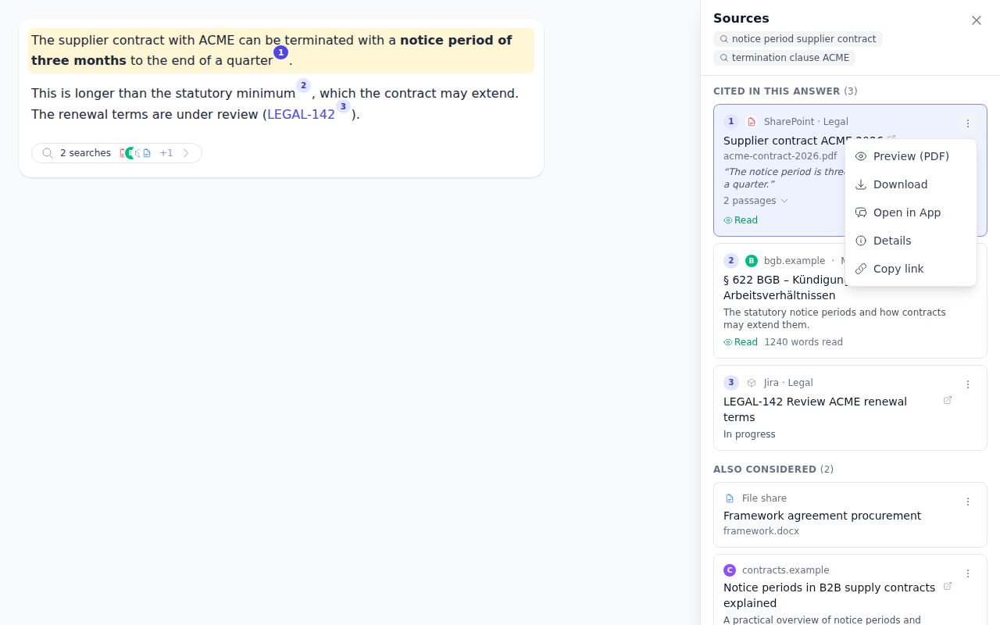
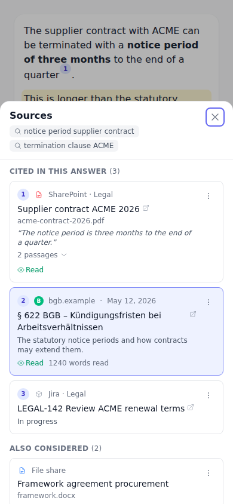
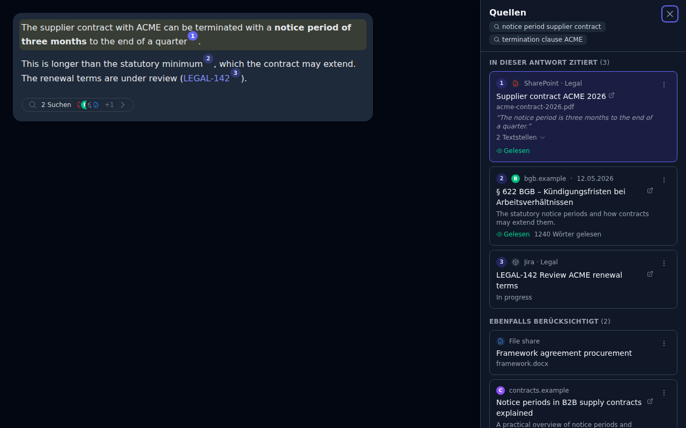

# Answer Sources: One Contract for "I Have Found This for You"

Issue: [intrafind/ihub-apps#2637](https://github.com/intrafind/ihub-apps/issues/2637) ·
Builds on #2520 (web search sources view) and #2597 (iFinder tool documents in the Documents
panel). Developer and admin documentation: [`docs/answer-sources.md`](../../docs/answer-sources.md).

## Goal

Web search, iFinder and iAssistant each told the user what they found in their own way. The goal
is one clean, abstract contract through which **any** integration returns what it found. The chat
then shows, cites, stores, shares and acts on it without integration-specific code. This follows
the consolidation of the loops (`AgentLoop` for chat, workflows, agents and inference): one model,
producers that plug in, one collector in the loop, one frame, one stored field, one panel and one
action vocabulary.

## What we had

| | iAssistant | iFinder tools | Web search | Workflows / agents |
|---|---|---|---|---|
| Producer | adapter chunk `citations {references, resultItems}`, in the iFinder API shape | `iFinderCitations.js` re-encodes tool results into iAssistant's shape | `loop/webSources.js` per tool call, plus provider grounding | `PromptNodeExecutor` harvest → `state.data._citations` |
| Wire | `tool/progress` phase `citation` | same, whole list every frame | `tool/completed.webSources`, `tool/progress` phase `grounding`, `step/completed.groundingMetadata`, rebuilt on the client | – |
| Stored | `citations` | `citations` | `webSearch` (unreleased) | run data |
| Share | dropped, by field name | dropped | kept, including page-reader reads | – |
| UI | `CitationPanel`, inline tiles, six actions | same | `WebSearchSources`, side panel, open only | admin run page |
| Inline markers | `<cite type="s\|r">N</cite>` (global DOM ids) | `[title](deepLink)` + token matching | `[n](url)` badges | `[N]` |

Tool-id heuristics (`isWebSearchTool`, `startsWith('ifinder')`, `includes('search')`) decided what
counted as a source, there were two URL normalizers, and the loop's `citationSchema` declared a
shape it never carried. A new integration would have had to change the heuristics, a panel and the
share filter.

## Design

- **Model** (`shared/sources/`, pure, shared by server and client): a `Source` has an `id`
  (identity in the answer), a `provider` (the system it lives in, which decides its actions), a
  `kind` (`page`, `document`, `item`), display fields, `passages`, a `ref` (the provider's handle
  for content actions), `read`, `cited`, `markers` and `private`. An answer's set is
  `{ items, queries }`. One `mergeSources` folds frames on both sides, and one `resolveCitations`
  numbers links and provider markers alike.
- **Producers** (`server/services/sources/`), first match wins:
  1. a `sources` declaration in the tool definition (no code);
  2. a registered producer (built in: web search and the page reader, iFinder);
  3. the tool's own report: a `sources` array, MCP `resource_link`, `structuredContent.sources`.

  Model adapters put `chunk.sources` on the stream (iAssistant). Provider grounding is converted
  in the loop.
- **Loop**: `ctx.addSources` → `ctx.sources`, the ledger event `sources/added`, and
  `channel.onSources`. `LoopResult.sources` replaces `citations`. App-as-tool forwards its sources
  as the envelope, so the calling chat lists them.
- **Actions**: one vocabulary (open, copy link, preview, download, add to email, open in app,
  details). Open and copy need a `url`. The rest need a `ref` and a provider registered with
  `registerSourceProvider({ id, content, metadata })`, served by one route:
  `GET /api/sources/:provider/content|metadata`. A declared tool that returns iFinder ids with
  `"provider": "ifinder"` gets every document action for free.
- **Privacy is a property of the data**, not of the field name: `private` per source, and any
  source with a `ref` is private. A share keeps only public sources.

## Decisions

- **Answers stored with `citations` (5.5.24 and later): clean break.** No read-time conversion.
  Those answers keep their text and links but show no Documents panel. Shares still never carry
  the old field.
- **One panel for everything**: the newer web design (entry under the answer → side panel or
  bottom sheet, *Cited* / *Also considered*). The inline Documents tiles are gone.
- **Every normalized source states `private` explicitly.** Without that, a public page forwarded
  through an envelope, which defaults to private, would have turned private. Normalization is
  idempotent only if privacy is always stated.
- **The card title is the open action**: a real link for middle-click and copy, but a plain click
  goes through the host, which is required in the Outlook task pane. There is no second "open"
  button.
- **No heuristic for "search-like" tools** other than web search engines (by name, including MCP
  search tools named after an engine, for their result shape). Other tools report sources through
  the envelope or a declaration.
- **A name never makes results public.** Only the platform's own web search tools (Brave, Qwant,
  Staan, `webSearch`) and provider-run search report public hits. A tool that is only named after
  an engine may search an intranet, so its hits stay private; a custom tool's declaration can say
  `"public": true`.
- **A public sighting never declassifies a private one** (from the PR review). A source merged from a
  public and a private sighting is public but shows only what the public one reported. From the
  private one it takes only whether the source was read and cited, so a private tool's excerpt for
  a URL cannot reach a share through a web search that returned the same URL.

## Result

Desktop: the panel opened from badge 1, with the document's action menu open. One list holds a
SharePoint document found by iFinder, a web page and a Jira record from a declared tool mapping:

Phone (bottom sheet) and dark mode (German):

The screenshots were taken of the real `StreamingMarkdown` and `AnswerSources` components in a
temporary Vite harness with sample data. The harness is not committed.

## Follow-ups

- Workflows: feed the `_citations` ledger and the synthesizer's `{{citations}}` from
  `LoopResult.sources`, and drop `citationUtils.normalizeCitationUrl`.
- The admin run detail page renders sources with the same cards.
- Source declarations on MCP server configs; content actions for MCP resources (`resources/read`).
