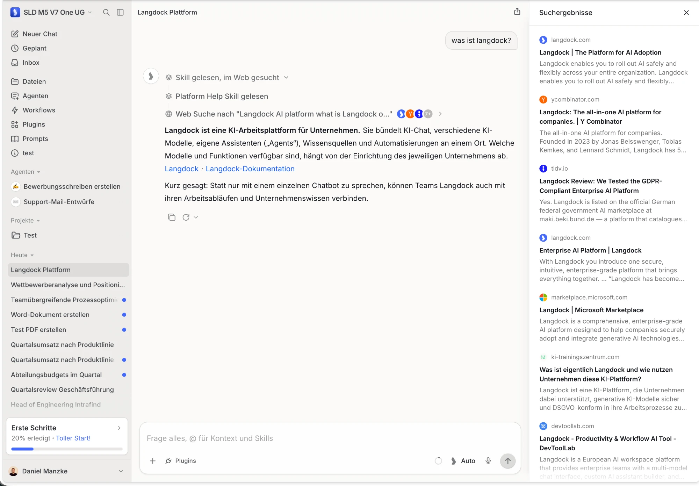
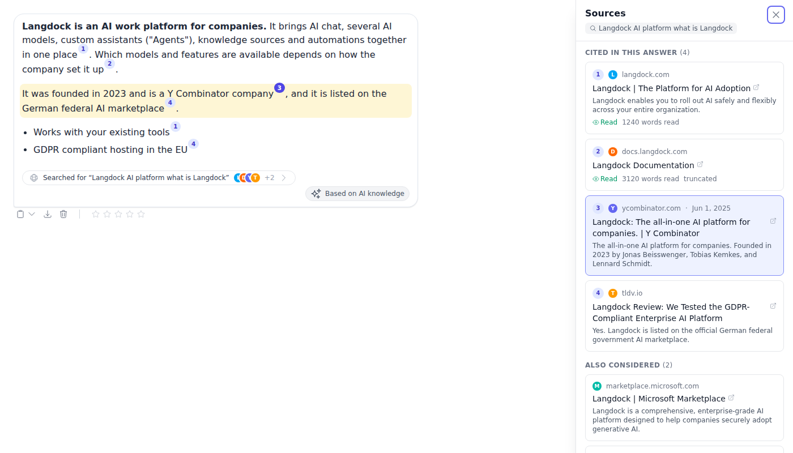
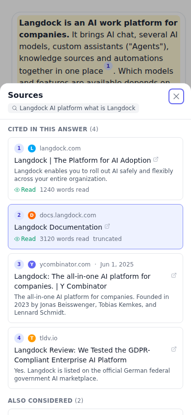
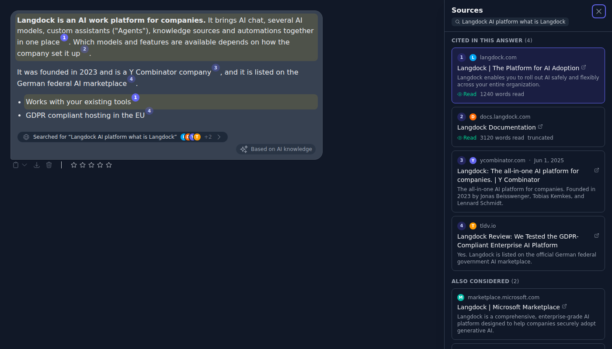

# Web Search: Inspectable Sources, Inline Citations, Stronger Page Reader

Issue: [intrafind/ihub-apps#2520](https://github.com/intrafind/ihub-apps/issues/2520) ·
Builds on #2480 (search activity in the chat) and #2483 (page reader next to search).

## Goal

A user can check a web answer: what was searched, which sources the answer used, which were
considered but not used, and which part of the answer came from which source. The model gets
pages in a structured form, and page reads are capped per turn.

## Design Reference

The sources view follows the pattern shown in this screenshot of a web search answer in another
AI workplace product (Langdock): a collapsible "searched the web" step with the queries and the
sites' icons above the answer, a side panel listing the search results as cards (favicon,
domain, title, snippet), and compact source links next to the paragraphs they back.



What we took from it: the entry that names the query and shows the sites' icons, the side panel
with one card per result, and citations placed next to the claims. What we changed: the panel
separates **Cited in this answer** (numbered like the inline badges) from **Also considered**;
citations are numbered superscript badges rather than site-name links, so several can sit after
one sentence; badges and cards highlight each other; cards show whether a page was read.

## Result

Desktop — the panel opened from badge 3; its paragraph and card are highlighted:



Phone (bottom sheet) and dark mode:





## Decisions on the Open Questions

### Marker format: links, numbered by the client

A citation is a Markdown link to one of the turn's sources, conventionally `[n](url)`. This takes
the strengths of both options in the issue:

- **Reliable to render**: the badge number is not the model's. Sources are numbered by the order
  the answer first links them, from the URL, so a model that numbers wrongly or restarts at 1
  after a second search still renders correctly.
- **Holds up when copied**: the copied text keeps the URL.
- **Never points elsewhere**: only a link whose URL (compared without scheme, `www.`, trailing
  slash, fragment and tracking parameters) is one the turn's searches or page reads returned
  becomes a badge. Anything else stays an ordinary link.

It also unifies the providers: OpenAI writes such links on its own; Anthropic's cited blocks get
one appended by the converter; Google's grounding supports get them inserted after the backed
passage (live on the client, written into the stored text on the server).

### `maxPageReads` default: 5, chat only

Five reads per answer is enough for "open the two or three best results and a pasted URL" and
bounds the context growth (each read is up to 50 000 characters). The cap applies to chat turns.
An app invoked as a tool from a chat runs its own turn under its own `maxPageReads` (sharing the
caller's gate would override the callee's setting; the caller's `maxToolRounds` bounds how often it
is invoked). Agents and workflows keep their own budgets (`maxToolRounds`, token budget) and are
not affected. Past the cap the gate answers the call
itself with a plain result (not an error, so the loop's circuit breaker is not tripped).

### Misplaced markers: no server-side attribution

A paragraph without a marker gets no highlight. Attributing unmarked paragraphs on the server
would mean guessing, and a wrong highlight is worse than none. The research guidance asks the
model to cite right after each claim; Anthropic and Google place markers from their own
citation data.

## Architecture

```
tool calls ── webSources (server/services/loop/webSources.js: url, title, snippet, date,
   │                      favicon, read / not readable, words read, truncated)
   │
grounding ── groundingMetadata per step (Anthropic searchResults/citations, Google chunks +
   │          webSupports, OpenAI searchResults/citations, webSearchQueries)
   ▼
shared/webCitations.js
   buildWebSearch({ tools, grounding }) → { queries, sources, supports }
   resolveCitations(markdown, webSearch) → { cited (numbered), considered, numbers }
   insertSupportMarkers(text, supports)   (Google)
   │                                   │
   ▼ server                            ▼ client
chatSeams collect → ChatService      runToMessage → message.webSearch
summary.webSearch → chatMaterializer    ChatMessage → resolveCitations
stores { queries, sources } and          StreamingMarkdown: links → badges
Google markers in the text               WebSearchSources: entry + panel
                                         webSourcesStore: open / pinned / hover
```

The same module builds the record on both sides, so a live answer and a reopened one render
identically.

## Page Reader

- Markdown via Mozilla Readability + Turndown (with a GFM table rule), selector rules as the
  fallback for pages without an article.
- One window per call: `truncated`, `totalLength`, `offset`, `nextOffset`; the model reads on with
  `offset`. The whole document is cached (bounded by size), so reading on costs no request.
- PDFs: all pages up to 400 000 characters / 500 pages, title and author from the metadata.
- `Accept-Language` from the user's language, a current browser user agent
  (`WEB_READER_USER_AGENT` overrides it).
- JavaScript-rendered pages are not rendered (no headless browser in the reader); a page that
  comes back nearly empty is flagged in a `note` so the model tries another source.

## Native Search and the Page Reader

Offered next to Anthropic and OpenAI Responses native search, whose requests accept function
tools. Not next to Google: Gemini drops function declarations next to `google_search`.
Combining built-in tools with function calling is documented as a preview for Gemini 3 models
only ([Gemini API: tool combination](https://ai.google.dev/gemini-api/docs/tool-combination)),
and it requires circulating the server-side tool call parts (with their signatures) back through
the conversation, which the Google adapter does not do. Worth a follow-up once it leaves preview.

## Follow-ups

- OpenAI can return all pages a `web_search_call` looked at with
  `include: ["web_search_call.action.sources"]`. Not requested yet (compatible gateways may reject
  the parameter); the converter already reads `action.sources` when present, which would fill
  **Also considered** for OpenAI.
- Qwant results carry no favicon, and Staan's only sometimes; cards fall back to the site's initial.
  No third-party favicon service is used, to avoid leaking the searched domains.
- The tool activity list itself is still not stored with the answer (only the sources are).
