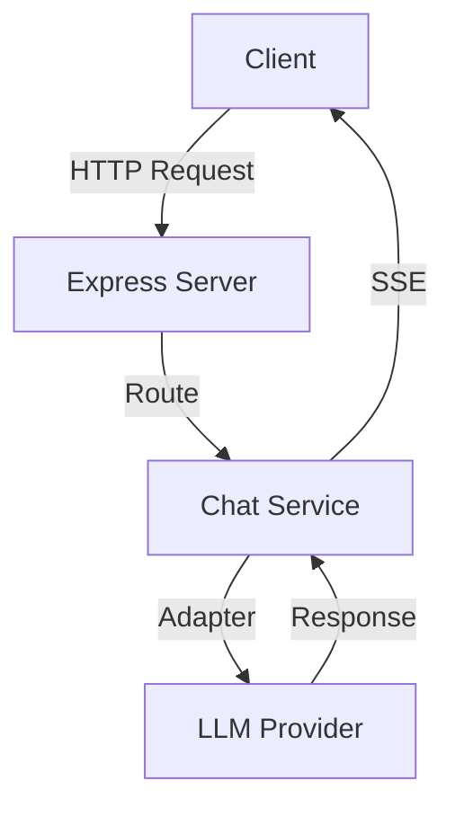

# Technical Debt - Actionable Recommendations
**Platform:** iHub Apps v4.2.0  
**Date:** January 19, 2026  
**Status:** Action Plan

---

## Quick Reference

🔴 **Critical** - Must fix immediately (security/production issues)  
🟡 **High** - Should fix within 1-2 sprints (quality/stability)  
🟢 **Medium** - Plan for next quarter (improvement/optimization)  
🔵 **Low** - Nice to have (cleanup/enhancement)

---

## 1. Immediate Actions (This Week)

### 🔴 CRITICAL: Security Vulnerabilities

**Issue:** 9 high severity vulnerabilities in dependencies (tar package chain)

**Action Plan:**
```bash
# 1. Update electron-builder
npm install electron-builder@latest --save-dev

# 2. Run audit fix
npm audit fix

# 3. If step 2 doesn't resolve all:
npm audit fix --force

# 4. Verify builds still work
npm run prod:build
npm run electron:build
```

**Validation:**
- ✅ Run `npm audit` - should show 0 high severity
- ✅ Test development build: `npm run dev`
- ✅ Test production build: `npm run prod:build`
- ✅ Test Electron build: `npm run electron:build`
- ✅ Test binary creation: `./build.sh --binary`

**Owner:** DevOps/Infrastructure Team  
**Timeline:** 2 days  
**Effort:** 4 hours

---

### 🟡 HIGH: API Documentation

**Issue:** No OpenAPI/Swagger documentation for REST API

**Action Plan:**

1. **Install swagger-jsdoc and swagger-ui-express:**
   ```bash
   cd server && npm install swagger-jsdoc swagger-ui-express
   ```

2. **Create Swagger configuration:**
   ```javascript
   // server/swagger.js
   import swaggerJsdoc from 'swagger-jsdoc';
   
   const options = {
     definition: {
       openapi: '3.0.0',
       info: {
         title: 'iHub Apps API',
         version: '4.2.0',
         description: 'AI-powered applications platform API',
       },
       servers: [
         {
           url: 'http://localhost:3000',
           description: 'Development server',
         },
       ],
     },
     apis: ['./routes/*.js'], // Path to API routes
   };
   
   export const swaggerSpec = swaggerJsdoc(options);
   ```

3. **Add JSDoc comments to routes:**
   ```javascript
   /**
    * @openapi
    * /api/apps:
    *   get:
    *     summary: Get all available applications
    *     tags: [Apps]
    *     responses:
    *       200:
    *         description: List of applications
    */
   router.get('/api/apps', async (req, res) => {
     // existing code
   });
   ```

4. **Add Swagger UI endpoint:**
   ```javascript
   // server/server.js
   import swaggerUi from 'swagger-ui-express';
   import { swaggerSpec } from './swagger.js';
   
   app.use('/api-docs', swaggerUi.serve, swaggerUi.setup(swaggerSpec));
   ```

**Validation:**
- ✅ Visit `http://localhost:3000/api-docs`
- ✅ Verify all major endpoints documented
- ✅ Test API calls from Swagger UI

**Owner:** Backend Team  
**Timeline:** 1 week  
**Effort:** 16 hours

---

### 🟡 HIGH: Test Coverage Baseline

**Issue:** Unknown test coverage, no coverage reporting

**Action Plan:**

1. **Generate coverage report:**
   ```bash
   npm run test:coverage
   ```

2. **Document baseline:**
   - Record current coverage percentages
   - Identify untested critical paths
   - Create coverage improvement goals

3. **Add coverage to CI/CD:**
   ```yaml
   # .github/workflows/test.yml
   - name: Run tests with coverage
     run: npm run test:coverage
   
   - name: Upload coverage reports
     uses: codecov/codecov-action@v3
     with:
       files: ./coverage/lcov.info
   ```

4. **Set minimum thresholds:**
   ```javascript
   // jest.config.js
   module.exports = {
     coverageThreshold: {
       global: {
         branches: 50,
         functions: 50,
         lines: 50,
         statements: 50
       }
     }
   };
   ```

**Validation:**
- ✅ Coverage report generated
- ✅ CI/CD runs coverage checks
- ✅ Coverage badge in README
- ✅ Team aware of current baseline

**Owner:** QA/Testing Team  
**Timeline:** 3 days  
**Effort:** 8 hours

---

## 2. Sprint Planning (Next 2 Weeks)

### 🟡 HIGH: Fix React Hooks Dependencies

**Issue:** 32 warnings about React Hooks dependencies

**Action Plan:**

**Phase 1: Critical Hooks (Week 1)**

Focus on hooks with the most dependencies issues:
- `client/src/features/chat/hooks/useIntegrationAuth.js` (8 warnings)
- `client/src/features/admin/components/AdminNavigation.jsx` (2 warnings)

```javascript
// BEFORE:
useEffect(() => {
  validateApp(formData);
}, [formData]); // missing validateApp dependency

// AFTER:
const validateApp = useCallback((data) => {
  // validation logic
}, [/* dependencies */]);

useEffect(() => {
  validateApp(formData);
}, [formData, validateApp]);
```

**Phase 2: Form Editors (Week 2)**

Fix all form editor components:
- AppFormEditor.jsx
- ModelFormEditor.jsx
- PromptFormEditor.jsx
- UserFormEditor.jsx
- GroupFormEditor.jsx

**Validation:**
- ✅ Run `npm run lint` - no hooks warnings
- ✅ Test all admin forms
- ✅ No regression in functionality

**Owner:** Frontend Team  
**Timeline:** 2 weeks  
**Effort:** 24 hours

---

### 🟢 MEDIUM: Clean Up Unused Variables

**Issue:** 25 unused variable warnings

**Action Plan:**

**Quick Fixes (Can be done in parallel):**

1. **Unused error variables (9 instances):**
   ```javascript
   // BEFORE:
   catch (error) { // unused
     return res.status(500).json({ error: 'Failed' });
   }
   
   // AFTER:
   catch (_error) { // prefixed with underscore
     return res.status(500).json({ error: 'Failed' });
   }
   ```

2. **Unused imports (5 instances):**
   - Remove `React` imports in JSX files (React 17+ transform)
   - Remove other unused imports

3. **Unused destructured variables (5 instances):**
   ```javascript
   // BEFORE:
   const { removed, ...rest } = options; // 'removed' unused
   
   // AFTER:
   const { removed: _removed, ...rest } = options;
   ```

**Validation:**
- ✅ Run `npm run lint` - no unused variable warnings
- ✅ Code still builds
- ✅ Tests pass

**Owner:** Any Developer (Good first issues)  
**Timeline:** 1 week  
**Effort:** 8 hours

---

## 3. Quarter Plan (Next 3 Months)

### 🟢 MEDIUM: Increase Test Coverage

**Goal:** Achieve 70% test coverage for critical paths

**Phase 1: Admin Panel Components (Month 1)**

Add unit tests for:
- ✅ AppFormEditor.jsx
- ✅ ModelFormEditor.jsx
- ✅ PromptFormEditor.jsx
- ✅ UserFormEditor.jsx
- ✅ GroupFormEditor.jsx
- ✅ SourceConfigForm.jsx

**Example Test:**
```javascript
// AppFormEditor.test.jsx
import { render, screen, fireEvent } from '@testing-library/react';
import AppFormEditor from './AppFormEditor';

describe('AppFormEditor', () => {
  it('validates required fields', async () => {
    render(<AppFormEditor app={mockApp} />);
    
    const saveButton = screen.getByText('Save');
    fireEvent.click(saveButton);
    
    expect(await screen.findByText('Name is required')).toBeInTheDocument();
  });
});
```

**Phase 2: Custom Hooks (Month 2)**

Add tests for:
- ✅ useAppChat.js
- ✅ useIntegrationAuth.js
- ✅ useMagicPrompt.js
- ✅ useVoiceRecognition.js

**Phase 3: Integration Tests (Month 3)**

Add integration tests for:
- ✅ Chat flow (user → LLM → response)
- ✅ File upload processing
- ✅ Source handlers integration
- ✅ Tool execution flow

**Validation:**
- ✅ Coverage report shows 70%+ coverage
- ✅ CI/CD enforces minimum coverage
- ✅ No critical paths uncovered

**Owner:** QA Team + All Developers  
**Timeline:** 3 months  
**Effort:** 120 hours

---

### 🟢 MEDIUM: Refactor Large Files

**Goal:** No file should exceed 500 lines

**Priority Files:**

1. **server/services/integrations/JiraService.js** (~800 lines)
   - Split into: JiraClient.js, JiraTransformers.js, JiraService.js
   - Estimated reduction: 800 → 3 files × 250 lines

2. **server/routes/openaiProxy.js** (~500 lines)
   - Split into: streamingHandler.js, embeddingsHandler.js, chatHandler.js
   - Estimated reduction: 500 → 3 files × 170 lines

3. **client/src/features/chat/hooks/useAppChat.js** (~400 lines)
   - Extract: useChatMessages.js, useChatStreaming.js, useChatActions.js
   - Estimated reduction: 400 → 4 files × 100 lines

4. **server/services/integrations/iAssistantService.js** (~500 lines)
   - Split by feature: auth.js, documents.js, search.js, service.js
   - Estimated reduction: 500 → 4 files × 125 lines

**Approach:**
- One file per sprint
- Create refactoring branch
- Add tests before refactoring
- Ensure no functionality changes

**Validation:**
- ✅ All tests pass
- ✅ No functionality regression
- ✅ Code is easier to understand
- ✅ Linting passes

**Owner:** Senior Developers  
**Timeline:** 3 months (1 file per 3 weeks)  
**Effort:** 80 hours

---

### 🟢 MEDIUM: Architecture Documentation

**Goal:** Create visual architecture documentation

**Deliverables:**

1. **System Architecture Diagram**
   - Client-Server architecture
   - LLM provider adapters
   - Authentication flow
   - Tool: Draw.io or Mermaid

2. **Data Flow Diagrams**
   - Chat message flow
   - File upload flow
   - Authentication flow
   - Source resolution flow

3. **Deployment Architecture**
   - Docker deployment
   - Binary deployment
   - Electron deployment
   - Cloud deployment options

4. **API Architecture**
   - REST endpoints overview
   - WebSocket/SSE connections
   - Authentication mechanisms

**Example Mermaid Diagram:**


**Validation:**
- ✅ Diagrams in docs/architecture/
- ✅ Included in main documentation
- ✅ Updated with code changes
- ✅ Team reviewed and approved

**Owner:** Tech Lead + Architects  
**Timeline:** 1 month  
**Effort:** 40 hours

---

## 4. Ongoing Maintenance

### 🔵 LOW: Automated Dependency Updates

**Goal:** Keep dependencies up-to-date automatically

**Setup Dependabot:**

1. **Create configuration:**
   ```yaml
   # .github/dependabot.yml
   version: 2
   updates:
     - package-ecosystem: "npm"
       directory: "/"
       schedule:
         interval: "weekly"
       open-pull-requests-limit: 10
       reviewers:
         - "team-leads"
       labels:
         - "dependencies"
     
     - package-ecosystem: "npm"
       directory: "/server"
       schedule:
         interval: "weekly"
     
     - package-ecosystem: "npm"
       directory: "/client"
       schedule:
         interval: "weekly"
   ```

2. **Setup auto-merge for minor updates:**
   ```yaml
   # .github/workflows/auto-merge-dependabot.yml
   name: Auto-merge Dependabot PRs
   on: pull_request
   
   jobs:
     auto-merge:
       runs-on: ubuntu-latest
       if: github.actor == 'dependabot[bot]'
       steps:
         - uses: actions/checkout@v3
         - name: Enable auto-merge for Dependabot PRs
           if: contains(github.event.pull_request.labels.*.name, 'dependencies')
           run: gh pr merge --auto --squash "$PR_URL"
   ```

**Validation:**
- ✅ Dependabot PRs created weekly
- ✅ Minor updates auto-merged
- ✅ Major updates reviewed manually

**Owner:** DevOps Team  
**Timeline:** 1 day  
**Effort:** 4 hours

---

### 🔵 LOW: Code Quality Gates

**Goal:** Prevent technical debt from accumulating

**Setup Pre-commit Hooks (Already exists, enhance):**

Current: lint-staged with ESLint + Prettier

**Add to `.lintstagedrc.json`:**
```json
{
  "*.{js,jsx}": [
    "eslint --fix",
    "prettier --write",
    "jest --bail --findRelatedTests --passWithNoTests"
  ]
}
```

**Add Pre-push Hooks:**
```bash
# .husky/pre-push
npm run test:quick
npm run lint
```

**Setup CI/CD Quality Gates:**
```yaml
# .github/workflows/quality.yml
name: Code Quality

on: [pull_request]

jobs:
  quality:
    runs-on: ubuntu-latest
    steps:
      - uses: actions/checkout@v3
      
      - name: Run linting
        run: npm run lint
      
      - name: Check test coverage
        run: npm run test:coverage
      
      - name: Coverage threshold check
        run: |
          coverage=$(cat coverage/coverage-summary.json | jq '.total.lines.pct')
          if (( $(echo "$coverage < 70" | bc -l) )); then
            echo "Coverage $coverage% is below 70%"
            exit 1
          fi
```

**Validation:**
- ✅ Commits blocked if linting fails
- ✅ Pushes blocked if tests fail
- ✅ PRs blocked if coverage drops

**Owner:** DevOps Team  
**Timeline:** 1 week  
**Effort:** 8 hours

---

### 🔵 LOW: Performance Monitoring

**Goal:** Track and optimize performance

**Setup OpenTelemetry (Already installed, enable):**

1. **Enable metrics export:**
   ```javascript
   // server/telemetry.js (enhance existing)
   import { PrometheusExporter } from '@opentelemetry/exporter-prometheus';
   
   const prometheusExporter = new PrometheusExporter(
     {
       endpoint: '/metrics',
       port: 9464,
     },
     () => {
       console.log('Prometheus scrape endpoint: http://localhost:9464/metrics');
     }
   );
   ```

2. **Add custom metrics:**
   ```javascript
   import { metrics } from '@opentelemetry/api';
   
   const meter = metrics.getMeter('ihub-apps');
   const requestDuration = meter.createHistogram('http_request_duration_ms');
   const chatRequests = meter.createCounter('chat_requests_total');
   ```

3. **Setup Grafana Dashboard:**
   - Create docker-compose with Prometheus + Grafana
   - Import pre-built Node.js dashboard
   - Add custom metrics panels

**Validation:**
- ✅ Metrics endpoint accessible
- ✅ Grafana dashboard shows metrics
- ✅ Alerts configured for anomalies

**Owner:** DevOps + Backend Team  
**Timeline:** 2 weeks  
**Effort:** 16 hours

---

## 5. Implementation Schedule

### Week 1-2 (Immediate)
- [x] Fix security vulnerabilities
- [ ] Setup API documentation (Swagger)
- [ ] Generate test coverage baseline
- [ ] Fix top 10 React Hooks warnings

### Month 1 (Sprint 1-2)
- [ ] Fix all React Hooks warnings
- [ ] Clean up unused variables
- [ ] Add admin panel component tests
- [ ] Refactor JiraService.js

### Month 2 (Sprint 3-4)
- [ ] Add custom hooks tests
- [ ] Refactor openaiProxy.js
- [ ] Create architecture diagrams
- [ ] Setup Dependabot

### Month 3 (Sprint 5-6)
- [ ] Add integration tests
- [ ] Refactor useAppChat.js
- [ ] Complete architecture documentation
- [ ] Setup performance monitoring

### Ongoing
- [ ] Weekly dependency updates (automated)
- [ ] Monthly security audits
- [ ] Quarterly documentation review
- [ ] Continuous test coverage improvement

---

## 6. Success Metrics

### Code Quality Metrics
- ✅ ESLint warnings: 62 → 0
- ✅ Security vulnerabilities: 9 → 0
- ✅ Test coverage: Unknown → 70%+
- ✅ Files >500 lines: 4 → 0

### Process Metrics
- ✅ Time to resolve security issues: <48 hours
- ✅ PR review time: <24 hours
- ✅ Build time: <10 minutes
- ✅ Test execution time: <5 minutes

### Team Metrics
- ✅ Developers understand architecture: 100%
- ✅ Documentation up-to-date: 100%
- ✅ Onboarding time for new developers: <1 week
- ✅ Deployment confidence: High

---

## 7. Resource Requirements

### Team Allocation

| Role | Hours/Week | Duration | Total Hours |
|------|------------|----------|-------------|
| Senior Developer | 8h | 12 weeks | 96h |
| Backend Developer | 6h | 12 weeks | 72h |
| Frontend Developer | 6h | 12 weeks | 72h |
| QA Engineer | 10h | 12 weeks | 120h |
| DevOps Engineer | 4h | 12 weeks | 48h |
| Tech Lead | 4h | 12 weeks | 48h |
| **Total** | | | **456h** |

### Budget Estimate

| Category | Cost |
|----------|------|
| Development Time | $45,600 (456h × $100/h) |
| Tools & Services | $500/month × 3 = $1,500 |
| Training | $2,000 |
| **Total** | **$49,100** |

---

## 8. Risk Management

### Potential Risks

| Risk | Probability | Impact | Mitigation |
|------|-------------|--------|------------|
| Breaking changes from dependency updates | Medium | High | Test thoroughly, maintain rollback plan |
| Performance regression from refactoring | Low | Medium | Add performance tests, monitor metrics |
| Team capacity constraints | Medium | High | Prioritize ruthlessly, extend timeline |
| Scope creep | Medium | Medium | Stick to plan, defer nice-to-haves |

### Mitigation Strategies

1. **Dependency Updates:**
   - Test in staging environment first
   - Maintain rollback scripts
   - Update documentation

2. **Refactoring:**
   - Add tests before refactoring
   - Review code changes carefully
   - Monitor production metrics

3. **Capacity:**
   - Get buy-in from management
   - Allocate dedicated time
   - Use pair programming for complex tasks

4. **Scope:**
   - Regular sprint reviews
   - Strict prioritization
   - Document deferred items

---

## 9. Communication Plan

### Weekly Updates
- Progress on current sprint tasks
- Blockers and risks
- Metrics updates

### Monthly Reviews
- Sprint retrospectives
- Metrics dashboard review
- Adjust plan as needed

### Quarterly Business Review
- Overall progress
- ROI demonstration
- Next quarter planning

---

## 10. Conclusion

This action plan provides a clear roadmap to address technical debt in the iHub Apps platform over the next 3-6 months. By following this plan, the team will:

✅ Eliminate security vulnerabilities  
✅ Improve code quality (0 lint warnings)  
✅ Increase test coverage to 70%+  
✅ Refactor complex code  
✅ Establish sustainable maintenance practices  

**Next Steps:**
1. Review and approve this plan with stakeholders
2. Assign owners to each task
3. Create tickets in project management system
4. Begin Week 1 tasks immediately
5. Schedule regular check-ins

**Questions? Contact:**
- Tech Lead: [Your Tech Lead]
- Project Manager: [Your PM]
- DevOps: [Your DevOps Lead]

---

---

**Document Version:** 1.0  
**Last Updated:** January 19, 2026  
**Next Review:** January 26, 2026 (1 week)  
**Status:** Ready for Review

---

*This document provides actionable recommendations based on the comprehensive technical debt analysis. For detailed analysis, see [TECHNICAL-DEBT-ANALYSIS.md](./TECHNICAL-DEBT-ANALYSIS.md).*
