# Admin UI Guide

The iHub Apps admin UI is the primary interface for managing your platform. This guide covers navigation, all major sections, and productivity features like keyboard shortcuts and the command palette.

> **Tip:** You do not need to edit JSON files directly to configure iHub Apps. Everything described in this guide can be done through the admin UI at `/admin`.

## Accessing the Admin UI

Navigate to `/admin` in your browser. You must be logged in as a user with admin permissions (member of the `admins` group, or of a group with `adminAccess: true`). On a fresh installation that is the shipped `admin` account (`admin` / `password123`) — change its password before you open iHub to other people. While the login page shows the demo accounts and `admin` or `user` still has its shipped password, every admin page shows a warning.

---

## Navigation

The admin UI uses a **collapsible left-rail sidebar** with these sections. Click a section header to expand or collapse it.

| Section | What's inside |
|---------|--------------|
| **Overview** | Dashboard, What's New |
| **AI Workspace** | Apps, Models, Providers, Prompts, Tools, Skills, Sources, Workflows, Agents (Agent Factory), Marketplace |
| **Access & Identity** | Users, Groups, Authentication, OAuth |
| **Integrations** | Integrations (Jira, Office 365, Google Drive, Nextcloud, iFinder, Outlook add-in, browser extension, …), MCP servers, MCP gateway, A2A agents, Credentials |
| **Customization** | UI Customization, Localization, Pages, Short Links |
| **Observability** | Usage Reports, Feedback, Logging, Telemetry, System Resources, Chat History, Scheduled Tasks, Audit Log |
| **Platform** | Features, Voice Input, Security, Backup & Restore, Updates, Advanced |

Pages for features that are switched off (for example Marketplace, Workflows, Agents or Scheduled Tasks, see [Features](#features)) are not listed.

**Collapsing the sidebar:** Click the chevron at the bottom of the sidebar to collapse it to icon-only mode. Hover over any icon to see its label. The collapse state is remembered across sessions.

**Mobile:** On small screens the sidebar is hidden by default. Tap the hamburger menu (☰) in the top bar to open the sidebar as a drawer.

---

## Keyboard Shortcuts

The admin UI supports keyboard shortcuts so you can navigate without reaching for the mouse.

### Navigation shortcuts

Press `g` followed by a letter within 300ms:

| Shortcut | Destination |
|----------|-------------|
| `g` `a` | Apps |
| `g` `m` | Models |
| `g` `p` | Prompts |
| `g` `u` | Users |
| `g` `g` | Groups |
| `g` `s` | Sources |
| `g` `l` | Audit Log |

### Other shortcuts

| Shortcut | Action |
|----------|--------|
| `n` | Create new item (on any list page) |
| `?` | Show the full shortcut cheatsheet |
| `Cmd+K` / `Ctrl+K` | Open the command palette |
| `Cmd+S` / `Ctrl+S` | Save the app you are editing and stay in the editor |

> Shortcuts do not fire when focus is in a text input or textarea. `Cmd+S` / `Ctrl+S` is the
> exception: it saves from anywhere in the app editor.

---

## Command Palette (Cmd+K)

Press `Cmd+K` (Mac) or `Ctrl+K` (Windows/Linux) from anywhere in the admin UI to open the command palette.

The palette lets you:
- **Navigate** to any admin page by name
- **Search entities** — type an app name, model ID, user, prompt, or source to jump directly to its edit page
- **Run actions** — "New App", "Run Backup", "Check for Updates", "View Audit Log"
- **See recent pages** — the last 5 pages you visited appear at the top

Results update as you type. Press `Enter` to navigate to the highlighted result, `Esc` to close.

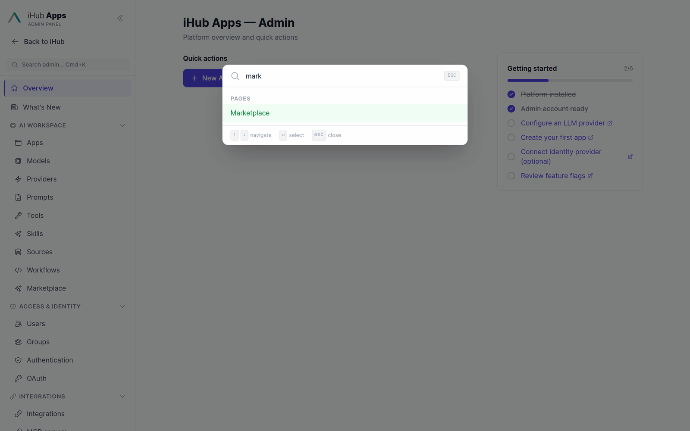

---

## Overview Dashboard

The dashboard (`/admin`) gives a real-time snapshot of your platform.


**Stat cards:**
- **Apps** — total configured apps
- **Users** — registered users (with active sessions in the last 30 days shown as subtitle)
- **Conversations** — total chat sessions recorded
- **Version** — current iHub Apps version; shows an update badge if a newer version is available

**Platform status panel:** Shows enabled/total counts for providers, models, sources, and tools, plus active authentication methods, OAuth server status, and the free space on the fullest disk iHub writes to.

**Low-disk banner:** When that disk is 80 % full or more, a banner at the top of every admin page (not only the dashboard) says so and links to [System Resources](#system-resources). See [Low-disk warnings](#low-disk-warnings).

**Quick actions:** One-click shortcuts to the most common admin tasks.

**Setup checklist:** Shown on fresh installations to guide initial configuration. Disappears once the checklist steps are complete.

---

## What's New

**What's New** (`/admin/changelog`) is the in-product changelog. It lists every release that shipped something worth noting, newest first, and shows one release at a time.

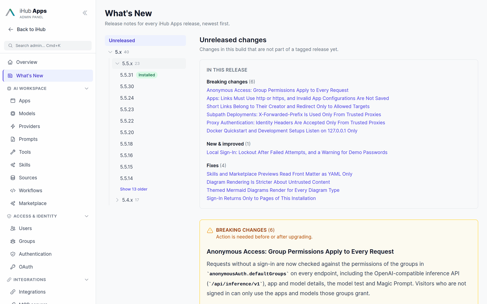

- **Release list** (left): a tree — `5.x` holds `5.5.x` holds the releases — because an installation that has been running a while has more releases than a flat list can show. Only the groups worth opening start open: the one holding the release on screen and the one holding the installed release. Every other group stays shut behind a header that carries how many releases it holds and how many of them are new, so an upgrade spanning two series does not unfold into the long list the tree replaces. A series longer than ten releases lists the newest ten and offers the rest behind **Show N older**. The release you are running is marked **Installed**. Builds from the main branch additionally list **Unreleased** — changes that are not part of a tagged release yet.
- **New since the upgrade**: iHub records which version it was running before the one it runs now, so every release an upgrade spanned is marked **New** — jump from 5.4.3 to 5.5.1 and all six releases in between are flagged, not just the one installed. A banner above the list names the jump. A fresh installation has nothing to compare against and shows no banner and no badges. The record lives in `contents/data/installed-version.json` and is written once per start.
- **In this release**: a table of contents linking to every entry, grouped into **Breaking changes**, **New & improved** and **Fixes** — in that order, so what needs action comes first. Each section ends with a link back to the contents.
- **Entries** are full Markdown: nested and numbered lists, quoted error messages, tables, links and code blocks (with copy and download buttons).

The content comes from `docs/releases/` in the repository and ships with every build; see [Release Process](release-process.md) for how entries get from `next/` to a numbered release.

---

## Managing Apps

Apps are the AI-powered tools your users interact with. Each app has its own system prompt, model preference, variables, and permissions.

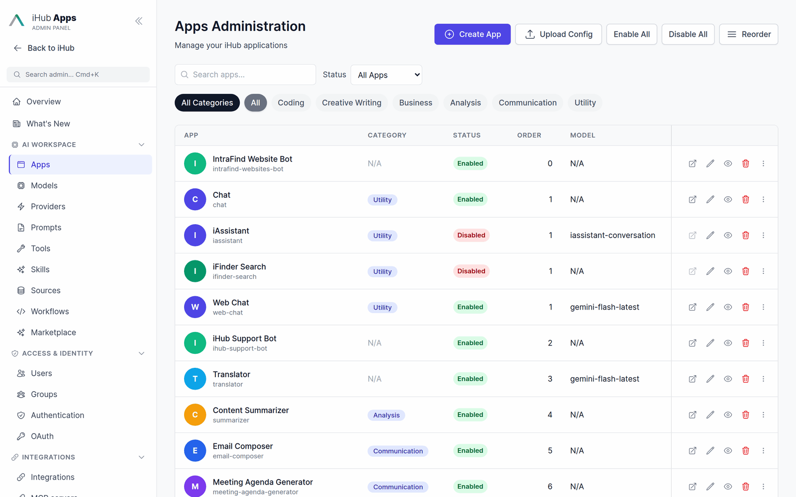

**To create an app:** Go to **AI Workspace → Apps** and click **Create App**. You can start from a blank form, use a template, upload a JSON file, or install one from the [Marketplace](#marketplace).

**To edit an app:** Click the app name in the list, or use `Cmd+K` to search for it directly.

**Key fields:**
- **ID** — unique identifier, used in URLs. Cannot be changed after creation.
- **Name / Description** — localized; enter values for each language you support.
- **System prompt** — the instruction given to the AI model before the user's message.
- **Preferred model** — override the platform default for this app; optionally restrict the selectable models or hide the model selector. Token limits come from the model (context window and output limit), not from the app.
- **Variables** — user-facing input fields (text, date, select, etc.), shown beside the chat or as a start form (see below).
- **Tools, sources, skills, workflows** — what the app may use beyond the model.
- **Upload, transcription, web search, image generation** — per-app features users switch on in the chat input's **+** menu.
- **Permissions** — which groups can access this app. The **Group access** card on the edit page shows the groups that already have access as chips, with a search box to grant more; every change saves immediately; see [Managing Groups](#managing-groups).

**Start chats with a form:** In the **Variables** section, tick **Start chats with a form** to open every new chat with a form of the app's variables, a message field and — when uploads are on — a drop zone. **Send button label** sets the button text per language (default: **Start**). Sending the form fills the prompt template once and sends it as the first message; the conversation then continues without the template. See [App Configuration](apps.md).

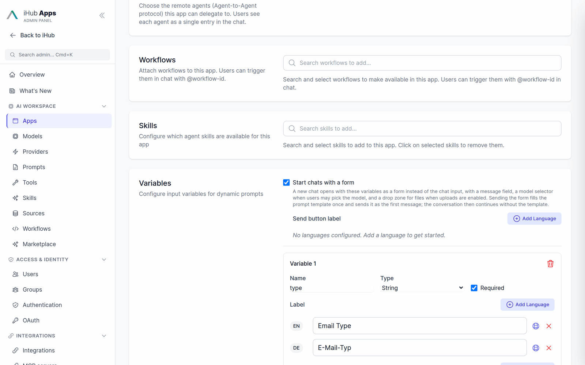

**Enabling/disabling:** Use the toggle in the app list or the Enabled field on the edit page.

**Saving:** **Save** (or `Cmd+S` / `Ctrl+S`) stores the app and keeps you in the editor, so you can
keep tweaking it. **Save & Exit** stores it and returns to the app list. Saving a new app with
**Save** moves the editor to the app's own address (`/admin/apps/<id>`); from then on History,
Download, Open app and Test are available.

**Opening an app:** **Open app** in the editor header, or the open icon in the app list, opens the
app's chat page in a new tab. Disabled apps are not served to the chat, so for them the button is
greyed out until the app is enabled (in the editor: enabled and saved).

**Testing an app:** **Test** in the editor header opens the app's chat next to the editor (full
screen on small screens), so you can check the start screen, send messages and see how the prompt,
model, tools and sources behave without leaving the editor. It is the same chat users get, not a
separate preview.

- The test runs the **saved** version of the app. While you have unsaved changes the panel says so;
  every save restarts the test with the new version.
- Each start is a new chat that begins from the app's own defaults (model, settings, variables), as
  a new user would see it. What you last chose on the app's own page is neither used nor changed.
  **Restart** (the circular arrow) starts over without saving.
- Test chats are ordinary chats of your own account, stored and counted like any other chat you
  have with the app.
- Changes are live for users as soon as you save, so test risky changes on a cloned app.
- The test is available for chat apps. For iframe and redirect apps, use **Open app**.
- Canvas and "open in app" links from the test open in a new tab, so the editor stays where it is.

**Change history:** Every edit page has a **History** button. Click it to see a before/after diff of every saved change, including who made the change and when.

---

## Managing Models

Models define which AI providers and specific model versions are available on your platform.

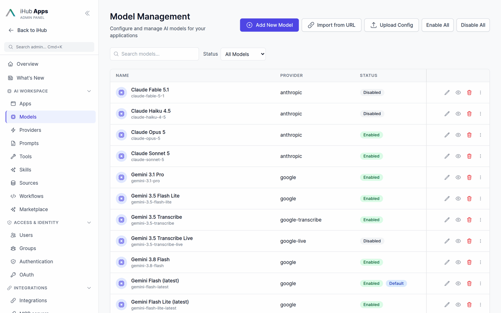

**To add a model:** Go to **AI Workspace → Models** and click **Add New Model**, upload a JSON file, install one from the [Marketplace](#marketplace), or use **Import from URL**.

**Key fields:**
- **Model type** — **Chat** (the default), **Transcription** (speech-to-text for recordings and uploads) or **Text-to-Speech** (read aloud). Only chat models appear in the chat's model selector.
- **Provider** — the API the model speaks: OpenAI, OpenAI Responses, Anthropic, Google, Mistral, AWS Bedrock, local/vLLM, iAssistant, a transcription provider, or one of your [custom LLM providers](#managing-providers).
- **Model ID** — the provider's model identifier (e.g. `gpt-5`, `claude-sonnet-5`, `gemini-flash-latest`).
- **Context window / max output tokens** — the limits apps and chats work with.
- **Capabilities** — tools, vision, thinking/reasoning, native web search, prompt caching, image generation.
- **Hints** — a hint, info, warning or alert shown to users who pick the model (see [Model Hints](models.md#model-hints)).

**Import from URL** reads an endpoint's model list — OpenAI, vLLM, LM Studio, LLM Hub and other OpenAI-compatible servers, Mistral, Anthropic or Google — and creates the models you pick. It asks which provider the models belong to and can create a new provider with its API key on the spot. See [Models → Importing Models from an Endpoint](models.md#importing-models-from-an-endpoint).

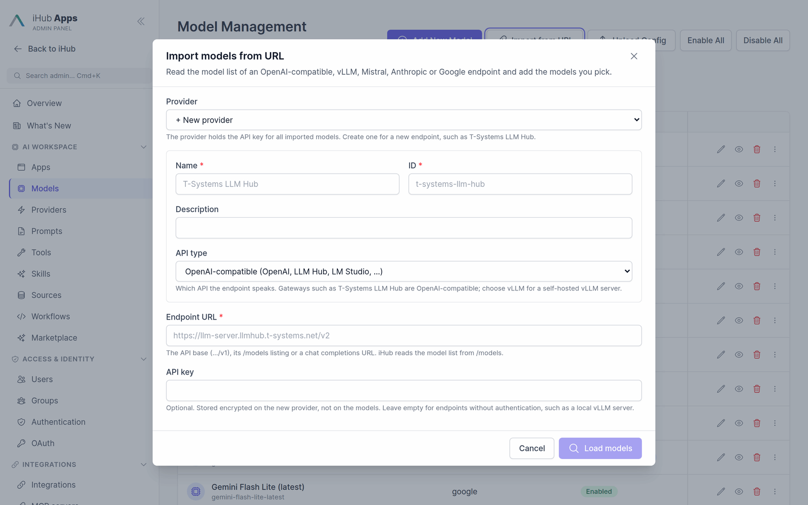

**Testing a model:** Use the **Test** button on the model list page to verify connectivity and authentication.

---

## Managing Providers

**AI Workspace → Providers** holds the connections: API keys for the LLM providers (OpenAI, Anthropic, Google, Mistral, local, AWS Bedrock), the web search providers (Brave, Staan, Qwant) and other integrations. A model without a key of its own uses its provider's key, then the provider's environment variable (e.g. `GOOGLE_API_KEY`). Keys are stored encrypted and shown masked; **Test All** checks every configured key.


**Create New Provider** adds an **LLM provider** for an endpoint of your own — for example a gateway such as T-Systems LLM Hub, or a self-hosted vLLM server. It has a name, an ID, the **API type** the endpoint speaks (OpenAI-compatible, vLLM, Mistral, …), an optional base URL and its API key. Its page lists the linked models and imports more; a provider that models still use cannot be deleted. See [Models → Custom LLM Providers](models.md#custom-llm-providers).

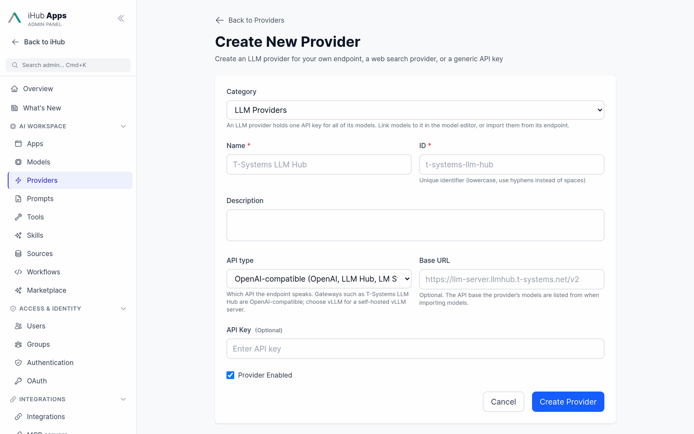

---

## Managing Prompts

Prompts are reusable system prompt templates that can be referenced by apps or used standalone.

Go to **AI Workspace → Prompts**. Prompts and Global Variables are organized as tabs.

**Global Variables** are key-value pairs injected into any system prompt that references `{{variableName}}`. They allow you to maintain shared values (company name, product names, URLs) in one place.

---

## Managing Users

Go to **Access & Identity → Users** to view, edit, and manage user accounts.

**Filtering:** Use the search box and filter dropdowns (auth method, group, status, last active) to find users. Filters are saved in the URL and persist across navigation.

**Editing a user:** Click the user's name to open their profile. You can change their groups, disable their account, and view their authentication methods and last active date.

**Bulk operations:** Select multiple users with the checkboxes to perform bulk actions (enable, disable, change group).

**Deleting a user:** Deleting a user ends their access immediately, whichever way they signed in, and then removes what they owned in the background:

- Always: personal API keys, OAuth connections, the credentials they stored for other systems (Office 365, Jira, Google Drive, Nextcloud, MCP servers) and their scheduled tasks.
- Also for now: their chats, prompts, skills and short links. Anything others reached through a shared prompt, skill or chat link goes with it.
- Kept: the audit log and usage statistics. When the clean-up finishes, the audit log gets a `cleanup` entry for the user, listing any part that could not be removed.

Deleting cannot be undone. To stop someone from signing in while keeping what they made, disable the account instead.

---

## Managing Groups

Groups control what users can access. Go to **Access & Identity → Groups**.

**Group inheritance:** Groups can inherit permissions from parent groups. For example, the built-in `users` group inherits from `authenticated`, which inherits from `anonymous`. A user's effective permissions are the union of their group's permissions and all inherited parent groups.

**Permissions:** Each group can be configured with:
- Which apps, prompts, and models are accessible
- Whether admin access is granted (`adminAccess: true`)
- External group mappings (for OIDC/LDAP — maps an external group name to this internal group)

**Group access from the content side:** Every app, prompt, skill, tool and workflow edit page has a **Group access** card showing the same permission lists per group, as a search-and-add list rather than a long list of every group: groups that already have access appear as chips, and a search box finds the rest by name — the same pattern used to add apps, models or prompts to a group elsewhere in the admin area. Picking a group in the search results adds the item to that group's list in `groups.json`; removing its chip takes it off. Each change is saved immediately and recorded in the change history and audit log like an edit of the group itself. A group that holds a wildcard (`"*"`) for the type is shown as a locked chip, because a single item cannot be withdrawn from a wildcard — replace the wildcard with an explicit list in the group editor instead.

**Content admins:** Members of a group with `contentAdmin: true` (the shipped `content-admins` group) can use the **Group access** card too, but only for the groups they belong to and for the groups that inherit from those. A content admin who is in `sales` can grant or withdraw content for `sales` and for every group with `sales` in its `inherits` chain, and sees no other groups. The `authenticated` and `anonymous` groups every user carries implicitly do not count as membership, so a content admin cannot publish to all users unless an administrator has explicitly made them a member of such a group. Everything else about a group — name, inheritance, models, external mappings, admin flags — stays with full administrators.

---

## Marketplace

**AI Workspace → Marketplace** installs apps, models, prompts, skills and workflows from registries with one click, and keeps track of what it installed so it can be updated, uninstalled or detached later. The **iHub Official Marketplace** and **iHub Examples** registries are preconfigured; **Manage Registries** adds your own. The marketplace is a preview feature — switch it on under **Platform → Features**.


See [Marketplace](marketplace.md) for statuses, updates, private registries and the catalog format.

---

## Features

**Platform → Features** switches platform features on and off — among them the preview features Agent Skills, Workflows, Marketplace, Integrations, Durable Chats (server-side chat history) and Scheduled Tasks, plus Prompt Library, Usage Tracking, Tools, Sources, Compare Mode, Chat Sharing, Short Links, Feedback and Export. The corresponding admin pages and user features appear or disappear with them.


---

## Scheduled Tasks

**Observability → Scheduled Tasks** shows whether the feature is running (feature flag, durable chats, platform switch), sets the limits — tasks per user, shortest interval, concurrent runs, catch-up window, approval timeout, retention — and lists every user's tasks with owner, schedule, status, last run and failures. Admins can pause, disable or delete a task and read its run history; a run always acts as its owner. Who may create tasks is the **Scheduled tasks** permission of a group.


See [Scheduled Tasks](scheduled-tasks.md).

---

## Voice Input

**Platform → Voice Input** configures speech for the whole platform:

- **Defaults** — the dictation service of the microphone button (Browser, Azure Speech or vLLM Realtime) and the transcription model for recordings and audio/video uploads. Apps follow the defaults unless they choose a service or model of their own.
- **vLLM Realtime** and **Azure Speech** — endpoints and keys, each with **Test connection**.
- **Read aloud (text-to-speech)** — the play button on chat messages and its model, with a test field.
- **Test voice input** — microphone check, live dictation and a record-and-transcribe test, run in your own browser against the saved configuration.

<p align="center">
  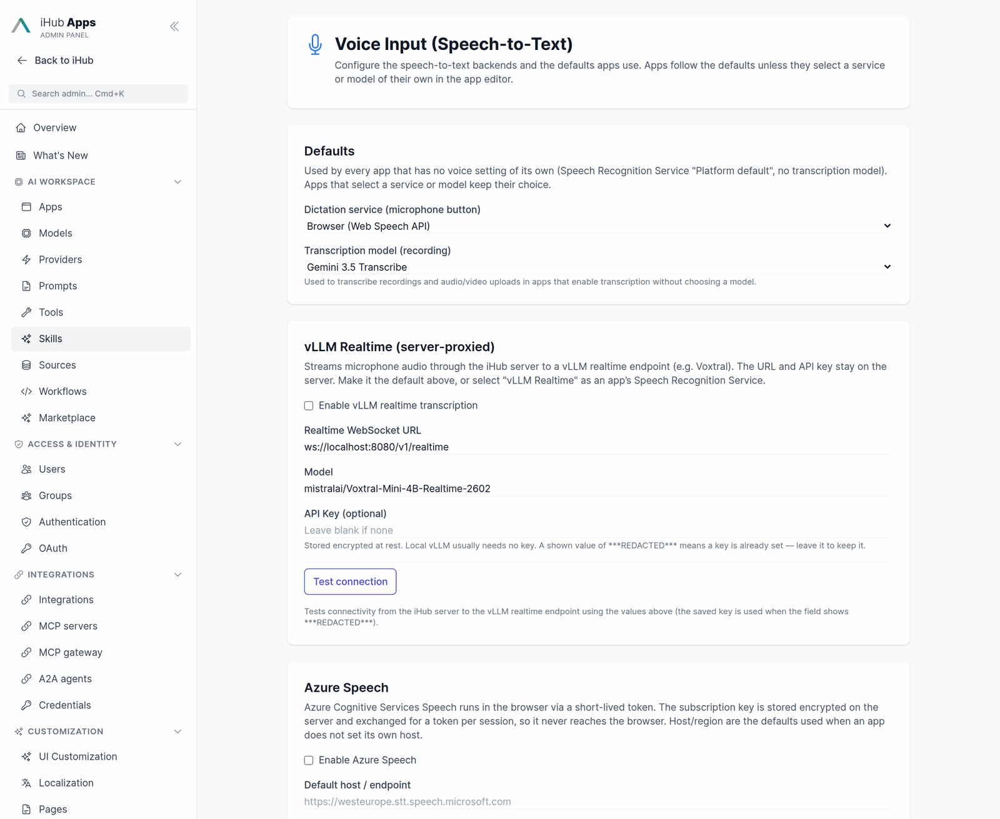
  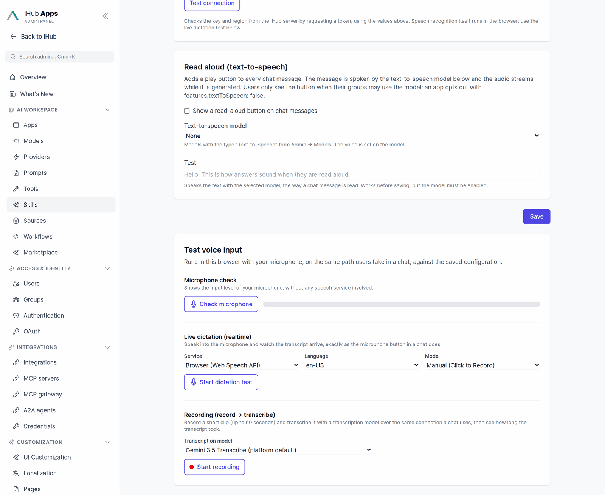
</p>

See [Realtime Voice & Transcription](voice-transcription.md) and [Read Aloud](text-to-speech.md).

---

## UI Customization

**Customization → UI Customization** edits the header, the **Start Page**, the footer, assets (logo, icons), styles, content, error pages and the PWA settings. On **Start Page** you choose what `/` opens, whether users are greeted by name, the heading and subtitle, the default app whose chat input appears on the start page, the featured apps and how many app shortcuts the start page and the sidebar show. See [UI Configuration → Start Page](ui.md#start-page-configuration).

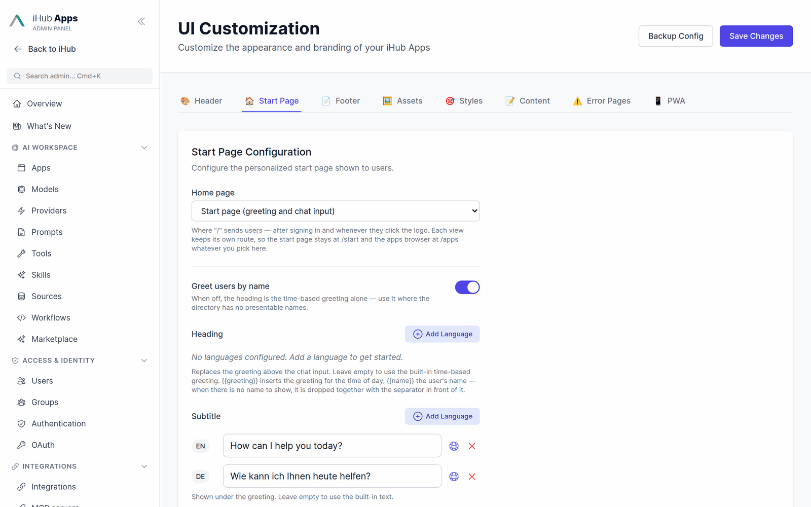

---

## Usage Reports

**Observability → Usage Reports** (`/admin/usage`) shows messages, tokens, feedback and magic-prompt
use, all-time on **Overview**, **Users**, **Applications** and **Details**, and per day or month on
**Timeline** (range 7 days to 12 months, from the hourly rollups — **Generate Report** refreshes
them on demand).

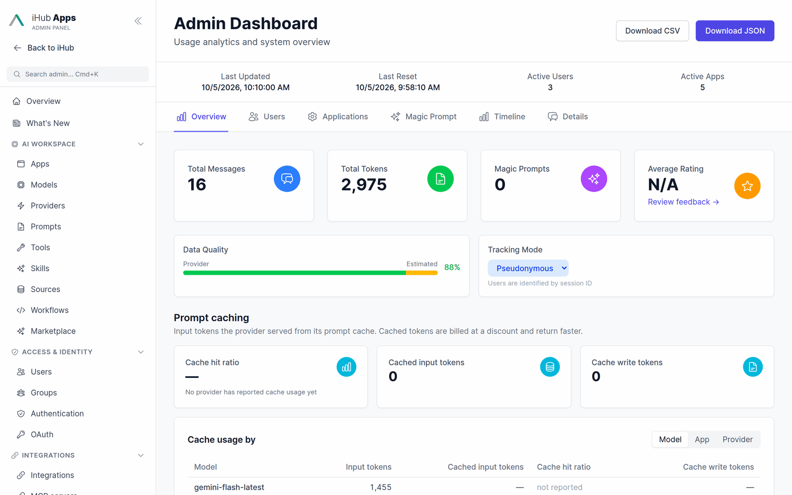

**How tokens are counted.** Prompt tokens are the whole input of a model call, including tokens the
provider served from its prompt cache; completion tokens are the whole output, including reasoning
("thinking") tokens. This holds for every provider, so numbers compare across models. The provider's
own counts are used whenever it reports them; a call that failed or was stopped before the provider
answered is counted with a local estimate. **Data Quality** shows the share of provider numbers.

### Prompt caching

Providers keep a cache of recently seen prompt prefixes (system prompt, tool definitions, the start
of the conversation). Input served from that cache is billed at a discount and answers faster.
Whether iHub marks prompts for the cache is a per-model switch in the model editor (**Prompt
Caching → Use prompt caching**; see [Models → Prompt Caching](models.md#prompt-caching)). The
**Prompt caching** panel on **Overview** shows:

- **Cache hit ratio** — cached input tokens divided by input tokens, counted over the models that
  report caching, so models without cache reporting don't dilute it.
- **Cached input tokens** — input served from the cache.
- **Cache write tokens** — input written to the cache. Anthropic and Bedrock charge extra for
  writes; when writes exceed reads, the tile turns amber, because caching then costs more than it
  saves.
- A breakdown **by model, app or provider**. "not reported" means the provider never reported
  cache usage for that row — it is not the same as 0 %.

**Timeline** adds a **Cached input tokens** card with the hit ratio for the range, a **Cached vs.
uncached input tokens** chart, cache columns in the app and model breakdowns, and a **Providers**
breakdown.

What each provider reports:

| Provider (adapter) | Cached input | Cache writes | Reasoning |
| --- | --- | --- | --- |
| Anthropic | yes | yes | — (included in output) |
| Bedrock (Converse) | yes | yes | — |
| OpenAI Chat Completions, OpenAI Responses | yes | — (automatic, no write charge) | yes |
| Google Gemini | yes | — | yes |
| vLLM / local OpenAI-compatible | when the server reports `prompt_tokens_details` | — | when reported |
| Mistral | when reported | — | — |
| iAssistant | no usage reported | — | — |

The provider breakdown and the cache counters cover usage recorded since the release that added
them; older data counts as uncached.

**Exports.** **Download CSV/JSON** export the all-time summary including the cache totals. The event
export (`GET /api/admin/usage/export?range=90d&format=csv`) has the columns `provider`,
`cacheReadTokens`, `cacheWriteTokens`, `reasoningTokens` and `webSearchRequests` after the existing
ones; a counter the provider did not report is left empty.

---

## System Resources

**Observability → System Resources** (`/admin/system-resources`) shows how much CPU, memory and disk space this installation uses. It is meant for single-host installations — one server or one container, with or without several workers. Deployments with several replicas should use [Telemetry & Observability](telemetry.md) instead, since each replica has its own disk.

The page refreshes every 15 seconds while it is open.

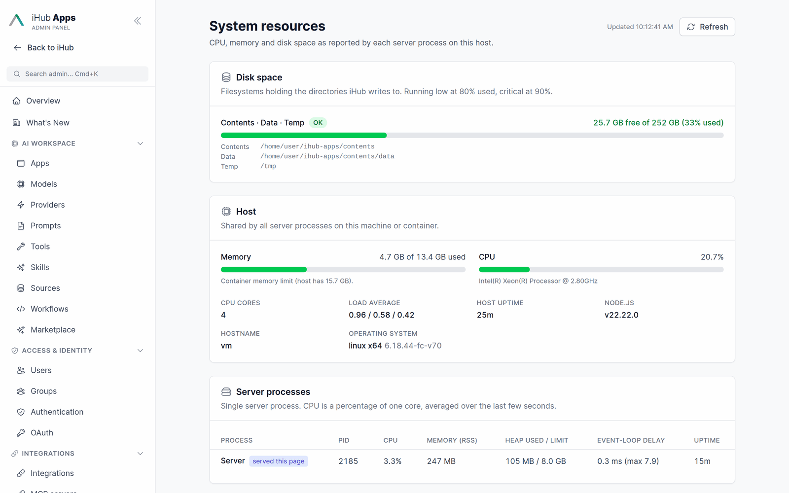

**Disk space.** One entry per filesystem that holds a directory iHub writes to: the contents directory, its `data` and `uploads` directories, the log directory (when file logging is on) and the operating system's temp directory. Directories on the same disk share one entry, which lists them. Each entry shows free and total space and a status:

| Status | When |
|--------|------|
| **OK** | less than 80 % used |
| **Running low** | 80 % used or more |
| **Critical** | 90 % used or more |

The percentage is computed like `df`: space reserved for the root user counts as neither used nor free.

**Host.** Memory used and total, CPU utilisation, core count, load average, uptime, operating system and Node.js version. Inside a container, memory is measured against the container's memory limit, and a container CPU limit (cgroup `cpu.max`) is shown next to the core count.

**Server processes.** One row per process:

- **Server** — the single process when `WORKERS=1`.
- **Primary** and **Worker 0 … N-1** — in cluster mode. The worker that answered the request is marked *served this page*; it asks the others over the cluster's internal message bus. A worker that does not answer within 1.5 seconds is shown as *did not respond* (restarting, stuck or overloaded).

For each process: CPU (percent of one core, averaged over the last five seconds), resident memory (RSS), V8 heap used and heap limit, event-loop delay (mean and maximum over the last five seconds) and uptime.

The page is hidden, together with the other system pages, when `admin.pages.system` is `false` in `platform.json`. The data comes from `GET /api/admin/system/resources` (admin only).

### Low-disk warnings

Nobody may open the admin UI for weeks on a small installation, so a full disk is reported in two more places:

- **Server log.** Every five minutes the server checks the same directories. When a disk crosses a threshold it logs one line from the `StorageMonitor` component: `warn` at 80 % used, `error` at 90 %. While the disk stays there, the line is repeated once an hour. When usage drops back below 80 %, an `info` line says so. Nothing is logged while disks are fine. In cluster mode only one process (worker 0) runs the check, so each event is logged once. Example:

  ```text
  [warn] [StorageMonitor] Disk space running low on the volume holding contents, data, uploads, temp: 3.1 GB free of 20.0 GB (84.5% used)
  ```

  JSON logs carry the numbers as fields (`status`, `usedPercent`, `availableBytes`, `totalBytes`, `paths`), so a log shipper can alert on `component = StorageMonitor` and `level >= warn`.

- **Admin banner.** Every admin page shows an amber (running low) or red (critical) banner above its content, re-checked every five minutes. **Dismiss** hides it for the browser session. A dismissed *running low* banner comes back if the disk turns critical. Content admins don't see it, and the System Resources page shows its own, more detailed alert instead. The banner reads `GET /api/admin/system/storage` (admin only).

---

## Audit Log

Go to **Observability → Audit Log** to see a complete record of all admin actions.

The date filter works in **whole days**: `from` and `to` select calendar days (UTC), and there is no
time-of-day cutoff. The default view covers today and yesterday — not a rolling 24 hours — so the
table is not near-empty just after midnight. Widen or narrow it with the date inputs or the
quick-filter chips.

### Filtering

Actor, resource, action, result and source are **checkbox lists**. Open one and you get every value that actually occurs in the selected date range, each with the number of entries behind it — so when logins dominate the log you can see `login — 794` and untick exactly that. **Select all** and **Select none** are one click each, and lists longer than ten values get a type-ahead box.

The option lists come from the log itself, not from a fixed vocabulary, so resource types added by a new release (or derived from a request path) show up on their own. Counts and options are computed over the **date range only** — unticking a value never makes its checkbox disappear.

**Free-text search:** the search box matches the summary, resource ID, IP, request ID and actor name of every entry in the date range. It is a plain substring match, case-insensitive.

**Quick filters:** one-click chips for **Today** / **Today & yesterday** / **Last 7 days** / **Last 30 days**, **Hide sign-ins** (drops `login` and `logout`), and **Failures only**. **Clear all filters** appears whenever any filter is active.

**Long summaries:** the summary cell has a show-more/show-less toggle. There is no row-level detail view — the full record is available through the CSV export, which always reflects the filters currently on screen.

### URL-persisted filters

All filter state lives in the URL, so a filtered view can be bookmarked or shared. Each field has two parameters: the include set and an `Exclude` set subtracted from it. `*` means "every value".

| URL | Result |
| --- | --- |
| *(no parameter)* | everything — the default |
| `?action=create,update` | only those two |
| `?actionExclude=login,logout` | everything except those two |
| `?actionExclude=*` | nothing — the "select none" state |
| `?action=*&actionExclude=login` | everything except login |
| `?resource=app&resourceExclude=app` | nothing — exclusion wins on a value in both sets |

The checkbox lists write the **exclusion** form for a partial selection, so a value introduced by a later release stays visible in a bookmarked view instead of being silently filtered out. The inclusion form keeps working for links you already have and for anyone pinning an exact set by hand.

`resource`, `action`, `result` and `source` accept comma-separated (`?action=a,b`) and repeated (`?action=a&action=b`) parameters alike. `actor` accepts repeated parameters only and is never split on commas, because a username can legitimately contain one (`Doe, John`).

---

## Change History

Every entity edit page (apps, models, prompts, sources, tools, providers, groups, users) has a **History** button in the page header.

Opening the history drawer shows:
- A list of every saved change, with timestamp and the admin who made it
- A before/after diff for each change — only the fields that changed are shown
- Both form edits and raw JSON editor changes are recorded

---

## Unsaved Changes

If you navigate away from an edit page with unsaved changes, a confirmation dialog will appear asking if you want to leave or stay. This prevents accidental data loss.

The warning also appears if you try to close or refresh the browser tab while a form is dirty.

---

## Backup & Restore

Go to **Platform → Backup & Restore** to export and import the full platform configuration.

**Export:** Downloads a ZIP file containing all configuration JSON files from `contents/`. The filename includes the current timestamp.

**Import:** Upload a previously exported ZIP. The current configuration is automatically backed up before the import is applied. After import, the server applies any pending configuration migrations automatically.

---

## Security Settings

Go to **Platform → Security** to manage:
- **SSL certificates** — upload a custom TLS certificate and key
- **CORS** — configure allowed origins for cross-origin API requests
- **Cookie settings** — SameSite policy, Secure flag, and session expiry
- **Value encryption** — encrypt a plaintext secret for use in configuration files

---

## Updates

Go to **Platform → Updates** to:
- See the current installed version
- Check for available updates
- Apply an update (binary installations only)
- Roll back to the previous version if needed

---

## Keyboard Shortcut Reference

| Shortcut | Action |
|----------|--------|
| `g` `a` | Go to Apps |
| `g` `m` | Go to Models |
| `g` `p` | Go to Prompts |
| `g` `u` | Go to Users |
| `g` `g` | Go to Groups |
| `g` `s` | Go to Sources |
| `g` `l` | Go to Audit Log |
| `n` | New item on current list page |
| `?` | Show shortcut cheatsheet |
| `Cmd+K` / `Ctrl+K` | Open command palette |
| `Cmd+S` / `Ctrl+S` | Save (in the app editor) |
