# iHub Apps - Technical Architecture

iHub Apps is an enterprise-grade platform for creating, managing, and deploying AI-powered applications. This document provides comprehensive technical details of the system architecture, components, and data flow patterns.

## Table of Contents

1. [High-Level Architecture Overview](#high-level-architecture-overview)
2. [Server Architecture](#server-architecture)
3. [Client Architecture](#client-architecture)
4. [Source Handlers System](#source-handlers-system)
5. [Authentication & Authorization](#authentication--authorization)
6. [Configuration Management](#configuration-management)
7. [Request/Response Flow](#requestresponse-flow)
8. [Component Interactions](#component-interactions)
9. [Security Architecture](#security-architecture)
10. [Performance & Scalability](#performance--scalability)

## High-Level Architecture Overview

The system follows a modern three-tier architecture with clear separation of concerns:

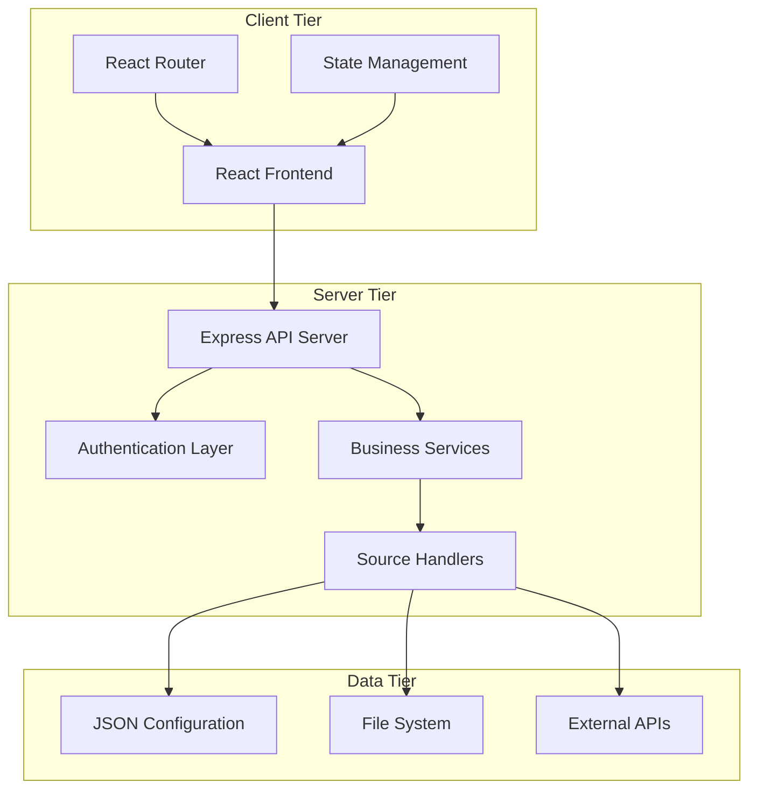
```mermaid
graph TB
    subgraph "Client Tier"
        UI[React Frontend]
        Router[React Router]
        State[State Management]
    end
    
    subgraph "Server Tier"
        API[Express API Server]
        Auth[Authentication Layer]
        Services[Business Services]
        Sources[Source Handlers]
    end
    
    subgraph "Data Tier"
        Config[JSON Configuration]
        FileSystem[File System]
        External[External APIs]
    end
    
    UI --> API
    Router --> UI
    State --> UI
    API --> Auth
    API --> Services
    Services --> Sources
    Sources --> Config
    Sources --> FileSystem
    Sources --> External
```

### Core Components

- **Frontend (`/client`)**: React SPA with Vite build system and Tailwind CSS
- **Backend (`/server`)**: Node.js Express server with clustering support
- **Configuration (`/contents`)**: JSON-based configuration files for apps, models, and settings
- **Shared (`/shared`)**: Common utilities and internationalization resources

## Client Architecture

The client is built as a modern React Single Page Application (SPA) using feature-based organization:

### Directory Structure

```
client/src/
├── features/           # Feature modules with domain-specific logic
│   ├── apps/          # AI application management
│   ├── auth/          # Authentication UI components
│   ├── chat/          # Chat interface and messaging
│   ├── admin/         # Administrative interfaces
│   ├── canvas/        # Rich text editing canvas
│   ├── upload/        # File upload functionality
│   └── voice/         # Voice input components
├── shared/            # Shared components and utilities
│   ├── components/    # Reusable UI components
│   ├── contexts/      # React Context providers
│   └── hooks/         # Custom React hooks
├── pages/             # Page components and routing
├── api/               # API client and request handling
└── utils/             # Client-side utilities
```

### Feature-Based Architecture

Each feature module follows a consistent structure:

- **`components/`**: UI components specific to the feature
- **`pages/`**: Top-level page components for routing
- **`hooks/`**: Feature-specific custom hooks
- **`index.js`**: Public API exports for the feature

### State Management

The application uses React Context API for global state management:

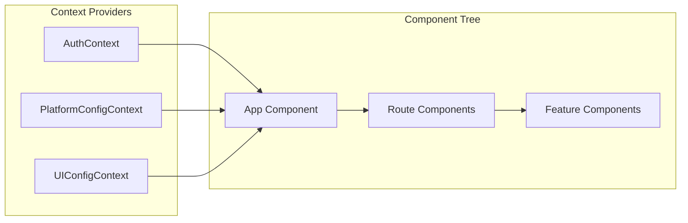
```mermaid
graph LR
    subgraph "Context Providers"
        Auth[AuthContext]
        Platform[PlatformConfigContext]
        UI[UIConfigContext]
    end
    
    subgraph "Component Tree"
        App[App Component]
        Routes[Route Components]
        Features[Feature Components]
    end
    
    Auth --> App
    Platform --> App
    UI --> App
    App --> Routes
    Routes --> Features
```

#### Key Contexts

- **`AuthContext`**: User authentication state, permissions, login/logout
- **`PlatformConfigContext`**: Server configuration, feature flags, system settings
- **`UIConfigContext`**: UI customization, themes, localization settings

### Dynamic Content Rendering

The system supports dynamic React component rendering through:

- **`UnifiedPage.jsx`**: Main page component handling both markdown and React content
- **`ReactComponentRenderer.jsx`**: JSX compilation and rendering using Babel Standalone
- **Auto-detection**: Identifies content type based on JSX patterns

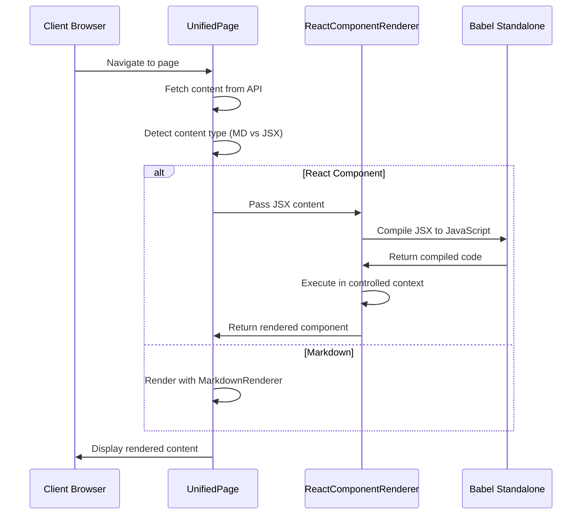
```mermaid
sequenceDiagram
    participant Client as Client Browser
    participant UP as UnifiedPage
    participant RCR as ReactComponentRenderer
    participant Babel as Babel Standalone
    
    Client->>UP: Navigate to page
    UP->>UP: Fetch content from API
    UP->>UP: Detect content type (MD vs JSX)
    alt React Component
        UP->>RCR: Pass JSX content
        RCR->>Babel: Compile JSX to JavaScript
        Babel->>RCR: Return compiled code
        RCR->>RCR: Execute in controlled context
        RCR->>UP: Return rendered component
    else Markdown
        UP->>UP: Render with MarkdownRenderer
    end
    UP->>Client: Display rendered content
```

## Server Architecture

The server is built on Node.js with Express.js and follows a layered architecture pattern:

### Core Architecture Layers

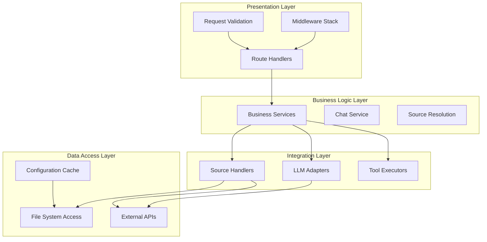
```mermaid
graph TB
    subgraph "Presentation Layer"
        Routes[Route Handlers]
        Middleware[Middleware Stack]
        Validation[Request Validation]
    end
    
    subgraph "Business Logic Layer"
        Services[Business Services]
        ChatService[Chat Service]
        SourceService[Source Resolution]
    end
    
    subgraph "Integration Layer"
        Adapters[LLM Adapters]
        Sources[Source Handlers]
        Tools[Tool Executors]
    end
    
    subgraph "Data Access Layer"
        ConfigCache[Configuration Cache]
        FileSystem[File System Access]
        External[External APIs]
    end
    
    Routes --> Services
    Middleware --> Routes
    Validation --> Routes
    Services --> Adapters
    Services --> Sources
    Services --> Tools
    Adapters --> External
    Sources --> FileSystem
    Sources --> External
    ConfigCache --> FileSystem
```

### Directory Structure

```
server/
├── routes/             # Route handlers organized by feature
│   ├── chat/          # Chat and messaging endpoints
│   ├── admin/         # Administrative API endpoints
│   └── auth.js        # Authentication endpoints
├── services/          # Business logic services
│   ├── chat/          # Chat service components
│   └── integrations/  # External service integrations
├── adapters/          # LLM provider adapters
│   └── toolCalling/   # Tool calling converters
├── sources/           # Source handler system
├── middleware/        # Express middleware
├── utils/             # Utility modules
├── validators/        # Zod schema validators
└── tools/            # LLM tool implementations
```

### Clustering and Process Management

The server supports horizontal scaling through Node.js clustering:

```javascript
const workerCount = config.WORKERS; // Configurable worker count

if (cluster.isPrimary && workerCount > 1) {
  // Primary process manages workers
  for (let i = 0; i < workerCount; i++) {
    cluster.fork();
  }
} else {
  // Worker processes handle requests
  startServer();
}
```

### Request Processing Pipeline

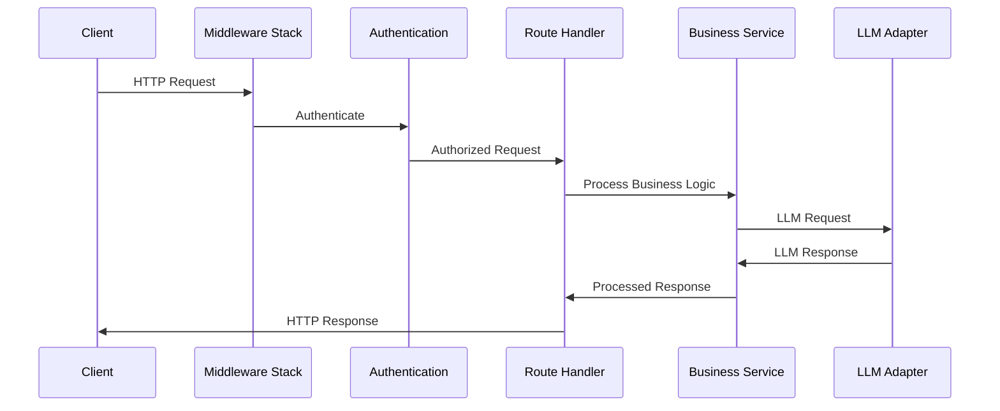
```mermaid
sequenceDiagram
    participant Client
    participant Middleware as Middleware Stack
    participant Auth as Authentication
    participant Route as Route Handler
    participant Service as Business Service
    participant Adapter as LLM Adapter
    
    Client->>Middleware: HTTP Request
    Middleware->>Auth: Authenticate
    Auth->>Route: Authorized Request
    Route->>Service: Process Business Logic
    Service->>Adapter: LLM Request
    Adapter->>Service: LLM Response
    Service->>Route: Processed Response
    Route->>Client: HTTP Response
```

### Chat Service Architecture

The chat functionality uses a modular, service-oriented architecture:

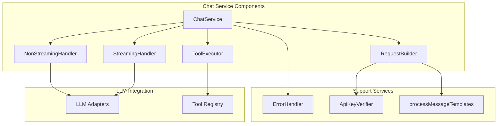
```mermaid
graph TB
    subgraph "Chat Service Components"
        CS[ChatService]
        RB[RequestBuilder]
        NSH[NonStreamingHandler]
        SH[StreamingHandler]
        TE[ToolExecutor]
    end
    
    subgraph "Support Services"
        EH[ErrorHandler]
        AKV[ApiKeyVerifier]
        PMT[processMessageTemplates]
    end
    
    subgraph "LLM Integration"
        Adapters[LLM Adapters]
        Tools[Tool Registry]
    end
    
    CS --> RB
    CS --> NSH
    CS --> SH
    CS --> TE
    CS --> EH
    RB --> AKV
    RB --> PMT
    TE --> Tools
    NSH --> Adapters
    SH --> Adapters
```

#### Component Responsibilities

- **`ChatService.js`**: Main orchestration class that coordinates chat requests
- **`RequestBuilder.js`**: Prepares and validates LLM requests with templates and variables
- **`NonStreamingHandler.js`**: Processes complete LLM responses in single requests
- **`StreamingHandler.js`**: Handles real-time streaming responses using Server-Sent Events
- **`ToolExecutor.js`**: Manages LLM tool calling and execution workflows
- **`ErrorHandler.js`**: Centralized error handling with custom error classes
- **`ApiKeyVerifier.js`**: Validates API keys for different LLM providers

#### Chat Request Flow

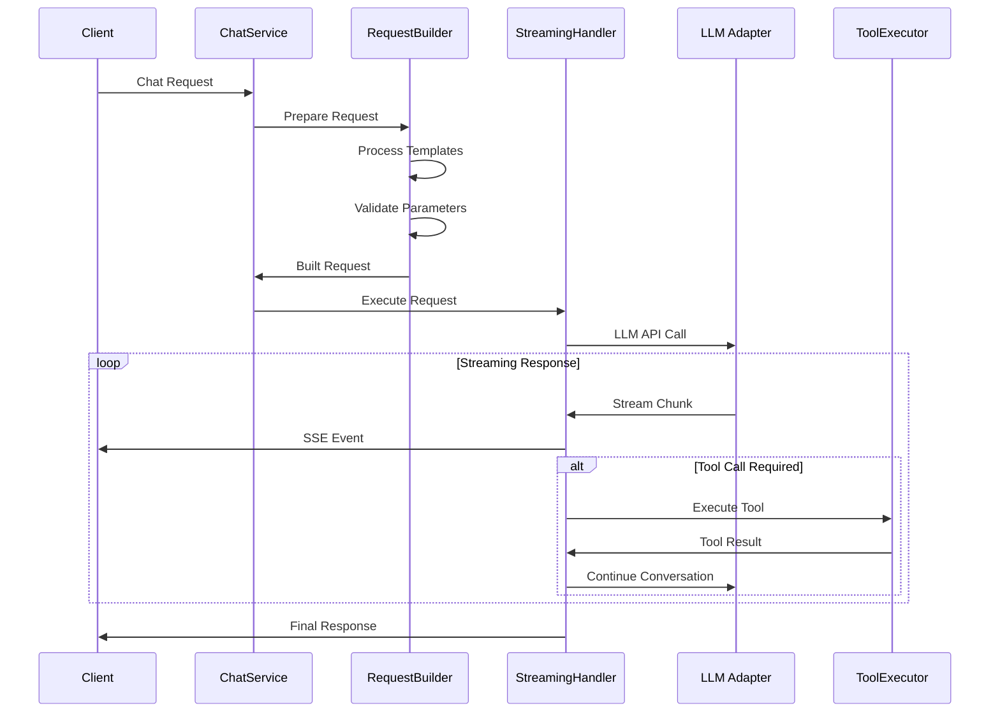
```mermaid
sequenceDiagram
    participant Client
    participant ChatService as ChatService
    participant RequestBuilder as RequestBuilder
    participant Handler as StreamingHandler
    participant Adapter as LLM Adapter
    participant ToolExecutor as ToolExecutor
    
    Client->>ChatService: Chat Request
    ChatService->>RequestBuilder: Prepare Request
    RequestBuilder->>RequestBuilder: Process Templates
    RequestBuilder->>RequestBuilder: Validate Parameters
    RequestBuilder->>ChatService: Built Request
    ChatService->>Handler: Execute Request
    Handler->>Adapter: LLM API Call
    
    loop Streaming Response
        Adapter->>Handler: Stream Chunk
        Handler->>Client: SSE Event
        
        alt Tool Call Required
            Handler->>ToolExecutor: Execute Tool
            ToolExecutor->>Handler: Tool Result
            Handler->>Adapter: Continue Conversation
        end
    end
    
    Handler->>Client: Final Response
```

## Source Handlers System

The Source Handlers system provides a unified interface for loading content from various sources:

### Architecture Overview

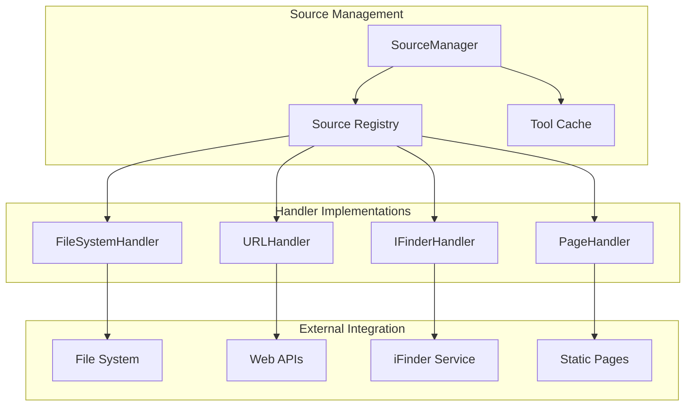
```mermaid
graph TB
    subgraph "Source Management"
        SM[SourceManager]
        SR[Source Registry]
        TC[Tool Cache]
    end
    
    subgraph "Handler Implementations"
        FS[FileSystemHandler]
        URL[URLHandler]
        IF[IFinderHandler]
        PH[PageHandler]
    end
    
    subgraph "External Integration"
        Files[File System]
        Web[Web APIs]
        iFinder[iFinder Service]
        Pages[Static Pages]
    end
    
    SM --> SR
    SM --> TC
    SR --> FS
    SR --> URL
    SR --> IF
    SR --> PH
    FS --> Files
    URL --> Web
    IF --> iFinder
    PH --> Pages
```

### Handler Implementations

#### FileSystemHandler
- **Purpose**: Load content from local file system
- **Supports**: Text files, JSON, Markdown
- **Caching**: File content caching with modification time tracking
- **Security**: Path traversal protection

#### URLHandler
- **Purpose**: Fetch content from web URLs
- **Features**: Web content extraction, fallback mechanisms
- **Integration**: Uses webContentExtractor tool for intelligent content parsing
- **Error Handling**: Graceful degradation when external tools unavailable

#### IFinderHandler
- **Purpose**: Integration with iFinder document management system
- **Authentication**: JWT-based authentication
- **Features**: Document search, content retrieval, metadata extraction
- **Caching**: Response caching with configurable TTL

#### PageHandler
- **Purpose**: Load static pages and dynamic React components
- **Supports**: Markdown files, JSX components
- **Features**: Multi-language support, dynamic compilation

### Source Resolution Process

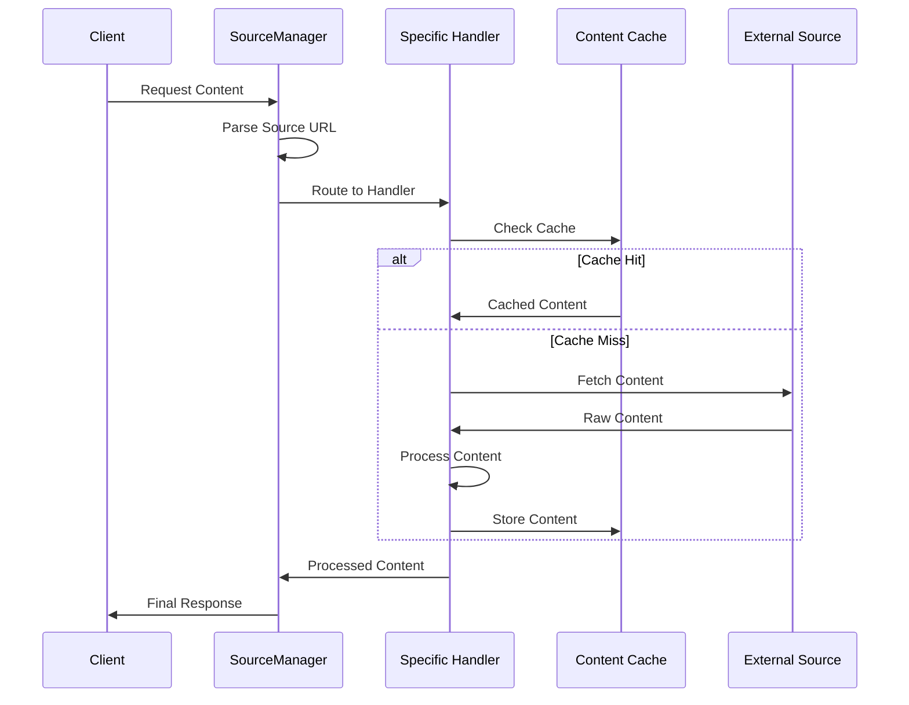
```mermaid
sequenceDiagram
    participant Client
    participant SourceManager as SourceManager
    participant Handler as Specific Handler
    participant Cache as Content Cache
    participant External as External Source
    
    Client->>SourceManager: Request Content
    SourceManager->>SourceManager: Parse Source URL
    SourceManager->>Handler: Route to Handler
    Handler->>Cache: Check Cache
    
    alt Cache Hit
        Cache->>Handler: Cached Content
    else Cache Miss
        Handler->>External: Fetch Content
        External->>Handler: Raw Content
        Handler->>Handler: Process Content
        Handler->>Cache: Store Content
    end
    
    Handler->>SourceManager: Processed Content
    SourceManager->>Client: Final Response
```

### Tool Integration

Source handlers generate LLM tools dynamically:

```javascript
// Example: URL Handler generates web search tool
const urlTool = {
  name: 'fetch_url_content',
  description: 'Fetch and extract content from a web URL',
  parameters: {
    type: 'object',
    properties: {
      url: { type: 'string', description: 'URL to fetch content from' }
    }
  }
};
```

## Authentication & Authorization

The system implements a flexible multi-mode authentication architecture supporting various enterprise scenarios:

### Authentication Modes

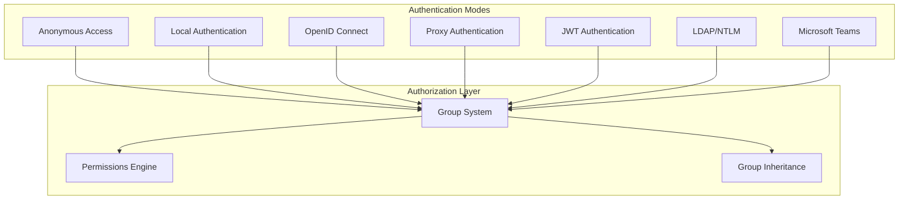
```mermaid
graph TB
    subgraph "Authentication Modes"
        Anonymous[Anonymous Access]
        Local[Local Authentication]
        OIDC[OpenID Connect]
        Proxy[Proxy Authentication]
        JWT[JWT Authentication]
        LDAP[LDAP/NTLM]
        Teams[Microsoft Teams]
    end
    
    subgraph "Authorization Layer"
        Groups[Group System]
        Permissions[Permissions Engine]
        Inheritance[Group Inheritance]
    end
    
    Anonymous --> Groups
    Local --> Groups
    OIDC --> Groups
    Proxy --> Groups
    JWT --> Groups
    LDAP --> Groups
    Teams --> Groups
    Groups --> Permissions
    Groups --> Inheritance
```

### Group Inheritance System

The authorization system supports hierarchical group inheritance:

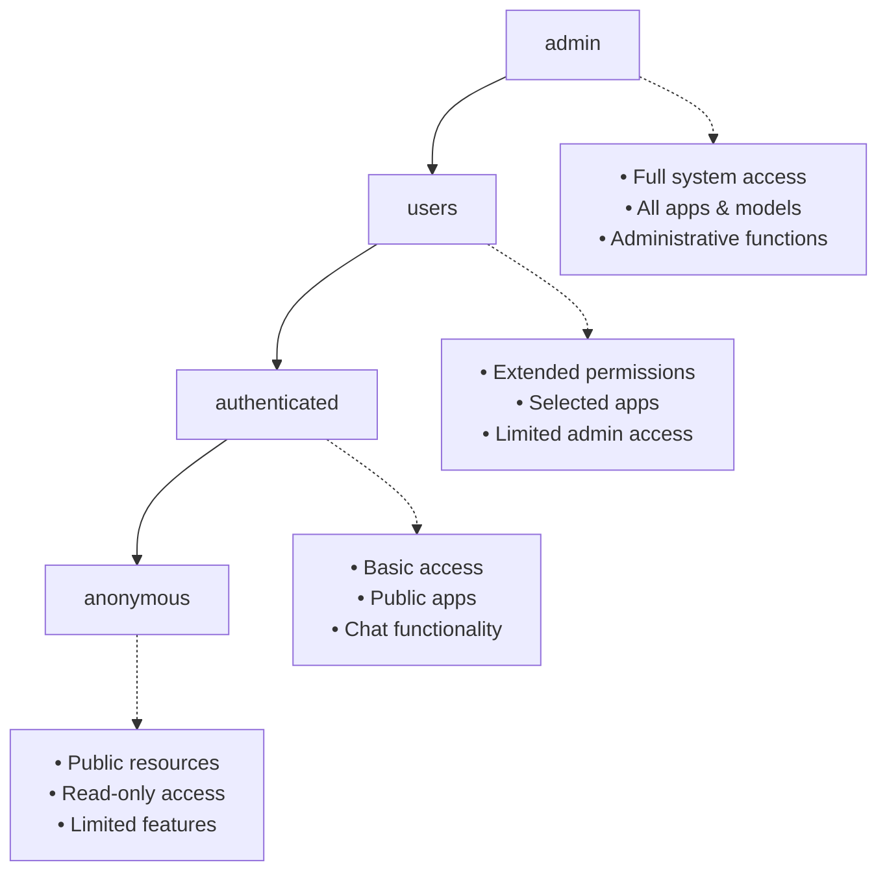
```mermaid
graph TD
    Admin[admin] --> Users[users]
    Users --> Authenticated[authenticated]
    Authenticated --> Anonymous[anonymous]
    
    Admin -.-> AdminPerms["• Full system access<br/>• All apps & models<br/>• Administrative functions"]
    Users -.-> UserPerms["• Extended permissions<br/>• Selected apps<br/>• Limited admin access"]
    Authenticated -.-> AuthPerms["• Basic access<br/>• Public apps<br/>• Chat functionality"]
    Anonymous -.-> AnonPerms["• Public resources<br/>• Read-only access<br/>• Limited features"]
```

#### Group Configuration Structure

```json
{
  "groups": {
    "admin": {
      "id": "admin",
      "name": "Administrators",
      "inherits": ["users"],
      "permissions": {
        "apps": ["*"],
        "models": ["*"],
        "adminAccess": true
      },
      "mappings": ["Admins", "IT-Team"]
    }
  }
}
```

### Authentication Flow

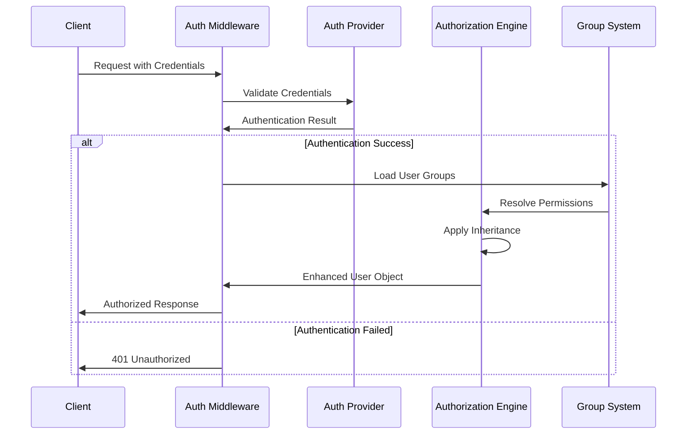
```mermaid
sequenceDiagram
    participant Client
    participant Middleware as Auth Middleware
    participant Provider as Auth Provider
    participant Authorization as Authorization Engine
    participant Groups as Group System
    
    Client->>Middleware: Request with Credentials
    Middleware->>Provider: Validate Credentials
    Provider->>Middleware: Authentication Result
    
    alt Authentication Success
        Middleware->>Groups: Load User Groups
        Groups->>Authorization: Resolve Permissions
        Authorization->>Authorization: Apply Inheritance
        Authorization->>Middleware: Enhanced User Object
        Middleware->>Client: Authorized Response
    else Authentication Failed
        Middleware->>Client: 401 Unauthorized
    end
```

### Permission Resolution Process

1. **Group Loading**: Load user's assigned groups from configuration
2. **Inheritance Resolution**: Resolve parent group permissions recursively
3. **Permission Merging**: Combine permissions from all inherited groups
4. **Resource Filtering**: Filter available resources based on merged permissions
5. **Caching**: Cache resolved permissions for performance

## Configuration Management

The system uses a sophisticated configuration management system with caching and validation:

### Configuration Architecture

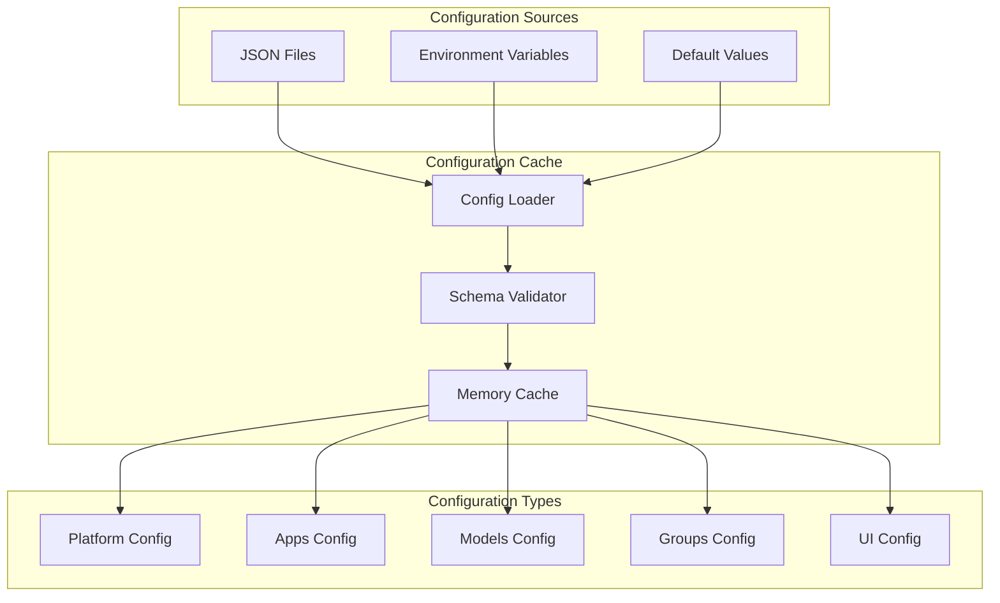
```mermaid
graph TB
    subgraph "Configuration Sources"
        JSON[JSON Files]
        ENV[Environment Variables]
        Defaults[Default Values]
    end
    
    subgraph "Configuration Cache"
        Loader[Config Loader]
        Cache[Memory Cache]
        Validator[Schema Validator]
    end
    
    subgraph "Configuration Types"
        Platform[Platform Config]
        Apps[Apps Config]
        Models[Models Config]
        Groups[Groups Config]
        UI[UI Config]
    end
    
    JSON --> Loader
    ENV --> Loader
    Defaults --> Loader
    Loader --> Validator
    Validator --> Cache
    Cache --> Platform
    Cache --> Apps
    Cache --> Models
    Cache --> Groups
    Cache --> UI
```

### Configuration Loading Process

```javascript
// Configuration loading with validation and caching
class ConfigCache {
  async loadConfiguration(type) {
    // 1. Check memory cache
    if (this.cache.has(type)) {
      return this.cache.get(type);
    }
    
    // 2. Load from file system
    const config = await this.loadFromFile(type);
    
    // 3. Resolve environment variables
    const resolved = this.resolveEnvVars(config);
    
    // 4. Validate against schema
    const validated = await this.validateConfig(type, resolved);
    
    // 5. Apply post-processing (e.g., group inheritance)
    const processed = await this.postProcessConfig(type, validated);
    
    // 6. Cache result
    this.cache.set(type, processed);
    
    return processed;
  }
}
```

### Schema Validation

All configurations use Zod schemas for runtime validation:

```javascript
// Example: App configuration schema
const AppConfigSchema = z.object({
  id: z.string(),
  name: z.record(z.string(), z.string()),
  description: z.record(z.string(), z.string()),
  system: z.record(z.string(), z.string()),
  tokenLimit: z.number().positive(),
  variables: z.array(VariableSchema).optional(),
  permissions: z.array(z.string()).optional()
});
```

## Request/Response Flow

### Complete Request Processing Pipeline

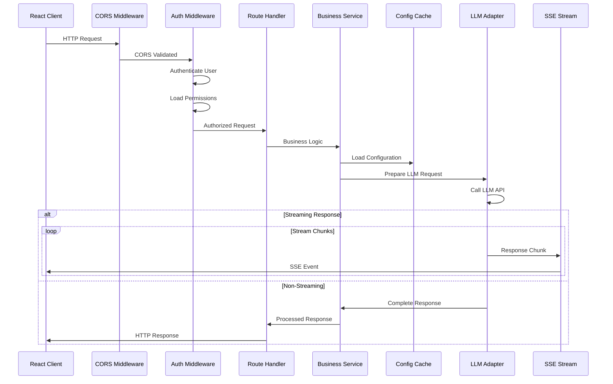
```mermaid
sequenceDiagram
    participant Client as React Client
    participant CORS as CORS Middleware
    participant Auth as Auth Middleware
    participant Route as Route Handler
    participant Service as Business Service
    participant Cache as Config Cache
    participant Adapter as LLM Adapter
    participant Stream as SSE Stream
    
    Client->>CORS: HTTP Request
    CORS->>Auth: CORS Validated
    Auth->>Auth: Authenticate User
    Auth->>Auth: Load Permissions
    Auth->>Route: Authorized Request
    Route->>Service: Business Logic
    Service->>Cache: Load Configuration
    Service->>Adapter: Prepare LLM Request
    Adapter->>Adapter: Call LLM API
    
    alt Streaming Response
        loop Stream Chunks
            Adapter->>Stream: Response Chunk
            Stream->>Client: SSE Event
        end
    else Non-Streaming
        Adapter->>Service: Complete Response
        Service->>Route: Processed Response
        Route->>Client: HTTP Response
    end
```

### Error Handling Flow

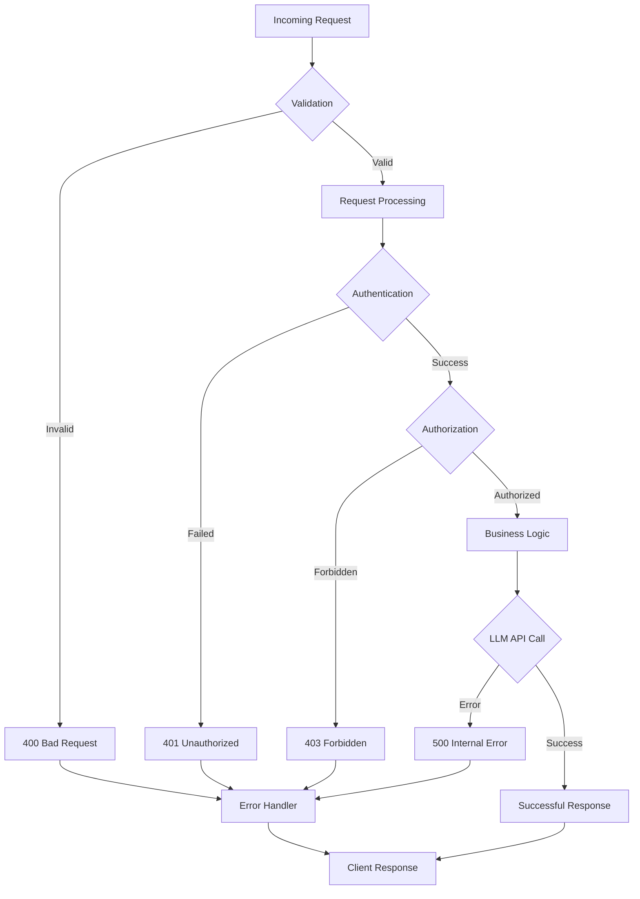
```mermaid
graph TB
    Request[Incoming Request] --> Validation{Validation}
    Validation -->|Valid| Processing[Request Processing]
    Validation -->|Invalid| ValidationError[400 Bad Request]
    
    Processing --> Authentication{Authentication}
    Authentication -->|Success| Authorization{Authorization}
    Authentication -->|Failed| AuthError[401 Unauthorized]
    
    Authorization -->|Authorized| BusinessLogic[Business Logic]
    Authorization -->|Forbidden| PermissionError[403 Forbidden]
    
    BusinessLogic --> LLMCall{LLM API Call}
    LLMCall -->|Success| Response[Successful Response]
    LLMCall -->|Error| LLMError[500 Internal Error]
    
    ValidationError --> ErrorHandler[Error Handler]
    AuthError --> ErrorHandler
    PermissionError --> ErrorHandler
    LLMError --> ErrorHandler
    
    ErrorHandler --> Client[Client Response]
    Response --> Client
```

## Component Interactions

### System Component Dependencies

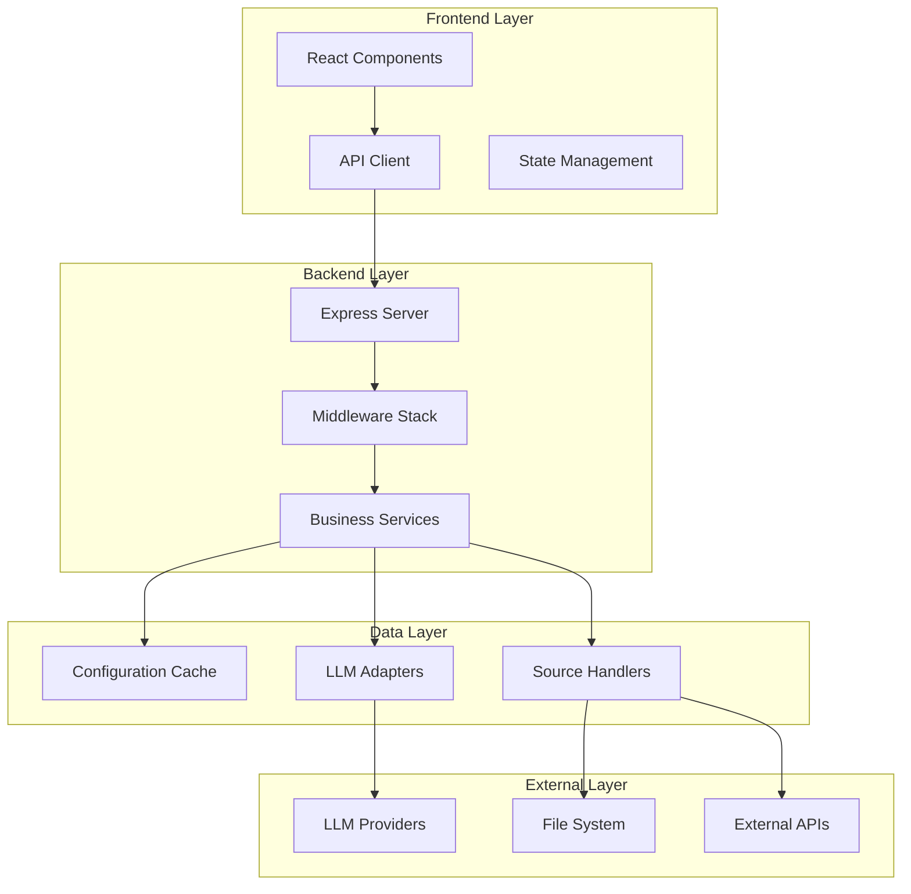
```mermaid
graph TB
    subgraph "Frontend Layer"
        React[React Components]
        API[API Client]
        State[State Management]
    end
    
    subgraph "Backend Layer"
        Express[Express Server]
        Middleware[Middleware Stack]
        Services[Business Services]
    end
    
    subgraph "Data Layer"
        ConfigCache[Configuration Cache]
        Sources[Source Handlers]
        Adapters[LLM Adapters]
    end
    
    subgraph "External Layer"
        LLMs[LLM Providers]
        Files[File System]
        External[External APIs]
    end
    
    React --> API
    API --> Express
    Express --> Middleware
    Middleware --> Services
    Services --> ConfigCache
    Services --> Sources
    Services --> Adapters
    Sources --> Files
    Adapters --> LLMs
    Sources --> External
```

### Inter-Service Communication

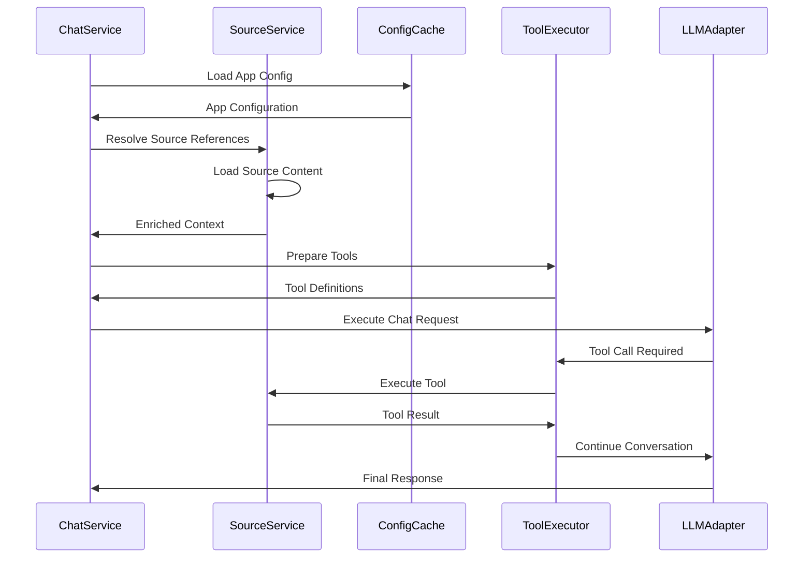
```mermaid
sequenceDiagram
    participant ChatService
    participant SourceService
    participant ConfigCache
    participant ToolExecutor
    participant LLMAdapter
    
    ChatService->>ConfigCache: Load App Config
    ConfigCache->>ChatService: App Configuration
    ChatService->>SourceService: Resolve Source References
    SourceService->>SourceService: Load Source Content
    SourceService->>ChatService: Enriched Context
    ChatService->>ToolExecutor: Prepare Tools
    ToolExecutor->>ChatService: Tool Definitions
    ChatService->>LLMAdapter: Execute Chat Request
    LLMAdapter->>ToolExecutor: Tool Call Required
    ToolExecutor->>SourceService: Execute Tool
    SourceService->>ToolExecutor: Tool Result
    ToolExecutor->>LLMAdapter: Continue Conversation
    LLMAdapter->>ChatService: Final Response
```

## Security Architecture

### Security Layers

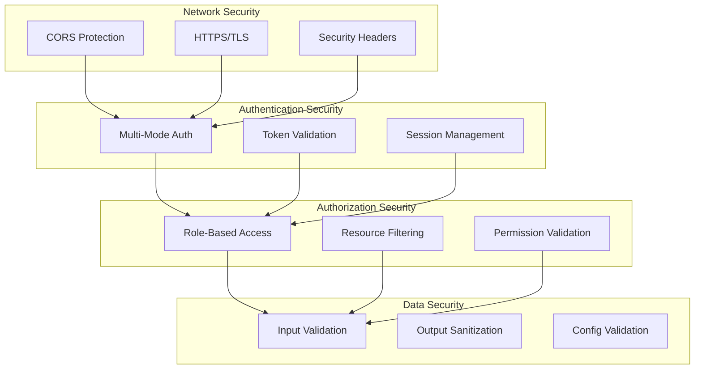
```mermaid
graph TB
    subgraph "Network Security"
        CORS[CORS Protection]
        HTTPS[HTTPS/TLS]
        Headers[Security Headers]
    end
    
    subgraph "Authentication Security"
        MultiAuth[Multi-Mode Auth]
        TokenValidation[Token Validation]
        SessionManagement[Session Management]
    end
    
    subgraph "Authorization Security"
        RBAC[Role-Based Access]
        ResourceFiltering[Resource Filtering]
        PermissionValidation[Permission Validation]
    end
    
    subgraph "Data Security"
        InputValidation[Input Validation]
        OutputSanitization[Output Sanitization]
        ConfigValidation[Config Validation]
    end
    
    CORS --> MultiAuth
    HTTPS --> MultiAuth
    Headers --> MultiAuth
    MultiAuth --> RBAC
    TokenValidation --> RBAC
    SessionManagement --> RBAC
    RBAC --> InputValidation
    ResourceFiltering --> InputValidation
    PermissionValidation --> InputValidation
```

### Security Best Practices Implemented

1. **Authentication**:
   - Multiple authentication modes for different deployment scenarios
   - JWT token validation with configurable expiration
   - Secure session management with httpOnly cookies

2. **Authorization**:
   - Group-based permissions with inheritance
   - Resource-level access control
   - Dynamic permission resolution

3. **Input Validation**:
   - Zod schema validation for all inputs
   - Request size limiting
   - Path traversal protection

4. **Output Security**:
   - Content sanitization for user-generated content
   - XSS protection in markdown rendering
   - Secure error messages without information leakage

5. **Network Security**:
   - Comprehensive CORS configuration
   - Security headers (HSTS, CSP, etc.)
   - API rate limiting

## Performance & Scalability

### Performance Optimizations

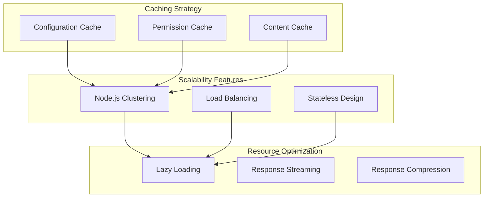
```mermaid
graph TB
    subgraph "Caching Strategy"
        ConfigCache[Configuration Cache]
        PermissionCache[Permission Cache]
        ContentCache[Content Cache]
    end
    
    subgraph "Scalability Features"
        Clustering[Node.js Clustering]
        LoadBalancing[Load Balancing]
        StatelessDesign[Stateless Design]
    end
    
    subgraph "Resource Optimization"
        LazyLoading[Lazy Loading]
        Streaming[Response Streaming]
        Compression[Response Compression]
    end
    
    ConfigCache --> Clustering
    PermissionCache --> Clustering
    ContentCache --> Clustering
    Clustering --> LazyLoading
    LoadBalancing --> LazyLoading
    StatelessDesign --> LazyLoading
```

### Scalability Considerations

1. **Horizontal Scaling**:
   - Stateless server design enables easy horizontal scaling
   - Node.js clustering for multi-core utilization
   - Load balancer support with session affinity

2. **Caching Strategy**:
   - In-memory configuration caching
   - Permission resolution caching
   - Source content caching with TTL

3. **Resource Management**:
   - Request throttling and rate limiting
   - Memory-efficient streaming responses
   - Garbage collection optimization

4. **Database-Free Design**:
   - JSON-based configuration eliminates database bottlenecks
   - File-system caching reduces I/O operations
   - Configuration hot-reloading without service interruption

## Shared Components

The `/shared` directory contains code used by both client and server:

- **`localize.js`**: Internationalization utilities and helpers
- **`unifiedEventSchema.js`**: Common event schema for telemetry
- **`i18n/`**: Translation files for multiple languages

This structure enables code reuse and maintains consistency across the full-stack application while helping new developers quickly locate features and shared utilities.

## Development Testing

### Server Startup Validation

After any architectural changes or refactoring, validate server startup:

```bash
# Quick server startup test
timeout 10s node server/server.js || echo "Server startup check completed"

# Full development environment test
timeout 15s npm run dev || echo "Development environment startup check completed"
```

This prevents deployment of code with import errors, missing dependencies, or runtime issues.

---

## Related Documentation

For deeper understanding of specific architectural components:

- [Architecture Diagrams](diagrams.md) - Visual system representations and data flows
- [Developer Onboarding](developer-onboarding.md) - Development environment and patterns
- [Sources System](sources.md) - Knowledge source integration architecture
- [External Authentication](external-authentication.md) - Authentication system architecture
- [Security Guide](security.md) - Security architecture and implementation
- [Platform Configuration](platform.md) - Configuration system architecture
- [Server Configuration](server-config.md) - Production deployment considerations
- [Troubleshooting](troubleshooting.md) - Common architectural issues and solutions
- [Configuration Validation](configuration-validation.md) - Config system validation patterns
