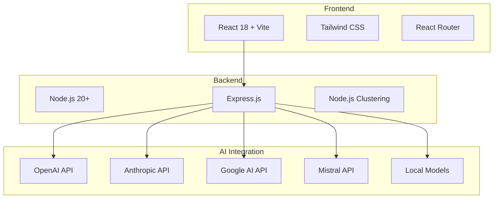
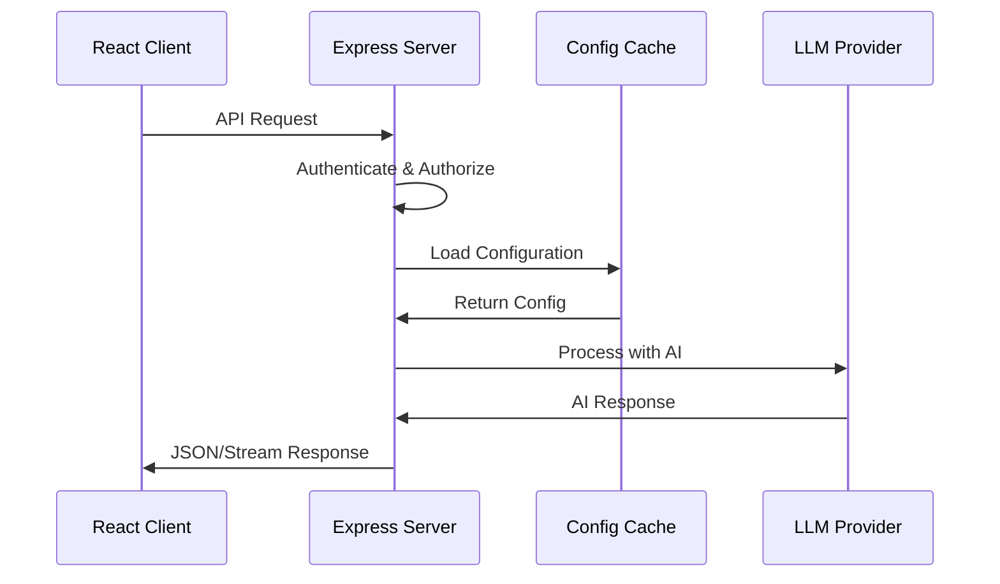
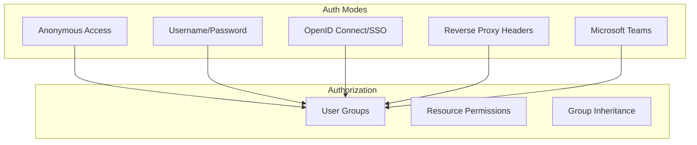
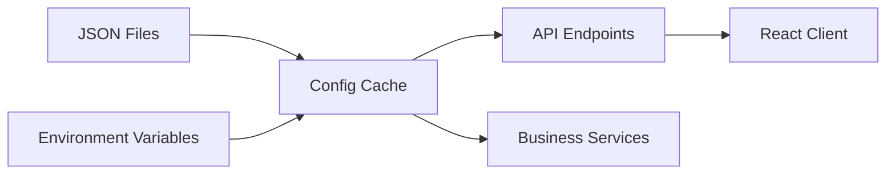
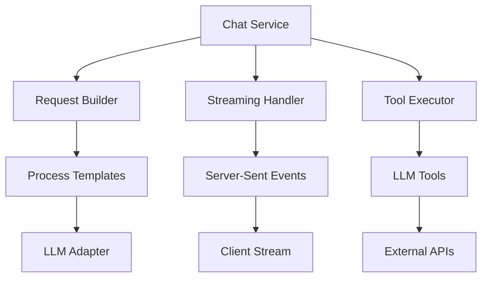

# Developer Onboarding Guide

Welcome to the iHub Apps development team! This guide will help you get up and running quickly and understand the project architecture, development workflow, and best practices.

## Table of Contents

1. [Quick Start Guide](#quick-start-guide)
2. [Project Overview](#project-overview)
3. [Development Environment Setup](#development-environment-setup)
4. [Codebase Tour](#codebase-tour)
5. [Development Workflow](#development-workflow)
6. [Architecture Deep Dive](#architecture-deep-dive)
7. [Common Development Tasks](#common-development-tasks)
8. [Debugging and Troubleshooting](#debugging-and-troubleshooting)
9. [Testing Strategy](#testing-strategy)
10. [Best Practices and Conventions](#best-practices-and-conventions)
11. [Next Steps and Specialization Areas](#next-steps-and-specialization-areas)

## Quick Start Guide

### 30-Second Setup ⚡

```bash
# 1. Clone and install dependencies
git clone <repository>
cd ihub-apps
npm run install:all

# 2. Start development environment
npm run dev

# 3. Open browser to http://localhost:5173
```

**That's it!** The application works immediately with no configuration required.

### Verify Your Setup

```bash
# Test server startup
timeout 10s npm run server || echo "✅ Server startup test complete"

# Test client build
cd client && npm run build

# Run linting (ensure code quality)
npm run lint:fix

# Test LLM adapters (optional - requires API keys)
npm run test:all
```

### First Contribution Checklist

- [ ] Clone repository and run `npm run install:all`
- [ ] Start development with `npm run dev`
- [ ] Access http://localhost:5173 and explore the interface
- [ ] Make a small change (e.g., edit a label in the UI)
- [ ] Run `npm run lint:fix` before committing
- [ ] Test your change works in both development and production build

## Project Overview

### What is iHub Apps?

iHub Apps is an enterprise-grade platform for creating, managing, and deploying AI-powered applications. Think of it as a "Slack for AI" - it provides:

- **30+ Pre-built AI Applications**: Chat, translation, summarization, analysis, and more
- **Multi-LLM Support**: OpenAI, Anthropic, Google, Mistral, and local models
- **Enterprise Authentication**: Anonymous, Local, OIDC, Proxy, and Microsoft Teams
- **Flexible Configuration**: JSON-based configuration without database dependencies
- **Real-time Chat**: Streaming responses with tool calling support
- **Admin Interface**: Complete management UI for apps, models, users, and settings

### Core Value Proposition

1. **Zero Database**: Everything runs from JSON configuration files
2. **Instant Setup**: Works immediately without complex configuration
3. **Enterprise Ready**: Multi-tenant authentication and authorization
4. **Extensible**: Plugin architecture for custom tools and sources
5. **Scalable**: Node.js clustering and stateless design

### Technology Stack



## Development Environment Setup

### Prerequisites

- **Node.js 20+**: Download from [nodejs.org](https://nodejs.org)
- **Git**: Version control
- **Code Editor**: VS Code recommended with these extensions:
  - ES7+ React/Redux/React-Native snippets
  - Prettier - Code formatter
  - ESLint
  - Tailwind CSS IntelliSense

### Step-by-Step Setup

#### 1. Clone and Install

```bash
git clone <repository-url>
cd ihub-apps

# Install dependencies for all components
npm run install:all

# This installs:
# - Root dependencies (build tools, linting)
# - Client dependencies (React, Vite, Tailwind)
# - Server dependencies (Express, LLM adapters)
```

#### 2. Configure Environment (Optional)

```bash
# Copy example environment file
cp config.env .env

# Edit .env with your API keys (optional for basic development)
# OPENAI_API_KEY=your_openai_key
# ANTHROPIC_API_KEY=your_anthropic_key
# GOOGLE_API_KEY=your_google_key
```

**Note**: API keys are optional for UI development. The app works without them.

#### 3. Start Development Environment

```bash
# Start both server and client with hot reload
npm run dev

# Or start individually:
npm run server    # Start server only (port 3000)
npm run client    # Start client only (port 5173)
```

#### 4. Verification Steps

```bash
# ✅ Server Health Check
curl http://localhost:3000/api/health

# ✅ Client Access
open http://localhost:5173

# ✅ Admin Panel Access
open http://localhost:5173/admin

# ✅ API Documentation
open http://localhost:3000/api-docs
```

### Browser Developer Setup

Install these browser extensions for enhanced development:

- **React Developer Tools**: Debug React components
- **Redux DevTools**: State management debugging (if using Redux)
- **Tailwind CSS DevTools**: Inspect Tailwind classes

### Docker Development (Alternative)

```bash
# Build development container
npm run docker:build:dev

# Start with hot reload and volume mounting
npm run docker:run:dev

# Access at http://localhost:5173
```

## Codebase Tour

### High-Level Structure

```
ihub-apps/
├── 📁 client/          # React frontend application
├── 📁 server/          # Node.js Express backend
├── 📁 contents/        # JSON configuration files
├── 📁 shared/          # Code shared between client/server
├── 📁 docs/           # Documentation (mdBook format)
├── 📁 docker/         # Docker configuration
├── 📁 electron/       # Electron app wrapper
└── 📁 teams/          # Microsoft Teams integration
```

### 🎯 Key Entry Points

Start exploring from these important files:

#### Server Entry Points
- **`server/server.js`** - Main server application
- **`server/routes/chat/dataRoutes.js`** - Primary API endpoints
- **`server/configCache.js`** - Configuration loading system
- **`server/services/chat/ChatService.js`** - Core chat functionality

#### Client Entry Points
- **`client/src/App.jsx`** - Main React application
- **`client/src/features/apps/pages/AppChat.jsx`** - Chat interface
- **`client/src/shared/contexts/AuthContext.jsx`** - Authentication
- **`client/src/pages/UnifiedPage.jsx`** - Dynamic page rendering

#### Configuration Files
- **`contents/config/platform.json`** - Core platform settings
- **`contents/config/apps.json`** - AI application definitions
- **`contents/config/models.json`** - LLM model configurations

### 📂 Feature-Based Architecture

The codebase uses feature-based organization:

```
features/
├── apps/           # AI application management
│   ├── components/ # App-specific UI components  
│   ├── pages/      # App pages (AppChat, AppsList)
│   └── hooks/      # Custom React hooks for app logic
├── auth/           # Authentication & authorization
├── admin/          # Administrative interface
├── chat/           # Chat messaging interface
├── canvas/         # Rich text editing canvas
└── upload/         # File upload functionality
```

### 🔧 Server Architecture Layers

```
server/
├── routes/         # API route handlers (by feature)
├── services/       # Business logic services
├── middleware/     # Express middleware (auth, CORS)
├── adapters/       # LLM provider integrations
├── sources/        # Content source handlers
├── tools/          # LLM tool implementations
├── validators/     # Zod schema validators
└── utils/          # Utility functions
```

### 🎨 Frontend Component Organization

```
src/
├── features/       # Feature modules (domain logic)
├── shared/         # Reusable components & contexts
│   ├── components/ # UI components (Layout, Icon, etc.)
│   ├── contexts/   # React Context providers
│   └── hooks/      # Shared custom hooks
├── pages/          # Page components and routing
├── api/            # API client and request handling
└── utils/          # Client-side utilities
```

### 📄 Configuration System

The app uses JSON configuration files instead of a database:

```
contents/
├── config/         # Core configuration
│   ├── platform.json  # Server settings, auth config
│   ├── apps.json      # AI app definitions
│   ├── models.json    # LLM model configs
│   ├── groups.json    # User groups & permissions
│   └── ui.json        # UI customization
├── pages/          # Static/dynamic page content
│   ├── en/         # English content
│   └── de/         # German content
└── sources/        # Content sources for AI apps
```

## Development Workflow

### Daily Development Cycle

```bash
# 1. Start development environment
npm run dev

# 2. Make changes to code
# - Edit files in client/src/ or server/
# - Hot reload automatically updates the app

# 3. Verify changes work
# - Test in browser at http://localhost:5173
# - Check console for errors

# 4. Run code quality checks
npm run lint:fix     # Fix linting issues
npm run format:fix   # Fix formatting

# 5. Test server startup (after server changes)
timeout 10s npm run server

# 6. Commit changes (pre-commit hooks run automatically)
git add .
git commit -m "feat: add new feature"
```

### Code Quality Tools

The project uses automated code quality tools:

```bash
# ESLint - JavaScript/React linting
npm run lint          # Check for issues
npm run lint:fix      # Auto-fix issues

# Prettier - Code formatting  
npm run format        # Check formatting
npm run format:fix    # Auto-format code

# Pre-commit hooks automatically run on git commit
# Uses husky + lint-staged for staged file checks
```

### Branch Strategy

```bash
# Create feature branch
git checkout -b feature/your-feature-name

# Make changes and commit
git add .
git commit -m "feat: describe your change"

# Push and create pull request
git push origin feature/your-feature-name
```

### Build and Deployment

```bash
# Development build (with hot reload)
npm run dev

# Production build
npm run prod:build

# Test production build locally
npm run start:prod

# Build standalone binary
npm run build:binary

# Docker builds
npm run docker:build         # Standard build
npm run docker:build:prod    # Production optimized
```

## Architecture Deep Dive

### Request Flow Overview



### Authentication Architecture

The system supports multiple authentication modes:



**Key Files**:
- `server/middleware/authRequired.js` - Authentication middleware
- `server/utils/authorization.js` - Permission system
- `client/src/shared/contexts/AuthContext.jsx` - Client auth state

### Configuration Management



**Configuration Flow**:
1. JSON files loaded from `contents/` directory
2. Environment variables override JSON values
3. Configurations cached in memory for performance
4. Hot-reloading for most config changes (no restart required)

### Chat Service Architecture



**Key Components**:
- `ChatService.js` - Main orchestration
- `RequestBuilder.js` - Template processing  
- `StreamingHandler.js` - Real-time responses
- `ToolExecutor.js` - LLM tool calling

For detailed architecture information, see [docs/architecture.md](architecture.md).

## Common Development Tasks

### Adding a New AI Application

1. **Create App Configuration** (`contents/config/apps.json`):
```json
{
  "id": "my-new-app",
  "name": {
    "en": "My New App",
    "de": "Meine Neue App"
  },
  "description": {
    "en": "Describe what your app does",
    "de": "Beschreiben Sie, was Ihre App macht"
  },
  "system": {
    "en": "You are a helpful assistant that...",
    "de": "Du bist ein hilfreicher Assistent, der..."
  },
  "tokenLimit": 4000,
  "color": "blue",
  "icon": "lightbulb"
}
```

2. **Test the App**:
   - Restart development server: `npm run dev`
   - Navigate to http://localhost:5173
   - Find your new app in the list
   - Test chat functionality

### Adding a New LLM Model

1. **Create Model Configuration** (`contents/config/models.json`):
```json
{
  "id": "my-custom-model",
  "name": "My Custom Model",
  "provider": "openai",
  "apiEndpoint": "https://api.example.com/v1/chat/completions",
  "contextWindow": 8000,
  "maxTokens": 2000,
  "streaming": true,
  "toolCalling": true
}
```

2. **Update Server Adapter** (if needed):
   - Check existing adapters in `server/adapters/`
   - Create new adapter if provider is unsupported
   - Register adapter in `server/adapters/index.js`

### Customizing the UI

1. **Edit UI Configuration** (`contents/config/ui.json`):
```json
{
  "branding": {
    "title": "My AI Platform",
    "logo": "/path/to/logo.png",
    "favicon": "/path/to/favicon.ico"
  },
  "theme": {
    "primaryColor": "#3b82f6",
    "backgroundColor": "#ffffff"
  }
}
```

2. **Add Custom CSS** (if needed):
   - Edit `client/src/App.css`
   - Use Tailwind CSS classes for styling
   - Follow existing component patterns

### Adding User Groups and Permissions

1. **Configure Groups** (`contents/config/groups.json`):
```json
{
  "groups": {
    "developers": {
      "id": "developers",
      "name": "Developers",
      "inherits": ["users"],
      "permissions": {
        "apps": ["chat", "translator", "summarizer"],
        "models": ["gpt-4", "claude-3-sonnet"],
        "adminAccess": false
      }
    }
  }
}
```

2. **Test Permissions**:
   - Configure authentication mode in `platform.json`
   - Create test users and assign to groups
   - Verify access restrictions work correctly

### Creating Custom Tools for LLMs

1. **Implement Tool** (`server/tools/myCustomTool.js`):
```javascript
export const myCustomTool = {
  name: 'my_custom_tool',
  description: 'Describe what your tool does',
  parameters: {
    type: 'object',
    properties: {
      input: {
        type: 'string',
        description: 'Input parameter description'
      }
    },
    required: ['input']
  },
  execute: async (parameters) => {
    // Implement your tool logic
    return `Result for: ${parameters.input}`;
  }
};
```

2. **Register Tool** (`server/toolLoader.js`):
```javascript
import { myCustomTool } from './tools/myCustomTool.js';

export const tools = [
  // ... existing tools
  myCustomTool
];
```

### Adding Content Sources

1. **Implement Source Handler** (`server/sources/MySourceHandler.js`):
```javascript
export class MySourceHandler extends SourceHandler {
  constructor() {
    super('my-source', 'My Custom Source');
  }

  async loadContent(sourceConfig) {
    // Implement content loading logic
    return {
      content: 'Loaded content...',
      metadata: { source: 'my-source' }
    };
  }
}
```

2. **Register Handler** (`server/sources/index.js`):
```javascript
import { MySourceHandler } from './MySourceHandler.js';

export const sourceHandlers = [
  // ... existing handlers
  new MySourceHandler()
];
```

## Debugging and Troubleshooting

### Server Debugging

1. **Enable Debug Logging**:
```bash
# Set debug environment variable
export DEBUG=ihub:*
npm run server
```

2. **Common Server Issues**:
```bash
# Port already in use
lsof -ti:3000 | xargs kill -9

# Configuration errors
npm run server 2>&1 | grep -i error

# Check server health
curl http://localhost:3000/api/health
```

3. **Server Logs**:
   - Server logs to console in development
   - Check for import/export errors
   - Validate JSON configuration files

### Client Debugging

1. **Browser Developer Tools**:
   - Open DevTools (F12)
   - Check Console tab for errors
   - Network tab for API request failures
   - React DevTools for component debugging

2. **Common Client Issues**:
```bash
# Clear browser cache
# Hard refresh: Ctrl+Shift+R (Windows) or Cmd+Shift+R (Mac)

# Node modules issues
rm -rf client/node_modules
cd client && npm install

# Build errors
cd client && npm run build 2>&1 | head -20
```

3. **Hot Reload Issues**:
```bash
# Restart development server
npm run dev

# Check Vite configuration
cd client && cat vite.config.js
```

### Authentication Debugging

1. **Enable Auth Debug Mode**:
```json
// contents/config/platform.json
{
  "auth": {
    "debug": true
  }
}
```

2. **Test Authentication**:
```bash
# Test authentication endpoints
cd server && node tests/authentication-security.test.js
```

3. **Common Auth Issues**:
   - Check JWT token format and expiration
   - Verify group mappings and permissions
   - Test with different auth modes
   - Check CORS configuration for cross-origin issues

### Configuration Issues

1. **Validate Configuration**:
```bash
# Check JSON syntax
cd contents/config && for f in *.json; do echo "Checking $f"; node -e "JSON.parse(require('fs').readFileSync('$f', 'utf8'))"; done
```

2. **Configuration Loading**:
   - Check `server/configCache.js` for loading errors
   - Verify file paths and permissions
   - Test configuration hot-reloading

3. **Schema Validation**:
   - Check `server/validators/` for schema definitions
   - Run validation manually if needed
   - Verify required fields are present

### Performance Issues

1. **Profile Server Performance**:
```bash
# Start with profiling
node --prof server/server.js

# Analyze profile
node --prof-process isolate-*.log > profile.txt
```

2. **Client Performance**:
   - Use React DevTools Profiler
   - Check for unnecessary re-renders
   - Optimize large component trees
   - Profile bundle size with `npm run build`

3. **Memory Issues**:
   - Monitor memory usage in Node.js
   - Check for memory leaks in long-running processes
   - Optimize configuration caching

## Testing Strategy

### Automated Tests

The project includes comprehensive testing:

```bash
# Run all LLM adapter tests
npm run test:all

# Test specific adapters
npm run test:openai
npm run test:anthropic
npm run test:google
npm run test:mistral

# Test tool calling functionality
npm run test:tool-calling

# Test authentication security
cd server && node tests/authentication-security.test.js
```

### Manual Testing Checklist

#### Basic Functionality
- [ ] Server starts without errors
- [ ] Client loads at http://localhost:5173
- [ ] Can access different AI applications
- [ ] Chat functionality works (with mock responses)
- [ ] Admin panel loads at http://localhost:5173/admin

#### Authentication Testing
- [ ] Anonymous access works (default)
- [ ] Local authentication (if configured)
- [ ] OIDC authentication (if configured) 
- [ ] Group permissions are enforced
- [ ] Admin access restrictions work

#### Configuration Testing
- [ ] Add new app via admin panel
- [ ] Modify existing app configuration
- [ ] Test configuration hot-reloading
- [ ] Verify JSON schema validation

#### API Testing
- [ ] Test API endpoints with curl or Postman
- [ ] Verify streaming responses work
- [ ] Test error handling and validation
- [ ] Check API documentation at http://localhost:3000/api-docs

### Load Testing

```bash
# Simple load test for API endpoints
curl -w "@curl-format.txt" -s -o /dev/null http://localhost:3000/api/health

# Use tools like Apache Bench for more comprehensive testing
ab -n 1000 -c 10 http://localhost:3000/api/health
```

### Integration Testing

```bash
# Test complete chat flow
cd server && node tests/real-llm-integration.test.js

# Test tool integration
cd server && node tests/toolCallingIntegration.test.js
```

## Best Practices and Conventions

### Code Style

1. **JavaScript/React Conventions**:
   - Use ES modules (`import`/`export`)
   - Prefer `const` over `let`, avoid `var`
   - Use destructuring for props and function parameters
   - Write meaningful variable and function names

2. **React Component Guidelines**:
   - Use functional components with hooks
   - Keep components small and focused
   - Extract custom hooks for reusable logic
   - Use proper prop types with destructuring

3. **File Naming**:
   - React components: `PascalCase.jsx`
   - Utility functions: `camelCase.js`
   - Constants: `UPPER_SNAKE_CASE.js`
   - Directories: `kebab-case`

### Project Structure Guidelines

1. **Feature-Based Organization**:
   - Group related components, hooks, and pages
   - Keep feature logic contained within feature directories
   - Use `index.js` files to define public APIs

2. **Separation of Concerns**:
   - Business logic in services (`server/services/`)
   - UI logic in components (`client/src/features/`)
   - Configuration in JSON files (`contents/`)
   - Utilities in dedicated util directories

3. **Import Organization**:
```javascript
// External libraries
import React, { useState, useEffect } from 'react';
import axios from 'axios';

// Internal imports (absolute paths preferred)
import { ChatService } from '../services/chat/ChatService.js';
import { useAuth } from '../shared/hooks/useAuth.js';

// Relative imports (same feature only)
import { ChatMessage } from './ChatMessage.jsx';
```

### API Design Patterns

1. **RESTful Endpoints**:
   - Use proper HTTP methods (GET, POST, PUT, DELETE)
   - Consistent URL patterns (`/api/resource/:id`)
   - Return appropriate HTTP status codes

2. **Error Handling**:
```javascript
// Consistent error response format
{
  "error": "Human-readable error message",
  "code": "SPECIFIC_ERROR_CODE",
  "details": {} // Additional context
}
```

3. **Response Formats**:
```javascript
// Success response
{
  "data": {...},
  "meta": {
    "timestamp": "2023-...",
    "requestId": "..."
  }
}
```

### Configuration Best Practices

1. **JSON Schema Validation**:
   - Use Zod schemas for all configuration
   - Validate on load and provide clear error messages
   - Document required vs optional fields

2. **Environment Variables**:
   - Use `.env` files for sensitive data
   - Provide reasonable defaults in code
   - Document all environment variables

3. **Hot Reloading**:
   - Design configs to reload without server restart
   - Cache configurations for performance
   - Implement change detection and validation

### Security Best Practices

1. **Input Validation**:
   - Validate all user inputs with Zod schemas
   - Sanitize output to prevent XSS
   - Use parameterized queries for database operations

2. **Authentication & Authorization**:
   - Never trust client-side validation alone
   - Implement proper session management
   - Use least-privilege principle for permissions

3. **API Security**:
   - Implement rate limiting
   - Use HTTPS in production
   - Validate API keys and tokens properly

### Performance Guidelines

1. **React Performance**:
   - Use React.memo for expensive components
   - Implement proper key props in lists
   - Avoid unnecessary re-renders with useCallback/useMemo

2. **Server Performance**:
   - Cache frequently accessed data
   - Use streaming for large responses
   - Implement request throttling

3. **Bundle Optimization**:
   - Code splitting for large features
   - Tree shaking to eliminate dead code
   - Optimize images and assets

### Documentation Standards

1. **Code Comments**:
   - Write JSDoc comments for public functions
   - Explain complex business logic
   - Document API endpoints and parameters

2. **README Files**:
   - Each major feature should have a README
   - Include examples and common use cases
   - Keep documentation up to date with code changes

3. **API Documentation**:
   - Use OpenAPI/Swagger for API documentation
   - Include request/response examples
   - Document authentication requirements

## Next Steps and Specialization Areas

### Immediate Next Steps (Week 1)

1. **Complete Local Setup**:
   - [ ] Get the development environment running
   - [ ] Make your first small change (UI text or styling)
   - [ ] Successfully run linting and tests
   - [ ] Explore the admin interface

2. **Understand the Architecture**:
   - [ ] Read [docs/architecture.md](architecture.md) thoroughly
   - [ ] Trace a chat request from frontend to LLM and back
   - [ ] Understand the configuration system
   - [ ] Review authentication modes

3. **Make Your First Contribution**:
   - [ ] Find a "good first issue" or small enhancement
   - [ ] Create a feature branch
   - [ ] Implement the change following best practices
   - [ ] Submit a pull request

### Specialization Areas

#### 🎨 Frontend Development Focus

**Key Skills**: React, Tailwind CSS, State Management, UX/UI Design

**Learning Path**:
1. Study the React component architecture in `client/src/features/`
2. Learn the Tailwind CSS patterns used throughout the app
3. Understand state management with React Context
4. Work on UI/UX improvements and new components

**First Projects**:
- Improve accessibility of existing components
- Create new chat interface features
- Implement dark/light mode improvements
- Add responsive design enhancements

**Advanced Projects**:
- Build complex admin interface features
- Implement real-time collaborative editing
- Create advanced data visualization components

#### ⚙️ Backend Development Focus  

**Key Skills**: Node.js, Express, API Design, LLM Integration

**Learning Path**:
1. Deep dive into server architecture in `server/`
2. Study LLM adapter patterns in `server/adapters/`
3. Understand the chat service architecture
4. Learn the configuration and caching systems

**First Projects**:
- Add support for a new LLM provider
- Implement new API endpoints
- Create custom tools for LLM integration
- Improve error handling and logging

**Advanced Projects**:
- Build advanced source handler integrations
- Implement real-time collaboration features
- Create sophisticated caching strategies
- Design monitoring and analytics systems

#### 🔐 DevOps & Infrastructure Focus

**Key Skills**: Docker, Kubernetes, CI/CD, Monitoring

**Learning Path**:
1. Study the Docker configuration in `docker/`
2. Learn the deployment patterns and scripts
3. Understand the clustering and scaling architecture
4. Review security and authentication systems

**First Projects**:
- Improve Docker build processes
- Create deployment documentation
- Set up monitoring and logging
- Implement backup and disaster recovery

**Advanced Projects**:
- Design Kubernetes deployment strategies
- Build CI/CD pipelines
- Implement advanced security measures
- Create performance monitoring systems

#### 🤖 AI/ML Integration Focus

**Key Skills**: LLM APIs, Prompt Engineering, Tool Development

**Learning Path**:
1. Study the LLM adapter architecture
2. Learn prompt engineering techniques
3. Understand tool calling and function execution
4. Explore different AI model capabilities

**First Projects**:
- Create new AI application templates
- Implement custom tools for LLMs
- Improve prompt engineering for existing apps
- Add support for new AI model features

**Advanced Projects**:
- Build sophisticated AI agent workflows
- Implement multimodal AI capabilities
- Create AI model comparison and routing
- Design intelligent content generation systems

#### 🏢 Enterprise Integration Focus

**Key Skills**: Authentication, Authorization, Enterprise APIs

**Learning Path**:
1. Study the multi-mode authentication system
2. Learn enterprise integration patterns
3. Understand group inheritance and permissions
4. Explore Microsoft Teams and OIDC integration

**First Projects**:
- Improve authentication documentation
- Add new OIDC provider support
- Implement group management features
- Create user management improvements

**Advanced Projects**:
- Build sophisticated RBAC systems
- Create enterprise directory integration
- Implement advanced audit and compliance features
- Design multi-tenant architecture

### Advanced Learning Resources

#### Internal Documentation
- [Architecture Deep Dive](architecture.md) - Complete system architecture
- [Authentication Guide](external-authentication.md) - Enterprise auth setup
- [API Documentation](http://localhost:3000/api-docs) - Complete API reference

#### External Learning Resources
- **React**: [React Official Documentation](https://react.dev/)
- **Node.js**: [Node.js Best Practices](https://github.com/goldbergyoni/nodebestpractices)
- **Express**: [Express.js Guide](https://expressjs.com/en/guide/routing.html)
- **LLM APIs**: Each provider's official documentation
- **Tailwind CSS**: [Tailwind CSS Documentation](https://tailwindcss.com/docs)

### Community and Support

#### Getting Help
1. **Internal**: Ask questions in team channels or code reviews
2. **Documentation**: Check existing docs before asking questions
3. **Code**: Read similar implementations in the codebase
4. **Testing**: Write tests to understand functionality

#### Contributing Back
1. **Documentation**: Improve documentation as you learn
2. **Code Reviews**: Participate in code review processes
3. **Mentoring**: Help other new developers as you gain experience
4. **Best Practices**: Share discoveries and improvements with the team

---

**Welcome to the team! 🚀**

This guide should get you started, but don't hesitate to ask questions and explore the codebase. The best way to learn is by doing, so start with small changes and gradually take on more complex tasks.

Remember: The codebase is designed to be approachable and well-documented. Every feature you see working in the UI has corresponding code that you can study and modify. Happy coding!