# iHub Apps - Visual Architecture Diagrams

This document provides comprehensive visual representations of the iHub Apps architecture using Mermaid diagrams. These diagrams complement the detailed [Architecture Documentation](./architecture.md) and help visualize system components, data flows, and interactions.

## Table of Contents

1. [System Overview](#system-overview)
2. [Server Architecture](#server-architecture)
3. [Client Architecture](#client-architecture)
4. [Authentication & Authorization Flow](#authentication--authorization-flow)
5. [Request Processing Flow](#request-processing-flow)
6. [Source Handlers Architecture](#source-handlers-architecture)
7. [Configuration Management](#configuration-management)
8. [Security Architecture](#security-architecture)
9. [Deployment Architectures](#deployment-architectures)
10. [Data Flow Diagrams](#data-flow-diagrams)

---

## System Overview

### High-Level System Architecture

This diagram shows the overall system architecture with the three main tiers and their relationships.

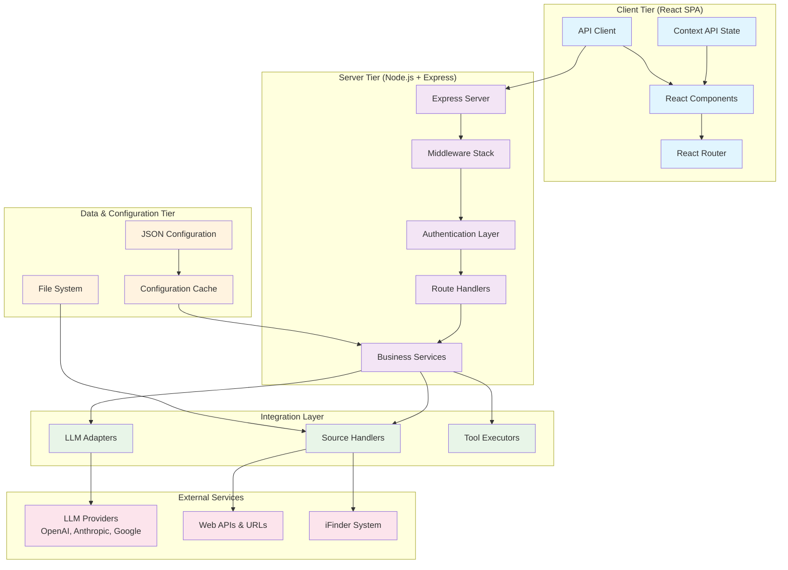
```mermaid
graph TB
    subgraph "Client Tier (React SPA)"
        direction TB
        UI[React Components]
        Router[React Router]
        State[Context API State]
        API[API Client]
        
        UI --> Router
        State --> UI
        API --> UI
    end
    
    subgraph "Server Tier (Node.js + Express)"
        direction TB
        Express[Express Server]
        Auth[Authentication Layer]
        Routes[Route Handlers]
        Services[Business Services]
        Middleware[Middleware Stack]
        
        Express --> Middleware
        Middleware --> Auth
        Auth --> Routes
        Routes --> Services
    end
    
    subgraph "Integration Layer"
        direction TB
        Adapters[LLM Adapters]
        Sources[Source Handlers]
        Tools[Tool Executors]
        
        Services --> Adapters
        Services --> Sources
        Services --> Tools
    end
    
    subgraph "Data & Configuration Tier"
        direction TB
        Config[JSON Configuration]
        FileSystem[File System]
        Cache[Configuration Cache]
        
        Config --> Cache
        FileSystem --> Sources
        Cache --> Services
    end
    
    subgraph "External Services"
        direction TB
        LLMs[LLM Providers<br/>OpenAI, Anthropic, Google]
        WebAPIs[Web APIs & URLs]
        iFinder[iFinder System]
        
        Adapters --> LLMs
        Sources --> WebAPIs
        Sources --> iFinder
    end
    
    API --> Express
    
    classDef clientTier fill:#e1f5fe
    classDef serverTier fill:#f3e5f5
    classDef integrationTier fill:#e8f5e8
    classDef dataTier fill:#fff3e0
    classDef externalTier fill:#fce4ec
    
    class UI,Router,State,API clientTier
    class Express,Auth,Routes,Services,Middleware serverTier
    class Adapters,Sources,Tools integrationTier
    class Config,FileSystem,Cache dataTier
    class LLMs,WebAPIs,iFinder externalTier
```

### Component Interaction Overview

This diagram illustrates how the major components interact with each other.

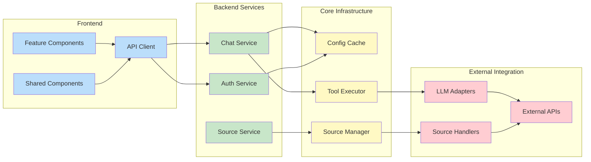
```mermaid
graph LR
    subgraph "Frontend"
        FC[Feature Components]
        SC[Shared Components]
        AC[API Client]
    end
    
    subgraph "Backend Services"
        CS[Chat Service]
        AS[Auth Service]
        SS[Source Service]
    end
    
    subgraph "Core Infrastructure"
        CC[Config Cache]
        SM[Source Manager]
        TE[Tool Executor]
    end
    
    subgraph "External Integration"
        LA[LLM Adapters]
        SH[Source Handlers]
        EX[External APIs]
    end
    
    FC --> AC
    SC --> AC
    AC --> CS
    AC --> AS
    CS --> CC
    CS --> TE
    AS --> CC
    SS --> SM
    SM --> SH
    TE --> LA
    LA --> EX
    SH --> EX
    
    classDef frontend fill:#bbdefb
    classDef backend fill:#c8e6c9
    classDef infrastructure fill:#fff9c4
    classDef external fill:#ffcdd2
    
    class FC,SC,AC frontend
    class CS,AS,SS backend
    class CC,SM,TE infrastructure
    class LA,SH,EX external
```

---

## Server Architecture

### Express Server Structure

This diagram shows the detailed server architecture with all major components and their relationships.

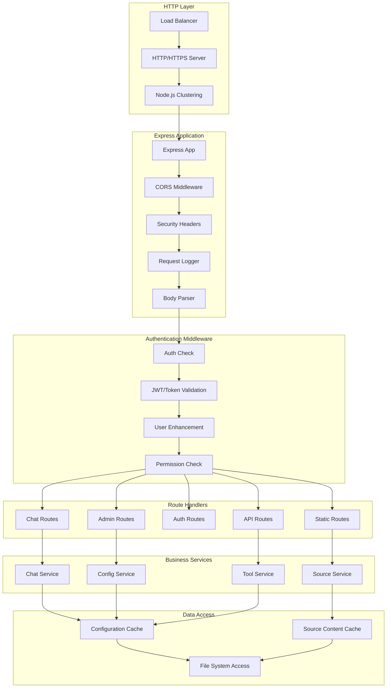
```mermaid
graph TB
    subgraph "HTTP Layer"
        HTTP[HTTP/HTTPS Server]
        Cluster[Node.js Clustering]
        LB[Load Balancer]
    end
    
    subgraph "Express Application"
        App[Express App]
        CORS[CORS Middleware]
        Security[Security Headers]
        Logger[Request Logger]
        Parser[Body Parser]
    end
    
    subgraph "Authentication Middleware"
        AuthCheck[Auth Check]
        TokenValidation[JWT/Token Validation]
        UserEnhancement[User Enhancement]
        PermissionCheck[Permission Check]
    end
    
    subgraph "Route Handlers"
        ChatRoutes[Chat Routes]
        AdminRoutes[Admin Routes]
        AuthRoutes[Auth Routes]
        StaticRoutes[Static Routes]
        APIRoutes[API Routes]
    end
    
    subgraph "Business Services"
        ChatService[Chat Service]
        ConfigService[Config Service]
        SourceService[Source Service]
        ToolService[Tool Service]
    end
    
    subgraph "Data Access"
        ConfigCache[Configuration Cache]
        FileAccess[File System Access]
        SourceCache[Source Content Cache]
    end
    
    LB --> HTTP
    HTTP --> Cluster
    Cluster --> App
    App --> CORS
    CORS --> Security
    Security --> Logger
    Logger --> Parser
    Parser --> AuthCheck
    AuthCheck --> TokenValidation
    TokenValidation --> UserEnhancement
    UserEnhancement --> PermissionCheck
    PermissionCheck --> ChatRoutes
    PermissionCheck --> AdminRoutes
    PermissionCheck --> AuthRoutes
    PermissionCheck --> StaticRoutes
    PermissionCheck --> APIRoutes
    
    ChatRoutes --> ChatService
    AdminRoutes --> ConfigService
    StaticRoutes --> SourceService
    APIRoutes --> ToolService
    
    ChatService --> ConfigCache
    ConfigService --> ConfigCache
    SourceService --> SourceCache
    ToolService --> ConfigCache
    
    ConfigCache --> FileAccess
    SourceCache --> FileAccess
```

### Chat Service Architecture

This detailed diagram shows the internal structure of the Chat Service, which is the core component for LLM interactions.

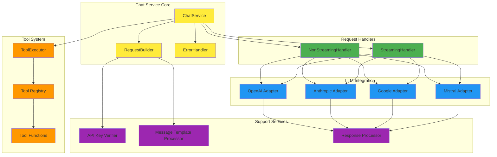
```mermaid
graph TB
    subgraph "Chat Service Core"
        CS[ChatService]
        RB[RequestBuilder]
        EH[ErrorHandler]
    end
    
    subgraph "Request Handlers"
        NSH[NonStreamingHandler]
        SH[StreamingHandler]
        direction LR
    end
    
    subgraph "Tool System"
        TE[ToolExecutor]
        TR[Tool Registry]
        TF[Tool Functions]
    end
    
    subgraph "LLM Integration"
        OpenAI[OpenAI Adapter]
        Anthropic[Anthropic Adapter]
        Google[Google Adapter]
        Mistral[Mistral Adapter]
    end
    
    subgraph "Support Services"
        AKV[API Key Verifier]
        PMT[Message Template Processor]
        Response[Response Processor]
    end
    
    CS --> RB
    CS --> NSH
    CS --> SH
    CS --> TE
    CS --> EH
    
    RB --> AKV
    RB --> PMT
    
    NSH --> OpenAI
    NSH --> Anthropic
    NSH --> Google
    NSH --> Mistral
    
    SH --> OpenAI
    SH --> Anthropic
    SH --> Google
    SH --> Mistral
    
    TE --> TR
    TR --> TF
    
    OpenAI --> Response
    Anthropic --> Response
    Google --> Response
    Mistral --> Response
    
    classDef core fill:#ffeb3b
    classDef handlers fill:#4caf50
    classDef tools fill:#ff9800
    classDef adapters fill:#2196f3
    classDef support fill:#9c27b0
    
    class CS,RB,EH core
    class NSH,SH handlers
    class TE,TR,TF tools
    class OpenAI,Anthropic,Google,Mistral adapters
    class AKV,PMT,Response support
```

---

## Client Architecture

### React Application Structure

This diagram shows the client-side architecture with feature-based organization and state management.

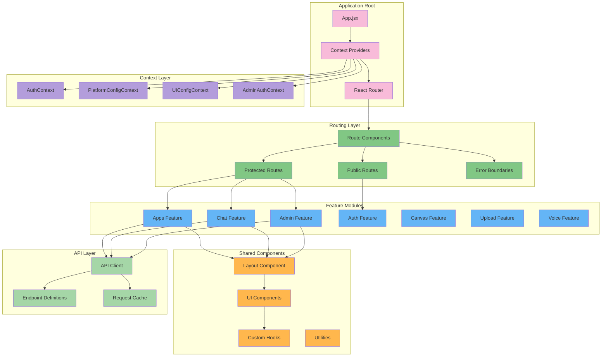
```mermaid
graph TB
    subgraph "Application Root"
        App[App.jsx]
        Providers[Context Providers]
        Router[React Router]
    end
    
    subgraph "Context Layer"
        AuthCtx[AuthContext]
        PlatformCtx[PlatformConfigContext]
        UICtx[UIConfigContext]
        AdminCtx[AdminAuthContext]
    end
    
    subgraph "Routing Layer"
        Routes[Route Components]
        ProtectedRoutes[Protected Routes]
        PublicRoutes[Public Routes]
        ErrorBoundaries[Error Boundaries]
    end
    
    subgraph "Feature Modules"
        AppsFeature[Apps Feature]
        ChatFeature[Chat Feature]
        AdminFeature[Admin Feature]
        AuthFeature[Auth Feature]
        CanvasFeature[Canvas Feature]
        UploadFeature[Upload Feature]
        VoiceFeature[Voice Feature]
    end
    
    subgraph "Shared Components"
        Layout[Layout Component]
        UIComponents[UI Components]
        Hooks[Custom Hooks]
        Utils[Utilities]
    end
    
    subgraph "API Layer"
        APIClient[API Client]
        Endpoints[Endpoint Definitions]
        Cache[Request Cache]
    end
    
    App --> Providers
    Providers --> AuthCtx
    Providers --> PlatformCtx
    Providers --> UICtx
    Providers --> AdminCtx
    Providers --> Router
    
    Router --> Routes
    Routes --> ProtectedRoutes
    Routes --> PublicRoutes
    Routes --> ErrorBoundaries
    
    ProtectedRoutes --> AppsFeature
    ProtectedRoutes --> ChatFeature
    ProtectedRoutes --> AdminFeature
    PublicRoutes --> AuthFeature
    
    AppsFeature --> Layout
    ChatFeature --> Layout
    AdminFeature --> Layout
    
    Layout --> UIComponents
    UIComponents --> Hooks
    
    AppsFeature --> APIClient
    ChatFeature --> APIClient
    AdminFeature --> APIClient
    
    APIClient --> Endpoints
    APIClient --> Cache
    
    classDef root fill:#f8bbd9
    classDef context fill:#b39ddb
    classDef routing fill:#81c784
    classDef features fill:#64b5f6
    classDef shared fill:#ffb74d
    classDef api fill:#a5d6a7
    
    class App,Providers,Router root
    class AuthCtx,PlatformCtx,UICtx,AdminCtx context
    class Routes,ProtectedRoutes,PublicRoutes,ErrorBoundaries routing
    class AppsFeature,ChatFeature,AdminFeature,AuthFeature,CanvasFeature,UploadFeature,VoiceFeature features
    class Layout,UIComponents,Hooks,Utils shared
    class APIClient,Endpoints,Cache api
```

### Dynamic Content Rendering System

This diagram illustrates how the system handles dynamic React component rendering and page content.

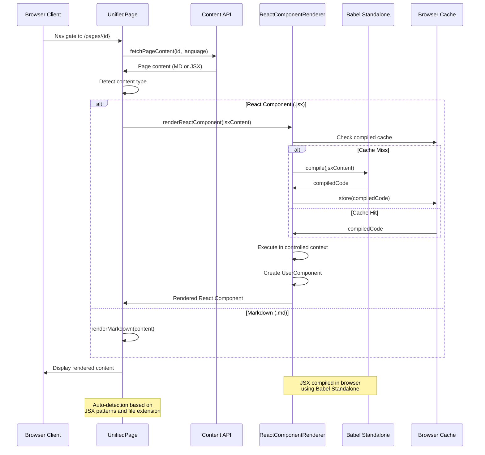
```mermaid
sequenceDiagram
    participant Client as Browser Client
    participant UP as UnifiedPage
    participant API as Content API
    participant RCR as ReactComponentRenderer
    participant Babel as Babel Standalone
    participant Cache as Browser Cache
    
    Client->>UP: Navigate to /pages/{id}
    UP->>API: fetchPageContent(id, language)
    API->>UP: Page content (MD or JSX)
    
    UP->>UP: Detect content type
    
    alt React Component (.jsx)
        UP->>RCR: renderReactComponent(jsxContent)
        RCR->>Cache: Check compiled cache
        
        alt Cache Miss
            RCR->>Babel: compile(jsxContent)
            Babel->>RCR: compiledCode
            RCR->>Cache: store(compiledCode)
        else Cache Hit
            Cache->>RCR: compiledCode
        end
        
        RCR->>RCR: Execute in controlled context
        RCR->>RCR: Create UserComponent
        RCR->>UP: Rendered React Component
        
    else Markdown (.md)
        UP->>UP: renderMarkdown(content)
    end
    
    UP->>Client: Display rendered content
    
    Note over RCR,Babel: JSX compiled in browser<br/>using Babel Standalone
    Note over UP: Auto-detection based on<br/>JSX patterns and file extension
```

---

## Authentication & Authorization Flow

### Multi-Mode Authentication System

This diagram shows the comprehensive authentication system supporting multiple authentication modes.

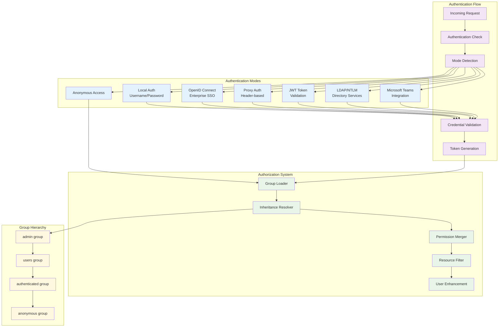
```mermaid
graph TB
    subgraph "Authentication Modes"
        Anonymous[Anonymous Access]
        Local[Local Auth<br/>Username/Password]
        OIDC[OpenID Connect<br/>Enterprise SSO]
        Proxy[Proxy Auth<br/>Header-based]
        JWT[JWT Token<br/>Validation]
        LDAP[LDAP/NTLM<br/>Directory Services]
        Teams[Microsoft Teams<br/>Integration]
    end
    
    subgraph "Authentication Flow"
        Request[Incoming Request]
        AuthCheck[Authentication Check]
        ModeDetection[Mode Detection]
        Validation[Credential Validation]
        TokenGeneration[Token Generation]
    end
    
    subgraph "Authorization System"
        GroupLoader[Group Loader]
        InheritanceResolver[Inheritance Resolver]
        PermissionMerger[Permission Merger]
        ResourceFilter[Resource Filter]
        UserEnhancement[User Enhancement]
    end
    
    subgraph "Group Hierarchy"
        AdminGroup[admin group]
        UsersGroup[users group]
        AuthenticatedGroup[authenticated group]
        AnonymousGroup[anonymous group]
    end
    
    Request --> AuthCheck
    AuthCheck --> ModeDetection
    
    ModeDetection --> Anonymous
    ModeDetection --> Local
    ModeDetection --> OIDC
    ModeDetection --> Proxy
    ModeDetection --> JWT
    ModeDetection --> LDAP
    ModeDetection --> Teams
    
    Anonymous --> GroupLoader
    Local --> Validation
    OIDC --> Validation
    Proxy --> Validation
    JWT --> Validation
    LDAP --> Validation
    Teams --> Validation
    
    Validation --> TokenGeneration
    TokenGeneration --> GroupLoader
    
    GroupLoader --> InheritanceResolver
    InheritanceResolver --> PermissionMerger
    PermissionMerger --> ResourceFilter
    ResourceFilter --> UserEnhancement
    
    AdminGroup --> UsersGroup
    UsersGroup --> AuthenticatedGroup
    AuthenticatedGroup --> AnonymousGroup
    
    InheritanceResolver --> AdminGroup
    
    classDef authModes fill:#e3f2fd
    classDef authFlow fill:#f3e5f5
    classDef authzSystem fill:#e8f5e8
    classDef groups fill:#fff8e1
    
    class Anonymous,Local,OIDC,Proxy,JWT,LDAP,Teams authModes
    class Request,AuthCheck,ModeDetection,Validation,TokenGeneration authFlow
    class GroupLoader,InheritanceResolver,PermissionMerger,ResourceFilter,UserEnhancement authzSystem
    class AdminGroup,UsersGroup,AuthenticatedGroup,AnonymousGroup groups
```

### Group Inheritance Resolution Process

This diagram details how the system resolves group permissions through inheritance chains.

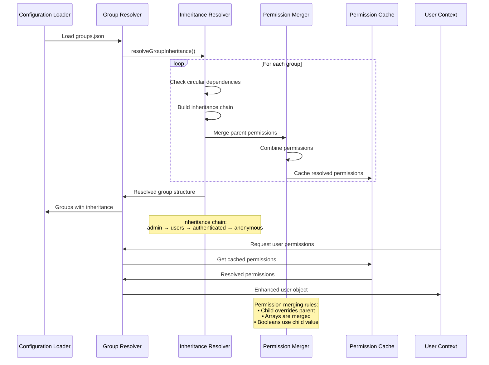
```mermaid
sequenceDiagram
    participant Config as Configuration Loader
    participant GR as Group Resolver
    participant IR as Inheritance Resolver
    participant PM as Permission Merger
    participant Cache as Permission Cache
    participant User as User Context
    
    Config->>GR: Load groups.json
    GR->>IR: resolveGroupInheritance()
    
    loop For each group
        IR->>IR: Check circular dependencies
        IR->>IR: Build inheritance chain
        IR->>PM: Merge parent permissions
        PM->>PM: Combine permissions
        PM->>Cache: Cache resolved permissions
    end
    
    IR->>GR: Resolved group structure
    GR->>Config: Groups with inheritance
    
    Note over IR: Inheritance chain:<br/>admin → users → authenticated → anonymous
    
    User->>GR: Request user permissions
    GR->>Cache: Get cached permissions
    Cache->>GR: Resolved permissions
    GR->>User: Enhanced user object
    
    Note over PM: Permission merging rules:<br/>• Child overrides parent<br/>• Arrays are merged<br/>• Booleans use child value
```

---

## Request Processing Flow

### Complete Chat Request Flow

This sequence diagram shows the complete flow of a chat request through the system.

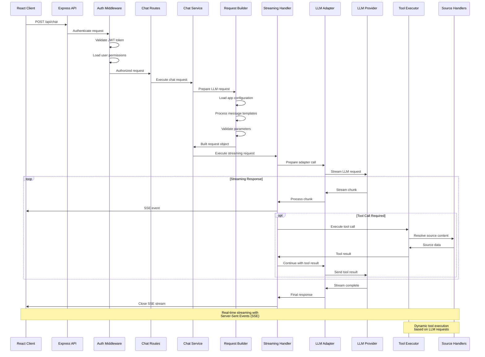
```mermaid
sequenceDiagram
    participant Client as React Client
    participant API as Express API
    participant Auth as Auth Middleware
    participant Routes as Chat Routes
    participant Service as Chat Service
    participant Builder as Request Builder
    participant Handler as Streaming Handler
    participant Adapter as LLM Adapter
    participant LLM as LLM Provider
    participant Tools as Tool Executor
    participant Sources as Source Handlers
    
    Client->>API: POST /api/chat
    API->>Auth: Authenticate request
    Auth->>Auth: Validate JWT token
    Auth->>Auth: Load user permissions
    Auth->>Routes: Authorized request
    
    Routes->>Service: Execute chat request
    Service->>Builder: Prepare LLM request
    Builder->>Builder: Load app configuration
    Builder->>Builder: Process message templates
    Builder->>Builder: Validate parameters
    Builder->>Service: Built request object
    
    Service->>Handler: Execute streaming request
    Handler->>Adapter: Prepare adapter call
    Adapter->>LLM: Stream LLM request
    
    loop Streaming Response
        LLM->>Adapter: Stream chunk
        Adapter->>Handler: Process chunk
        Handler->>Client: SSE event
        
        opt Tool Call Required
            Handler->>Tools: Execute tool call
            Tools->>Sources: Resolve source content
            Sources->>Tools: Source data
            Tools->>Handler: Tool result
            Handler->>Adapter: Continue with tool result
            Adapter->>LLM: Send tool result
        end
    end
    
    LLM->>Adapter: Stream complete
    Adapter->>Handler: Final response
    Handler->>Client: Close SSE stream
    
    Note over Client,Sources: Real-time streaming with<br/>Server-Sent Events (SSE)
    Note over Tools,Sources: Dynamic tool execution<br/>based on LLM requests
```

### Error Handling Flow

This diagram shows how errors are handled throughout the request processing pipeline.

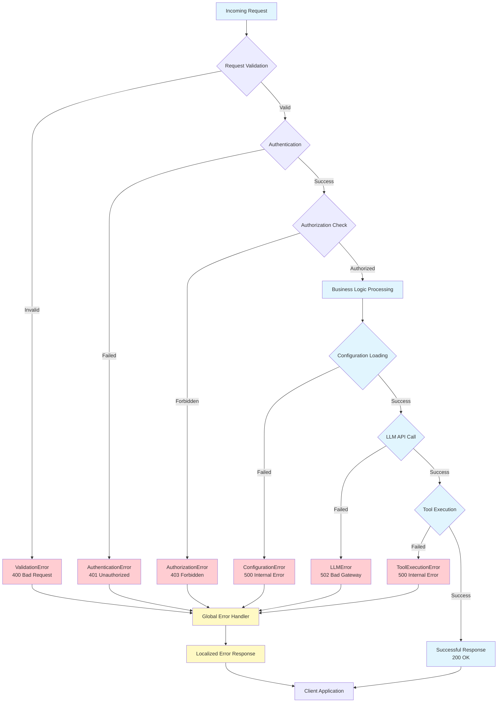
```mermaid
graph TB
    Request[Incoming Request] --> Validation{Request Validation}
    
    Validation -->|Valid| Authentication{Authentication}
    Validation -->|Invalid| ValidationError[ValidationError<br/>400 Bad Request]
    
    Authentication -->|Success| Authorization{Authorization Check}
    Authentication -->|Failed| AuthError[AuthenticationError<br/>401 Unauthorized]
    
    Authorization -->|Authorized| BusinessLogic[Business Logic Processing]
    Authorization -->|Forbidden| PermissionError[AuthorizationError<br/>403 Forbidden]
    
    BusinessLogic --> ConfigLoad{Configuration Loading}
    ConfigLoad -->|Success| LLMCall{LLM API Call}
    ConfigLoad -->|Failed| ConfigError[ConfigurationError<br/>500 Internal Error]
    
    LLMCall -->|Success| ToolExecution{Tool Execution}
    LLMCall -->|Failed| LLMError[LLMError<br/>502 Bad Gateway]
    
    ToolExecution -->|Success| Response[Successful Response<br/>200 OK]
    ToolExecution -->|Failed| ToolError[ToolExecutionError<br/>500 Internal Error]
    
    ValidationError --> ErrorHandler[Global Error Handler]
    AuthError --> ErrorHandler
    PermissionError --> ErrorHandler
    ConfigError --> ErrorHandler
    LLMError --> ErrorHandler
    ToolError --> ErrorHandler
    
    ErrorHandler --> ErrorResponse[Localized Error Response]
    ErrorResponse --> Client[Client Application]
    Response --> Client
    
    classDef success fill:#c8e6c9
    classDef error fill:#ffcdd2
    classDef processing fill:#e1f5fe
    classDef handler fill:#fff9c4
    
    class Request,BusinessLogic,ConfigLoad,LLMCall,ToolExecution,Response processing
    class ValidationError,AuthError,PermissionError,ConfigError,LLMError,ToolError error
    class ErrorHandler,ErrorResponse handler
```

---

## Source Handlers Architecture

### Source Management System

This diagram illustrates the comprehensive source handling system that manages content from various sources.

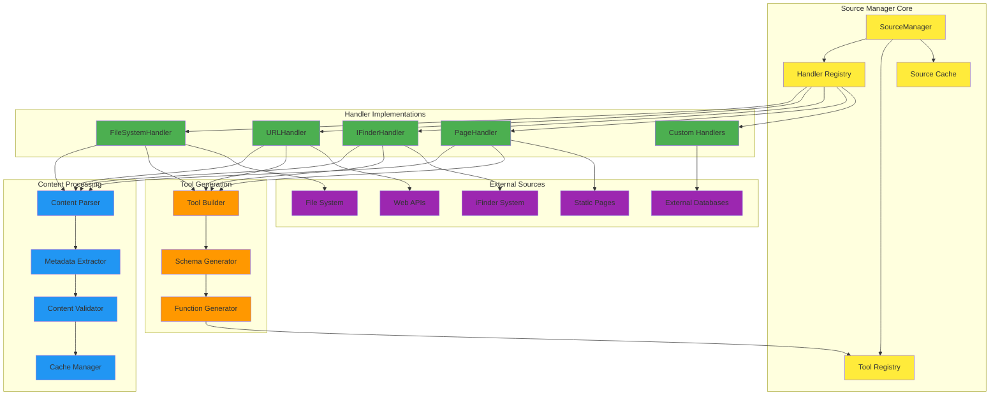
```mermaid
graph TB
    subgraph "Source Manager Core"
        SM[SourceManager]
        Registry[Handler Registry]
        ToolRegistry[Tool Registry]
        Cache[Source Cache]
    end
    
    subgraph "Handler Implementations"
        FSH[FileSystemHandler]
        URLHandler[URLHandler]
        IFH[IFinderHandler]
        PH[PageHandler]
        CustomHandlers[Custom Handlers]
    end
    
    subgraph "Content Processing"
        ContentParser[Content Parser]
        MetadataExtractor[Metadata Extractor]
        ContentValidator[Content Validator]
        CacheManager[Cache Manager]
    end
    
    subgraph "Tool Generation"
        ToolBuilder[Tool Builder]
        SchemaGenerator[Schema Generator]
        FunctionGenerator[Function Generator]
    end
    
    subgraph "External Sources"
        FileSystem[File System]
        WebAPIs[Web APIs]
        iFinder[iFinder System]
        StaticPages[Static Pages]
        Databases[External Databases]
    end
    
    SM --> Registry
    SM --> ToolRegistry
    SM --> Cache
    
    Registry --> FSH
    Registry --> URLHandler
    Registry --> IFH
    Registry --> PH
    Registry --> CustomHandlers
    
    FSH --> ContentParser
    URLHandler --> ContentParser
    IFH --> ContentParser
    PH --> ContentParser
    
    ContentParser --> MetadataExtractor
    MetadataExtractor --> ContentValidator
    ContentValidator --> CacheManager
    
    FSH --> ToolBuilder
    URLHandler --> ToolBuilder
    IFH --> ToolBuilder
    PH --> ToolBuilder
    
    ToolBuilder --> SchemaGenerator
    SchemaGenerator --> FunctionGenerator
    FunctionGenerator --> ToolRegistry
    
    FSH --> FileSystem
    URLHandler --> WebAPIs
    IFH --> iFinder
    PH --> StaticPages
    CustomHandlers --> Databases
    
    classDef core fill:#ffeb3b
    classDef handlers fill:#4caf50
    classDef processing fill:#2196f3
    classDef tools fill:#ff9800
    classDef external fill:#9c27b0
    
    class SM,Registry,ToolRegistry,Cache core
    class FSH,URLHandler,IFH,PH,CustomHandlers handlers
    class ContentParser,MetadataExtractor,ContentValidator,CacheManager processing
    class ToolBuilder,SchemaGenerator,FunctionGenerator tools
    class FileSystem,WebAPIs,iFinder,StaticPages,Databases external
```

### Source Resolution Process

This sequence diagram shows how sources are resolved and content is loaded.

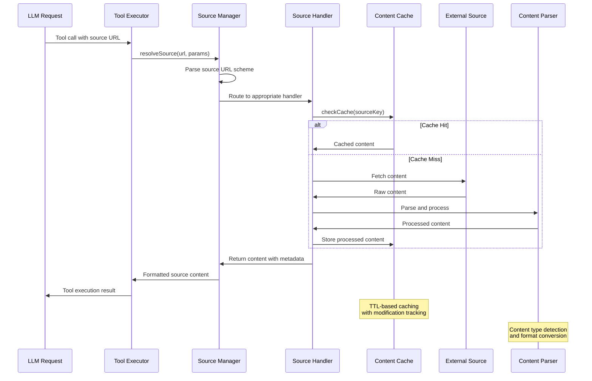
```mermaid
sequenceDiagram
    participant LLM as LLM Request
    participant TE as Tool Executor
    participant SM as Source Manager
    participant Handler as Source Handler
    participant Cache as Content Cache
    participant External as External Source
    participant Parser as Content Parser
    
    LLM->>TE: Tool call with source URL
    TE->>SM: resolveSource(url, params)
    SM->>SM: Parse source URL scheme
    SM->>Handler: Route to appropriate handler
    
    Handler->>Cache: checkCache(sourceKey)
    
    alt Cache Hit
        Cache->>Handler: Cached content
    else Cache Miss
        Handler->>External: Fetch content
        External->>Handler: Raw content
        Handler->>Parser: Parse and process
        Parser->>Handler: Processed content
        Handler->>Cache: Store processed content
    end
    
    Handler->>SM: Return content with metadata
    SM->>TE: Formatted source content
    TE->>LLM: Tool execution result
    
    Note over Cache: TTL-based caching<br/>with modification tracking
    Note over Parser: Content type detection<br/>and format conversion
```

---

## Configuration Management

### Configuration Loading and Caching System

This diagram shows the sophisticated configuration management system with validation and caching.

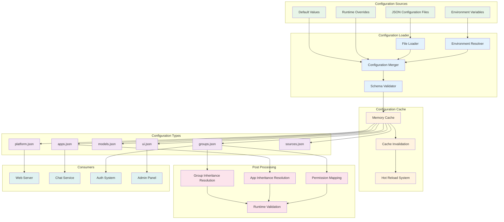
```mermaid
graph TB
    subgraph "Configuration Sources"
        JSONFiles[JSON Configuration Files]
        EnvVars[Environment Variables]
        Defaults[Default Values]
        RuntimeOverrides[Runtime Overrides]
    end
    
    subgraph "Configuration Loader"
        FileLoader[File Loader]
        EnvResolver[Environment Resolver]
        Merger[Configuration Merger]
        Validator[Schema Validator]
    end
    
    subgraph "Configuration Cache"
        MemoryCache[Memory Cache]
        CacheInvalidation[Cache Invalidation]
        HotReload[Hot Reload System]
    end
    
    subgraph "Configuration Types"
        Platform[platform.json]
        Apps[apps.json]
        Models[models.json]
        Groups[groups.json]
        UI[ui.json]
        Sources[sources.json]
    end
    
    subgraph "Post Processing"
        GroupInheritance[Group Inheritance Resolution]
        AppInheritance[App Inheritance Resolution]
        PermissionMapping[Permission Mapping]
        Validation[Runtime Validation]
    end
    
    subgraph "Consumers"
        WebServer[Web Server]
        ChatService[Chat Service]
        AuthSystem[Auth System]
        AdminPanel[Admin Panel]
    end
    
    JSONFiles --> FileLoader
    EnvVars --> EnvResolver
    Defaults --> Merger
    RuntimeOverrides --> Merger
    
    FileLoader --> Merger
    EnvResolver --> Merger
    Merger --> Validator
    Validator --> MemoryCache
    
    MemoryCache --> CacheInvalidation
    CacheInvalidation --> HotReload
    
    MemoryCache --> Platform
    MemoryCache --> Apps
    MemoryCache --> Models
    MemoryCache --> Groups
    MemoryCache --> UI
    MemoryCache --> Sources
    
    Groups --> GroupInheritance
    Apps --> AppInheritance
    Groups --> PermissionMapping
    
    GroupInheritance --> Validation
    AppInheritance --> Validation
    PermissionMapping --> Validation
    
    Platform --> WebServer
    Apps --> ChatService
    Groups --> AuthSystem
    UI --> AdminPanel
    
    classDef sources fill:#e8f5e8
    classDef loader fill:#e3f2fd
    classDef cache fill:#fff3e0
    classDef types fill:#f3e5f5
    classDef processing fill:#fce4ec
    classDef consumers fill:#e0f2f1
    
    class JSONFiles,EnvVars,Defaults,RuntimeOverrides sources
    class FileLoader,EnvResolver,Merger,Validator loader
    class MemoryCache,CacheInvalidation,HotReload cache
    class Platform,Apps,Models,Groups,UI,Sources types
    class GroupInheritance,AppInheritance,PermissionMapping,Validation processing
    class WebServer,ChatService,AuthSystem,AdminPanel consumers
```

### Configuration Validation Pipeline

This diagram shows how configurations are validated using Zod schemas and processed.

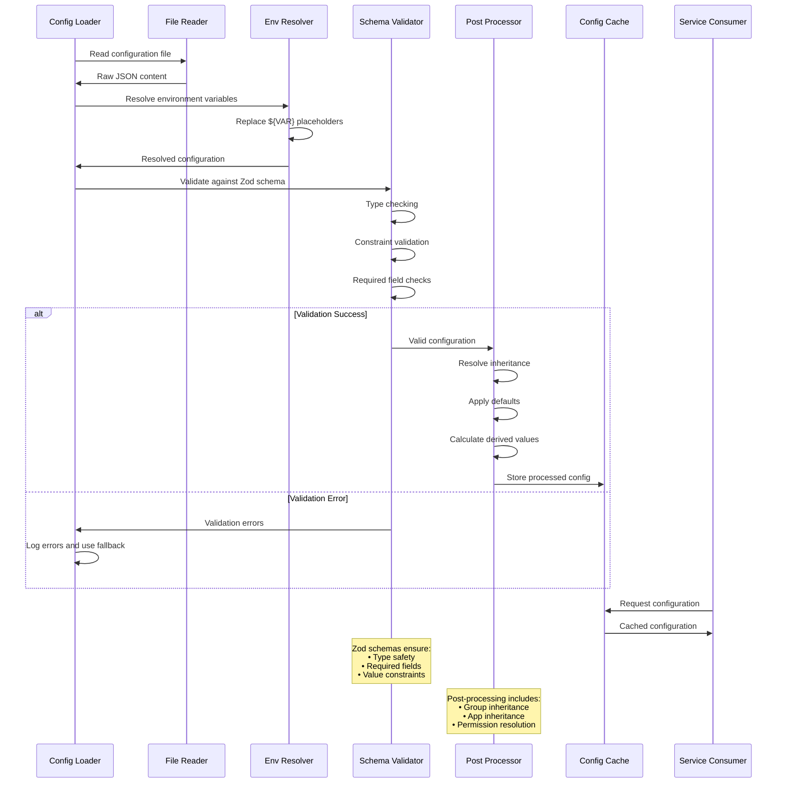
```mermaid
sequenceDiagram
    participant Loader as Config Loader
    participant Reader as File Reader
    participant Resolver as Env Resolver
    participant Validator as Schema Validator
    participant Processor as Post Processor
    participant Cache as Config Cache
    participant Consumer as Service Consumer
    
    Loader->>Reader: Read configuration file
    Reader->>Loader: Raw JSON content
    
    Loader->>Resolver: Resolve environment variables
    Resolver->>Resolver: Replace ${VAR} placeholders
    Resolver->>Loader: Resolved configuration
    
    Loader->>Validator: Validate against Zod schema
    Validator->>Validator: Type checking
    Validator->>Validator: Constraint validation
    Validator->>Validator: Required field checks
    
    alt Validation Success
        Validator->>Processor: Valid configuration
        Processor->>Processor: Resolve inheritance
        Processor->>Processor: Apply defaults
        Processor->>Processor: Calculate derived values
        Processor->>Cache: Store processed config
    else Validation Error
        Validator->>Loader: Validation errors
        Loader->>Loader: Log errors and use fallback
    end
    
    Consumer->>Cache: Request configuration
    Cache->>Consumer: Cached configuration
    
    Note over Validator: Zod schemas ensure:<br/>• Type safety<br/>• Required fields<br/>• Value constraints
    Note over Processor: Post-processing includes:<br/>• Group inheritance<br/>• App inheritance<br/>• Permission resolution
```

---

## Security Architecture

### Multi-Layer Security Model

This diagram illustrates the comprehensive security architecture with multiple layers of protection.

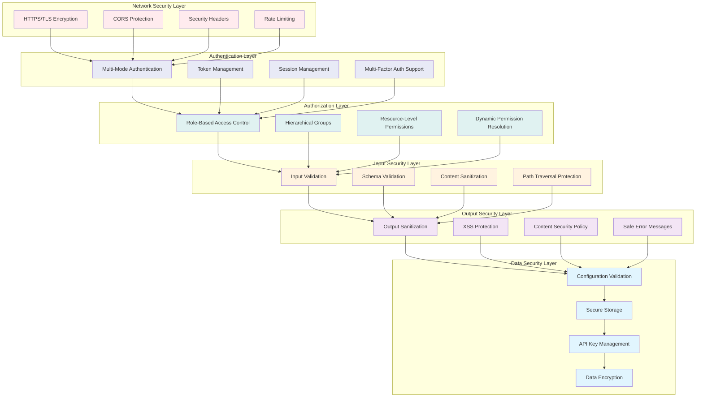
```mermaid
graph TB
    subgraph "Network Security Layer"
        HTTPS[HTTPS/TLS Encryption]
        CORS[CORS Protection]
        Headers[Security Headers]
        RateLimit[Rate Limiting]
    end
    
    subgraph "Authentication Layer"
        MultiAuth[Multi-Mode Authentication]
        TokenMgmt[Token Management]
        SessionMgmt[Session Management]
        MFA[Multi-Factor Auth Support]
    end
    
    subgraph "Authorization Layer"
        RBAC[Role-Based Access Control]
        GroupSystem[Hierarchical Groups]
        ResourceACL[Resource-Level Permissions]
        DynamicPerms[Dynamic Permission Resolution]
    end
    
    subgraph "Input Security Layer"
        InputValidation[Input Validation]
        SchemaValidation[Schema Validation]
        Sanitization[Content Sanitization]
        PathTraversal[Path Traversal Protection]
    end
    
    subgraph "Output Security Layer"
        OutputSanitization[Output Sanitization]
        XSSProtection[XSS Protection]
        CSPHeaders[Content Security Policy]
        SafeErrors[Safe Error Messages]
    end
    
    subgraph "Data Security Layer"
        ConfigValidation[Configuration Validation]
        SecureStorage[Secure Storage]
        KeyManagement[API Key Management]
        DataEncryption[Data Encryption]
    end
    
    HTTPS --> MultiAuth
    CORS --> MultiAuth
    Headers --> MultiAuth
    RateLimit --> MultiAuth
    
    MultiAuth --> RBAC
    TokenMgmt --> RBAC
    SessionMgmt --> RBAC
    MFA --> RBAC
    
    RBAC --> InputValidation
    GroupSystem --> InputValidation
    ResourceACL --> InputValidation
    DynamicPerms --> InputValidation
    
    InputValidation --> OutputSanitization
    SchemaValidation --> OutputSanitization
    Sanitization --> OutputSanitization
    PathTraversal --> OutputSanitization
    
    OutputSanitization --> ConfigValidation
    XSSProtection --> ConfigValidation
    CSPHeaders --> ConfigValidation
    SafeErrors --> ConfigValidation
    
    ConfigValidation --> SecureStorage
    SecureStorage --> KeyManagement
    KeyManagement --> DataEncryption
    
    classDef network fill:#ffebee
    classDef auth fill:#e8eaf6
    classDef authz fill:#e0f2f1
    classDef input fill:#fff3e0
    classDef output fill:#f3e5f5
    classDef data fill:#e1f5fe
    
    class HTTPS,CORS,Headers,RateLimit network
    class MultiAuth,TokenMgmt,SessionMgmt,MFA auth
    class RBAC,GroupSystem,ResourceACL,DynamicPerms authz
    class InputValidation,SchemaValidation,Sanitization,PathTraversal input
    class OutputSanitization,XSSProtection,CSPHeaders,SafeErrors output
    class ConfigValidation,SecureStorage,KeyManagement,DataEncryption data
```

### Security Threat Model and Mitigations

This diagram shows potential security threats and their corresponding mitigations.

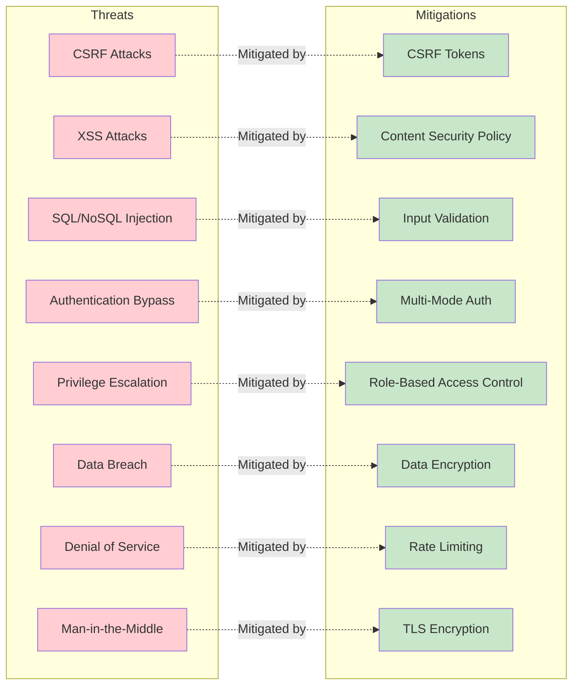
```mermaid
graph LR
    subgraph "Threats"
        CSRF[CSRF Attacks]
        XSS[XSS Attacks]
        Injection[SQL/NoSQL Injection]
        AuthBypass[Authentication Bypass]
        PrivEsc[Privilege Escalation]
        DataBreach[Data Breach]
        DoS[Denial of Service]
        MITM[Man-in-the-Middle]
    end
    
    subgraph "Mitigations"
        CSRFToken[CSRF Tokens]
        ContentPolicy[Content Security Policy]
        InputVal[Input Validation]
        MultiAuthMode[Multi-Mode Auth]
        RBAC[Role-Based Access Control]
        Encryption[Data Encryption]
        RateLimit[Rate Limiting]
        TLSEncryption[TLS Encryption]
    end
    
    CSRF -.->|Mitigated by| CSRFToken
    XSS -.->|Mitigated by| ContentPolicy
    Injection -.->|Mitigated by| InputVal
    AuthBypass -.->|Mitigated by| MultiAuthMode
    PrivEsc -.->|Mitigated by| RBAC
    DataBreach -.->|Mitigated by| Encryption
    DoS -.->|Mitigated by| RateLimit
    MITM -.->|Mitigated by| TLSEncryption
    
    classDef threats fill:#ffcdd2
    classDef mitigations fill:#c8e6c9
    
    class CSRF,XSS,Injection,AuthBypass,PrivEsc,DataBreach,DoS,MITM threats
    class CSRFToken,ContentPolicy,InputVal,MultiAuthMode,RBAC,Encryption,RateLimit,TLSEncryption mitigations
```

---

## Deployment Architectures

### Standard NPM Deployment

This diagram shows the traditional Node.js deployment architecture.

```mermaid
graph TB
    subgraph "Client Infrastructure"
        Browser[Web Browser]
        CDN[CDN (Optional)]
    end
    
    subgraph "Load Balancer Tier"
        LB[Load Balancer<br/>Nginx/HAProxy]
    end
    
    subgraph "Application Tier"
        Node1[Node.js Instance 1<br/>Port 3001]
        Node2[Node.js Instance 2<br/>Port 3002]
        Node3[Node.js Instance N<br/>Port 300N]
    end
    
    subgraph "Application Process"
        Primary[Primary Process]
        Worker1[Worker Process 1]
        Worker2[Worker Process 2]
        WorkerN[Worker Process N]
    end
    
    subgraph "Storage Tier"
        ConfigFiles[Configuration Files<br/>/contents]
        StaticFiles[Static Files<br/>/client/dist]
        Logs[Application Logs]
    end
    
    subgraph "External Services"
        LLMProviders[LLM Providers<br/>OpenAI, Anthropic, etc.]
        iFinder[iFinder System]
        AuthProviders[Auth Providers<br/>OIDC, LDAP]
    end
    
    Browser --> CDN
    CDN --> LB
    Browser --> LB
    
    LB --> Node1
    LB --> Node2
    LB --> Node3
    
    Node1 --> Primary
    Primary --> Worker1
    Primary --> Worker2
    Primary --> WorkerN
    
    Worker1 --> ConfigFiles
    Worker2 --> ConfigFiles
    WorkerN --> ConfigFiles
    
    Worker1 --> StaticFiles
    Worker2 --> StaticFiles
    WorkerN --> StaticFiles
    
    Worker1 --> LLMProviders
    Worker2 --> LLMProviders
    WorkerN --> LLMProviders
    
    Worker1 --> iFinder
    Worker2 --> iFinder
    WorkerN --> iFinder
    
    Worker1 --> AuthProviders
    Worker2 --> AuthProviders
    WorkerN --> AuthProviders
    
    classDef client fill:#e3f2fd
    classDef lb fill:#f3e5f5
    classDef app fill:#e8f5e8
    classDef process fill:#fff3e0
    classDef storage fill:#fce4ec
    classDef external fill:#e0f2f1
    
    class Browser,CDN client
    class LB lb
    class Node1,Node2,Node3 app
    class Primary,Worker1,Worker2,WorkerN process
    class ConfigFiles,StaticFiles,Logs storage
    class LLMProviders,iFinder,AuthProviders external
```

### Docker Deployment Architecture

This diagram shows the containerized deployment using Docker.

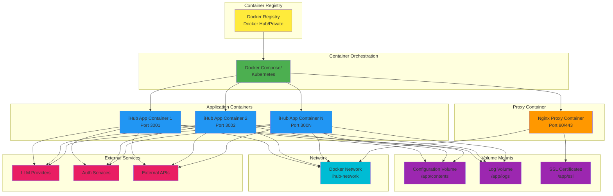
```mermaid
graph TB
    subgraph "Container Registry"
        Registry[Docker Registry<br/>Docker Hub/Private]
    end
    
    subgraph "Container Orchestration"
        Orchestrator[Docker Compose/<br/>Kubernetes]
    end
    
    subgraph "Application Containers"
        AppContainer1[iHub App Container 1<br/>Port 3001]
        AppContainer2[iHub App Container 2<br/>Port 3002]
        AppContainerN[iHub App Container N<br/>Port 300N]
    end
    
    subgraph "Proxy Container"
        Nginx[Nginx Proxy Container<br/>Port 80/443]
    end
    
    subgraph "Volume Mounts"
        ConfigVolume[Configuration Volume<br/>/app/contents]
        LogVolume[Log Volume<br/>/app/logs]
        SSLVolume[SSL Certificates<br/>/app/ssl]
    end
    
    subgraph "Network"
        AppNetwork[Docker Network<br/>ihub-network]
    end
    
    subgraph "External Services"
        LLMs[LLM Providers]
        Auth[Auth Services]
        External[External APIs]
    end
    
    Registry --> Orchestrator
    Orchestrator --> AppContainer1
    Orchestrator --> AppContainer2
    Orchestrator --> AppContainerN
    Orchestrator --> Nginx
    
    AppContainer1 --> AppNetwork
    AppContainer2 --> AppNetwork
    AppContainerN --> AppNetwork
    Nginx --> AppNetwork
    
    AppContainer1 --> ConfigVolume
    AppContainer2 --> ConfigVolume
    AppContainerN --> ConfigVolume
    
    AppContainer1 --> LogVolume
    AppContainer2 --> LogVolume
    AppContainerN --> LogVolume
    
    Nginx --> SSLVolume
    
    AppContainer1 --> LLMs
    AppContainer2 --> LLMs
    AppContainerN --> LLMs
    
    AppContainer1 --> Auth
    AppContainer2 --> Auth
    AppContainerN --> Auth
    
    AppContainer1 --> External
    AppContainer2 --> External
    AppContainerN --> External
    
    classDef registry fill:#ffeb3b
    classDef orchestration fill:#4caf50
    classDef containers fill:#2196f3
    classDef proxy fill:#ff9800
    classDef storage fill:#9c27b0
    classDef network fill:#00bcd4
    classDef external fill:#e91e63
    
    class Registry registry
    class Orchestrator orchestration
    class AppContainer1,AppContainer2,AppContainerN containers
    class Nginx proxy
    class ConfigVolume,LogVolume,SSLVolume storage
    class AppNetwork network
    class LLMs,Auth,External external
```

### Binary Deployment (Single Executable)

This diagram shows the self-contained binary deployment option.

```mermaid
graph TB
    subgraph "Binary Package"
        Executable[iHub Apps Binary<br/>Single Executable File]
        EmbeddedAssets[Embedded Static Assets]
        EmbeddedServer[Embedded Node.js Runtime]
    end
    
    subgraph "Runtime Environment"
        OS[Operating System<br/>Linux/Windows/macOS]
        ProcessManager[Process Manager<br/>systemd/PM2/Windows Service]
    end
    
    subgraph "External Configuration"
        ConfigDir[Configuration Directory<br/>/etc/ihub-apps or ./contents]
        EnvFile[Environment File<br/>.env]
        CertFiles[SSL Certificates<br/>Optional]
    end
    
    subgraph "Network Access"
        Port[Network Port<br/>3001 (configurable)]
        Firewall[Firewall Rules]
    end
    
    subgraph "External Dependencies"
        LLMProviders[LLM Providers<br/>Internet access required]
        AuthSystems[Authentication Systems<br/>OIDC/LDAP if used]
        FileSystem[File System Access<br/>For configuration and logs]
    end
    
    Executable --> EmbeddedAssets
    Executable --> EmbeddedServer
    
    EmbeddedServer --> OS
    OS --> ProcessManager
    ProcessManager --> Executable
    
    Executable --> ConfigDir
    Executable --> EnvFile
    Executable --> CertFiles
    
    Executable --> Port
    Port --> Firewall
    
    Executable --> LLMProviders
    Executable --> AuthSystems
    Executable --> FileSystem
    
    classDef binary fill:#ffeb3b
    classDef runtime fill:#4caf50
    classDef config fill:#2196f3
    classDef network fill:#ff9800
    classDef external fill:#9c27b0
    
    class Executable,EmbeddedAssets,EmbeddedServer binary
    class OS,ProcessManager runtime
    class ConfigDir,EnvFile,CertFiles config
    class Port,Firewall network
    class LLMProviders,AuthSystems,FileSystem external
```

---

## Data Flow Diagrams

### Configuration Data Flow

This diagram shows how configuration data flows through the system from files to runtime usage.

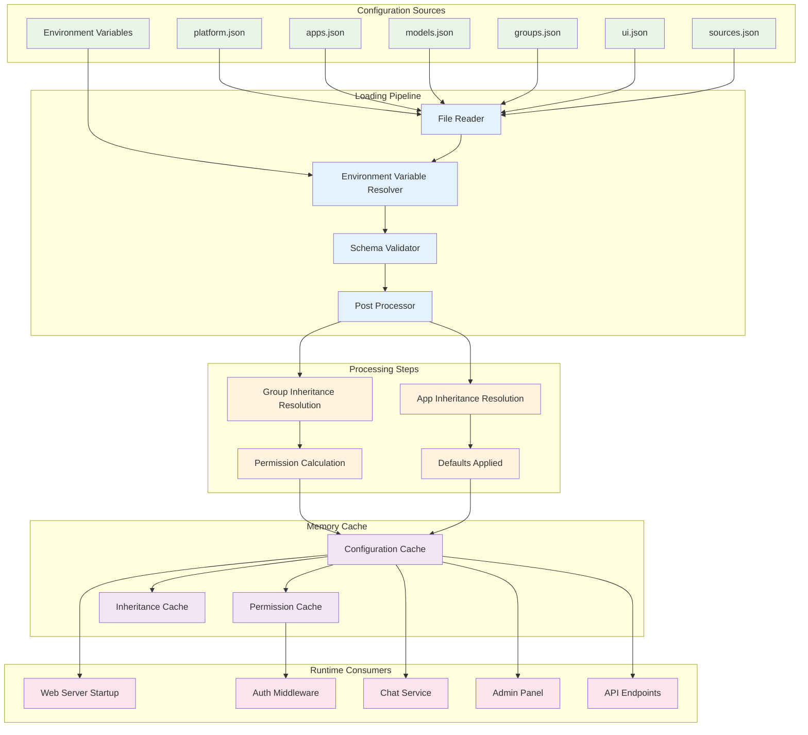
```mermaid
flowchart TD
    subgraph "Configuration Sources"
        PlatformJSON[platform.json]
        AppsJSON[apps.json]
        ModelsJSON[models.json]
        GroupsJSON[groups.json]
        UIJSON[ui.json]
        SourcesJSON[sources.json]
        EnvVars[Environment Variables]
    end
    
    subgraph "Loading Pipeline"
        FileReader[File Reader]
        EnvResolver[Environment Variable Resolver]
        Validator[Schema Validator]
        PostProcessor[Post Processor]
    end
    
    subgraph "Processing Steps"
        GroupInheritance[Group Inheritance Resolution]
        AppInheritance[App Inheritance Resolution]
        PermissionCalc[Permission Calculation]
        DefaultsApplied[Defaults Applied]
    end
    
    subgraph "Memory Cache"
        ConfigCache[Configuration Cache]
        PermissionCache[Permission Cache]
        InheritanceCache[Inheritance Cache]
    end
    
    subgraph "Runtime Consumers"
        WebServer[Web Server Startup]
        AuthMiddleware[Auth Middleware]
        ChatService[Chat Service]
        AdminPanel[Admin Panel]
        APIEndpoints[API Endpoints]
    end
    
    PlatformJSON --> FileReader
    AppsJSON --> FileReader
    ModelsJSON --> FileReader
    GroupsJSON --> FileReader
    UIJSON --> FileReader
    SourcesJSON --> FileReader
    EnvVars --> EnvResolver
    
    FileReader --> EnvResolver
    EnvResolver --> Validator
    Validator --> PostProcessor
    
    PostProcessor --> GroupInheritance
    PostProcessor --> AppInheritance
    GroupInheritance --> PermissionCalc
    AppInheritance --> DefaultsApplied
    
    PermissionCalc --> ConfigCache
    DefaultsApplied --> ConfigCache
    ConfigCache --> PermissionCache
    ConfigCache --> InheritanceCache
    
    ConfigCache --> WebServer
    PermissionCache --> AuthMiddleware
    ConfigCache --> ChatService
    ConfigCache --> AdminPanel
    ConfigCache --> APIEndpoints
    
    classDef source fill:#e8f5e8
    classDef pipeline fill:#e3f2fd
    classDef processing fill:#fff3e0
    classDef cache fill:#f3e5f5
    classDef consumers fill:#fce4ec
    
    class PlatformJSON,AppsJSON,ModelsJSON,GroupsJSON,UIJSON,SourcesJSON,EnvVars source
    class FileReader,EnvResolver,Validator,PostProcessor pipeline
    class GroupInheritance,AppInheritance,PermissionCalc,DefaultsApplied processing
    class ConfigCache,PermissionCache,InheritanceCache cache
    class WebServer,AuthMiddleware,ChatService,AdminPanel,APIEndpoints consumers
```

### Chat Message Data Flow

This diagram illustrates the complete data flow for chat messages from user input to LLM response.

```mermaid
flowchart TD
    subgraph "Client Side"
        UserInput[User Message Input]
        ChatUI[Chat UI Component]
        APIClient[API Client]
        MessageDisplay[Message Display]
    end
    
    subgraph "Server Processing"
        ExpressAPI[Express API Endpoint]
        AuthCheck[Authentication Check]
        RequestValidation[Request Validation]
        ChatService[Chat Service]
    end
    
    subgraph "Request Preparation"
        ConfigLoader[App Configuration Loader]
        TemplateProcessor[Message Template Processor]
        ContextBuilder[Context Builder]
        SourceResolver[Source Content Resolver]
    end
    
    subgraph "LLM Integration"
        AdapterSelection[LLM Adapter Selection]
        RequestBuilder[LLM Request Builder]
        APICall[LLM API Call]
        ResponseParser[Response Parser]
    end
    
    subgraph "Streaming & Tools"
        StreamHandler[Streaming Handler]
        ToolDetector[Tool Call Detector]
        ToolExecutor[Tool Executor]
        SourceHandler[Source Handler]
    end
    
    subgraph "Response Processing"
        ResponseFormatter[Response Formatter]
        ErrorHandler[Error Handler]
        SSEStream[Server-Sent Events]
        MessageStorage[Message Storage]
    end
    
    UserInput --> ChatUI
    ChatUI --> APIClient
    APIClient --> ExpressAPI
    
    ExpressAPI --> AuthCheck
    AuthCheck --> RequestValidation
    RequestValidation --> ChatService
    
    ChatService --> ConfigLoader
    ConfigLoader --> TemplateProcessor
    TemplateProcessor --> ContextBuilder
    ContextBuilder --> SourceResolver
    
    SourceResolver --> AdapterSelection
    AdapterSelection --> RequestBuilder
    RequestBuilder --> APICall
    APICall --> ResponseParser
    
    ResponseParser --> StreamHandler
    StreamHandler --> ToolDetector
    ToolDetector --> ToolExecutor
    ToolExecutor --> SourceHandler
    
    StreamHandler --> ResponseFormatter
    ResponseFormatter --> SSEStream
    SSEStream --> MessageDisplay
    
    ResponseParser --> ErrorHandler
    ErrorHandler --> ResponseFormatter
    
    ResponseFormatter --> MessageStorage
    
    classDef client fill:#e3f2fd
    classDef server fill:#f3e5f5
    classDef preparation fill:#e8f5e8
    classDef llm fill:#fff3e0
    classDef streaming fill:#fce4ec
    classDef response fill:#e0f2f1
    
    class UserInput,ChatUI,APIClient,MessageDisplay client
    class ExpressAPI,AuthCheck,RequestValidation,ChatService server
    class ConfigLoader,TemplateProcessor,ContextBuilder,SourceResolver preparation
    class AdapterSelection,RequestBuilder,APICall,ResponseParser llm
    class StreamHandler,ToolDetector,ToolExecutor,SourceHandler streaming
    class ResponseFormatter,ErrorHandler,SSEStream,MessageStorage response
```

### Source Content Data Flow

This diagram shows how source content is discovered, loaded, processed, and cached throughout the system.

```mermaid
flowchart TD
    subgraph "Source Discovery"
        LLMRequest[LLM Tool Request]
        SourceURL[Source URL/Reference]
        SchemeDetection[URL Scheme Detection]
        HandlerSelection[Handler Selection]
    end
    
    subgraph "Handler Processing"
        FileSystemHandler[File System Handler]
        URLHandler[URL Handler]
        IFinderHandler[iFinder Handler]
        PageHandler[Page Handler]
        CustomHandler[Custom Handler]
    end
    
    subgraph "Content Loading"
        SourceAccess[Source Access]
        ContentRetrieval[Content Retrieval]
        ErrorHandling[Error Handling]
        FallbackMechanism[Fallback Mechanism]
    end
    
    subgraph "Content Processing"
        ContentParser[Content Parser]
        MetadataExtraction[Metadata Extraction]
        FormatConversion[Format Conversion]
        Sanitization[Content Sanitization]
    end
    
    subgraph "Caching Layer"
        CacheCheck[Cache Check]
        TTLValidation[TTL Validation]
        CacheStorage[Cache Storage]
        CacheInvalidation[Cache Invalidation]
    end
    
    subgraph "Response Generation"
        ContentFormatting[Content Formatting]
        MetadataEnrichment[Metadata Enrichment]
        ToolResponse[Tool Response Generation]
        LLMDelivery[Delivery to LLM]
    end
    
    LLMRequest --> SourceURL
    SourceURL --> SchemeDetection
    SchemeDetection --> HandlerSelection
    
    HandlerSelection --> FileSystemHandler
    HandlerSelection --> URLHandler
    HandlerSelection --> IFinderHandler
    HandlerSelection --> PageHandler
    HandlerSelection --> CustomHandler
    
    FileSystemHandler --> SourceAccess
    URLHandler --> SourceAccess
    IFinderHandler --> SourceAccess
    PageHandler --> SourceAccess
    CustomHandler --> SourceAccess
    
    SourceAccess --> CacheCheck
    CacheCheck --> TTLValidation
    
    TTLValidation -->|Cache Miss| ContentRetrieval
    TTLValidation -->|Cache Hit| ContentFormatting
    
    ContentRetrieval --> ErrorHandling
    ErrorHandling --> FallbackMechanism
    FallbackMechanism --> ContentParser
    
    ContentParser --> MetadataExtraction
    MetadataExtraction --> FormatConversion
    FormatConversion --> Sanitization
    
    Sanitization --> CacheStorage
    CacheStorage --> ContentFormatting
    
    ContentFormatting --> MetadataEnrichment
    MetadataEnrichment --> ToolResponse
    ToolResponse --> LLMDelivery
    
    classDef discovery fill:#e8f5e8
    classDef handlers fill:#e3f2fd
    classDef loading fill:#f3e5f5
    classDef processing fill:#fff3e0
    classDef caching fill:#fce4ec
    classDef response fill:#e0f2f1
    
    class LLMRequest,SourceURL,SchemeDetection,HandlerSelection discovery
    class FileSystemHandler,URLHandler,IFinderHandler,PageHandler,CustomHandler handlers
    class SourceAccess,ContentRetrieval,ErrorHandling,FallbackMechanism loading
    class ContentParser,MetadataExtraction,FormatConversion,Sanitization processing
    class CacheCheck,TTLValidation,CacheStorage,CacheInvalidation caching
    class ContentFormatting,MetadataEnrichment,ToolResponse,LLMDelivery response
```

---

## Summary

These visual diagrams provide comprehensive coverage of the iHub Apps architecture, illustrating:

1. **System Overview**: High-level architecture and component relationships
2. **Server Architecture**: Detailed server components, clustering, and service architecture
3. **Client Architecture**: React application structure and dynamic content rendering
4. **Authentication & Authorization**: Multi-mode auth system and group inheritance
5. **Request Processing**: Complete request/response flow with error handling
6. **Source Handlers**: Source management system and content resolution
7. **Configuration Management**: Configuration loading, validation, and caching
8. **Security Architecture**: Multi-layer security model and threat mitigations
9. **Deployment Architectures**: NPM, Docker, and binary deployment options
10. **Data Flow**: Configuration, chat messages, and source content data flows

These diagrams are designed to help developers, administrators, and stakeholders understand the system architecture at various levels of detail, from high-level overviews to specific implementation details. They complement the detailed written documentation and provide visual references for system design, troubleshooting, and enhancement planning.

For more detailed information about any of these architectural components, refer to the comprehensive [Architecture Documentation](./architecture.md).