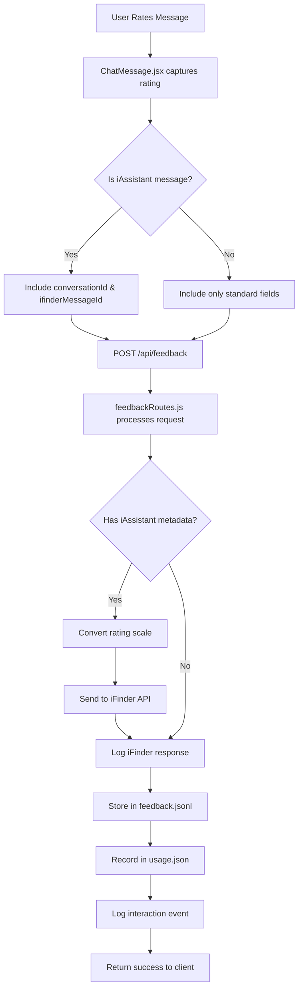

# Feedback Feature

**Comprehensive guide to the user feedback system for administrators**

This guide provides complete information about iHub Apps' feedback feature, including how it works, where feedback is stored, configuration options, integration with iAssistant, pseudonymisation, and everything an administrator needs to know.

## Table of Contents

1. [Overview](#overview)
2. [How Feedback Works](#how-feedback-works)
3. [Feedback Storage](#feedback-storage)
4. [Configuration](#configuration)
5. [iAssistant Integration](#iassistant-integration)
6. [Privacy and Pseudonymisation](#privacy-and-pseudonymisation)
7. [Accessing Feedback Data](#accessing-feedback-data)
8. [Usage Tracking Integration](#usage-tracking-integration)
9. [API Reference](#api-reference)
10. [Troubleshooting](#troubleshooting)

## Overview

The feedback feature allows users to rate AI-generated responses and provide optional textual feedback. This information helps administrators:

- **Monitor AI Response Quality**: Track user satisfaction with AI responses
- **Identify Issues**: Find problematic responses that require improvement
- **Analyze Performance**: Understand which apps, models, and conversations deliver the best results
- **Improve Training**: Use feedback data to refine AI configurations

### Key Features

- **Star Rating System**: Users can rate responses from 0.5 to 5 stars in 0.5-star increments
- **Optional Comments**: Users can provide detailed feedback text
- **iAssistant Integration**: Feedback for iAssistant messages automatically routes to iFinder API
- **Privacy-Preserving**: Supports anonymous, pseudonymous, and identified tracking modes
- **Dual Storage**: Feedback stored both locally (JSONL format) and in usage tracking system
- **Usage Analytics**: Integrated with the usage tracking dashboard

## How Feedback Works

### User Experience Flow

1. **User receives AI response** in any chat application
2. **User clicks the feedback button** (star icon) on the message
3. **Rating modal appears** with 5-star rating selector
4. **User selects rating** (0.5 to 5 stars)
5. **Optional text field** appears for additional comments
6. **User submits feedback** or closes the modal
7. **System stores feedback** and confirms submission

### Technical Flow



### Rating Scale

Users provide ratings on a 0.5 to 5 star scale:

| Stars | Meaning | iFinder Rating |
|-------|---------|----------------|
| 0.5 | Strongly negative | -100 |
| 1.0 | Very poor | -75 |
| 1.5 | Poor | -50 |
| 2.0 | Below average | -25 |
| 2.5 | Neutral | 0 |
| 3.0 | Satisfactory | 20 |
| 3.5 | Good | 40 |
| 4.0 | Very good | 60 |
| 4.5 | Excellent | 80 |
| 5.0 | Outstanding | 100 |

**Note**: For iAssistant integration, ratings are converted to iFinder's -100 to +100 scale using the formula:
- Ratings < 2.5: `Math.round(((rating - 2.5) / 2) * 100)`
- Rating = 2.5: `0`
- Ratings > 2.5: `Math.round(((rating - 2.5) / 2.5) * 100)`

## Feedback Storage

### Primary Storage: feedback.jsonl

Feedback is stored in **JSON Lines (JSONL)** format at:

```
contents/data/feedback.jsonl
```

Each line is a complete JSON object representing one feedback entry.

#### Storage Format

```json
{
  "timestamp": "2026-04-22T10:30:45.123Z",
  "messageId": "msg-abc123",
  "appId": "enterprise-chat",
  "chatId": "550e8400-e29b-41d4-a716-446655440000",
  "modelId": "gpt-4o",
  "rating": 4.5,
  "comment": "Very helpful response with clear examples",
  "contentSnippet": "The capital of France is Paris. Paris is located in the north-central part...",
  "conversationId": "conv-xyz789",
  "ifinderMessageId": "msg-ifinder-456",
  "baseUrl": "https://iassistant.company.com"
}
```

#### Field Descriptions

| Field | Type | Required | Description |
|-------|------|----------|-------------|
| `timestamp` | ISO 8601 string | Yes | When feedback was submitted |
| `messageId` | string | Yes | Unique identifier of the rated message |
| `appId` | string | Yes | ID of the app where message was generated |
| `chatId` | string | Yes | ID of the chat session |
| `modelId` | string | Yes | ID of the AI model that generated the response |
| `rating` | number | Yes | User's rating (0.5 to 5.0) |
| `comment` | string | No | User's optional text feedback |
| `contentSnippet` | string | No | First 300 characters of rated message |
| `conversationId` | string | No | iFinder conversation ID (iAssistant only) |
| `ifinderMessageId` | string | No | iFinder message ID (iAssistant only) |
| `baseUrl` | string | No | iFinder base URL (iAssistant only) |

### Secondary Storage: usage.json

Feedback aggregates are also stored in `contents/data/usage.json`:

```json
{
  "feedback": {
    "total": 1523,
    "ratings": {
      "1": 45,
      "2": 123,
      "3": 456,
      "4": 678,
      "5": 221
    },
    "averageRating": 3.8,
    "perUser": {
      "usr_a7f3b2...": {
        "total": 25,
        "ratings": { "1": 0, "2": 2, "3": 5, "4": 12, "5": 6 },
        "averageRating": 4.1
      }
    },
    "perApp": {
      "enterprise-chat": {
        "total": 450,
        "ratings": { "1": 10, "2": 35, "3": 150, "4": 200, "5": 55 },
        "averageRating": 3.7
      }
    },
    "perModel": {
      "gpt-4o": {
        "total": 890,
        "ratings": { "1": 20, "2": 60, "3": 250, "4": 400, "5": 160 },
        "averageRating": 3.9
      }
    }
  }
}
```

### Storage Characteristics

- **Append-Only**: Feedback is never deleted, only appended
- **Buffered Writes**: Feedback is queued and written every 10 seconds for performance
- **Atomic Operations**: File writes use atomic operations to prevent corruption
- **No Size Limits**: Files can grow indefinitely (consider log rotation for production)
- **Human-Readable**: JSONL format is easily parseable and debuggable

## Configuration

### Enable/Disable Feedback Tracking

Configure in `contents/config/platform.json`:

```json
{
  "features": {
    "feedbackTracking": true
  }
}
```

**Default**: `true` (enabled)

**When disabled**:
- Feedback API endpoint still accepts requests
- No data is written to `feedback.jsonl`
- Usage statistics are not updated
- iAssistant feedback still routes to iFinder (if configured)

### Usage Tracking Mode

Control user identification in feedback data:

```json
{
  "features": {
    "usageTrackingMode": "pseudonymous"
  }
}
```

**Available Modes**:

| Mode | Description | User Identifier | Reversible? |
|------|-------------|-----------------|-------------|
| `anonymous` | One-way hashed fingerprints | `usr_a7f3b2...` (SHA-256) | No - cannot identify users |
| `pseudonymous` | Session-based IDs | `session-{timestamp}-{random}` | Partially - requires correlation effort |
| `identified` | Real usernames/emails | `user@company.com` | Yes - directly identifies users |

**Default**: `pseudonymous`

**Migration Note**: Changing modes only affects new feedback entries. Existing data retains original identifiers.

### Rate Limiting

Feedback submissions respect the default API rate limits:

```json
{
  "rateLimit": {
    "default": {
      "windowMs": 60000,
      "limit": 100,
      "skipSuccessfulRequests": false,
      "skipFailedRequests": true
    }
  }
}
```

Users can submit up to 100 feedback entries per minute (shared with other API calls).

## iAssistant Integration

When using iAssistant (RAG-powered chat via iFinder), feedback automatically routes to the iFinder feedback API in addition to local storage.

### How It Works

1. **Message includes metadata**: iAssistant responses include `conversationId` and `ifinderMessageId`
2. **Client captures metadata**: `ChatMessage.jsx` includes these IDs in feedback submission
3. **Server detects iAssistant**: `feedbackRoutes.js` checks for presence of both IDs
4. **Rating conversion**: Converts 0.5-5 scale to iFinder's -100 to +100 scale
5. **API call**: Sends feedback to iFinder via `PUT /rag/api/v0/conversations/{conversationId}/messages/{messageId}/feedback`
6. **Dual storage**: Feedback stored both in iFinder AND locally

### Requirements

For iAssistant feedback to work:

- **User must be authenticated** (anonymous users skip iFinder routing)
- **iAssistant must be configured** in `platform.json`
- **Conversation metadata must exist** (conversationId and ifinderMessageId)
- **Network connectivity** to iFinder API endpoint

### iFinder API Details

**Endpoint**: `PUT /rag/api/v0/conversations/{conversationId}/messages/{messageId}/feedback`

**Request Format**:
```json
{
  "rating": 80,
  "comment": "Very helpful response"
}
```

**Rating Scale**: `-100` (strongly negative) to `+100` (strongly positive)

**Authentication**: JWT token using user context

### Error Handling

- **iFinder API failures** are logged but **do not prevent** local feedback storage
- Feedback continues to work even if iFinder is unreachable
- Error messages logged to server logs with component tag `feedbackRoutes`
- Client receives success response even if iFinder call fails

### Monitoring iAssistant Feedback

Check server logs for:

```bash
# Successful iFinder feedback routing
grep "Feedback sent to iFinder API" server.log

# Failed iFinder API calls
grep "Failed to send feedback to iFinder API" server.log

# Overall feedback tracking
grep "Feedback received" server.log | jq '.ifinderFeedbackSent'
```

## Privacy and Pseudonymisation

### Three Privacy Levels

#### 1. Anonymous Mode (Highest Privacy)

**Configuration**:
```json
{
  "features": {
    "usageTrackingMode": "anonymous"
  }
}
```

**How It Works**:
- User identifier is one-way hashed: `SHA-256(userId + pepper)`
- Pepper is server secret (from encryption key or `platform.json`)
- Result: `usr_a7f3b2c4d5e6f7g8h9i0j1k2l3m4n5o6p7q8r9s0`
- **Irreversible**: No way to determine which user submitted feedback

**Use Cases**:
- Organizations with strict privacy requirements
- GDPR compliance where user anonymity is critical
- Public-facing applications

**Limitations**:
- Cannot contact users about specific feedback
- Cannot correlate with user support tickets
- Cannot identify problematic user patterns

#### 2. Pseudonymous Mode (Default - Balanced Privacy)

**Configuration**:
```json
{
  "features": {
    "usageTrackingMode": "pseudonymous"
  }
}
```

**How It Works**:
- User identifier is session-based: `session-1640000000000-abc123xyz`
- Session IDs stored in browser localStorage
- Same user gets new ID if they clear browser data
- **Partially reversible**: Requires access to session logs and correlation effort

**Use Cases**:
- Most enterprise deployments
- Balance between analytics and privacy
- Ability to track patterns without direct identification

**Characteristics**:
- Same user across sessions: Different IDs
- Same browser session: Same ID
- Clearing cookies: New ID
- Different devices: Different IDs

#### 3. Identified Mode (Full Accountability)

**Configuration**:
```json
{
  "features": {
    "usageTrackingMode": "identified"
  }
}
```

**How It Works**:
- User identifier is actual username or email: `john.doe@company.com`
- Directly stored in all feedback and usage data
- **Fully reversible**: Direct user identification

**Use Cases**:
- Internal corporate applications
- Compliance requirements for audit trails
- Customer support integration
- User training and accountability

**Requirements**:
- Users must consent to identified tracking
- Data protection agreements must be in place
- GDPR compliance documentation required

### Switching Privacy Modes

**Important**: Changing privacy mode only affects **new** feedback entries.

**Migration Process**:

1. **Backup current data**:
   ```bash
   cp contents/data/feedback.jsonl contents/data/feedback.jsonl.backup
   cp contents/data/usage.json contents/data/usage.json.backup
   ```

2. **Update configuration**:
   ```json
   {
     "features": {
       "usageTrackingMode": "anonymous"
     }
   }
   ```

3. **Restart server** (or wait for hot-reload)

4. **Verify new mode**:
   ```bash
   # Check the Admin Usage Reports page
   # New entries should use the new identifier format
   ```

**Data Retention**:
- Old data with previous identifiers remains unchanged
- Mixed identifier types in same dataset
- Queries must handle multiple identifier formats

### GDPR Compliance

**Data Controller Responsibilities**:

1. **Inform users** about feedback collection and storage
2. **Obtain consent** for identified tracking mode
3. **Provide access** to user's own feedback data
4. **Enable deletion** of user's feedback upon request
5. **Document retention** policies and data processing

**Technical Measures**:

- **Default to pseudonymous**: Most privacy-preserving by default
- **No PII in content snippets**: First 300 chars only, no sensitive data detection
- **Optional comments**: Users choose what to share
- **Local storage**: Data stays on your infrastructure
- **Export capability**: JSON format for data portability

**Data Subject Rights**:

```bash
# Export user's feedback (requires identifier correlation)
grep "user@company.com" contents/data/feedback.jsonl > user_feedback.json

# Delete user's feedback (requires manual process or custom script)
# Not implemented by default - administrators must handle deletion requests
```

## Accessing Feedback Data

### Admin Dashboard

**Location**: Admin Panel → Usage Reports → Feedback Tab

**Features**:
- **Overview**: Total feedback count, average rating, distribution chart
- **Filters**: By app, model, user, date range
- **Visualization**: Star rating distribution histogram
- **Details**: Individual feedback entries with comments
- **Export**: Download as CSV or JSON

**Access Requirements**:
- User must have `adminAccess: true` in group permissions
- Navigate to `/admin/usage-reports`
- Select "Feedback" tab

### File System Access

#### Reading feedback.jsonl

```bash
# View all feedback
cat contents/data/feedback.jsonl

# Count total feedback entries
wc -l contents/data/feedback.jsonl

# View most recent 10 entries
tail -10 contents/data/feedback.jsonl | jq

# Filter by app
grep '"appId":"enterprise-chat"' contents/data/feedback.jsonl | jq

# Calculate average rating
jq -s 'map(.rating) | add / length' contents/data/feedback.jsonl

# Find feedback with comments
jq 'select(.comment != "")' contents/data/feedback.jsonl
```

#### Reading usage.json

```bash
# View feedback summary
jq '.feedback' contents/data/usage.json

# Get average rating
jq '.feedback.averageRating' contents/data/usage.json

# Top-rated app
jq '.feedback.perApp | to_entries | max_by(.value.averageRating)' contents/data/usage.json

# Ratings distribution
jq '.feedback.ratings' contents/data/usage.json
```

### API Access

#### GET /api/admin/usage (Feedback Summary)

**Authentication**: Requires admin access

**Response**:
```json
{
  "feedback": {
    "total": 1523,
    "ratings": {
      "1": 45,
      "2": 123,
      "3": 456,
      "4": 678,
      "5": 221
    },
    "averageRating": 3.8
  }
}
```

#### POST /api/admin/usage/export (Export Feedback)

**Authentication**: Requires admin access

**Request**:
```json
{
  "format": "csv",
  "type": "feedback",
  "dateRange": "30d"
}
```

**Response**: CSV file with feedback data

### Database Integration (Future)

Current implementation uses file-based storage. For production deployments with large volumes:

**Recommendations**:
1. **Log Rotation**: Rotate feedback.jsonl monthly
2. **Database Import**: Import JSONL into PostgreSQL/MongoDB for querying
3. **Analytics Platform**: Export to data warehouse for advanced analytics
4. **Real-time Processing**: Stream JSONL to Apache Kafka for real-time analysis

## Usage Tracking Integration

Feedback is tightly integrated with the usage tracking system:

### Shared Configuration

Both systems respect the same privacy settings:

```json
{
  "features": {
    "usageTracking": true,
    "feedbackTracking": true,
    "usageTrackingMode": "pseudonymous"
  }
}
```

### Dual Recording

Every feedback submission is recorded in **three places**:

1. **feedback.jsonl**: Detailed individual feedback entries
2. **usage.json**: Aggregated feedback statistics
3. **Interaction logs**: Structured event logging (if enabled)

### Usage Statistics

Feedback updates the following usage metrics:

```json
{
  "feedback": {
    "total": 1523,                    // Total feedback count
    "ratings": { ... },               // Rating distribution
    "averageRating": 3.8,            // Mean rating
    "perUser": { ... },              // Per-user aggregates
    "perApp": { ... },               // Per-app aggregates
    "perModel": { ... }              // Per-model aggregates
  }
}
```

### Legacy Compatibility

For backward compatibility, the system maintains legacy `good/bad` counts:

```json
{
  "feedback": {
    "good": 899,   // Ratings >= 4 stars
    "bad": 168     // Ratings <= 2 stars
  }
}
```

**Migration**: On first load, legacy thumbs up/down data is automatically converted to star ratings:
- Thumbs up → 5 stars
- Thumbs down → 1 star

## API Reference

### POST /api/feedback

Submit user feedback for an AI response.

#### Authentication

Required: User must be authenticated (anonymous users rejected)

#### Request Body

```json
{
  "messageId": "msg-abc123",
  "appId": "enterprise-chat",
  "chatId": "550e8400-e29b-41d4-a716-446655440000",
  "modelId": "gpt-4o",
  "rating": 4.5,
  "feedback": "Very helpful response",
  "messageContent": "The capital of France is Paris...",
  "conversationId": "conv-xyz789",
  "ifinderMessageId": "msg-ifinder-456"
}
```

#### Request Parameters

| Parameter | Type | Required | Description |
|-----------|------|----------|-------------|
| `messageId` | string | Yes | ID of the message being rated |
| `appId` | string | Yes | ID of the app |
| `chatId` | string | Yes | ID of the chat session |
| `modelId` | string | Yes | ID of the model |
| `rating` | number | Yes | Rating (0.5 to 5.0, in 0.5 increments) |
| `feedback` | string | No | Optional text feedback |
| `messageContent` | string | No | Snippet of message content |
| `conversationId` | string | No | iFinder conversation ID (iAssistant only) |
| `ifinderMessageId` | string | No | iFinder message ID (iAssistant only) |

#### Response

**Success (200 OK)**:
```json
{
  "success": true
}
```

**Error (400 Bad Request)**:
```json
{
  "error": "Missing required fields"
}
```

**Error (401 Unauthorized)**:
```json
{
  "error": "Authentication required"
}
```

**Error (500 Internal Server Error)**:
```json
{
  "error": "Error processing feedback"
}
```

#### Rate Limiting

- **Limit**: 100 requests per minute per user
- **Headers**: Standard rate limit headers included
- **Exceeded**: Returns 429 Too Many Requests

### Validation Schema

The feedback endpoint validates requests using Zod schema:

```javascript
{
  messageId: z.string(),
  appId: z.string(),
  chatId: z.string(),
  messageContent: z.string().optional(),
  rating: z.number().min(0.5).max(5).multipleOf(0.5),
  feedback: z.string().optional(),
  modelId: z.string().optional(),
  conversationId: z.string().optional(),
  ifinderMessageId: z.string().optional()
}
```

## Troubleshooting

### Common Issues

#### 1. Feedback Not Saving

**Symptoms**: User submits feedback but no data appears in `feedback.jsonl`

**Possible Causes**:
- `feedbackTracking` disabled in `platform.json`
- File system permissions issue
- Disk space full
- Server restart before flush interval (10 seconds)

**Solutions**:
```bash
# Check feature is enabled
jq '.features.feedbackTracking' contents/config/platform.json

# Check file permissions
ls -la contents/data/feedback.jsonl

# Check disk space
df -h

# Check server logs
grep "Failed to save feedback" server.log
```

#### 2. iAssistant Feedback Not Routing

**Symptoms**: Local feedback works but iFinder API doesn't receive it

**Possible Causes**:
- User is anonymous (iFinder routing skipped)
- Missing conversationId or ifinderMessageId
- Network connectivity to iFinder API
- JWT authentication failure
- iFinder API unavailable

**Solutions**:
```bash
# Check server logs for iFinder routing
grep "Feedback sent to iFinder API" server.log
grep "Failed to send feedback to iFinder API" server.log

# Verify user is authenticated
# Check that conversationId exists in feedback entry

# Test iFinder API connectivity
curl -I https://your-ifinder-instance.com/rag/api/v0

# Verify JWT configuration
jq '.iFinder.privateKey' contents/config/platform.json
```

#### 3. Rating Scale Confusion

**Symptoms**: Users report wrong ratings displayed

**Possible Causes**:
- Client/server rating scale mismatch
- Decimal precision issues
- Legacy thumbs up/down migration

**Solutions**:
- Verify client sends ratings in 0.5 increments (0.5, 1.0, 1.5, ..., 5.0)
- Check server accepts the exact rating value
- Review migration logs for legacy data conversion

#### 4. Permission Denied

**Symptoms**: Feedback submission returns 401 Unauthorized

**Possible Causes**:
- User not logged in
- Session expired
- JWT token invalid
- Authentication mode misconfigured

**Solutions**:
```bash
# Check authentication status in browser console
localStorage.getItem('authToken')

# Verify authentication mode
jq '.auth.mode' contents/config/platform.json

# Check session timeout
jq '.auth.sessionTimeoutMinutes' contents/config/platform.json

# Review authentication logs
grep "Authentication failed" server.log
```

#### 5. Missing Feedback in Dashboard

**Symptoms**: Feedback exists in files but not visible in admin dashboard

**Possible Causes**:
- Dashboard cache not refreshed
- Date range filter too narrow
- User ID format mismatch
- File read permissions

**Solutions**:
- Refresh browser page
- Expand date range filter to "All Time"
- Check file permissions on `feedback.jsonl` and `usage.json`
- Restart server to reload usage data

### Performance Issues

#### Large feedback.jsonl File

**Problem**: File becomes too large to process efficiently

**Solutions**:

1. **Log Rotation**:
   ```bash
   # Rotate monthly
   mv contents/data/feedback.jsonl contents/data/feedback-2026-04.jsonl
   touch contents/data/feedback.jsonl
   ```

2. **Compression**:
   ```bash
   # Compress old files
   gzip contents/data/feedback-2026-*.jsonl
   ```

3. **Database Migration**:
   ```bash
   # Import to PostgreSQL
   cat feedback.jsonl | jq -c | psql -d ihub -c "COPY feedback FROM STDIN CSV QUOTE E'\x01' DELIMITER E'\x02'"
   ```

#### Slow Dashboard Loading

**Problem**: Admin dashboard takes too long to load feedback data

**Solutions**:
- Implement pagination in dashboard queries
- Pre-compute aggregates in background job
- Add database indexes for common queries
- Cache dashboard data with expiration

### Debugging Tips

#### Enable Debug Logging

```json
{
  "debug": {
    "logLevel": "debug",
    "enableRequestLogging": true,
    "enableResponseLogging": true
  }
}
```

#### Monitor Feedback Flow

```bash
# Watch feedback file in real-time
tail -f contents/data/feedback.jsonl | jq

# Count feedback by hour
jq -r '.timestamp | split("T")[1] | split(":")[0]' feedback.jsonl | sort | uniq -c

# Monitor server logs
tail -f logs/server.log | grep -i feedback
```

#### Test Feedback Submission

```bash
# Test API endpoint
curl -X POST http://localhost:3000/api/feedback \
  -H "Authorization: Bearer YOUR_JWT_TOKEN" \
  -H "Content-Type: application/json" \
  -d '{
    "messageId": "test-msg-123",
    "appId": "test-app",
    "chatId": "test-chat",
    "modelId": "gpt-4o",
    "rating": 4.5,
    "feedback": "Test feedback"
  }'
```

### Getting Help

If you encounter issues not covered here:

1. **Check server logs**: `logs/server.log` for detailed error messages
2. **Review configuration**: Validate `platform.json` syntax
3. **Test connectivity**: Verify network access to external services
4. **Consult documentation**: Check related docs (authentication, usage tracking, iAssistant)
5. **Report issues**: Open GitHub issue with logs and configuration (redact sensitive data)

## Best Practices

### For Administrators

1. **Regular Backups**: Backup `feedback.jsonl` and `usage.json` regularly
2. **Monitor Growth**: Track file sizes and implement rotation before issues arise
3. **Privacy Compliance**: Document and communicate tracking mode to users
4. **Data Retention**: Define and enforce feedback data retention policies
5. **Access Control**: Limit admin dashboard access to authorized personnel
6. **Performance Monitoring**: Watch for slow feedback queries and optimize as needed

### For Production Deployments

1. **Use Pseudonymous Mode**: Balance privacy and analytics
2. **Implement Log Rotation**: Prevent unbounded file growth
3. **Database Backend**: Consider migrating to PostgreSQL for large volumes
4. **Caching Strategy**: Cache aggregated feedback statistics
5. **Rate Limiting**: Protect against feedback spam or abuse
6. **Monitoring Alerts**: Alert on feedback API errors or high failure rates

### For Privacy-Sensitive Environments

1. **Enable Anonymous Mode**: Use one-way hashing for user identifiers
2. **Minimal Content Snippets**: Consider disabling or truncating content snippets
3. **Data Minimization**: Only collect essential feedback fields
4. **Audit Logging**: Track who accesses feedback data in admin dashboard
5. **Encryption at Rest**: Encrypt `feedback.jsonl` file system mount
6. **Regular Reviews**: Audit feedback data collection and usage practices

## Summary

The feedback feature provides comprehensive user satisfaction tracking with:

- **Flexible privacy**: Anonymous, pseudonymous, or identified modes
- **Dual storage**: Local files and usage aggregates
- **iAssistant integration**: Automatic routing to iFinder API
- **Admin dashboard**: Visual analytics and export capabilities
- **API access**: Programmatic feedback submission and retrieval

For most deployments, the default pseudonymous mode with local file storage provides an excellent balance of functionality, privacy, and performance. Advanced deployments can customize privacy settings, implement database backends, and integrate with external analytics platforms.
