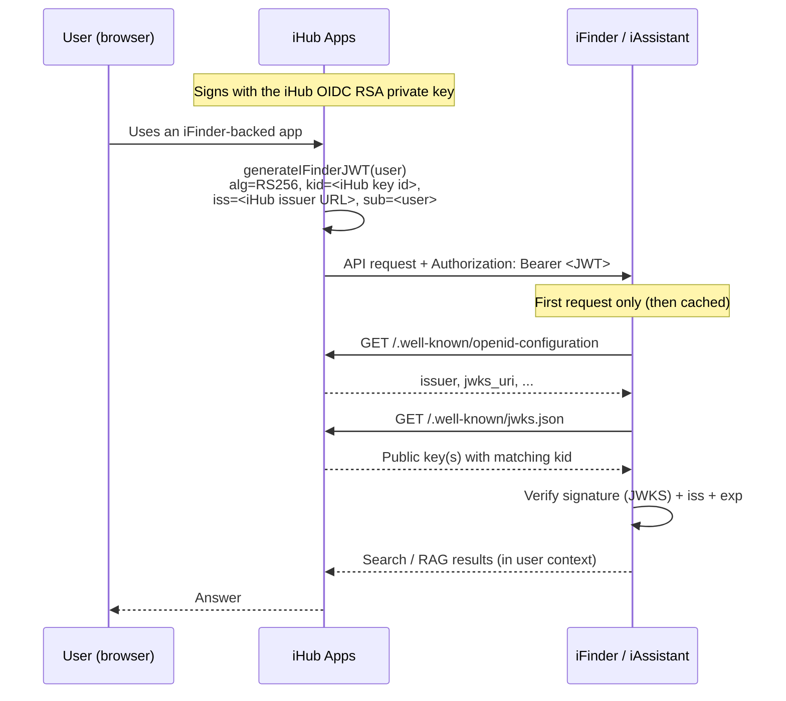

# iFinder Keyless (OIDC/OAuth) JWT Integration

> **This is the recommended way to connect iHub Apps to iFinder / iAssistant.**
> It replaces the manual RSA key generation and exchange described in
> [iFinder JWT Key Generation](ifinder-jwt-key-generation.md). No key pair has
> to be created, no public key has to be copied into iFinder — the whole trust
> relationship is established through configuration alone.

## Table of Contents

1. [Overview](#overview)
2. [Why Keyless?](#why-keyless)
3. [How It Works](#how-it-works)
4. [Prerequisites](#prerequisites)
5. [Step 1 — Configure iHub Apps](#step-1--configure-ihub-apps)
6. [Step 2 — Configure iFinder](#step-2--configure-ifinder)
7. [Step 3 — Verify the Connection](#step-3--verify-the-connection)
8. [Token Structure](#token-structure)
9. [Migrating from Manual Key Exchange](#migrating-from-manual-key-exchange)
10. [Configuration Reference](#configuration-reference)
11. [Troubleshooting](#troubleshooting)
12. [Related Documentation](#related-documentation)

## Overview

iHub Apps calls the iFinder / iAssistant APIs on behalf of the logged-in user.
Every request carries a short-lived JWT that identifies that user. iFinder must
be able to verify that the token was really issued by iHub and has not been
tampered with.

There are two ways to establish that trust:

| Approach | How iFinder gets the verification key | Key management |
|---|---|---|
| **Keyless / OIDC (recommended)** | iFinder fetches iHub's public key at runtime from iHub's JWKS endpoint (`/.well-known/jwks.json`) | None — nothing to generate or copy |
| Manual key exchange (legacy) | An operator generates an RSA key pair, gives the private key to iHub and uploads the public key into iFinder | Manual generation, distribution, and rotation |

The keyless approach reuses the RSA key pair that iHub already maintains for its
OpenID Connect / OAuth server. That key pair is published — public half only —
at the standard JWKS endpoint, exactly the way any OIDC identity provider
publishes its signing keys. iFinder, which is a Spring Boot application, already
knows how to consume an OIDC provider's discovery and JWKS endpoints, so pointing
it at iHub is all that is required.

## Why Keyless?

- **Nothing to generate.** No `openssl genpkey`, no PEM files, no
  `IFINDER_PRIVATE_KEY`.
- **Nothing to exchange.** The public key is never emailed, copied, or checked
  into a config repository. iFinder pulls it over HTTPS when it needs it.
- **Automatic rotation.** When iHub's signing key changes, iFinder picks up the
  new key from the JWKS endpoint automatically (keys are matched by their `kid`).
  There is no coordinated "rotate on both sides" procedure.
- **Standards-based.** iFinder validates iHub tokens the same way it would
  validate tokens from Entra ID, Keycloak, or any other OIDC provider.
- **One key, one source of truth.** The token that goes to iFinder is signed with
  the same key iHub uses for its own OIDC tokens, so there is only one key to back
  up and protect (`contents/rsa_private.pem`).

## How It Works



1. A user triggers an iFinder tool (search, get content, …) or an iAssistant
   RAG conversation inside iHub.
2. iHub mints a JWT for that user, signing it with its **OIDC RSA private key**
   using `RS256`. The JWT header includes a `kid` (key id) that matches the key
   published at iHub's JWKS endpoint, and the `iss` (issuer) claim is iHub's
   public base URL.
3. iHub sends the token to iFinder in the `Authorization: Bearer …` header.
4. On the first token it sees, iFinder reads iHub's discovery document
   (`/.well-known/openid-configuration`), learns the `jwks_uri`, and downloads
   the public key(s). It caches them and only refetches when it encounters an
   unknown `kid`.
5. iFinder verifies the signature against the public key, checks that `iss`
   matches its configured `issuer-uri`, and checks expiry. If everything lines
   up, the request runs in the user's context.

Because the public key travels from iHub to iFinder over HTTPS on demand, there
is no manual key exchange step.

## Prerequisites

- **iHub Apps** reachable from iFinder over HTTPS at a stable, public base URL
  (this is the URL iFinder will fetch `/.well-known/*` from).
- **RS256 signing** — iHub's default JWT algorithm. The JWKS endpoint only
  publishes a key when `platform.jwt.algorithm` is `RS256` (the default). If it
  was changed to `HS256`, switch it back to `RS256` first.
- **Administrative access** to both the iHub Admin UI and the iFinder Spring
  configuration.
- **iFinder** must recognize the user identity that iHub puts in the token's
  `sub` claim (see [JWT Subject](#configuration-reference)). This is the same
  identity requirement as the legacy approach.

You do **not** need to fully turn iHub into an OAuth identity provider
(`oauth.enabled`) just for iFinder verification. The `/.well-known/jwks.json`
and `/.well-known/openid-configuration` endpoints are always served, and the RSA
key pair is created automatically on first startup. The only OAuth setting that
matters here is the **issuer URL** (below).

## Step 1 — Configure iHub Apps

### Option A — Admin UI (recommended)

1. Open **Admin → iFinder Integration**.
2. Enable the integration and set the **iFinder Base URL**.
3. Tick **"Use iHub OIDC Keypair for JWT signing"**.
4. Confirm the **Effective OAuth Issuer URL** shown below the toggle is your
   iHub public URL (see the important note below about setting it explicitly).
5. Set the **JWT Audience** (default `ifinder-api`), **Default Scope**
   (e.g. `fa_index_read`), and the **JWT Subject Field** that matches the
   identity iFinder expects (usually `email`).
6. Save. The UI prints the exact iFinder configuration to paste on the iFinder
   side (also shown in [Step 2](#step-2--configure-ifinder)).

When keyless mode is on, the private key, algorithm, and issuer text fields
disappear — they are no longer used.

### Option B — `platform.json`

```json
{
  "oauth": {
    "issuer": "https://your-ihub-instance.com"
  },
  "iFinder": {
    "enabled": true,
    "baseUrl": "https://your-ifinder-instance.com",
    "useOidcKeyPair": true,
    "audience": "ifinder-api",
    "defaultScope": "fa_index_read",
    "jwtSubjectField": "email",
    "tokenExpirationSeconds": 3600
  }
}
```

`platform.json` changes to the `iFinder` block are picked up automatically. The
`oauth.issuer` change (server behavior/auth) requires a **server restart**.

### ⚠️ Important: set the OAuth Issuer URL explicitly

When `useOidcKeyPair` is enabled, iHub stamps the token's `iss` claim from
`platform.oauth.issuer`. **This value must be an absolute URL** (starting with
`http`/`https`) and must be identical to the `issuer-uri` you configure on the
iFinder side.

Token signing happens outside of any HTTP request, so iHub **cannot
auto-detect** the public host at signing time. The "Auto-detected" issuer shown
in the Admin UI is only used for display and for the discovery document served
on live requests — it is **not** used when minting the iFinder token. If
`oauth.issuer` is left unset, the token's `iss` silently falls back to the
literal string `ihub-apps`, which is **not** a URL and will **not** match
iFinder's `issuer-uri`, causing every token to be rejected.

**Always set `oauth.issuer` to your iHub public base URL** (Admin →
Authentication → OAuth Server, or the `oauth.issuer` key in `platform.json`)
before relying on keyless iFinder tokens. iHub logs a warning at token-signing
time if this is misconfigured:

```
iFinder useOidcKeyPair is enabled but platform.oauth.issuer is not a URL.
iFinder JWT issuer will not match OIDC Discovery.
```

If iHub sits behind a reverse proxy, set `oauth.issuer` to the **external**
URL that iFinder will use to reach iHub, not the internal hostname.

## Step 2 — Configure iFinder

iFinder is a Spring Boot application using Spring Security's OAuth2 resource
server. Point it at iHub's issuer and enable resource-server validation:

```yaml
# iFinder application configuration
intrafind:
  security:
    auth:
      enable-oauth2-resource-server: true

spring:
  security:
    oauth2:
      resourceserver:
        jwt:
          # iFinder auto-discovers /.well-known/openid-configuration and the
          # JWKS endpoint from this issuer URL. Must match iHub oauth.issuer.
          issuer-uri: https://your-ihub-instance.com
          # Which JWT claim identifies the user. Match iHub's jwtSubjectField.
          principal-claim-name: email
```

What each setting does:

- **`enable-oauth2-resource-server: true`** turns on JWT validation for incoming
  API calls.
- **`issuer-uri`** is the single most important value. Spring appends
  `/.well-known/openid-configuration` to it, reads the `jwks_uri`, downloads the
  public key, and from then on validates every token's signature, `iss`, and
  `exp` automatically. It must be **byte-for-byte identical** to iHub's
  `oauth.issuer` (mind the trailing slash).
- **`principal-claim-name`** tells iFinder which claim to treat as the username.
  Use the claim iHub populates via its **JWT Subject Field** — typically `email`.
  For Microsoft Entra ID-backed identities, `email` is the safe choice.

### Alternative: point directly at the JWKS endpoint

If you prefer not to rely on discovery, you can point iFinder straight at the
key set instead of the issuer:

```yaml
spring:
  security:
    oauth2:
      resourceserver:
        jwt:
          jwk-set-uri: https://your-ihub-instance.com/.well-known/jwks.json
```

With `jwk-set-uri`, Spring validates the signature and expiry but does **not**
enforce an issuer match by default. `issuer-uri` is preferred because it also
pins the issuer.

## Step 3 — Verify the Connection

### From iHub

- In **Admin → iFinder Integration**, click **Test iFinder** (and **Test
  iAssistant**). A green result means iHub could reach iFinder and the token was
  accepted.
- Confirm the endpoints iFinder will read are reachable and, for RS256, return a
  key:

  ```bash
  curl https://your-ihub-instance.com/.well-known/openid-configuration
  curl https://your-ihub-instance.com/.well-known/jwks.json
  ```

  The JWKS response must contain a key with a `kid`. An empty `keys: []` array
  means iHub is not signing with RS256 — fix `platform.jwt.algorithm` first.

### From iFinder

Enable Spring Security debug logging while testing:

```yaml
logging:
  level:
    org.springframework.security: DEBUG
    org.springframework.security.oauth2: TRACE
```

A successful validation logs the resolved principal (the value of your
`principal-claim-name` claim). Signature, issuer, or expiry failures are logged
here too.

## Token Structure

A keyless iFinder token looks like this:

```json
{
  "header": {
    "alg": "RS256",
    "typ": "JWT",
    "kid": "e67f5e39d283ddec"
  },
  "payload": {
    "sub": "user.email@example.com",
    "name": "User Name",
    "iat": 1643723400,
    "exp": 1643727000,
    "iss": "https://your-ihub-instance.com",
    "aud": "ifinder-api",
    "scope": "fa_index_read"
  }
}
```

Compared with the legacy manual-key token, two things change automatically when
`useOidcKeyPair` is on:

- **`kid`** is added to the header, matching the key published at
  `/.well-known/jwks.json`, so iFinder can select the right key.
- **`iss`** becomes the iHub issuer **URL** (from `oauth.issuer`) instead of the
  literal `ihub-apps`, so it validates against OIDC discovery.

The same token is used for both the iFinder tools and the iAssistant RAG
integration.

## Migrating from Manual Key Exchange

If you already run iFinder with a manually exchanged key pair, switch over like
this:

1. **iHub:** set `oauth.issuer` to your public URL, enable
   `iFinder.useOidcKeyPair`, and save. You can leave the old `privateKey` /
   `privateKeyRef` in place — it is ignored while keyless mode is on.
2. **iFinder:** replace the `public-key-location` configuration with
   `issuer-uri` (or `jwk-set-uri`) as shown in [Step 2](#step-2--configure-ifinder).
3. **Restart** iFinder (and iHub, since `oauth.issuer` is an auth setting) and
   run the connection test.
4. Once verified, you can remove the old public key file from iFinder and delete
   the `IFINDER_PRIVATE_KEY` env var / `iFinder.privateKey` value from iHub.

Because iFinder now trusts iHub's OIDC signing key, no future key rotation
requires touching iFinder — new keys are discovered through JWKS.

> **Breaking-change note:** the two mechanisms are mutually exclusive per
> environment. While `useOidcKeyPair` is `true`, the manually configured private
> key is not used. Plan the cutover so iHub and iFinder are switched together.

## Configuration Reference

### iHub Apps — `platform.json`

| Setting | Where | Purpose | Required for keyless |
|---|---|---|---|
| `iFinder.enabled` | iFinder block | Enables the integration | Yes |
| `iFinder.baseUrl` | iFinder block | iFinder / iAssistant instance URL | Yes |
| `iFinder.useOidcKeyPair` | iFinder block | Sign with the iHub OIDC RSA key and advertise via JWKS | **Yes — set `true`** |
| `oauth.issuer` | oauth block | Absolute URL stamped into the token `iss`; must equal iFinder `issuer-uri` | **Yes — must be a URL** |
| `iFinder.audience` | iFinder block | `aud` claim (default `ifinder-api`) | Optional |
| `iFinder.defaultScope` | iFinder block | `scope` claim (e.g. `fa_index_read`) | Optional |
| `iFinder.jwtSubjectField` | iFinder block | Which user field becomes `sub` (`email`, `username`, `domain\\username`, or a `${user.field}` template) | Recommended |
| `iFinder.tokenExpirationSeconds` | iFinder block | Token TTL (default `3600`) | Optional |
| `platform.jwt.algorithm` | jwt block | Must be `RS256` (default) so JWKS is populated | Yes (default) |

Settings that are **ignored** while `useOidcKeyPair` is `true`:
`iFinder.privateKey`, `iFinder.privateKeyRef`, `IFINDER_PRIVATE_KEY`,
`iFinder.algorithm`, and `iFinder.issuer` (the OIDC issuer URL is used instead).

### iFinder — Spring Boot

| Property | Value | Purpose |
|---|---|---|
| `intrafind.security.auth.enable-oauth2-resource-server` | `true` | Turn on JWT validation |
| `spring.security.oauth2.resourceserver.jwt.issuer-uri` | iHub public URL | Discover keys and pin the issuer |
| `spring.security.oauth2.resourceserver.jwt.principal-claim-name` | `email` (or your subject claim) | Map the JWT to a user |

## Troubleshooting

### "Invalid issuer" / token rejected

The token `iss` must exactly equal iFinder's `issuer-uri`. Common causes:

- `oauth.issuer` was never set on iHub, so `iss` fell back to `ihub-apps`. Set
  `oauth.issuer` to your public URL and restart iHub.
- Trailing-slash mismatch (`https://host` vs `https://host/`). Make both sides
  identical.
- iHub is behind a reverse proxy and `oauth.issuer` points at the internal host
  while iFinder uses the external host. Use the external URL on both sides.

### JWKS endpoint returns `{ "keys": [] }`

iHub is not signing with RS256. Set `platform.jwt.algorithm` back to `RS256`
(the default) and restart. HS256 (symmetric) keys cannot be published via JWKS.

### "Unable to find a signing key" / unknown `kid`

iFinder's cached key set is stale, or iHub's RSA keys were regenerated. iFinder
refreshes on an unknown `kid`; if it does not, restart iFinder to force a
refetch. Note that losing / regenerating `contents/rsa_private.pem` on iHub
invalidates all previously issued tokens.

### iFinder cannot reach `/.well-known/*`

Check network path and TLS from the iFinder host to iHub:

```bash
curl -v https://your-ihub-instance.com/.well-known/openid-configuration
```

Firewalls, split-horizon DNS, or a proxy that rewrites `Host` headers are the
usual culprits.

### "iFinder JWT requires authenticated user"

Anonymous users cannot use iFinder. Ensure the user is logged in to iHub. This
is unrelated to the signing mode.

### Wrong user resolved in iFinder

`principal-claim-name` on iFinder must match the claim iHub fills via
`jwtSubjectField`. If iHub sends `sub = email` but iFinder reads `sub` as an
opaque id, set `principal-claim-name: email` (or align the two).

## Related Documentation

- [iFinder Integration](iFinder-Integration.md) — full feature and tool reference
- [iFinder & iAssistant Admin Guide](ifinder-iassistant-admin-guide.md) — end-to-end admin setup
- [iFinder JWT Key Generation](ifinder-jwt-key-generation.md) — legacy manual key-exchange approach
- [Using iHub as an OIDC Identity Provider](ihub-as-oidc-idp.md) — the same JWKS/discovery machinery for other clients
- [JWT Well-Known Endpoints](jwt-well-known-endpoints.md) — JWKS and discovery endpoint details, key management

---

_Last updated: July 2026_
