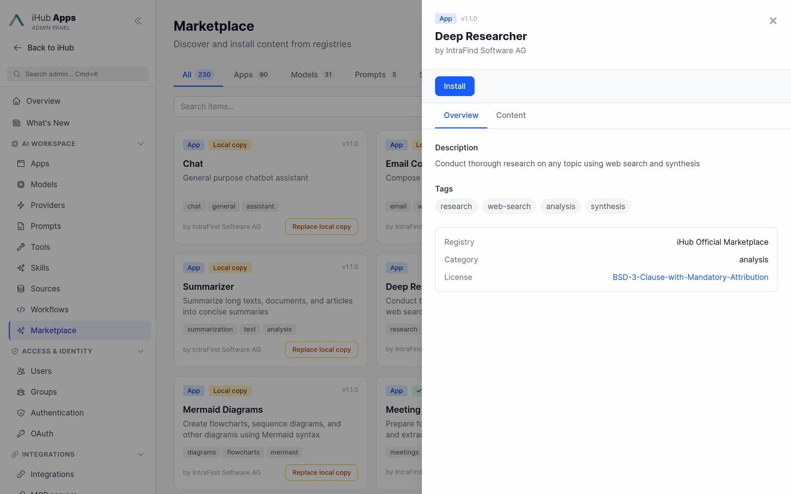
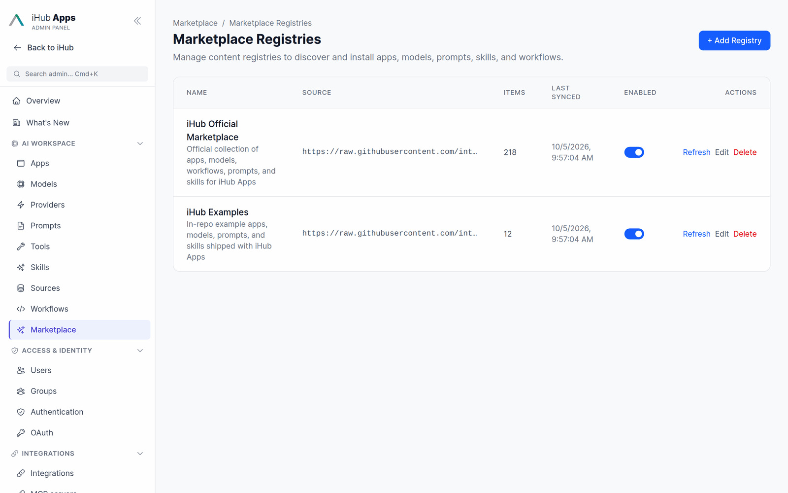

# Marketplace

The marketplace installs apps, models, prompts, skills and workflows from **registries** — catalogs
published as a `catalog.json` file, for example in a Git repository. Admins browse the catalogs in
**Admin → Marketplace**, read what an item does and install it with one click. iHub keeps track of
what it installed, so an item can later be updated, uninstalled or handed over to manual
maintenance.

## Enabling

The marketplace is a **preview** feature and is off by default. Switch it on under
**Admin → Platform → Features → Marketplace** (`features.marketplace` in `contents/config/features.json`).
The **Marketplace** entry then appears in the admin sidebar under **AI Workspace**.

## Shipped registries

Two registries are preconfigured in `contents/config/registries.json`:

| Registry                      | Catalog                                                                                     | Content |
| ----------------------------- | ------------------------------------------------------------------------------------------- | ------- |
| **iHub Official Marketplace** | `https://raw.githubusercontent.com/intrafind/ihub-marketplace/main/catalog.json`           | 90 apps (21 general apps and 69 department assistants for data, engineering, finance, HR, security, leadership, legal, marketing, operations, product, PR, sales and support), 98 skills, 19 model configurations, 6 workflows, 5 prompts |
| **iHub Examples**             | `https://raw.githubusercontent.com/intrafind/ihub-apps/main/examples/catalog.json`         | Example apps, models (such as the [AWS Bedrock](models.md#aws-bedrock) models), prompts and skills from this repository |

The official catalog can also be browsed without an iHub installation at
[intrafind.github.io/ihub-marketplace](https://intrafind.github.io/ihub-marketplace/). Its source is
the [intrafind/ihub-marketplace](https://github.com/intrafind/ihub-marketplace) repository.

Both registries are fetched on demand. If the catalog is empty the first time you open the
marketplace, press **Refresh** on the registry under **Manage Registries**. The installation needs
outbound HTTPS access to the catalog host (see [Proxy Configuration](proxy-configuration.md) for
installations behind a proxy).

## Browsing

The tabs filter by type and show how many items each type has. The search box matches names and
descriptions; the two selectors narrow the list to one registry and to a status.

Each card shows the item's type, version, tags, author and its state:

| State                | Meaning                                                                                                     | Action                                    |
| -------------------- | ----------------------------------------------------------------------------------------------------------- | ----------------------------------------- |
| *(none)*             | Available in the registry, not on this installation                                                         | **Install**                               |
| **Installed**        | Installed from the marketplace and tracked                                                                   | **Update** (when the catalog has a newer version), **Uninstall**, **Detach** |
| **Local copy**       | An item with the same id already exists here but was not installed from the marketplace — a shipped default or something an admin created | **Replace local copy** (asks for confirmation) |

Click a card to open its details: description, tags, registry, category and license (linked to the
license text when the catalog provides one). The **Content** tab previews the item itself — the app
or model JSON, or a skill's `SKILL.md`.

## Installing, updating and removing

- **Install** fetches the item, validates it against the same schema the admin editors use, and
  writes it to `contents/` (`apps/`, `models/`, `prompts/`, `workflows/` or `skills/<name>/`). The
  item's id must equal its catalog name. The installation is recorded in
  `contents/config/installations.json` together with the version, the registry and the admin who
  installed it, and written to the audit log.
- **Model configurations never carry API keys.** An installed model uses the key of its provider
  (**Admin → Providers**) or the provider's environment variable. A model that replaces an existing
  one keeps that one's API key and its `default` flag.
- Installed content behaves like any other: who can use an app, model, prompt or skill is decided by
  the [group permissions](admin-ui.md#managing-groups), and it can be edited in its admin page.
- **Update** replaces the installed item with the catalog's current version. An update is offered
  when the catalog's `version` differs from the installed one. Local edits to the item are
  overwritten — **Detach** it first if you want to keep them.
- **Uninstall** deletes the item's files and the installation record.
- **Detach** keeps the files but removes the installation record. The item is then maintained by
  hand like anything an admin created, and the marketplace shows it as **Local copy**.

## Registries

**Admin → Marketplace → Manage Registries** lists the configured registries with their item count
and last sync. **Refresh** re-fetches a catalog, **Edit** changes it, and the toggle takes a
registry out of browsing without deleting it.

**Add Registry** asks for:

| Field            | Notes                                                                                           |
| ---------------- | ----------------------------------------------------------------------------------------------- |
| Name, ID         | The ID is a lowercase slug (`a-z`, `0-9`, `-`)                                                  |
| Catalog URL      | The URL of the `catalog.json` (or of the directory that holds it)                               |
| Authentication   | **None**, **Bearer Token**, **Basic Auth** or **Custom Header** — for private catalogs, e.g. a private GitHub repository read with a token |
| Auto Refresh     | Re-fetch the catalog periodically, every 1–168 hours (default 24)                               |

**Test Connection** fetches the catalog with the entered values before you save. Credentials are
stored encrypted with the other platform secrets.

### Publishing your own registry

A registry is a `catalog.json` that lists the items and where to fetch each one from — a path
relative to the catalog, a file in a GitHub repository, or an absolute URL. Every item carries a
`type` (`app`, `model`, `prompt`, `skill` or `workflow`), a `name`, a display name, a description,
a version and optional author, category, tags, license and `licenseUrl`. The schema is described
in [Configuration Validation → Catalog Schema](configuration-validation.md#9-catalog-schema-catalogschemajs);
the [ihub-marketplace](https://github.com/intrafind/ihub-marketplace) repository is a complete
example, including a script that regenerates the catalog from its content folders.

A private registry is a good way to roll the same apps, prompts and skills out to several iHub
installations — for example a test and a production system, or one installation per subsidiary.

## Multi-server deployments

Installations write to `contents/` and to `contents/config/installations.json`. With several
servers on separate hosts, run installs and updates against one host (or a CI job) — see
[Multi-Server Deployment → Marketplace installs](multi-server-deployment.md#marketplace-installs).

## API

All routes are admin-only and require the marketplace feature:

| Method & path                                                                 | Purpose                                     |
| ----------------------------------------------------------------------------- | ------------------------------------------- |
| `GET /api/admin/marketplace`                                                  | Browse items (type, search, registry, status filters) |
| `GET /api/admin/marketplace/registries/:registryId/items/:type/:name`         | One item with its content preview           |
| `POST …/items/:type/:name/_install`                                            | Install (`{ "replaceLocal": true }` to replace a local copy) |
| `POST …/items/:type/:name/_update` · `_uninstall` · `_detach`                  | Update, uninstall, detach                   |
| `GET /api/admin/marketplace/installations`                                    | What the marketplace installed              |
| `GET /api/admin/marketplace/updates`                                          | Installed items with a newer catalog version |
| `GET` · `POST /api/admin/marketplace/registries`                              | List, create registries                     |
| `GET` · `PUT` · `DELETE /api/admin/marketplace/registries/:registryId`        | Read, edit, delete a registry               |
| `POST /api/admin/marketplace/registries/:registryId/_refresh`                 | Re-fetch a catalog                          |
| `POST /api/admin/marketplace/registries/_test` · `/:registryId/_test`         | Test an unsaved or a saved registry         |

## Code map

| File                                                   | Responsibility                                        |
| ------------------------------------------------------ | ----------------------------------------------------- |
| `server/services/marketplace/RegistryService.js`       | Fetching, caching and refreshing catalogs             |
| `server/services/marketplace/ContentInstaller.js`      | Install, update, uninstall, detach; the installations manifest |
| `server/validators/catalogSchema.js`                   | Catalog schema                                        |
| `server/validators/registryConfigSchema.js`            | Registry configuration schema                         |
| `server/routes/admin/marketplace.js`                   | The HTTP surface                                      |
| `client/src/features/admin/pages/AdminMarketplacePage.jsx` | Browse page                                       |
| `client/src/features/admin/components/marketplace/`    | Cards, detail panel, type tabs, registry form         |
