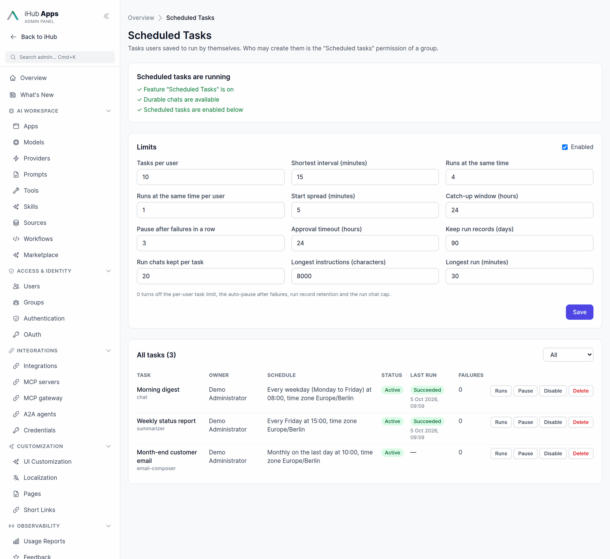

# Scheduled Tasks

A scheduled task is a saved prompt that runs by itself: every weekday at 08:00,
once next Tuesday, every two hours, on the last day of the month, or only when
its owner presses **Run now**. It runs **as its owner**, against one of their
apps, with that app's tools, integrations, sources, skills, workflows and
apps-as-tools. Every run becomes its own chat, so the result is read like any
other conversation — and continued, if the owner wants to follow up. A task can
also **remember between runs**: it keeps notes, reads them and its earlier runs
at the start of a run, and tells you only what is new
([Memory and earlier runs](#memory-and-earlier-runs)).

The feature ships as a **preview** and is off by default.


## Enabling

All of these have to hold before anyone sees the feature:

| Condition                                  | Where it comes from                                                      |
| ------------------------------------------ | ------------------------------------------------------------------------ |
| `features.scheduledTasks` is on            | Admin → Platform → Features → **Scheduled Tasks** (preview, off by default) |
| Durable chats work                         | `features.chatPersistence` on and storage up — see [Chat Persistence](chat-persistence.md) |
| `platform.scheduledTasks.enabled !== false` | `contents/config/platform.json`, or Admin → Scheduled Tasks → Settings    |
| The user's groups grant `scheduledTasks`   | Admin → Groups → permissions                                             |

The client learns the combined answer from `GET /api/configs/platform`
(`scheduledTasks.enabled`); the per-user permission comes with
`/api/auth/status` (`permissions.scheduledTasks`). With the feature off, the
**Scheduled tasks** entry, the `/tasks` pages and the admin page are not there
at all.

**Who may create tasks.** Migration V138 grants the permission to `admins`,
`users` and `authenticated`, and sets it to `false` for `anonymous`; custom
groups are left alone, and a value an admin already set is never overwritten.
The permission inherits like every other group permission. Independent of the
groups, a task always needs a signed-in, interactive user: anonymous visitors,
OAuth clients, agents and delegated tokens are refused (`401
AUTHENTICATION_REQUIRED` / `403 INTERACTIVE_USER_REQUIRED`).

A user whose permission is withdrawn can still **read, pause and delete** the
tasks they own; they can no longer create, edit, run or resume them, and their
active tasks pause on their next run (`PERMISSION_REVOKED`).

### Platform limits

`platform.json → scheduledTasks`, written with its defaults by migration V138
and editable in Admin → Scheduled Tasks → Settings. Changes apply without a
restart.

| Key                        | Default | Meaning                                                                 |
| -------------------------- | ------- | ----------------------------------------------------------------------- |
| `enabled`                  | `true`  | Second switch under the feature flag                                    |
| `maxTasksPerUser`          | `10`    | Tasks one user may own (`409 TASK_LIMIT_REACHED` beyond it)             |
| `minIntervalMinutes`       | `15`    | Shortest gap between two runs; enforced on the server for every schedule type, cron included |
| `maxConcurrentRuns`        | `4`     | Runs executing at once, across the installation                         |
| `maxConcurrentRunsPerUser` | `1`     | Runs executing at once for one owner; the rest wait in the queue         |
| `staggerMinutes`           | `5`     | Each task starts up to this many minutes after its slot, by a stable per-task offset, so "08:00" does not start every task at the same second |
| `catchUpWindowHours`       | `24`    | How old a missed slot may be and still get one catch-up run             |
| `maxConsecutiveFailures`   | `3`     | Failed runs in a row after which a task pauses itself (`0` = never)      |
| `approvalTimeoutHours`     | `24`    | How long a run waits for an approval before it fails                    |
| `runRetentionDays`         | `90`    | Run history older than this is deleted by the daily sweep               |
| `maxRunChatsPerTask`       | `20`    | Run chats kept per task; older ones are deleted after each run           |
| `maxInstructionLength`     | `8000`  | Characters in a task's instructions                                     |
| `maxRunMinutes`            | `30`    | Wall-clock limit of one run                                             |
| `memoryEnabled`            | `true`  | Switch for task memory across the installation: off, tasks run without notes (the notes are kept) |
| `memoryMaxChars`           | `8000`  | Size limit of one task's notes, 1000–64000 characters                    |
| `maxHistoryReadChars`      | `8000`  | How much of an earlier run's answer a run gets back from `get_task_run`, 1000–50000 |

## Creating a task

There are three ways in, and all of them end on the same form:


- **Scheduled tasks → New task** (`/tasks/new`). Name, app, model (the app's
  default unless the app allows choosing), the app's variables, instructions,
  schedule, tools and when to notify.
- **Schedule this…** on a message you sent in a chat. The form opens
  prefilled with that message, the chat's app and the tools that were on.
- **Ask the app.** An app that offers the [scheduling tools](#scheduling-tools-in-apps)
  can draft a task from "every weekday at 8, summarize my open Jira tickets".
  The assistant only **proposes**: a confirmation card in the chat shows the
  name, schedule, next runs and instructions, and nothing is saved until the
  user presses **Save** (or **Edit in form**). A card that was saved stays
  saved — reloading the chat does not offer to save it twice.

The instructions are sent on every run as a complete prompt. To have a run
follow a [skill](skills.md), write `/skill-name` in the instructions, as in a
chat message — for example `/inbox-triage Brief me on yesterday's mail.` The
skill must be one the task's owner can use in the task's app.

Without **Remember between runs**, a run does not see earlier runs, so a prompt
that wants "what changed since last time" uses the run variables (with it, the
task has [notes and earlier runs](#memory-and-earlier-runs) to compare
against):

| Variable                     | Value                                                        |
| ---------------------------- | ------------------------------------------------------------ |
| `{{task_name}}`              | The task's name                                              |
| `{{run_time}}`               | When this run started, in the task's time zone               |
| `{{scheduled_time}}`         | The slot this run is for (when it was requested, for **Run now**) |
| `{{run_number}}`             | 1 for the first run, counting every run that executed          |
| `{{run_trigger}}`            | `schedule`, `manual` or `catch-up`                           |
| `{{last_run_at}}`            | When the previous run started, or `never`                    |
| `{{last_successful_run_at}}` | When the last successful run started, or `never`             |
| `{{timezone}}`               | The task's time zone                                         |

App variables (the app's own `variables`) are filled in once on the form and
sent with every run.

## Schedules

| Type       | Example                                   | Fields                                   |
| ---------- | ----------------------------------------- | ---------------------------------------- |
| `manual`   | Only when started by hand                 | —                                        |
| `once`     | 2026-10-06 09:00                          | `at`                                     |
| `interval` | Every 2 hours; every 3 days at 07:00      | `every`, `unit` (`minutes`/`hours`/`days`), `time` (days only) |
| `daily`    | Every day at 07:30                        | `time`                                   |
| `weekdays` | Monday to Friday at 08:00                 | `time`                                   |
| `weekly`   | Monday and Thursday at 17:00              | `days` (0 = Sunday … 6), `time`          |
| `monthly`  | On the 1st and 15th; on the last day      | `daysOfMonth` (1–31 and/or `"last"`), `time` |
| `cron`     | `0 8 * * 1-5`                             | `cron` (5 fields)                        |

Every schedule except `manual` and `once` also takes an optional `startAt`,
`endAt` and `maxRuns`. All of them carry a `timezone` (an IANA name; the
browser's by default).

- **Wall-clock time is kept across DST.** "Every day at 08:00 Europe/Berlin"
  is 06:00 UTC in summer and 07:00 UTC in winter. A time that does not exist on
  the spring-forward day still runs that day, once, after the gap; one that
  happens twice in autumn runs once, the first time.
- **The 29th to 31st fall back to the last day** of a shorter month, so
  "monthly on the 31st" runs on 30 April and 28/29 February rather than
  skipping them.
- **Intervals are anchored.** An interval counts from the moment it was saved
  (or its `startAt`), and editing anything but the interval keeps that anchor
  — renaming a task does not move its slots.
- **The minimum interval is enforced on the server**, for cron too: a pattern
  whose runs come closer than `minIntervalMinutes` is refused
  (`BELOW_MIN_INTERVAL`).
- **The form previews the schedule** through `POST /api/scheduled-tasks/_preview`:
  a sentence ("Every weekday at 08:00, time zone Europe/Berlin") and the next
  runs, or the reason it is invalid. The same sentence and the next five runs
  appear on the task page.

## Runs

Each run starts a **new durable chat** in the task's app, titled
"<task name> · <date>", with `origin: { createdVia: 'scheduled-task', taskId,
runId, taskName }`. The chat shows a banner — "Scheduled run of <task> ·
<time>" with a link back to the task — and can be continued like any chat.


A run that finished while nobody was watching is **unread**: the chat carries
the usual unseen dot in *Recents* and the chat list, the **Scheduled tasks**
entry in the sidebar counts the unseen runs, and a toast announces it on the
next page the owner opens. Opening the run's chat clears all of it. **Notify
me** on the task chooses between *after every run*, *only when a run fails*,
*only when something changed* and *never*. *Only when something changed* needs
**Remember between runs**; see [Notify only when something changed](#notify-only-when-something-changed).

### Run history

The task page lists every run, newest first: status, trigger, scheduled and
start time, duration, the reason for anything but a success, and a link to the
chat.


| Status              | Meaning                                                                 |
| ------------------- | ----------------------------------------------------------------------- |
| `queued`            | Claimed and waiting for a free slot in the runner                       |
| `running`           | The turn is producing                                                  |
| `awaiting_approval` | Paused on a tool that needs the owner's approval — see [Approvals](#approvals) |
| `succeeded`         | The turn finished without an error. Open the chat to see whether it did what you wanted. |
| `failed`            | The turn errored, an integration needs reconnecting, or an approval timed out |
| `skipped`           | The slot did not run: the previous run was still going, the owner lost access, or the scheduler was down |
| `cancelled`         | Stopped by the owner, an admin, or a rejected approval                  |

**Run now** queues a run immediately (`manual`); it is refused while another run
of the same task is in progress (`409 RUN_IN_PROGRESS`).

### Exactly one run per slot

The scheduler runs on the cluster's scheduler-lock owner — one worker across
the installation, with failover when it goes away. A slot is claimed with a
compare-and-set on the task document before its run is created, so a slot
produces one run even while ownership moves between workers. What happens to a
slot:

- **On time** (found within 10 minutes of its start): it runs (`schedule`).
- **The previous run is still going:** the slot is recorded as `skipped`
  (`PREVIOUS_RUN_ACTIVE`). Runs of one task never overlap.
- **Missed** — the server was down, or no worker owned the scheduler: the most
  recent missed slot runs **once** as a `catch-up` if it is inside
  `catchUpWindowHours`; the others are recorded as a single `skipped` run with
  the count (`MISSED`). A task whose schedule fired forty times while the
  server was down produces one catch-up run, not forty.
- **A run in progress when the server stopped** is marked `failed`
  (`INTERRUPTED`) when the scheduler comes back. The worker executing a run
  holds a lease on it and renews it while the run goes on; a run is only taken
  for interrupted once that lease ran out (about three minutes after its worker
  stopped). A worker that lost the scheduler lock but is still executing keeps
  its run, and a worker that finds its run settled elsewhere stops it and
  stores nothing more.

### Runs act as the owner

A run is not a system job. Before every run the owner is looked up again and
their permissions are resolved **fresh** from their groups. For a local account
those are the memberships in `users.json` right now, so removing the owner from
a group takes effect on the next run. For an OIDC, LDAP, NTLM or proxy account
they are the groups the owner had when they last saved the task, because the
identity provider can only be asked at sign-in; the group permissions those
groups carry are still read fresh.

- The owner's account was deactivated or deleted → the task is **disabled**.
  An external account counts as deleted when `users.json` held a record of it
  when the task was last saved and no longer does; one that never had a record
  (it signs in without one) is not checked this way.
- The owner lost the `scheduledTasks` permission, the app, the model or a tool
  the task uses → the run is `skipped` and the task **paused**, with the reason
  on the task page (`PERMISSION_REVOKED`, `APP_NOT_ACCESSIBLE`,
  `MODEL_NOT_ACCESSIBLE`, `TOOL_NOT_AVAILABLE`, …). Resuming it runs the same
  checks.
- An integration that needs signing in again (an expired Jira token, for
  example) fails the run with `INTEGRATION_RECONNECT_REQUIRED` and a
  **Reconnect** link, rather than reporting a success whose answer apologises.

Runs are unattended, so the model is told so: it does not ask questions or wait
for confirmation, and the `ask_user` clarification does not pause a run. Usage
is recorded under the owner with source `scheduled-task`, and ledger runs carry
the trigger `{ type: 'schedule', source: 'scheduled-task' }`.

### Completion and auto-pause

- A `once` task becomes **completed** after its run; so does a task that
  reached its `maxRuns` or `endAt`, or whose schedule has no future slot.
- A task pauses itself after `maxConsecutiveFailures` failed runs in a row
  (`TOO_MANY_FAILURES`, with the last error).
- A paused task keeps its history and does nothing until it is resumed. A
  resumed task continues with its next future slot; it does not replay what
  it missed while paused.

## Memory and earlier runs

By default a run starts from nothing. Tick **Remember between runs** on the
task form and the task gets **notes** that live between its runs, for a prompt
like "what are the latest features of openwebui? summarize each" that should
report only what is new since last week.

The notes are plain markdown, stored for the task and its owner. They are the
same memory that [agents](agents.md#memory-pipeline-memory-compose--memory-finalize)
have: the same tools (`read_memory`, `write_memory`), the same version check
on every write, the same editor for reading and editing them.

What a run with memory does:

1. **It starts with the notes.** They are added to the run's system prompt
   (never to the stored chat) as data, not instructions, together with the
   instruction to inform itself first: read the notes, call `list_task_runs`
   and read the last successful run with `get_task_run` — what it reported and
   anything the owner replied in that chat — and then report only what is new
   or changed.
2. **It can read earlier runs.** `list_task_runs` lists the earlier runs of
   this task (newest first, default 5, at most 20) and `get_task_run` returns
   what one of them answered, optionally with the conversation that followed
   in its chat. Nothing is copied: the answer is read from the run's chat, so
   a run whose chat was deleted or aged out says so. Only the task's own runs,
   and only for its owner, can be read. Both tools exist only inside a run.
3. **Its notes are updated after it.** When a run succeeds, one more model
   call without tools rewrites the notes from the run's answer: what was
   reported (as a compact watermark, not the report), open follow-ups, the
   owner's preferences. The model does not have to remember to write them.
   `write_memory` stays available in the run for something that must survive
   even a failing run. The extra call is part of the run's usage.

The notes are never wiped by the update: an answer that cannot be read, a model
error or a result over the size limit (after one more try) leaves them as they
were, and a run that fails does not touch them. When the owner edits the notes
while a run is going — at any point of it, also during the update itself — the owner's edit
stays and the run's update is dropped. A run that is stopped while its notes are being updated
ends as cancelled and leaves them alone.
The run's row on the task page says what happened (*Memory updated*, *No
changes*).

A model that cannot call tools — no tool support, or Gemini with Google
search, which drops every function tool — still gets its notes and the
instruction, and its notes are still updated afterwards.

### Notify only when something changed

With **Notify me → Only when something changed (and on failures)**, a run that
the update found to report nothing new is marked as seen and creates no
notification — a weekly "anything new?" task stays quiet on the weeks nothing
happened. A failed run always notifies, and so does a run whose update could not
tell (the owner is told rather than missing something). The option needs
memory: the form disables it while **Remember between runs** is off, and the
API refuses it (`NOTIFY_CHANGES_NEEDS_MEMORY`).

### Keeping and clearing notes

- **Reading and editing.** The owner reads and edits the notes in the *Memory*
  card on the task page. A save carries the version it started from; if a run
  changed the notes in the meantime the editor says so and lets the owner
  reload or keep editing, instead of overwriting the run's update.
- **Clearing.** *Clear* empties the notes. If you changed what the task does,
  clear them so the task does not keep reporting as if nothing changed.
  Someone who may no longer create tasks can still read and clear the notes
  of tasks they own.
- **Switching off** keeps the notes; they are just not used until memory is on
  again. **Duplicating** a task copies the setting, not the notes; the copy
  starts empty. **Deleting** the task deletes its notes.
- **Admins** see only metadata (size, version, last update, who wrote last)
  in Admin → Scheduled Tasks, and can clear the notes. They cannot read them.
- **Size.** `memoryMaxChars` applies to every write. The notes in the prompt
  are cut at the limit, with a marker, if a limit was lowered after they were
  written.
- **Scheduling tools.** A proposal card from `schedule_task` and
  `update_scheduled_task` can carry `memory` and shows it; the model is told
  that memory exists and is off by default.

## Approvals

A tool whose definition sets `"requiresApproval": true` does not run
unattended. When a run reaches it:

1. The call is not executed. The run pauses as `awaiting_approval` and a
   durable approval is raised.
2. The owner answers from the run's chat (the banner shows **Approve** /
   **Reject**) or from the task page. **Always allow for this task** approves
   and remembers the tool for this task.
3. An approval continues the same run in the same chat; a rejection cancels it
   (`APPROVAL_REJECTED`). No answer within `approvalTimeoutHours` fails it
   (`APPROVAL_TIMED_OUT`).

Tools remembered with *always allow* are listed under **Allowed without
asking** on the task page, each with a **Revoke** button. No tool shipped with
iHub sets `requiresApproval`; an admin adds it to the tools whose side effects
should not happen unattended (creating tickets, sending mail, …).

## Scheduling tools in apps

Five tools let an app manage the user's tasks from a conversation. They are
**opt-in**: an app offers them only when its `tools` list names them, and only
to users who may use scheduled tasks.

| Tool                      | What it does                                                                     |
| ------------------------- | -------------------------------------------------------------------------------- |
| `schedule_task`           | Proposes a new task. Nothing is saved; the user confirms on a card.              |
| `list_scheduled_tasks`    | Lists the user's tasks with their schedules and next runs.                       |
| `update_scheduled_task`   | Pausing and resuming apply directly; any other change is proposed on a card.     |
| `delete_scheduled_task`   | Proposes deleting a task; the user confirms on a card.                           |
| `run_scheduled_task_now`  | Starts a run of one of the user's tasks.                                         |

Inside a scheduled run, `schedule_task`, `delete_scheduled_task` and
`run_scheduled_task_now` are withheld — a task cannot multiply itself — and
`update_scheduled_task` may only pause the task that is running or change its
schedule (proposed, as always). Two more tools exist only inside a run of a task
that keeps memory: `list_task_runs` and `get_task_run`
([Memory and earlier runs](#memory-and-earlier-runs)). The model is told the user's local time and
time zone whenever `schedule_task` or `update_scheduled_task` is on, so
"tomorrow at 9" lands where the user means it.

## Administration

**Admin → Scheduled Tasks** (`/admin/scheduled-tasks`) lists every user's tasks
with owner, schedule, status, last run and consecutive failures, shows which
of the feature's conditions currently hold, and edits the platform limits.


`GET /api/admin/scheduled-tasks` also reports which worker runs the scheduler
and what it has queued. An admin can **pause**, **disable** (the owner cannot resume
it) or **delete** any task and read its run history. An admin never runs a task
or edits what it does — a run always acts as its owner. For a task that keeps
memory the list also shows the notes' size, version and last update; an admin
can clear them but never read them.

Every change is written to the audit log (Admin → Audit Log) with resource
`scheduledTask`: create, update, delete, pause/resume (`toggle`), run now
(`execute`), and the admin's pause/disable/delete and settings changes. Edits and
clears of a task's notes are logged as `scheduledTaskMemory`, without their content.

## Workflow schedule triggers use the same scheduler

A workflow's `triggers: [{ "id": "digest", "type": "schedule", "cron": "0 8 * *
1-5", "timezone": "Europe/Berlin" }]` now runs on the same scheduler as tasks,
instead of one in-memory cron per trigger created at boot (see
[Workflows](workflows.md#schedule-triggers)):

- Adding, editing or deleting a workflow's schedule **applies without a
  restart**.
- The next run is computed with the same time zone and DST rules as tasks.
- As before, the workflow runs as the non-privileged `system` principal, and a
  slot missed while the server was down is **skipped**, not caught up.

Webhook triggers are unchanged.

## API

All under `/api/scheduled-tasks`, authenticated, and scoped to the caller's own
tasks — an id that is not theirs is a 404.

| Method & path                                  | Purpose                                            |
| ---------------------------------------------- | -------------------------------------------------- |
| `GET /`                                        | The caller's tasks and their limits                |
| `POST /`                                       | Create                                             |
| `POST /_preview`                               | Validate a schedule, describe it, list next runs   |
| `GET /_notifications`                          | Runs the caller has not seen                       |
| `POST /_notifications/seen`                    | Mark them seen                                     |
| `GET /_apps/:appId/tools`                      | The tools a task of this app may use               |
| `GET` · `PUT` · `PATCH` · `DELETE /:taskId`    | Read, edit, delete (`?deleteChats=1` removes the run chats too) |
| `POST /:taskId/run` · `/pause` · `/resume` · `/duplicate` | Run now, pause, resume, copy            |
| `GET /:taskId/runs` · `/runs/:runId`           | Run history (cursor-paged), one run                |
| `POST /:taskId/runs/:runId/cancel`             | Stop a queued, running or waiting run              |
| `POST /:taskId/runs/:runId/approval`           | `{ decision: 'approve' \| 'reject', alwaysAllow }` |
| `DELETE /:taskId/allowed-tools/:toolId`        | Revoke an *always allow*                           |
| `GET /:taskId/memory`                          | The notes with `version`, `chars`, `updatedAt`, `updatedBy`, `maxChars` and `platformEnabled` |
| `PUT /:taskId/memory`                          | `{ content, expectedVersion }`: replace the notes (`409 VERSION_CONFLICT`, `400 MEMORY_TOO_LONG`) |
| `DELETE /:taskId/memory`                       | Clear the notes                                    |

Admin routes are under `/api/admin/scheduled-tasks` (list, read, `PATCH
{ status, reason }`, delete, runs, `PUT /settings`, and `GET` · `DELETE
/:taskId/memory` for the notes' metadata and clearing them). A task is created or
changed with `memory: { enabled }`; the task carries `memorySummary` (size,
version, last update and writer), never the notes. The OpenAPI description is
at `/api/docs`.

## Operational notes and limits

- **Runs execute on the scheduler owner.** A run requested on any worker is
  queued in storage and executed by the worker that owns the scheduler; a
  shared storage provider is what makes that work across machines. The
  filesystem provider supports cluster workers on one host.
- **Task and run documents** live in the `scheduled-tasks` and
  `scheduled-task-runs` namespaces of the [storage provider](storage.md) —
  `contents/data/scheduled-tasks/` and `contents/data/scheduled-task-runs/` on
  the filesystem provider.
- **Notes** live in the `scheduled-task-memory` namespace, one document per
  task, written under a lock with a version check.
- **Run chats follow chat retention's age rule** but not `maxChatsPerUser`;
  they are capped per task instead — see [Retention](chat-persistence.md#retention).
- **Deleting a task** keeps its run chats unless *delete chats* is ticked.
- The ticker checks for due work every 15 seconds; with the default stagger a
  run starts up to five minutes after its slot.

## Code map

| File                                                 | Responsibility                                            |
| ---------------------------------------------------- | --------------------------------------------------------- |
| `server/services/scheduler/schedule.js`              | Schedule model, validation, next-slot arithmetic, descriptions |
| `server/services/scheduler/SchedulerService.js`      | The ticker on the scheduler-lock owner, with pluggable sources |
| `server/services/scheduler/workflowTriggerSource.js` | Workflow schedule triggers as a source                    |
| `server/services/scheduler/tasks/taskSource.js`      | Claims due slots, recovery, the daily sweep               |
| `server/services/scheduler/tasks/taskModel.js`       | Pure task/run transitions: slots, outcomes, completion    |
| `server/services/scheduler/tasks/taskRunner.js`      | The run queue with global and per-owner limits            |
| `server/services/scheduler/tasks/taskExecution.js`   | One run: owner principal, checks, the headless chat turn  |
| `server/services/scheduler/tasks/taskService.js`     | Everything the routes and tools do to tasks               |
| `server/services/scheduler/tasks/runSeams.js`        | The approval gate and the integration check               |
| `server/services/memory/memoryService.js`            | Memory shared by agents and tasks: scope, read, write     |
| `server/services/scheduler/tasks/TaskMemoryRepository.js`, `taskMemory.js` | Notes storage, limits and metadata |
| `server/services/scheduler/tasks/runMemory.js`       | What a run is given: notes, instruction, tools            |
| `server/services/scheduler/tasks/runHistory.js`      | Listing and reading earlier runs                          |
| `server/services/scheduler/tasks/memoryComposer.js`  | The notes update after a run                              |
| `server/tools/scheduledTaskTools.js`                 | The five scheduling tools and the two history tools       |
| `server/routes/scheduledTasks.js`, `server/routes/admin/scheduledTasks.js` | The HTTP surface                    |
| `client/src/features/tasks/`                         | `/tasks` pages, the form, the Memory card, proposal cards, banner, notifier |
| `client/src/shared/components/MemoryEditor.jsx`      | The notes editor shared with the admin agent memory page  |

```bash
npm run test:scheduled-tasks
npx playwright test --config tests/config/playwright.config.js tests/e2e/scheduled-tasks.spec.js
```
