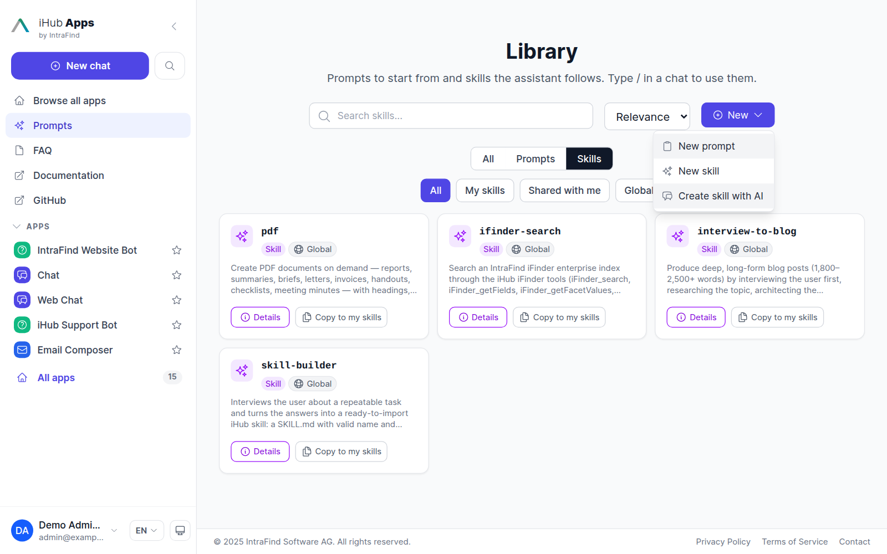
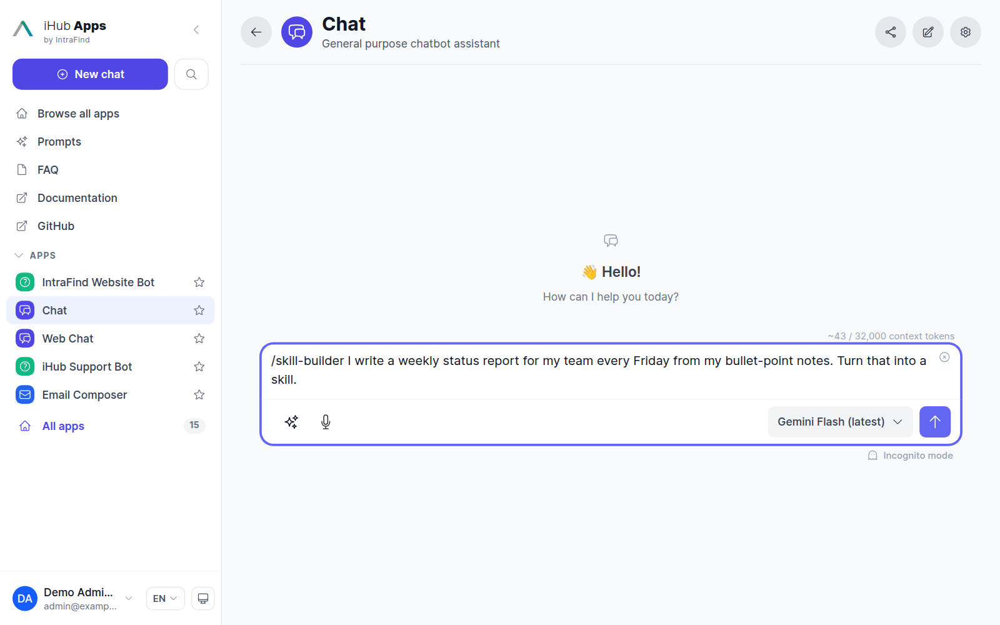
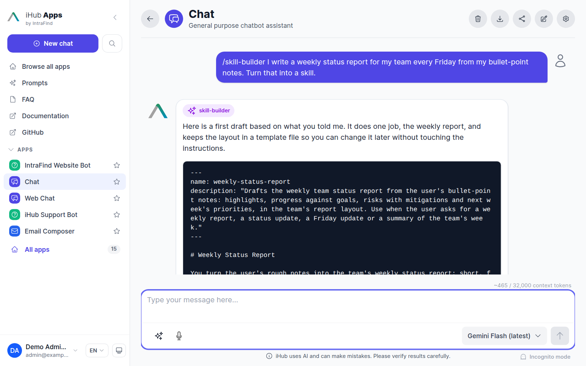
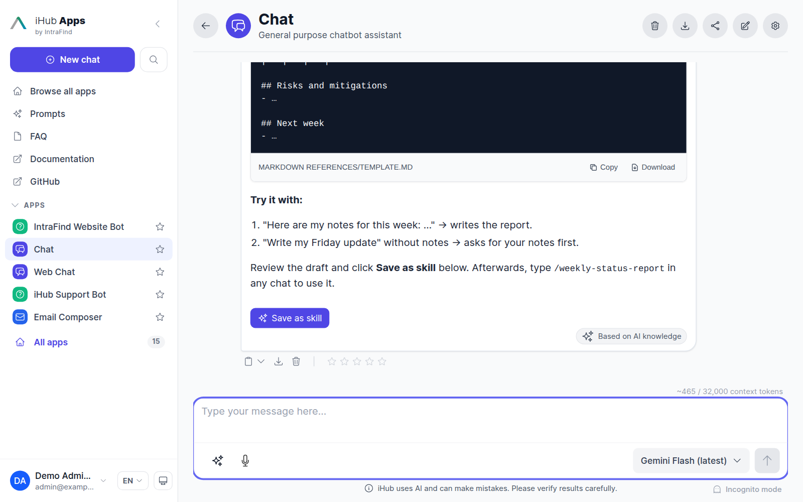
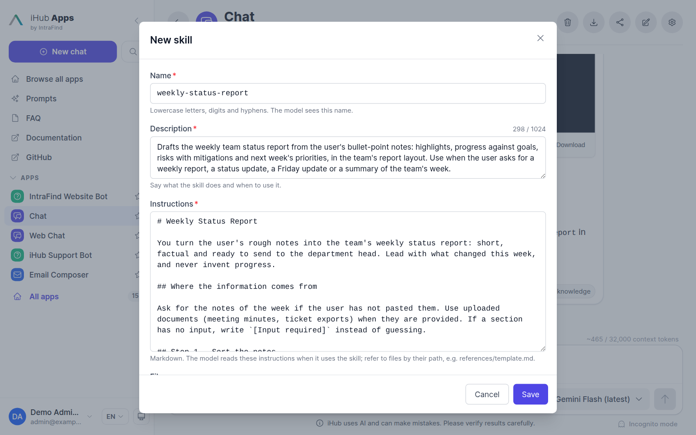

# Skills

A skill packages know-how for a task: instructions the model follows and, optionally, reference
files it can read. iHub uses the Agent Skills format (agentskills.io), the same `SKILL.md` format
Claude, ChatGPT and Gemini read. Skills need the **Agent Skills** feature (`skills`, preview,
off by default) under **Admin → Features**.

There are two kinds:

| Kind | Where it lives | Created by | Who can use it |
| ---- | -------------- | ---------- | -------------- |
| **Global skill** | A folder under `contents/skills/<name>/` | Admins (import, marketplace, promotion) | Users whose groups grant it (`permissions.skills`), in the apps it is assigned to (`skills` in the app) |
| **User skill** | The storage provider | Any signed-in user | The owner and everyone it is shared with, in every app that allows personal skills |

## Using Skills in Chat

- **Automatically:** the model sees the name and description of every skill it may use in the
  current app and loads a skill's full instructions when a request matches.
- **With `/name` in the message:** writing `/skill-name` at the start of the message or after a
  space loads that skill's instructions for the message, for example
  `/newsletter-composer draft this week's issue from my notes`. Several skills can be combined
  in one message; at most `skillSettings.maxActiveSkills` (default 3) are loaded. Typing `/` at
  the start of a word opens a picker that lists the skills next to the prompts; picking a skill
  inserts its `/name` and you keep typing. When your own skill, a skill shared with you and a
  global skill have the same name, your own is used, then the shared one.
- **Scheduled tasks and the API** work the same way: put `/skill-name` in a scheduled task's
  instructions, or in a message sent to the chat API, and the skill is loaded for that run. The
  chat API also accepts `requestedSkills`, a list of global skill names or user skill ids.

A skill is loaded only when the current app and user may use it. For a global skill that means:
installed, listed in the app's `skills`, and granted to the user's groups. For a user skill: the
user owns it or it is shared with them, and the app does not set
`skillSettings.allowPersonal: false`. Agents use only the global skills on their profile.

## User Skills

Any signed-in user can create skills of their own in the library (`/prompts`, **New → New
skill**), let the assistant draft one ([Create a skill with AI](#create-a-skill-with-ai)), or
start from a ready-made one in the [marketplace](#skills-from-the-marketplace). The editor has:

- **Name** — lowercase letters, digits and hyphens, starting and ending with a letter or digit,
  at most 64 characters.
- **Description** — what the skill does and when to use it, at most 1,024 characters. This is
  what the model reads to decide when to use the skill, so name the requests that should trigger
  it ("Use when …").
- **Instructions** — the Markdown the model follows once the skill is loaded.
- **Files** — optional text files under `references/`, `assets/` or `scripts/` (`.md`, `.txt`,
  `.csv`, `.json`, `.yaml`). The model reads them when the instructions point to them. Scripts
  are never run.

### Create a skill with AI

Users who would rather describe a skill than write one let the assistant draft it. The
**skill-builder** skill interviews them and writes the skill; one click turns the draft into a
skill of their own.

**1. Start from the library.** **New → Create skill with AI** in the library (`/prompts`).



**2. Describe the skill.** A new chat opens with `/skill-builder ` already in the input. Add what
the skill should do and send it. Pasting an existing prompt, Gem or custom GPT instructions
works too: skill-builder converts them.



**3. Answer its questions, get the draft.** skill-builder asks what it needs to know (the
result, the steps, the rules), then drafts the skill: a `SKILL.md` with name, description and
instructions in one code block, and any reference files in code blocks of their own, labelled
with their path. Ask for changes in the chat to get a revised draft.



**4. Save as skill.** Under the draft, **Save as skill** opens the skill editor.



**5. Review and save.** Name, description, instructions and reference files are filled in. The
editor checks the draft like a skill typed by hand, and the limits under [Settings](#settings)
apply. After **Save**, the skill is one of the user's own skills: private until shared, and used
with `/name` in any chat.



**Save as skill** appears under every finished answer that contains a skill in this form, in
any app, not only after **Create skill with AI**. It is not offered on an answer that was
cancelled or cut off, because the draft may be incomplete.

#### For admins

`skill-builder` is a global skill that ships with iHub, taken from the marketplace (its
hand-over is adapted to **Save as skill**). It is copied into `contents/skills/skill-builder/`
on startup and assigned to the **Chat** app, on new installations by the defaults and on
existing ones by a migration.

**Create skill with AI** is offered to signed-in users who may keep skills of their own, when
`skill-builder` is granted to their groups (`permissions.skills`) and assigned to a chat app they
can use. With several such apps, the start page's chat app wins, then favorites and the app
order. Admins assign it to other apps under **Admin → Apps**. To hide the entry, remove it from
every chat app it is assigned to (on a new installation, that is Chat).

### Skills from the marketplace

Writing a first skill from scratch is hard. When the [marketplace](marketplace.md) is switched
on and a registry has been refreshed, users can pick ready-made skills from it themselves, so
admins do not have to install every skill for everyone:

- **New → Skill from the marketplace** in the library opens the skills of all enabled
  registries. Users search them (in every language the catalog has, and by tag), filter by
  category and source, and open a skill to read its instructions, license and the files that
  come with it.
- On the **Skills** tab, users who have no skills of their own yet see a **Browse the
  marketplace** prompt.
- **Add** saves a copy as one of the user's own skills, under the catalog name or a name they
  choose. Like any user skill it is private until shared, can be edited, versioned and promoted,
  and is invoked with `/name`. The copy does not follow later catalog changes.
- A user skill holds text files directly under `references/`, `assets/` or `scripts/`. Other
  files of a marketplace skill (images, PDFs, nested folders) and files beyond
  `maxFilesPerSkill` or `maxSkillSizeKB` are left out; the user is told how many.
- The skill details show where the copy came from (registry, version) and its license.

Users never enter a URL: the skill is fetched from the source its admin-configured catalog
lists, with the registry's credentials. Registries that are switched off are not offered, and
users cannot refresh a catalog. Admins switch the feature off with `allowMarketplace` (below).

### Sharing and permissions

User skills follow the same rules as [user prompts](prompts.md#user-prompts):

- A skill is private until it is shared with **specific users**, **groups** (inheritance
  resolved) or **everyone signed in**, each as *can use* or *can edit*. Editors can share it
  further.
- Only the owner and admins can delete a skill or hand it to another user.
- Removing a share takes effect right away, in the skill list, the `/` picker and the model's
  list of skills.
- When the owner's account is deleted or deactivated, the skill stays usable for everyone it is
  shared with but becomes read-only; only admins can still change it.
- Anonymous users, API clients (client credentials, static API keys), agents and third-party
  apps acting on a user's behalf cannot hold user skills. A personal API key acts as its owner.
- Anyone who can see a skill can **duplicate** it, and a global skill can be copied into
  **My skills** to adapt it. The copy takes the instructions and the text files.

### Versions

Every save is kept as a version. Those who can edit a skill can open **History**, look at an
earlier version and restore it; a restore is saved as a new version.

### Using user skills in an app

A user's own and shared skills are offered in every app, in the `/` picker and to the model (the
20 most recently changed ones). To keep them out of an app — for example a regulated app that
must only use reviewed skills — set:

```json
"skillSettings": { "allowPersonal": false }
```

## Admin

**Admin → Skills** manages the global skills (import, export, delete, group access) and has a
**User skills** tab:

- It lists the user skills shared with a group or with everyone. Private skills and skills
  shared only with named users are not listed.
- Admins and content admins can open, edit, re-share, view the history of and delete these
  skills, and **promote** one. Promoting writes the skill as a global skill folder
  `contents/skills/<name>/` (`SKILL.md` with the description, the instructions and the files)
  and records where it was promoted to. Who can use the new global skill follows the groups'
  `skills` permission and the apps it is assigned to, like every other global skill.
- Every create, update, share change, hand-over, delete, restore and promotion is written to the
  audit log.

### Settings

The settings for user skills (full admins only) are stored in `platform.json`:

```json
"userSkills": {
  "enabled": true,
  "maxSkillsPerUser": 50,
  "maxVersions": 50,
  "maxSkillSizeKB": 256,
  "maxFilesPerSkill": 20,
  "allowMarketplace": true,
  "sharing": {
    "allowUsers": true,
    "allowGroups": true,
    "allowEveryone": true,
    "restrictToGroups": []
  }
}
```

| Setting | Meaning |
| ------- | ------- |
| `enabled` | Users may keep their own skills (also needs the `skills` feature) |
| `maxSkillsPerUser` | Most skills one user may keep; `0` means no limit |
| `maxVersions` | Versions kept per skill |
| `maxSkillSizeKB` | Instructions and files together |
| `maxFilesPerSkill` | Files per skill |
| `allowMarketplace` | Users may add skills from the marketplace to their own skills (also needs the `marketplace` feature and a refreshed registry) |
| `sharing.allowUsers` / `allowGroups` / `allowEveryone` | Which audiences users may share with |
| `sharing.restrictToGroups` | When it names groups, only their members may share with groups or with everyone |

### Storage

User skills, their versions and share markers are runtime data in the storage provider
(`contents/data/` with the default filesystem provider), in the namespaces `user-skills`,
`user-skill-versions` and `user-skill-shares`. A skill's instructions and files are kept
together in one document. If the storage provider is unavailable, users cannot create skills;
global skills keep working.

## API

| Method | Path | Purpose |
| ------ | ---- | ------- |
| GET | `/api/skills` | Skills for the `/` picker: global skills the user may see, plus their own and shared user skills (`scope`: `global`, `mine`, `shared`) |
| POST | `/api/skills/:name/duplicate` | Copy a global skill into My skills |
| GET | `/api/user-skills?scope=all\|mine\|shared` | The caller's own and shared user skills |
| POST | `/api/user-skills` | Create a user skill (`name`, `description`, `body`, `files`) |
| GET / PUT / DELETE | `/api/user-skills/:id` | Read (with instructions and files), update (`expectedRevision` refuses a stale save with 409), delete |
| PUT | `/api/user-skills/:id/shares` | Replace the share list |
| PUT | `/api/user-skills/:id/owner` | Hand the skill to another user (`ownerId`) |
| POST | `/api/user-skills/:id/duplicate` | Copy a user skill |
| GET | `/api/user-skills/:id/versions` | Versions, newest first; `/versions/:revision` returns one with its content |
| POST | `/api/user-skills/:id/versions/:revision/restore` | Restore a version |
| GET | `/api/user-skills/share-targets?q=` | Users and groups the caller may share with |
| GET | `/api/user-skills/marketplace?search=&category=&registry=&page=&limit=` | Skills of the enabled registries, with the registries and categories to filter by; each says whether the caller added it already (`added`) |
| GET | `/api/user-skills/marketplace/:registryId/:name` | One marketplace skill with a preview of its instructions and files |
| POST | `/api/user-skills/marketplace/:registryId/:name/add` | Copy it into My skills (`name` optional); the response lists `skippedFiles` |
| GET | `/api/admin/user-skills` | User skills shared with a group or everyone (admins and content admins) |
| POST | `/api/admin/user-skills/:id/promote` | Promote to a global skill (`name` optional; 409 when taken) |
| GET / PUT | `/api/admin/user-skills/settings` | The `userSkills` settings (full admins) |
