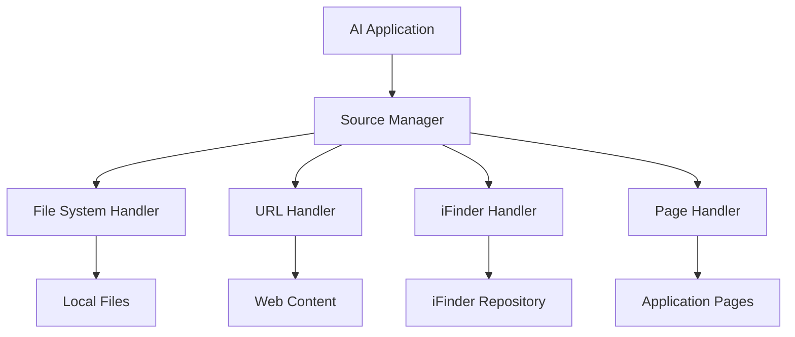

# Sources System

The iHub Apps source handlers system provides a unified way to integrate different types of knowledge sources with AI applications. This system allows apps to access content from local files, web URLs, iFinder document repositories, and internal pages, making them available either as context (prompt) or as tools for the AI to call dynamically.

## Table of Contents

1. [Overview](#overview)
2. [Supported Source Types](#supported-source-types)
3. [Configuration](#configuration)
4. [Integration with Apps](#integration-with-apps)
5. [Administration Interface](#administration-interface)
6. [Examples](#examples)
7. [Troubleshooting](#troubleshooting)

## Overview

### What is the Source Handlers System?

The source handlers system enables AI applications to access external knowledge sources through a standardized interface. Sources can be:

- **Filesystem sources**: Local markdown, text, or JSON files
- **URL sources**: Web pages and documents
- **iFinder sources**: Enterprise document management system integration
- **Page sources**: Internal application pages (FAQ, documentation, etc.)

### Why Use Sources?

- **Knowledge Integration**: Provide AI applications with access to current, relevant information
- **Dynamic Content**: Sources can be updated without modifying app configurations
- **Flexible Access**: Content can be provided as context or as callable tools
- **Centralized Management**: All sources managed through a single administration interface

### Architecture



## Supported Source Types

### 1. FileSystem Sources

Load content from local filesystem files within the `contents/sources/` directory.

**Use Cases:**
- Internal documentation
- Knowledge base articles
- Configuration data
- Reference materials

**Supported Formats:**
- Markdown (.md)
- Text files (.txt)
- JSON data (.json)
- Any UTF-8 text-based format

**Configuration Options:**
- `path`: File path relative to `contents/sources/`
- `encoding`: Text encoding (default: 'utf-8')

### 2. URL Sources

Fetch and process content from web URLs with intelligent content extraction.

**Use Cases:**
- External documentation
- Company websites
- News articles
- API documentation

**Features:**
- Automatic content cleaning and extraction
- Follow redirects
- Configurable timeout and retry logic
- Content length limits
- Metadata extraction (title, description)

**Configuration Options:**
- `url`: Target URL
- `method`: HTTP method ('GET' or 'POST')
- `headers`: Custom HTTP headers
- `timeout`: Request timeout (ms)
- `followRedirects`: Follow redirects (boolean)
- `maxRedirects`: Maximum redirects (0-10)
- `retries`: Number of retries (0-10)
- `maxContentLength`: Maximum content size
- `cleanContent`: Enable content cleaning

### 3. iFinder Sources

Integration with iFinder document management system for enterprise document access.

**Use Cases:**
- Enterprise document repositories
- Searchable knowledge bases
- User-specific document access
- Dynamic document retrieval

**Features:**
- User authentication support
- Document search functionality
- Specific document retrieval by ID
- Configurable search profiles
- Content length limits

**Configuration Options:**
- `baseUrl`: iFinder instance URL
- `apiKey`: API authentication key
- `searchProfile`: Search profile ('default' or custom)
- `maxResults`: Maximum search results (1-100)
- `queryTemplate`: Search query template
- `filters`: Search filters object
- `maxLength`: Maximum content length

### 4. Page Sources

Access internal application pages as sources.

**Use Cases:**
- FAQ pages
- Help documentation
- Internal reference pages
- Dynamic content pages

**Configuration Options:**
- `pageId`: Internal page identifier
- `language`: Language code ('en', 'de', etc.)

## Configuration

### Source Configuration Schema

Each source must conform to the following structure:

```json
{
  "id": "unique-source-id",
  "name": {
    "en": "Source Name",
    "de": "Quellenname"
  },
  "description": {
    "en": "Source description",
    "de": "Quellenbeschreibung"
  },
  "type": "filesystem|url|ifinder|page",
  "enabled": true,
  "exposeAs": "prompt|tool",
  "category": "optional-category",
  "tags": ["tag1", "tag2"],
  "config": {
    // Type-specific configuration
  },
  "caching": {
    "ttl": 3600,
    "strategy": "static|refresh",
    "enabled": true
  }
}
```

### Configuration Files

Sources are configured in `/contents/config/sources.json` as a JSON array:

```json
[
  {
    "id": "documentation",
    "name": { "en": "Documentation" },
    "description": { "en": "System documentation" },
    "type": "filesystem",
    "enabled": true,
    "exposeAs": "prompt",
    "config": {
      "path": "documentation.md",
      "encoding": "utf-8"
    }
  }
]
```

### Expose Modes

Sources can be exposed in two ways:

#### Prompt Mode (`exposeAs: "prompt"`)
- Content is loaded immediately and included in the AI prompt
- Suitable for static, contextual information
- Content appears in XML tags: `<source id="..." type="..." link="...">content</source>`

#### Tool Mode (`exposeAs: "tool"`)
- Source becomes a callable tool for the AI
- Content loaded only when the AI calls the tool
- Suitable for dynamic, searchable content
- Reduces token usage for large sources

## Integration with Apps

### App Configuration

Apps reference sources using the `sources` array:

```json
{
  "id": "knowledge-assistant",
  "name": { "en": "Knowledge Assistant" },
  "sources": [
    "documentation",
    "faq",
    "company-website"
  ],
  "system": {
    "en": "Use the provided sources to answer questions: {{sources}}"
  }
}
```

### Source Interpolation

The `{{sources}}` placeholder in system prompts is replaced with:

- **Prompt sources**: Full content in XML format
- **Tool sources**: Function references for AI to call

Example expanded prompt:
```xml
<sources>
  <source id="documentation" type="filesystem" link="documentation.md" description="System docs"/>
  <source id="web-search" type="function" name="source_web-search" displayName="Web Search" description="Search web content"/>
</sources>

Content from documentation source...
```

## Administration Interface

### Sources Management

Access the sources administration interface at `/admin/sources`.

#### Features:
- **List Sources**: View all configured sources with filtering
- **Create/Edit Sources**: Form-based source configuration
- **Test Sources**: Verify source connectivity and content
- **Preview Sources**: View source content before saving
- **Bulk Operations**: Enable/disable multiple sources
- **Dependency Tracking**: View which apps use each source
- **Statistics**: Source usage and performance metrics

#### Source Testing

Each source type supports connection testing:

- **FileSystem**: Verify file existence and readability
- **URL**: Check HTTP connectivity and response
- **iFinder**: Validate API connection and search functionality
- **Page**: Confirm page existence and language availability

#### File Operations (FileSystem Sources)

For filesystem sources, additional operations are available:

- **File Browser**: Navigate the sources directory
- **File Editor**: Edit source files directly
- **File Upload**: Upload new source files
- **File Management**: Create, rename, delete files

### API Endpoints

The sources system provides comprehensive REST API endpoints:

```bash
GET    /api/admin/sources           # List sources
POST   /api/admin/sources           # Create source
GET    /api/admin/sources/:id       # Get source
PUT    /api/admin/sources/:id       # Update source
DELETE /api/admin/sources/:id       # Delete source
POST   /api/admin/sources/:id/test  # Test source
POST   /api/admin/sources/:id/preview # Preview content
```

## Examples

### Example 1: Documentation Source (FileSystem)

```json
{
  "id": "api-docs",
  "name": {
    "en": "API Documentation",
    "de": "API-Dokumentation"
  },
  "description": {
    "en": "Complete API reference documentation",
    "de": "Vollständige API-Referenzdokumentation"
  },
  "type": "filesystem",
  "enabled": true,
  "exposeAs": "prompt",
  "config": {
    "path": "api-documentation.md",
    "encoding": "utf-8"
  }
}
```

### Example 2: Company Website Source (URL)

```json
{
  "id": "company-website",
  "name": {
    "en": "Company Website"
  },
  "description": {
    "en": "Official company website content"
  },
  "type": "url",
  "enabled": true,
  "exposeAs": "tool",
  "config": {
    "url": "https://company.com",
    "method": "GET",
    "timeout": 15000,
    "followRedirects": true,
    "maxRedirects": 3,
    "retries": 2,
    "maxContentLength": 50000,
    "cleanContent": true
  }
}
```

### Example 3: iFinder Document Source

```json
{
  "id": "knowledge-base",
  "name": {
    "en": "Knowledge Base"
  },
  "description": {
    "en": "Searchable enterprise knowledge base"
  },
  "type": "ifinder",
  "enabled": true,
  "exposeAs": "tool",
  "config": {
    "baseUrl": "https://ifinder.company.com",
    "apiKey": "${IFINDER_API_KEY}",
    "searchProfile": "knowledge",
    "maxResults": 5,
    "maxLength": 10000
  }
}
```

### Example 4: FAQ Page Source

```json
{
  "id": "faq",
  "name": {
    "en": "FAQ",
    "de": "FAQ"
  },
  "description": {
    "en": "Frequently asked questions"
  },
  "type": "page",
  "enabled": true,
  "exposeAs": "prompt",
  "config": {
    "pageId": "faq",
    "language": "en"
  }
}
```

### Example 5: Multi-Source App Configuration

```json
{
  "id": "support-assistant",
  "name": {
    "en": "Support Assistant"
  },
  "description": {
    "en": "AI assistant with access to documentation and knowledge base"
  },
  "sources": [
    "api-docs",
    "faq",
    "knowledge-base"
  ],
  "system": {
    "en": "You are a support assistant. Use these sources to help users:\n\n{{sources}}\n\nAlways cite your sources and provide accurate information."
  },
  "tools": [],
  "tokenLimit": 8000
}
```

## Troubleshooting

### Common Issues

#### 1. Source Not Loading

**Symptoms:** Source content appears empty or throws errors.

**Solutions:**
- Check source configuration using the test functionality
- Verify file paths for filesystem sources
- Check URL accessibility for URL sources
- Ensure iFinder credentials are valid
- Review error logs for specific error messages

#### 2. Permission Denied (FileSystem)

**Symptoms:** "Access denied" or "Path outside allowed directory" errors.

**Solutions:**
- Ensure file paths are relative to `contents/sources/` directory
- Avoid using `../` or absolute paths in file paths
- Check file permissions and ownership
- Verify the file exists in the correct location

#### 3. HTTP Errors (URL Sources)

**Symptoms:** HTTP 404, 403, or timeout errors.

**Solutions:**
- Test URL accessibility in a browser
- Check if the URL requires authentication
- Increase timeout values for slow endpoints
- Verify SSL certificate validity
- Check firewall and proxy settings

#### 4. iFinder Connection Issues

**Symptoms:** "Authentication failed" or "Connection timeout" errors.

**Solutions:**
- Verify iFinder instance URL and API key
- Check network connectivity to iFinder server
- Ensure user has proper permissions
- Test with a simple search query
- Review iFinder server logs

#### 5. Content Too Large

**Symptoms:** "Content exceeds maximum length" warnings.

**Solutions:**
- Increase `maxContentLength` in source configuration
- Use content cleaning options for URL sources
- Consider splitting large sources into smaller files
- Use tool mode instead of prompt mode for large sources

### Performance Optimization

#### Caching Strategy

Sources support caching to improve performance:

```json
{
  "caching": {
    "ttl": 3600,        // Cache duration in seconds
    "strategy": "static", // 'static' or 'refresh'
    "enabled": true
  }
}
```

#### Best Practices

1. **Use Tool Mode for Large Sources**: Reduces initial token usage
2. **Optimize Content Length**: Set appropriate limits for your use case
3. **Enable Caching**: Especially for stable external content
4. **Regular Testing**: Use built-in test functionality
5. **Monitor Performance**: Check cache statistics in admin interface

### Error Messages Reference

| Error Message | Cause | Solution |
|---------------|-------|----------|
| "Access denied: path outside allowed directory" | File path security violation | Use relative paths within sources/ |
| "Handler-specific configuration validation failed" | Invalid source config | Check required fields for source type |
| "No handler registered for type" | Unknown source type | Use: filesystem, url, ifinder, or page |
| "Source ID already exists" | Duplicate source ID | Choose unique source identifier |
| "Invalid URL: Only HTTP and HTTPS protocols allowed" | Invalid URL protocol | Use http:// or https:// URLs |
| "iFinder test failed: Authentication failed" | Invalid iFinder credentials | Check API key and base URL |

### Debugging Tips

1. **Use Test Function**: Always test sources before deploying
2. **Check Logs**: Review server logs for detailed error information
3. **Preview Content**: Use preview functionality to verify content
4. **Start Simple**: Begin with basic configurations and add complexity
5. **Monitor Dependencies**: Check which apps use sources before deletion

### Performance Monitoring

Monitor source performance through:

- **Cache Statistics**: Hit rates and cache usage
- **Response Times**: Source loading duration
- **Error Rates**: Failed source loads
- **Content Sizes**: Memory usage per source

Access statistics via `/api/admin/sources/_stats` endpoint or admin interface.

---

For additional support, consult the server logs or contact your system administrator. The sources system is designed to be robust and self-healing, with comprehensive error handling and recovery mechanisms.