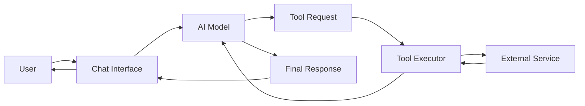

# Tool Calling Guide

This comprehensive guide covers how to implement and use tool calling in iHub Apps, enabling AI models to extend their capabilities by calling external functions and services.

## Table of Contents

- [Quick Start](#quick-start)
- [Core Concepts](#core-concepts)
- [Tool Development Lifecycle](#tool-development-lifecycle)
- [Implementation Patterns](#implementation-patterns)
- [Advanced Features](#advanced-features)
- [Practical Examples](#practical-examples)
- [Troubleshooting & Best Practices](#troubleshooting--best-practices)

## Quick Start

Get tool calling working in under 10 minutes with this simple example.

### Enable a Tool for Your App

Add a `tools` property to your app configuration:

```json
{
  "id": "research-assistant",
  "name": {
    "en": "Research Assistant",
    "de": "Recherche-Assistent"
  },
  "description": {
    "en": "AI assistant with web search capabilities",
    "de": "KI-Assistent mit Web-Suchfunktionen"
  },
  "system": {
    "en": "You are a helpful research assistant. Use web search to find current information when needed.",
    "de": "Du bist ein hilfreicher Recherche-Assistent. Nutze die Websuche, um aktuelle Informationen zu finden."
  },
  "tokenLimit": 8000,
  "tools": ["webSearch"]
}
```

### User Experience

When users ask questions requiring current information, the AI automatically uses available tools:

**User**: "What are the latest developments in quantum computing?"

**AI**: *[Searches web for "latest developments quantum computing 2024"]* 

Based on recent search results, here are the latest developments in quantum computing...

### How It Works

1. User sends a message requiring external information
2. AI model recognizes the need for a tool
3. Model generates a tool call request with parameters
4. iHub Apps executes the tool and returns results
5. Model incorporates tool results into its response

## Core Concepts

### What Are Tools?

Tools are functions that AI models can call to:
- **Access Real-time Information**: Web search, news feeds, APIs
- **Process Documents**: Extract content, analyze PDFs, parse structured data
- **Integrate Systems**: Query databases, call external APIs, interact with enterprise systems
- **Perform Computations**: Complex calculations, data transformations, analysis

**Important**: Models don't execute tools directly - they generate structured requests that iHub Apps executes on their behalf.

### Tool Architecture



### Tool Registration and Discovery

Tools are registered through three methods:

1. **Static Configuration** (`contents/config/tools.json`)
2. **MCP Server Discovery** (Model Context Protocol)
3. **Dynamic Registration** (Runtime API)

## Tool Development Lifecycle

### 1. Tool Definition

Create a tool definition in `contents/config/tools.json`:

```json
{
  "id": "weatherLookup",
  "name": {
    "en": "Weather Lookup",
    "de": "Wetter-Abfrage"
  },
  "description": {
    "en": "Get current weather for any location",
    "de": "Aktuelles Wetter für jeden Ort abrufen"
  },
  "script": "weatherLookup.js",
  "parameters": {
    "type": "object",
    "properties": {
      "location": {
        "type": "string",
        "description": "City name or coordinates"
      },
      "units": {
        "type": "string",
        "enum": ["celsius", "fahrenheit"],
        "default": "celsius"
      }
    },
    "required": ["location"]
  }
}
```

### 2. Tool Implementation

Create the implementation script in `server/tools/weatherLookup.js`:

```javascript
export async function execute(params) {
  const { location, units = 'celsius' } = params;
  
  try {
    // Validate parameters
    if (!location) {
      throw new Error('Location is required');
    }
    
    // Call external API
    const response = await fetch(
      `https://api.weather.com/v1/current?location=${encodeURIComponent(location)}&units=${units}`,
      {
        headers: {
          'Authorization': `Bearer ${process.env.WEATHER_API_KEY}`
        }
      }
    );
    
    if (!response.ok) {
      throw new Error(`Weather API error: ${response.statusText}`);
    }
    
    const data = await response.json();
    
    // Return structured result
    return {
      success: true,
      data: {
        location: data.location.name,
        temperature: data.current.temp,
        conditions: data.current.description,
        humidity: data.current.humidity,
        units: units
      }
    };
  } catch (error) {
    return {
      success: false,
      error: error.message
    };
  }
}
```

### 3. Testing and Validation

Test your tool independently before integration:

```bash
# Test tool execution
curl -X POST http://localhost:3000/api/tools/weatherLookup \
  -H "Content-Type: application/json" \
  -d '{
    "params": {
      "location": "London",
      "units": "celsius"
    }
  }'
```

### 4. App Integration

Add the tool to your app configuration:

```json
{
  "id": "weather-assistant",
  "tools": ["weatherLookup"],
  "system": {
    "en": "You are a weather assistant. Use the weatherLookup tool to provide current weather information."
  }
}
```

## Implementation Patterns

### Simple Tools (Single Function)

Basic tools that perform one specific task:

```javascript
// server/tools/simpleTool.js
export async function execute(params) {
  // Single function implementation
  const result = await performTask(params);
  return { success: true, data: result };
}
```

Configuration:
```json
{
  "id": "simpleTool",
  "script": "simpleTool.js",
  "parameters": {
    "type": "object",
    "properties": {
      "input": { "type": "string" }
    }
  }
}
```

### Method-Based Tools (Multiple Functions)

Complex tools providing multiple related functions:

```javascript
// server/tools/documentManager.js
export const functions = {
  search: async (params) => {
    // Search implementation
    const results = await searchDocuments(params.query);
    return { success: true, data: results };
  },
  
  getContent: async (params) => {
    // Content retrieval implementation
    const content = await fetchDocument(params.id);
    return { success: true, data: content };
  },
  
  update: async (params) => {
    // Update implementation
    const updated = await updateDocument(params.id, params.changes);
    return { success: true, data: updated };
  }
};

export async function execute(method, params) {
  if (!functions[method]) {
    throw new Error(`Unknown method: ${method}`);
  }
  return await functions[method](params);
}
```

Configuration:
```json
{
  "id": "documentManager",
  "functions": {
    "search": {
      "description": "Search documents",
      "parameters": {
        "type": "object",
        "properties": {
          "query": { "type": "string" }
        }
      }
    },
    "getContent": {
      "description": "Get document content",
      "parameters": {
        "type": "object",
        "properties": {
          "id": { "type": "string" }
        }
      }
    }
  }
}
```

App usage:
```json
{
  "tools": ["documentManager.search", "documentManager.getContent"]
}
```

### External Service Integration

Integrate with external APIs and services:

```javascript
// server/tools/jiraIntegration.js
import { JiraClient } from './lib/jira-client.js';

export async function execute(params) {
  const client = new JiraClient({
    host: process.env.JIRA_HOST,
    email: process.env.JIRA_EMAIL,
    apiToken: process.env.JIRA_API_TOKEN
  });
  
  try {
    switch (params.action) {
      case 'createIssue':
        return await client.createIssue({
          project: params.project,
          summary: params.summary,
          description: params.description,
          issueType: params.type || 'Task'
        });
        
      case 'searchIssues':
        return await client.searchIssues({
          jql: params.jql,
          maxResults: params.limit || 10
        });
        
      case 'updateIssue':
        return await client.updateIssue(params.issueKey, {
          fields: params.updates
        });
        
      default:
        throw new Error(`Unknown action: ${params.action}`);
    }
  } catch (error) {
    return {
      success: false,
      error: `JIRA API error: ${error.message}`
    };
  }
}
```

### Real-time Tool Execution

Tools that provide streaming or real-time responses:

```javascript
// server/tools/liveDataFeed.js
export async function* executeStream(params) {
  const eventSource = new EventSource(params.feedUrl);
  
  try {
    for await (const event of eventSource) {
      // Process and yield each event
      yield {
        type: 'data',
        content: processEvent(event)
      };
      
      // Check for completion condition
      if (shouldStop(event)) {
        break;
      }
    }
  } finally {
    eventSource.close();
  }
}
```

## Advanced Features

### MCP Server Integration

Model Context Protocol (MCP) enables dynamic tool discovery:

```bash
# Configure MCP server
export MCP_SERVER_URL="http://localhost:8080/mcp"
```

MCP server response format:
```json
{
  "tools": [
    {
      "name": "dynamicTool",
      "description": "Dynamically discovered tool",
      "inputSchema": {
        "type": "object",
        "properties": {
          "param1": { "type": "string" }
        }
      }
    }
  ]
}
```

### Tool Chaining and Workflows

Combine multiple tools for complex workflows:

```json
{
  "id": "document-processor",
  "tools": ["pdfExtractor", "textAnalyzer", "summaryGenerator"],
  "system": {
    "en": "Process documents by first extracting content, then analyzing it, and finally generating summaries. Chain tools as needed."
  }
}
```

Workflow example:
```javascript
// AI model generates sequential tool calls
1. pdfExtractor.extract({ file: "document.pdf" })
2. textAnalyzer.analyze({ text: extractedContent })
3. summaryGenerator.generate({ analysis: analysisResults })
```

### Performance Optimization

#### Caching Strategy

```javascript
// server/tools/cachedTool.js
const cache = new Map();
const CACHE_TTL = 300000; // 5 minutes

export async function execute(params) {
  const cacheKey = JSON.stringify(params);
  const cached = cache.get(cacheKey);
  
  if (cached && Date.now() - cached.timestamp < CACHE_TTL) {
    return cached.data;
  }
  
  const result = await performExpensiveOperation(params);
  
  cache.set(cacheKey, {
    data: result,
    timestamp: Date.now()
  });
  
  return result;
}
```

#### Concurrency Handling

```javascript
// server/tools/concurrentTool.js
import pLimit from 'p-limit';

const limit = pLimit(5); // Max 5 concurrent operations

export async function execute(params) {
  if (params.batch) {
    // Process batch with concurrency limit
    const promises = params.items.map(item =>
      limit(() => processItem(item))
    );
    
    return await Promise.all(promises);
  }
  
  return await processItem(params);
}
```

### Security Considerations

#### Authentication and Authorization

```javascript
// server/tools/secureTool.js
export async function execute(params, context) {
  // Check user permissions
  if (!context.user || !context.user.permissions.includes('tool:secure')) {
    throw new Error('Unauthorized: Missing required permissions');
  }
  
  // Validate API keys
  if (!process.env.SECURE_API_KEY) {
    throw new Error('Configuration error: API key not configured');
  }
  
  // Execute with user context
  return await performSecureOperation(params, context.user);
}
```

#### Input Validation

```javascript
// server/tools/validatedTool.js
import Ajv from 'ajv';

const ajv = new Ajv();
const validateParams = ajv.compile({
  type: 'object',
  properties: {
    query: { type: 'string', maxLength: 500 },
    limit: { type: 'integer', minimum: 1, maximum: 100 }
  },
  required: ['query']
});

export async function execute(params) {
  // Validate input parameters
  if (!validateParams(params)) {
    throw new Error(`Invalid parameters: ${ajv.errorsText(validateParams.errors)}`);
  }
  
  // Sanitize input
  const sanitized = {
    query: params.query.replace(/<script\b[^<]*(?:(?!<\/script>)<[^<]*)*<\/script>/gi, ''),
    limit: params.limit || 10
  };
  
  return await performOperation(sanitized);
}
```

## Practical Examples

### Web Search Tool

Complete implementation of a web search tool:

```javascript
// server/tools/webSearch.js
import fetch from 'node-fetch';

export async function execute(params) {
  const { query, limit = 10 } = params;
  
  if (!query) {
    throw new Error('Search query is required');
  }
  
  try {
    const response = await fetch(
      `https://api.duckduckgo.com/search?q=${encodeURIComponent(query)}&limit=${limit}`,
      {
        headers: {
          'User-Agent': 'iHub-Apps/1.0'
        }
      }
    );
    
    const data = await response.json();
    
    return {
      success: true,
      results: data.results.map(result => ({
        title: result.title,
        url: result.url,
        snippet: result.snippet
      }))
    };
  } catch (error) {
    return {
      success: false,
      error: `Search failed: ${error.message}`
    };
  }
}
```

### Document Processing Tool

Process and analyze documents:

```javascript
// server/tools/documentProcessor.js
import { PDFExtract } from 'pdf-extract';
import natural from 'natural';

export const functions = {
  extractText: async (params) => {
    const pdfExtract = new PDFExtract();
    const data = await pdfExtract.extract(params.filePath);
    
    const text = data.pages
      .map(page => page.content.map(item => item.str).join(' '))
      .join('\n');
    
    return { success: true, text };
  },
  
  analyze: async (params) => {
    const { text } = params;
    
    // Tokenize and analyze
    const sentences = natural.SentenceTokenizer.tokenize(text);
    const tfidf = new natural.TfIdf();
    tfidf.addDocument(text);
    
    // Extract key terms
    const keyTerms = [];
    tfidf.listTerms(0).slice(0, 10).forEach(item => {
      keyTerms.push({ term: item.term, score: item.tfidf });
    });
    
    return {
      success: true,
      analysis: {
        wordCount: text.split(/\s+/).length,
        sentenceCount: sentences.length,
        keyTerms
      }
    };
  },
  
  summarize: async (params) => {
    const { text, maxLength = 500 } = params;
    
    // Simple extractive summarization
    const sentences = natural.SentenceTokenizer.tokenize(text);
    const scores = calculateSentenceScores(sentences);
    const topSentences = selectTopSentences(scores, maxLength);
    
    return {
      success: true,
      summary: topSentences.join(' ')
    };
  }
};
```

### API Integration Tool

Integrate with REST APIs:

```javascript
// server/tools/apiConnector.js
export async function execute(params) {
  const { endpoint, method = 'GET', headers = {}, body } = params;
  
  // Validate endpoint
  const allowedDomains = ['api.example.com', 'data.company.com'];
  const url = new URL(endpoint);
  
  if (!allowedDomains.includes(url.hostname)) {
    throw new Error('Endpoint domain not allowed');
  }
  
  const options = {
    method,
    headers: {
      'Content-Type': 'application/json',
      ...headers
    }
  };
  
  if (body && method !== 'GET') {
    options.body = JSON.stringify(body);
  }
  
  try {
    const response = await fetch(endpoint, options);
    const data = await response.json();
    
    return {
      success: response.ok,
      status: response.status,
      data
    };
  } catch (error) {
    return {
      success: false,
      error: error.message
    };
  }
}
```

### Custom Business Logic Tool

Implement domain-specific business logic:

```javascript
// server/tools/invoiceProcessor.js
export async function execute(params) {
  const { action, data } = params;
  
  switch (action) {
    case 'validate':
      return validateInvoice(data);
      
    case 'calculate':
      return calculateTotals(data);
      
    case 'approve':
      return approveInvoice(data);
      
    default:
      throw new Error(`Unknown action: ${action}`);
  }
}

function validateInvoice(invoice) {
  const errors = [];
  
  // Business rule validations
  if (!invoice.invoiceNumber) {
    errors.push('Invoice number is required');
  }
  
  if (!invoice.customer?.id) {
    errors.push('Customer ID is required');
  }
  
  if (!invoice.items || invoice.items.length === 0) {
    errors.push('At least one line item is required');
  }
  
  invoice.items?.forEach((item, index) => {
    if (!item.quantity || item.quantity <= 0) {
      errors.push(`Item ${index + 1}: Invalid quantity`);
    }
    if (!item.unitPrice || item.unitPrice < 0) {
      errors.push(`Item ${index + 1}: Invalid unit price`);
    }
  });
  
  return {
    success: errors.length === 0,
    errors,
    valid: errors.length === 0
  };
}

function calculateTotals(invoice) {
  let subtotal = 0;
  
  const items = invoice.items.map(item => {
    const lineTotal = item.quantity * item.unitPrice;
    subtotal += lineTotal;
    return { ...item, lineTotal };
  });
  
  const taxRate = invoice.taxRate || 0.1;
  const tax = subtotal * taxRate;
  const total = subtotal + tax;
  
  return {
    success: true,
    data: {
      items,
      subtotal,
      taxRate,
      tax,
      total
    }
  };
}
```

## Troubleshooting & Best Practices

### Common Implementation Errors

**Error: Tool not found**
```
Error: Tool 'myTool' not found in configuration
```
**Solution**: 
- Verify tool is defined in `contents/config/tools.json`
- Check tool ID matches exactly (case-sensitive)
- Restart server after adding new tools

**Error: Parameter validation failed**
```
Error: Invalid parameters: data.query should be string
```
**Solution**:
- Review parameter schema in tool configuration
- Ensure all required parameters are provided
- Check parameter types match schema

**Error: Tool execution timeout**
```
Error: Tool execution exceeded 30 second timeout
```
**Solution**:
- Implement timeout handling in tool
- Consider breaking long operations into chunks
- Use streaming for real-time feedback

### Performance Optimization

**Tool Execution Performance**

| Operation Type | Recommended Timeout | Caching Strategy |
|---------------|-------------------|------------------|
| Simple Query | 5 seconds | 5 minutes |
| API Call | 10 seconds | 1 minute |
| Document Processing | 30 seconds | 30 minutes |
| Batch Operations | 60 seconds | No caching |

**Optimization Strategies**:

1. **Implement Caching**
```javascript
const cache = new LRUCache({ max: 100, ttl: 300000 });
```

2. **Use Connection Pooling**
```javascript
const pool = new Pool({ max: 10, min: 2 });
```

3. **Batch Operations**
```javascript
const results = await Promise.all(items.map(processItem));
```

### Security Guidelines

**1. Input Sanitization**
Always sanitize user inputs before processing:

```javascript
function sanitizeInput(input) {
  // Remove script tags
  input = input.replace(/<script\b[^<]*(?:(?!<\/script>)<[^<]*)*<\/script>/gi, '');
  
  // Escape special characters
  input = input.replace(/[&<>"']/g, char => ({
    '&': '&amp;',
    '<': '&lt;',
    '>': '&gt;',
    '"': '&quot;',
    "'": '&#39;'
  }[char]));
  
  return input;
}
```

**2. API Key Management**
- Store API keys in environment variables
- Never log or expose API keys
- Rotate keys regularly
- Use separate keys for development/production

**3. Rate Limiting**
Implement rate limiting for external API calls:

```javascript
import rateLimit from 'express-rate-limit';

const limiter = rateLimit({
  windowMs: 60 * 1000, // 1 minute
  max: 10 // limit to 10 requests
});
```

### Testing Strategies

**1. Unit Testing**
```javascript
// tests/tools/myTool.test.js
import { execute } from '../../server/tools/myTool.js';

describe('MyTool', () => {
  test('executes successfully with valid params', async () => {
    const result = await execute({ query: 'test' });
    expect(result.success).toBe(true);
    expect(result.data).toBeDefined();
  });
  
  test('handles missing parameters', async () => {
    await expect(execute({})).rejects.toThrow('Query is required');
  });
});
```

**2. Integration Testing**
```bash
# Test tool through API
curl -X POST http://localhost:3000/api/tools/myTool \
  -H "Content-Type: application/json" \
  -d '{"params": {"query": "test"}}'
```

**3. End-to-End Testing**
Test complete workflow from chat interface through tool execution.

### Tool Development Checklist

- [ ] Tool definition in `contents/config/tools.json`
- [ ] Implementation script in `server/tools/`
- [ ] Parameter validation implemented
- [ ] Error handling for all edge cases
- [ ] Authentication/authorization checks
- [ ] Input sanitization
- [ ] Timeout handling
- [ ] Caching strategy (if applicable)
- [ ] Unit tests written
- [ ] Integration tests passed
- [ ] Documentation updated
- [ ] Security review completed

## Related Documentation

- **[Structured Output Guide](structured-output.md)**: Combine tools with structured JSON responses
- **[App Configuration](apps.md)**: Configure apps to use tools
- **[Models Configuration](models.md)**: Model-specific tool calling behavior
- **[Security Guide](security.md)**: Security best practices for tool implementation

---

*This documentation follows iHub Apps best practices for tool calling implementation. For additional support, refer to the troubleshooting section or consult the community resources.*