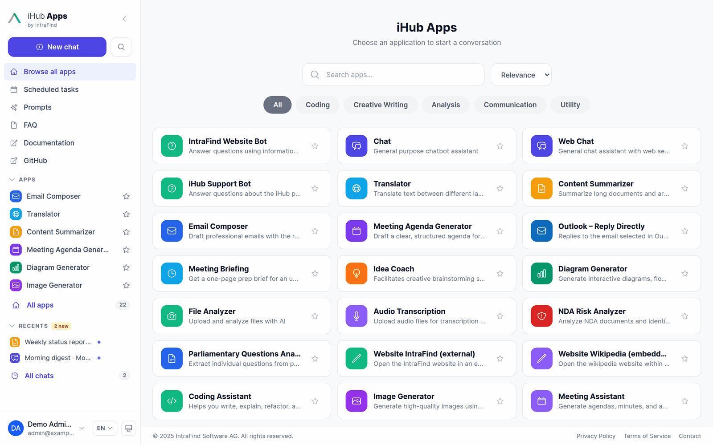
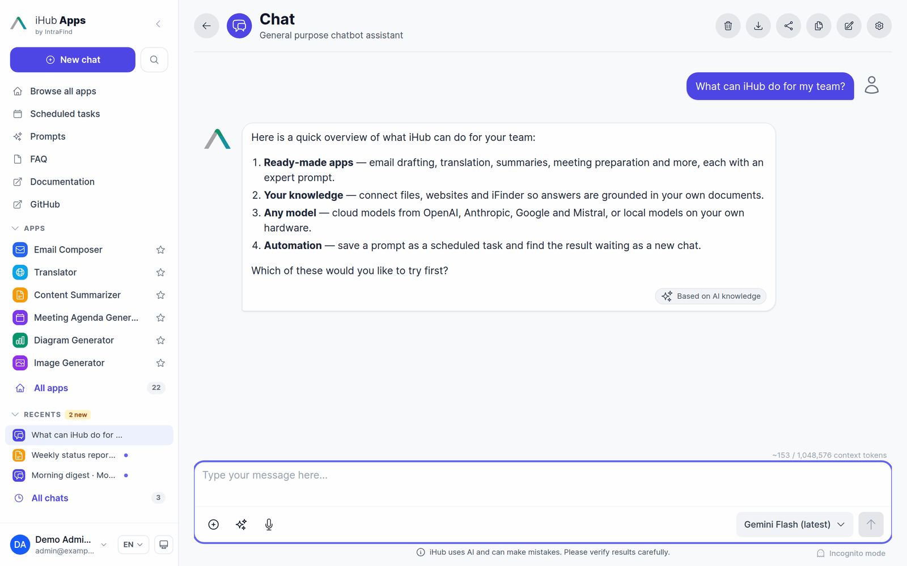
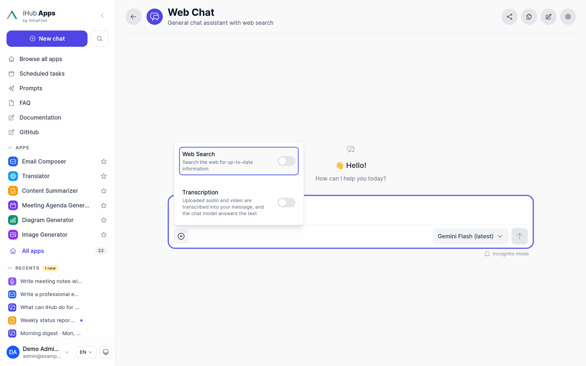
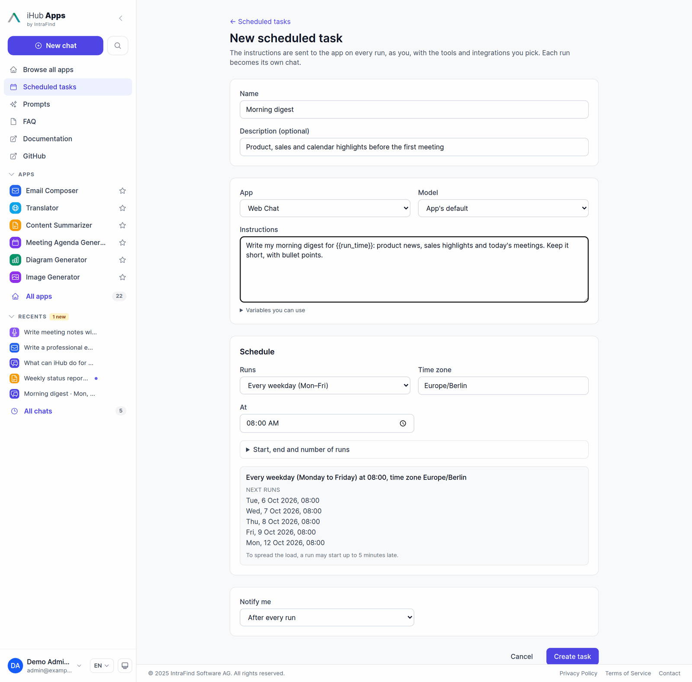
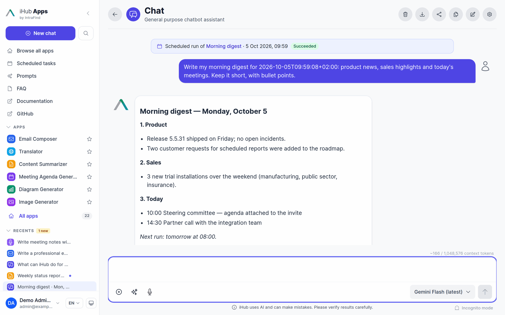

# User Guide

This guide walks you through iHub Apps as an end user: the start page, apps and their start forms,
chatting with different models, transcription, the prompt library and scheduled tasks. What you
see depends on what your administrator has switched on and on the groups you belong to — a feature
described here may not be available on your installation.

## Signing in

Depending on the installation you are signed in automatically (single sign-on), see a sign-in page
for a local or LDAP account, or can use iHub anonymously with a limited set of apps. The first time
you open iHub you may be asked to acknowledge a disclaimer from your administrator.

## The start page

After signing in you land on the start page.

- **Greeting and chat input** — type a question and press Enter. The message opens in the default
  app (shown above the input, here *Chat*) and is sent right away. Files you attach on the start
  page go along with it. **Open full app** opens the app without sending anything.
- **Jump into an app** — shortcuts to your favorite apps first, then the apps your administrator
  features. **Browse all apps** opens the full list.
- **Pick up where you left off** — your most recent chats.

### The sidebar

- **New chat** always brings you back to the start page. The magnifier next to it searches your
  chats and apps.
- **Browse all apps**, **Scheduled tasks** (with the number of unread runs), **Prompts** and the
  pages your administrator added (FAQ, documentation, …).
- **Apps** — your shortcut list. Star an app to make it a favorite; favorites always come first,
  here and on the start page.
- **Recents** — your latest chats, with a dot on chats that have news you have not read yet (for
  example a scheduled run). **All chats** opens the full chat history with search.
- At the bottom: your account, the interface language and the theme (system, light or dark). The
  arrow at the top collapses the sidebar to icons.

iHub works on phones and tablets as well — the sidebar becomes a menu behind the ☰ button — and can
be installed as an app from the browser (PWA).

  
  &nbsp;
  

## Finding an app

**Browse all apps** lists every app you may use. Search by name or description, filter by category
and sort by relevance (your most recently used apps first) or by name. Click an app to start
a chat in it.

Each app is a ready-made use case: it comes with its own instructions for the AI, often with
starter prompts, sometimes with tools such as web search or a connection to your company's
documents. You do not need to write a prompt — describe what you need, or fill in the form.

## Apps that start with a form

Some apps open with a form instead of an empty chat input. The Email Composer, for example, asks for
the type of email, the recipient, the subject and the tone. Fill in the fields — required ones are
marked with a red asterisk — add your own text in **Message**, drop files onto the form if the app
accepts uploads, and press **Start**. When the app lets you choose the model, the model selector
sits next to the button.

The app builds its prompt from your answers and sends it as the first message. From then on the
chat continues as usual: type follow-up messages such as "shorter" or "more formal" without filling
in the form again. The values stay with the chat, so they are still there when you reopen it.
**New chat** (or clearing the chat) brings the form back.

## Chatting

### The chat input

- **Enter** sends, **Shift+Enter** adds a line break. Type `/` to search the prompt library.
- **+** opens the per-chat options the app offers — for example **Web Search**, the app's tools,
  **Transcription** or image settings. A switched-on option shows as a chip in the input.

  

- **✨ Magic Prompt** rewrites a short or vague request into a well-formed prompt. You can undo it.
- **📎** attaches files: documents, images, audio or video, depending on the app.
- **🎙️** dictates into the input field; the **red dot** records a voice message (see
  [Transcription](#transcription-and-voice)).
- The **model selector** on the right chooses the model for this chat, when the app allows it.
  Hover a model to read its description; some models carry a hint or a notice from the
  administrator, for example "do not use for confidential data".

  

- **Incognito mode** below the input starts a chat that is not saved and disappears when you leave
  or reload the page.
- The counter above the input shows roughly how much of the model's context window the chat uses.

### Answers

Answers stream in as they are written. Under each answer a badge says what it is based on — *AI
knowledge*, *web search*, *iFinder*, *audio recording* and so on. When an answer used sources,
**N sources** opens a panel with every web page and document, and numbered badges in the text mark
which source supports which statement. Hovering a badge highlights the passage and its source.

### Message actions

Hover a message to see its actions:

- Your messages: **Edit** (change and resend), **Resend**, **Delete**, **Save as prompt** and
  **Schedule this…** (turn the message into a [scheduled task](#scheduled-tasks)).
- Answers: **Copy** (as text, Markdown or HTML), **Download**, **Open in Canvas** (edit a long text
  together with the model), **Read aloud** when your administrator enabled it, and a star rating
  with an optional comment for feedback.

### The chat header

Depending on the app: **Clear** the chat, **Export** it (Markdown, PDF, Word, HTML, JSON, …),
**Share** a read-only link, switch on **Compare mode**, and open the chat **Settings** (model,
temperature, output format, reasoning effort, tools).

### Compare two models

**Compare mode** splits the chat into two panels with a model each. Every message goes to both, and
both answers stream side by side — useful to choose a model for a task or to get a second opinion.

See [Compare Mode](compare-mode.md) for details.

## Chat history

With chat history enabled, every conversation is stored on the server: reopen it from **Recents** or
**All chats**, on any device, and continue where you left off. A reopened chat still shows what each
answer was based on — the searches it ran, the documents it read and the tools it used. Chats can
be renamed and deleted from the sidebar.

## Transcription and voice

Apps with transcription turn speech into the message you send:

- **Record**: press the red dot, speak, and press stop (or Send). The transcript appears in your
  message while you speak; then the chat model answers it.
- **Upload**: attach an audio or video file and send. Your typed text comes first, followed by
  *Transcript of <file>:* and the transcript. Long recordings such as meetings are supported.
- The **Transcription** switch in the **+** menu decides per chat whether uploaded audio is
  transcribed (on) or given to the model directly (off, for models that understand audio).

The answer is marked **Based on audio recording**. Typical uses: meeting notes from a recording,
an email from a voice memo, a summary of an interview.

Two more voice features may be available:

- **Dictation** — the microphone button types what you say into the input field, so you can check
  it before sending.
- **Read aloud** — the play button on a message reads it to you. Click again to pause, the square
  stops.

## Prompt library

**Prompts** in the sidebar opens the prompt library: prompts curated by your administrator
(**Global**), prompts you wrote (**My prompts**), prompts colleagues shared with you
(**Shared with me**) and your **Favorites**.

- **Use in chat** opens the prompt in its app (or the default app) with the text in the input —
  ready to edit and send. **Copy** puts it on the clipboard.
- Prompts can ask for details. A short form collects them and shows a preview of the finished text
  before it goes into the chat.

  

- **New prompt** creates your own; you can also hover a message you sent and choose
  **Save as prompt**. Write `{{name}}` for every detail the prompt should ask for, and `{{content}}`
  where your own text goes.
- Share your prompts with colleagues, groups or everyone, either to use or to edit. Every save is
  kept as a version you can restore.
- In any chat, type `/` to search the library without leaving the conversation.

Details: [Prompts Library](prompts.md).

## Scheduled tasks

A scheduled task is a prompt that runs by itself, as you, in one of your apps — for example a
morning digest every weekday at 08:00, a weekly status report on Friday afternoon, or a reminder
email on the last day of the month. Every run becomes its own chat, so the result is waiting for you
and can be continued like any conversation.

**Create a task** with **New task** on the Scheduled tasks page, with **Schedule this…** on a
message you sent, or — in apps that offer it — by asking: "every weekday at 8, summarize my open
tickets". The form asks for:

- **Name** and an optional description.
- **App** and **model**, plus the app's own fields when it has some.
- **Instructions** — the prompt sent on every run. Each run starts fresh, so write it as a complete
  request. Placeholders such as `{{run_time}}` or `{{last_successful_run_at}}` fill in when it runs
  (see **Variables you can use** under the field).
- **Schedule** — once, every few minutes/hours/days, every day, every weekday, on selected weekdays,
  monthly (including "on the last day"), by cron expression, or only when you press **Run now**.
  The preview lists the next runs in your time zone.
- **Notify me** — after every run, only when a run fails, or never.

The task page shows the schedule, the next runs and the run history with a link to each run's chat.
From there you can **Run now**, **Pause**, **Edit**, **Duplicate** or **Delete** the task.

New runs are marked in the sidebar and announced with a short notification. The run's chat shows a
banner with the task and the time of the run:

A run uses your current permissions. If you lose access to the app, model or a tool the task needs,
the run is skipped and the task paused, with the reason on the task page. Some tools that change
things (for example creating a ticket) may wait for your **Approve** before they run.

Details: [Scheduled Tasks](scheduled-tasks.md).

## Sharing

**Share** in the chat header creates a read-only link to the conversation (when chat sharing is
enabled) or a link to the app, optionally with the input prefilled. Shared chats leave out
documents and search results that only you may see.

## Using iHub elsewhere

Your administrator may also offer iHub inside other tools: the **Outlook add-in** (reply to or
summarize the open email), the **browser extension** (chat about the page you are reading),
**Microsoft Teams** and **Nextcloud**. They offer the same apps; the Outlook add-in and the browser
extension also list your chat history.

## Getting help

The **iHub Support Bot** app answers questions about iHub itself, including what changed in each
release. The **Documentation** link in the sidebar opens this documentation.
